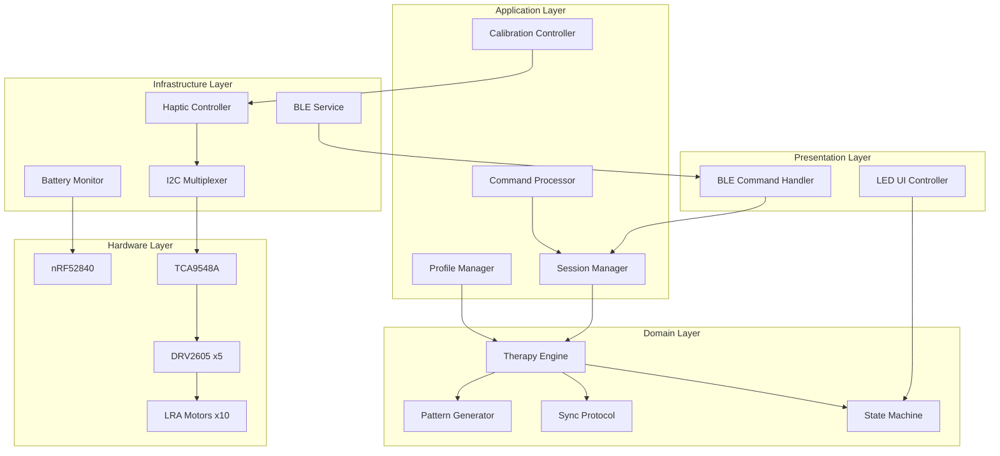

# BlueBuzzah v2.0

**Bilateral Haptic Therapy System for Parkinson's Disease Research**

[](https://github.com/yourusername/bluebuzzah)
[](https://circuitpython.org/)
[](LICENSE)

BlueBuzzah is a medical device research platform implementing vibrotactile Coordinated Reset (vCR) therapy for Parkinson's disease treatment. The system consists of two synchronized haptic gloves that deliver precisely timed vibration patterns to fingers, based on research showing therapeutic benefits from desynchronization of pathological neural oscillations.

## Overview

### Key Features

- **Bilateral Synchronization**: Sub-10ms synchronization between left and right gloves
- **Research-Based Therapy**: Regular vCR, Noisy vCR, and Hybrid vCR profiles
- **Mobile Control**: Comprehensive BLE protocol for iOS/Android app integration
- **Real-Time Session Management**: Pause, resume, and progress tracking
- **Multi-Connection Support**: Simultaneous phone and glove connections
- **Battery Safety**: Monitoring with automatic shutdown at critical levels
- **Calibration Mode**: Individual finger testing and adjustment
- **Clean Architecture**: Testable, maintainable, and extensible codebase

### System Architecture



## Quick Start

### Prerequisites

**Hardware Required:**

- 2x Adafruit Feather nRF52840 Express
- 10x DRV2605 Haptic Driver Breakouts
- 2x TCA9548A I2C Multiplexer
- 10x LRA Motors (coin-style, 175Hz resonant frequency)
- 2x LiPo batteries (500mAh+)
- Glove mounting hardware

**Software Required:**

- Python 3.9+ (for deployment tooling)
- CircuitPython 9.0+ (firmware on devices)
- Git

### Installation

1. **Clone the repository:**

   ```bash
   git clone https://github.com/yourusername/bluebuzzah.git
   cd bluebuzzah/v2
   ```

2. **Install CircuitPython on both devices:**

   - Download [CircuitPython 9.0+](https://circuitpython.org/board/feather_nrf52840_express/)
   - Follow Adafruit's installation guide
   - Verify devices appear as `CIRCUITPY` drives

3. **Deploy firmware to devices:**

   ```bash
   # Auto-detect and deploy to both devices
   python deploy/deploy.py

   # Or deploy manually to specific devices
   python deploy/deploy.py --role primary --device /Volumes/CIRCUITPY
   python deploy/deploy.py --role secondary --device /Volumes/CIRCUITPY1
   ```

4. **Verify deployment:**
   - Both devices should show rapid blue LED flashing during boot
   - PRIMARY shows 5x green flash when SECONDARY connects
   - Both show solid green when ready

### Basic Usage

#### Starting Default Therapy

1. Power on both devices
2. Wait for boot sequence (up to 30 seconds)
3. After boot success (solid green LED), therapy begins automatically with default profile
4. Therapy runs for 2 hours or until battery critical

#### Using Mobile App Control

1. Power on both devices
2. Connect phone via BLE to "BlueBuzzah" within 30-second boot window

## Hardware Setup

### Pin Connections (nRF52840)

```
Pin     | Function          | Connection
--------|-------------------|---------------------------
SDA     | I2C Data          | TCA9548A SDA + 4.7kΩ pullup
SCL     | I2C Clock         | TCA9548A SCL + 4.7kΩ pullup
D13     | NeoPixel          | RGB LED
A6      | Battery Monitor   | Voltage divider from LiPo
GND     | Ground            | Common ground
3.3V    | Power             | Power rail
```

### I2C Device Addresses

```
Device              | Address | Purpose
--------------------|---------|---------------------------
TCA9548A Multiplexer| 0x70    | I2C channel switching
DRV2605 (all)       | 0x5A    | Haptic driver (via mux)
```

### Multiplexer Channel Mapping

```
Channel | Finger
--------|-------
0       | Thumb
1       | Index
2       | Middle
3       | Ring
4       | Pinky
5-7     | Reserved
```

## Building and Testing

### Building Firmware

BlueBuzzah v2 uses a build system to compile Python source to optimized `.mpy` bytecode for CircuitPython:

```bash
# Standard build (compiles to .mpy)
python build.py

# Optimized build for production
python build.py --clean --optimize 2

# Debug build (keeps .py files)
python build.py --no-compile
```

The build creates a `dist/` directory with deployment-ready firmware containing:

- Compiled .mpy files (40-60% smaller than .py files)
- Faster loading times and lower RAM usage
- Production-ready firmware for deployment to devices

**Build Benefits:**

- 40-60% smaller file size
- Faster loading times
- Lower RAM usage
- Required for complex projects on memory-constrained boards

### Hardware Integration Testing

**IMPORTANT:** Testing requires actual BlueBuzzah hardware connected via BLE.

```python
# Step 1: Establish BLE connection to device
from adafruit_ble import BLERadio
from adafruit_ble.services.nordic import UARTService

# Connect to BlueBuzzah device
# See tests/README.md for detailed connection setup

# Step 2: Run tests
import tests.calibrate_commands_test as calibrate_test
import tests.session_commands_test as session_test

# Test motor calibration (requires 1 device)
calibrate_test.run_all_tests(uart_service)

# Test session management (requires PRIMARY device)
session_test.run_all_tests(uart_service)
```

**Test Coverage:** 8/18 BLE commands tested (44%)

See **[Testing Guide](docs/TESTING.md)** for complete documentation.

### Memory Profiling

```python
from utils.memory import monitor_memory

# Enable memory monitoring
monitor = monitor_memory(interval_sec=10.0)

# Your code here...

# Print memory statistics
print(monitor.get_summary())
```

## Configuration

### Device Role Configuration

Each device's role is set via `settings.json`:

```json
{
  "deviceRole": "Primary"
}
```

Or:

```json
{
  "deviceRole": "Secondary"
}
```

### Therapy Configuration

Therapy profiles are defined in `src/therapy/profiles/`:

```python
from config.therapy import TherapyConfig

# Create custom profile
config = TherapyConfig(
    profile_name="custom_vcr",
    burst_duration_ms=100,
    inter_burst_interval_ms=668,
    bursts_per_cycle=3,
    pattern_type="random_permutation",
    actuator_type=ActuatorType.LRA,
    frequency_hz=175,
    amplitude_percent=100
)
```

### System Constants

Modify constants in `src/core/constants.py`:

```python
# Timing
STARTUP_WINDOW = 30              # Boot connection window (seconds)
BLE_INTERVAL = 0.0075            # BLE connection interval (seconds)
SYNC_INTERVAL = 1.0              # Sync message interval (seconds)

# Battery
CRITICAL_VOLTAGE = 3.3           # Critical battery (volts)
LOW_VOLTAGE = 3.4                # Low battery warning (volts)

# Hardware
I2C_FREQUENCY = 400000           # I2C bus speed (Hz)
MAX_ACTUATORS = 5                # Fingers per hand
```

## Troubleshooting

### Boot Issues

**Symptom**: Devices show red flashing LED after 30 seconds

**Possible Causes**:

- PRIMARY and SECONDARY not powered on simultaneously
- BLE interference or range issues
- Hardware communication failure

**Solutions**:

1. Power cycle both devices simultaneously
2. Move devices closer together (< 1m)
3. Check battery voltage (should be > 3.4V)
4. Verify I2C connections

**Symptom**: Devices show blue flashing indefinitely

**Possible Causes**:

- BLE not initializing
- Settings file missing or corrupt

**Solutions**:

1. Check `settings.json` exists and is valid
2. Verify CircuitPython version (9.0+)
3. Redeploy firmware

### Therapy Issues

**Symptom**: Motors not vibrating

**Possible Causes**:

- I2C communication failure
- DRV2605 not initialized
- Motor connections loose

**Solutions**:

1. Run calibration mode to test individual fingers
2. Check I2C pullup resistors (4.7kΩ)
3. Verify motor connections to DRV2605

**Symptom**: Poor bilateral synchronization (> 10ms)

**Possible Causes**:

- BLE latency too high
- Timing drift accumulation

**Solutions**:

1. Reduce BLE_INTERVAL in constants
2. Check for GC pauses (disable DEBUG mode)
3. Monitor sync statistics

### Battery Issues

**Symptom**: Orange LED during therapy

**Meaning**: Battery low (< 3.4V)
**Action**: Charge battery soon, therapy continues

**Symptom**: Rapid red flashing, motors stop

**Meaning**: Battery critical (< 3.3V)
**Action**: Charge battery immediately

## Contributing

### Development Setup

```bash
# Clone repository
git clone https://github.com/yourusername/bluebuzzah.git
cd bluebuzzah

# For Python-based testing tools (optional - for running tests from host computer)
pip install adafruit-blinka-bleio

# See tests/README.md and docs/TESTING.md for test execution instructions
```

### Code Style

This project follows:

- **PEP 8** style guide (adapted for CircuitPython constraints)
- **Docstrings** (Google style) for all public functions
- **SOLID principles** and clean architecture
- **CircuitPython best practices** (see CLAUDE.md for memory optimization guidelines)

**Note:** Type hints are NOT supported in CircuitPython and will cause SyntaxError.

### Testing Requirements

- Hardware integration tests for BLE protocol validation
- Manual testing on actual Feather nRF52840 devices
- Memory stress testing for leak detection
- Synchronization latency measurement
- **Current coverage:** 8/18 BLE commands (44%), ~15-20% functional coverage
- **Future goal:** Develop automated unit tests with mocks for CI/CD

### Pull Request Process

1. Create feature branch from `main`
2. Implement changes following CircuitPython best practices (see CLAUDE.md)
3. Test on actual hardware if making firmware changes
4. Update documentation as needed
5. Submit PR with clear description and test results
6. Address review feedback

## Documentation

### Core Documentation

- **[API Reference](docs/API_REFERENCE.md)**: Complete API documentation
- **[BLE Protocol](docs/BLE_PROTOCOL.md)**: BLE command protocol specification (v2.0)
- **[Testing Guide](docs/TESTING.md)**: Hardware integration testing procedures
- **[Technical Reference](docs/TECHNICAL_REFERENCE.md)**: Hardware specs and configuration

### Architecture & Design

- **[Architecture Guide](docs/ARCHITECTURE.md)**: System design and patterns
- **[Firmware Architecture](docs/FIRMWARE_ARCHITECTURE.md)**: Firmware structure and modules
- **[Rebuild Specification](docs/REBUILD_SPECIFICATION.md)**: V2 rebuild design document

### Protocols & Behavior

- **[Synchronization Protocol](docs/SYNCHRONIZATION_PROTOCOL.md)**: Multi-device coordination
- **[Command Reference](docs/COMMAND_REFERENCE.md)**: Complete command documentation
- **[Boot Sequence](docs/BOOT_SEQUENCE.md)**: Boot process and LED indicators
- **[Therapy Engine](docs/THERAPY_ENGINE.md)**: Pattern generation and timing

### Setup & Calibration

- **[Calibration Guide](docs/CALIBRATION_GUIDE.md)**: Motor calibration procedures

## Hardware Requirements

### Minimum Requirements

- **Microcontroller**: nRF52840 (Adafruit Feather Express)
- **RAM**: 256KB
- **Flash**: 1MB
- **BLE**: Bluetooth 5.0
- **I2C**: 400kHz Fast Mode support

### Recommended Components

- **LRA Motors**: ERM1030 or similar (175Hz resonant)
- **Battery**: 500mAh+ LiPo (3.7V nominal)
- **Haptic Driver**: DRV2605L
- **Multiplexer**: TCA9548A

## Performance Specifications

- **Boot Time**: < 5 seconds (device ready)
- **Connection Time**: 5-30 seconds (bilateral sync)
- **Sync Accuracy**: < 10ms bilateral drift
- **Battery Life**: > 2 hours continuous therapy
- **Command Latency**: < 100ms response
- **Memory Usage**: < 50KB RAM peak

## Safety Features

- **Battery Monitoring**: Automatic shutdown at 3.3V
- **Connection Monitoring**: Therapy stops if PRIMARY-SECONDARY link lost
- **Failsafe**: All motors stop on critical error

## License

This project is licensed under the MIT License - see the [LICENSE](LICENSE) file for details.

## Acknowledgments

- Based on vCR therapy research for Parkinson's disease
- Built with [CircuitPython](https://circuitpython.org/)
- Hardware by [Adafruit Industries](https://www.adafruit.com/)
- DRV2605 driver from [Texas Instruments](https://www.ti.com/)

## Contact

- **Issues**: [GitHub Issues](https://github.com/BlueBuzzah/BlueBuzzah2-Firmware/issues)
- **Discussions**: [GitHub Discussions](https://github.com/BlueBuzzah/BlueBuzzah2-Firmware/discussions)
- **Email**: your.email@example.com

## Version

**Current Version**: 2.0.0 (Complete rebuild from v1.x)

**Key Changes in v2.0:**

- Complete firmware rewrite with clean architecture
- Enhanced BLE protocol with 18 commands
- Command-driven synchronization for precise timing
- Hardware integration testing framework
- CircuitPython 9.2+ optimizations for nRF52840
