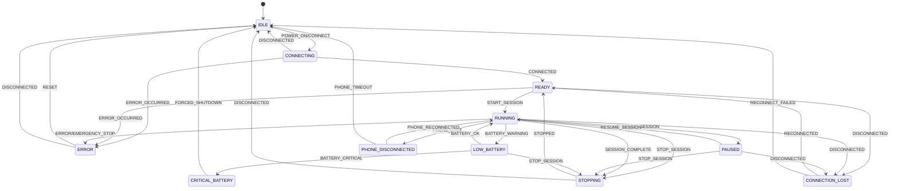
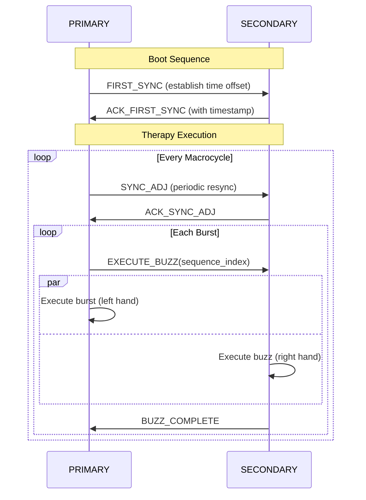
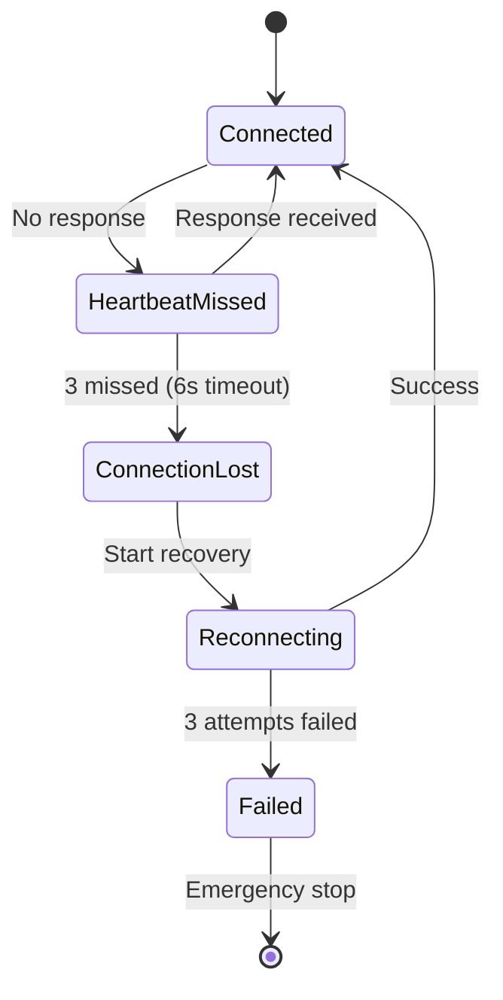
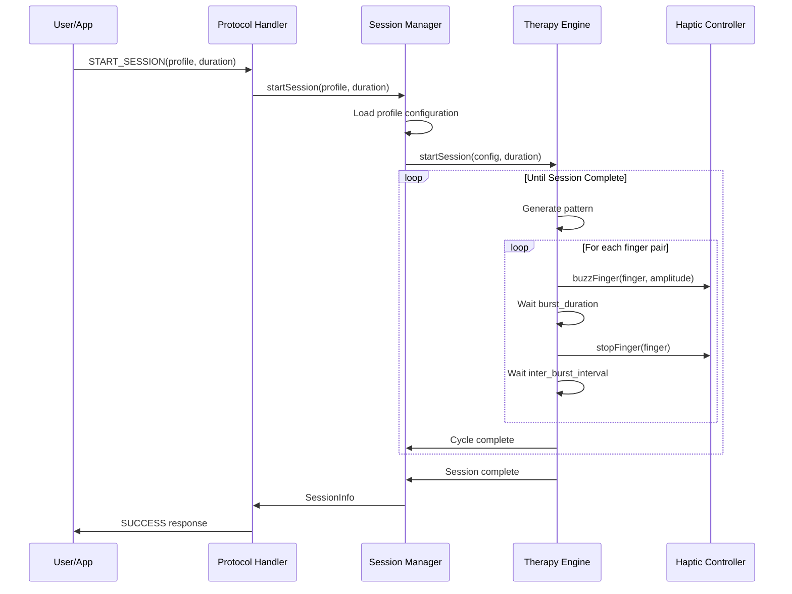
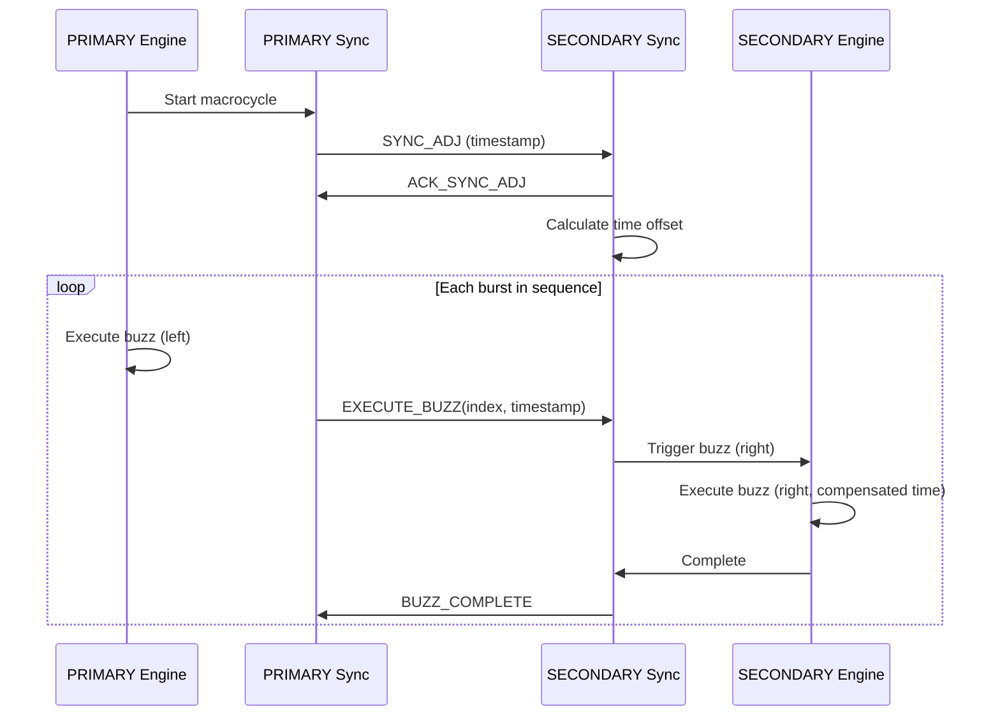

# BlueBuzzah v2 Architecture

This document provides a detailed explanation of the BlueBuzzah v2 system architecture, design patterns, and component interactions.

**Platform**: Arduino C++ on Adafruit Feather nRF52840 Express
**Build System**: PlatformIO with Adafruit nRF52 BSP

## Table of Contents

- [Overview](#overview)
- [Design Principles](#design-principles)
- [Layer Architecture](#layer-architecture)
- [Component Details](#component-details)
- [Design Patterns](#design-patterns)
- [Data Flow](#data-flow)
- [Integration Points](#integration-points)
- [Scalability and Extensibility](#scalability-and-extensibility)

## Overview

BlueBuzzah v2 is built using Clean Architecture principles, separating concerns into distinct layers with clear boundaries and dependencies flowing inward.

### Architecture Goals

1. **Testability**: Easy to test business logic without hardware
2. **Maintainability**: Clear module boundaries and responsibilities
3. **Extensibility**: Simple to add new features or change implementations
4. **Portability**: Hardware abstraction enables platform changes
5. **Reliability**: Explicit state management and error handling

### High-Level Structure

```
+-------------------------------------------------------------+
|                    Presentation Layer                       |
|  - BLE Command Handler  - Response Formatter  - LED UI      |
+-------------------------------------------------------------+
|                    Application Layer                        |
|  - Session Manager  - Profile Manager  - Command Processor  |
+-------------------------------------------------------------+
|                      Domain Layer                           |
|  - Therapy Engine  - Pattern Generator  - Sync Protocol     |
+-------------------------------------------------------------+
|                   Infrastructure Layer                      |
|  - BLE Service  - Haptic Driver  - Storage  - Battery Mon   |
+-------------------------------------------------------------+
|                      Hardware Layer                         |
|  - nRF52840  - DRV2605  - TCA9548A  - LRA Motors           |
+-------------------------------------------------------------+
```

## Design Principles

### 1. Clean Architecture

**Dependency Rule**: Dependencies point inward

- Presentation -> Application -> Domain -> Infrastructure -> Hardware
- Inner layers know nothing about outer layers
- Interfaces define boundaries

**Benefits**:

- Business logic independent of frameworks
- Testable without external dependencies
- UI and database can change independently

### 2. SOLID Principles

**Single Responsibility**: Each class has one reason to change

```cpp
// Each class has one responsibility
class TherapyEngine {
    // Responsible ONLY for executing therapy patterns
};

class PatternGenerator {
    // Responsible ONLY for generating patterns
};

class HardwareController {
    // Responsible ONLY for controlling motors
};
```

**Open/Closed**: Open for extension, closed for modification

```cpp
// include/pattern_generator.h

// Base pattern generator - extend by creating new generators
class PatternGenerator {
public:
    virtual ~PatternGenerator() = default;
    virtual Pattern generate(const PatternConfig& config) = 0;
};

// Concrete implementation - extends without modifying base
class RandomPermutationGenerator : public PatternGenerator {
public:
    Pattern generate(const PatternConfig& config) override {
        // Implementation here
    }
};
```

**Liskov Substitution**: Subtypes must be substitutable

```cpp
// Any HardwareController implementation can be used interchangeably
HardwareController* haptic = new DRV2605Controller(...);
HardwareController* haptic = new MockHapticController();  // For testing
```

**Interface Segregation**: Clients shouldn't depend on unused interfaces

```cpp
// Small, focused interfaces
class HapticInterface {
public:
    virtual void activate(uint8_t finger, uint8_t amplitude) = 0;
    virtual void deactivate(uint8_t finger) = 0;
};

// Not one massive "DeviceController" interface
```

**Dependency Inversion**: Depend on abstractions, not concretions

```cpp
class TherapyEngine {
public:
    // Depends on interfaces, not concrete implementations
    TherapyEngine(PatternGenerator& patternGen, HapticInterface& haptic)
        : _patternGenerator(patternGen)
        , _haptic(haptic)
    {}

private:
    PatternGenerator& _patternGenerator;
    HapticInterface& _haptic;
};
```

### 3. Domain-Driven Design

**Ubiquitous Language**: Common terminology

- **Session**: A therapy session from start to completion
- **Cycle**: One complete pattern repetition
- **Burst**: Three rapid buzzes on a finger
- **Macrocycle**: Collection of bursts with pauses
- **Profile**: Configuration for a therapy protocol

**Bounded Contexts**:

- **Therapy Context**: Pattern generation, cycle execution
- **Communication Context**: BLE protocol, messages
- **Hardware Context**: Device control, I2C communication
- **State Context**: Session states, transitions

## Layer Architecture

### Presentation Layer

**Purpose**: Handle external interactions (BLE commands, LED feedback)

**Components**:

- `menu_controller.h/.cpp`: Parse and validate BLE commands
- `led_controller.h/.cpp`: Visual feedback to user

**Characteristics**:

- No business logic
- Transforms external data to/from domain models
- Handles user interaction protocols

**Example**:

```cpp
// src/menu_controller.cpp

void MenuController::processCommand(const char* command,
                                     char* response,
                                     size_t responseSize) {
    // Parse command
    char cmdType[32];
    parseCommandType(command, cmdType, sizeof(cmdType));

    // Route to application layer
    if (strcmp(cmdType, "SESSION_START") == 0) {
        char profile[32];
        uint32_t duration;
        parseSessionParams(command, profile, &duration);

        if (_session.startSession(profile, duration)) {
            snprintf(response, responseSize, "OK:Session started\n\x04");
        } else {
            snprintf(response, responseSize, "ERROR:Cannot start session\n\x04");
        }
    }
    else if (strcmp(cmdType, "SESSION_STATUS") == 0) {
        _session.getStatus(response, responseSize);
    }
}
```

### Application Layer

**Purpose**: Orchestrate use cases and coordinate domain objects

**Components**:

- `session_manager.h/.cpp`: Session lifecycle management
- `profile_manager.h/.cpp`: Profile loading and validation
- `calibration_controller.h/.cpp`: Calibration workflows

**Characteristics**:

- Use case implementations
- Transaction boundaries
- Error handling and recovery

**Example**:

```cpp
// src/session_manager.cpp

bool SessionManager::startSession(const char* profileName, uint32_t durationSec) {
    // Load profile (application service)
    TherapyConfig config;
    if (!_profiles.loadProfile(profileName, config)) {
        return false;
    }

    // Validate preconditions
    if (!canStartSession()) {
        return false;
    }

    // Execute therapy (domain service)
    if (!_engine.startSession(config, durationSec)) {
        return false;
    }

    // Update state
    _stateMachine.transition(StateTrigger::START_SESSION);

    return true;
}
```

### Domain Layer

**Purpose**: Core business logic and rules

**Components**:

- `therapy_engine.h/.cpp`: Therapy execution logic
- `sync_protocol.h/.cpp`: Bilateral synchronization
- `state_machine.h/.cpp`: Therapy state machine

**Characteristics**:

- Pure business logic
- No external dependencies
- Framework-agnostic
- Highly testable

**Example**:

```cpp
// src/therapy_engine.cpp

void TherapyEngine::executeCycle() {
    // Generate pattern (domain logic)
    generatePattern();

    // Execute with precise timing
    for (uint8_t i = 0; i < _config.burstsPerCycle; i++) {
        uint8_t leftFinger = _leftSequence[i];
        uint8_t rightFinger = _rightSequence[i];

        // Bilateral activation (infrastructure call through interface)
        activateBilateral(leftFinger, rightFinger, _config.amplitudePercent);

        // Timing control (domain logic)
        delay(_config.burstDurationMs);

        deactivateBilateral(leftFinger, rightFinger);

        // Apply jitter if configured
        uint16_t interval = _config.interBurstIntervalMs;
        if (_config.jitterPercent > 0) {
            interval += calculateJitter();
        }
        delay(interval);
    }

    _cycleCount++;
}
```

### Infrastructure Layer

**Purpose**: Interface with external systems and hardware

**Components**:

- `ble_manager.h/.cpp`: BLE communication
- `hardware.h/.cpp`: Motor control (DRV2605), battery, I2C mux
- `profile_manager.h/.cpp`: LittleFS profile storage

**Characteristics**:

- Implements interfaces defined by domain
- Handles external resource management
- Deals with framework-specific code
- May have side effects

**Example**:

```cpp
// src/hardware.cpp

void HardwareController::buzzFinger(uint8_t finger, uint8_t amplitude) {
    // Infrastructure-level details
    _tca.select(finger);

    // Hardware-specific protocol
    uint8_t registerValue = (amplitude * 127) / 100;
    _drv[finger].setRealtimeValue(registerValue);

    _motorActive[finger] = true;
}

void HardwareController::stopFinger(uint8_t finger) {
    _tca.select(finger);
    _drv[finger].setRealtimeValue(0);
    _motorActive[finger] = false;
}
```

## Component Details

### State Management

The system has 11 distinct states to handle all operational scenarios:



**State Descriptions**:

| State | Value | Description |
|-------|-------|-------------|
| `IDLE` | 0 | No active session, system ready |
| `CONNECTING` | 1 | Establishing BLE connection |
| `READY` | 2 | Connected, ready for therapy |
| `RUNNING` | 3 | Active therapy session |
| `PAUSED` | 4 | Session paused, can resume |
| `STOPPING` | 5 | Session ending, cleanup |
| `ERROR` | 6 | Error condition, motors stopped |
| `LOW_BATTERY` | 7 | Battery < 20%, session can continue |
| `CRITICAL_BATTERY` | 8 | Battery < 5%, forced shutdown |
| `CONNECTION_LOST` | 9 | Inter-device BLE lost, attempting recovery |
| `PHONE_DISCONNECTED` | 10 | Phone BLE lost (PRIMARY only) |

**Implementation**:

```cpp
// src/state_machine.cpp

bool StateMachine::transition(StateTrigger trigger) {
    TherapyState nextState;

    switch (_currentState) {
        case TherapyState::IDLE:
            if (trigger == StateTrigger::CONNECTED) {
                nextState = TherapyState::READY;
            } else {
                return false;  // Invalid transition
            }
            break;

        case TherapyState::READY:
            if (trigger == StateTrigger::START_SESSION) {
                nextState = TherapyState::RUNNING;
            } else if (trigger == StateTrigger::DISCONNECTED) {
                nextState = TherapyState::CONNECTION_LOST;
            } else {
                return false;
            }
            break;

        // ... additional state transitions
    }

    // Notify callback if registered
    if (_callback) {
        _callback(_currentState, nextState);
    }

    _currentState = nextState;
    return true;
}
```

### Bilateral Mirroring

The `mirrorPattern` parameter controls whether both hands receive the same finger sequence or independent sequences. This is based on vCR research findings:

| vCR Type | `mirrorPattern` | Behavior | Rationale |
|----------|-----------------|----------|-----------|
| **Noisy vCR** | `true` | Same finger on both hands | Avoids bilateral masking interference |
| **Regular vCR** | `false` | Independent sequences per hand | Increases spatial randomization for synaptic decoupling |

**Implementation**:

```cpp
// src/therapy_engine.cpp

void TherapyEngine::generatePattern() {
    // Generate left hand sequence using Fisher-Yates shuffle
    for (uint8_t i = 0; i < 4; i++) {
        _leftSequence[i] = i;
    }
    for (uint8_t i = 3; i > 0; i--) {
        uint8_t j = random(0, i + 1);
        uint8_t temp = _leftSequence[i];
        _leftSequence[i] = _leftSequence[j];
        _leftSequence[j] = temp;
    }

    // Generate right hand sequence based on mirror setting
    if (_config.mirrorPattern) {
        // Mirrored: same finger on both hands (noisy vCR)
        memcpy(_rightSequence, _leftSequence, sizeof(_leftSequence));
    } else {
        // Non-mirrored: independent random sequence (regular vCR)
        for (uint8_t i = 0; i < 4; i++) {
            _rightSequence[i] = i;
        }
        for (uint8_t i = 3; i > 0; i--) {
            uint8_t j = random(0, i + 1);
            uint8_t temp = _rightSequence[i];
            _rightSequence[i] = _rightSequence[j];
            _rightSequence[j] = temp;
        }
    }
}
```

**Hardware Note**: Both gloves use identical channel-to-finger mapping (channel 0 = pinky on both gloves). The `mirrorPattern` setting controls whether the same channel number is sent to both devices (mirrored) or different channels (non-mirrored).

### Configuration System

**Layered Configuration**:

1. **Device Configuration** (`settings.json`): Device role
2. **Therapy Configuration** (profiles): Profile settings
3. **Runtime Configuration**: Dynamic adjustments

**Loading Hierarchy**:

```cpp
// src/main.cpp

DeviceConfig loadDeviceConfig() {
    DeviceConfig config;

    if (!LittleFS.begin()) {
        config.role = DeviceRole::PRIMARY;
        config.bleName = "BlueBuzzah";
        config.deviceTag = "[PRIMARY]";
        return config;
    }

    File file = LittleFS.open("/settings.json", "r");
    if (!file) {
        config.role = DeviceRole::PRIMARY;
        config.bleName = "BlueBuzzah";
        config.deviceTag = "[PRIMARY]";
        return config;
    }

    JsonDocument doc;
    deserializeJson(doc, file);
    file.close();

    const char* roleStr = doc["deviceRole"] | "Primary";
    config.role = (strcmp(roleStr, "Primary") == 0)
        ? DeviceRole::PRIMARY
        : DeviceRole::SECONDARY;
    config.bleName = "BlueBuzzah";
    config.deviceTag = (config.role == DeviceRole::PRIMARY)
        ? "[PRIMARY]" : "[SECONDARY]";

    return config;
}
```

### Synchronization Protocol

**PRIMARY-SECONDARY Communication**:



**Time Synchronization**:

```cpp
// src/sync_protocol.cpp

int32_t SyncProtocol::calculateOffset(uint32_t primaryTime, uint32_t secondaryTime) {
    // Offset = (T_primary - T_secondary) / 2
    // This compensates for message transmission time and ensures
    // sub-10ms synchronization accuracy.
    return (int32_t)(primaryTime - secondaryTime) / 2;
}

uint32_t SyncProtocol::applyCompensation(uint32_t timestamp, int32_t offset) {
    return timestamp + offset;
}
```

### Heartbeat Protocol

The heartbeat protocol ensures continuous connection monitoring between PRIMARY and SECONDARY devices:

| Parameter | Value | Description |
|-----------|-------|-------------|
| Interval | 2 seconds | Time between heartbeat messages |
| Timeout | 6 seconds | 3 missed heartbeats = connection lost |
| Recovery attempts | 3 | Number of reconnection attempts |
| Recovery delay | 2 seconds | Delay between reconnection attempts |

**Connection Recovery Flow**:



**Implementation**:

```cpp
// src/main.cpp

#define HEARTBEAT_INTERVAL_MS 2000
#define HEARTBEAT_TIMEOUT_MS 6000
#define RECONNECT_ATTEMPTS 3
#define RECONNECT_DELAY_MS 2000

void checkHeartbeat() {
    uint32_t elapsed = millis() - lastHeartbeatReceived;

    if (elapsed > HEARTBEAT_TIMEOUT_MS) {
        handleConnectionLost();
    }
}

void handleConnectionLost() {
    hardware.stopAllMotors();
    stateMachine.forceState(TherapyState::CONNECTION_LOST);
    ledController.indicateConnectionLost();

    // Attempt recovery
    for (uint8_t attempt = 0; attempt < RECONNECT_ATTEMPTS; attempt++) {
        delay(RECONNECT_DELAY_MS);
        if (bleManager.reconnectToPrimary()) {
            stateMachine.forceState(TherapyState::READY);
            lastHeartbeatReceived = millis();
            return;
        }
    }

    // Recovery failed
    stateMachine.forceState(TherapyState::IDLE);
}
```

### SYNC Message Format

Inter-device communication uses a structured message format:

**Format**:
```
SYNC:<command>:<key1>|<value1>|<key2>|<value2>...<EOT>
```

**Components**:
- `SYNC:` - Message prefix identifier
- `<command>` - Command type (see table below)
- `:` - Field separator
- `<key>|<value>` - Key-value pairs separated by pipe
- `<EOT>` - End of transmission marker (ASCII 0x04)

**Command Reference**:

| Command | Direction | Description |
|---------|-----------|-------------|
| `CONNECTED` | P->S | Connection established |
| `START_SESSION` | P->S | Begin therapy session |
| `PAUSE_SESSION` | P->S | Pause current session |
| `RESUME_SESSION` | P->S | Resume paused session |
| `STOP_SESSION` | P->S | Stop and end session |
| `STOPPED` | S->P | Session stopped confirmation |
| `EXECUTE_BUZZ` | P->S | Trigger buzz on SECONDARY |
| `HEARTBEAT` | P<->S | Connection keepalive |
| `EMERGENCY_STOP` | P<->S | Immediate motor shutoff |
| `PHONE_DISCONNECTED` | P->S | Phone app disconnected |
| `ACK` | S->P | Acknowledgment |
| `ERROR` | P<->S | Error notification |

**Example Messages**:
```
SYNC:START_SESSION:profile|noisy_vcr|duration|7200<EOT>
SYNC:EXECUTE_BUZZ:finger|2|amplitude|100<EOT>
SYNC:HEARTBEAT:timestamp|1234567890<EOT>
SYNC:ACK:command|START_SESSION<EOT>
```

## Design Patterns

### 1. Strategy Pattern (Pattern Generators)

**Purpose**: Pluggable algorithms for pattern generation

```cpp
// include/pattern_generator.h

class PatternGenerator {
public:
    virtual ~PatternGenerator() = default;
    virtual Pattern generate(const PatternConfig& config) = 0;
};

class RandomPermutationGenerator : public PatternGenerator {
public:
    Pattern generate(const PatternConfig& config) override {
        // Generate random permutation
        uint8_t sequence[4] = {0, 1, 2, 3};
        shuffleArray(sequence, 4);
        return Pattern(sequence, sequence, config);
    }
};

class SequentialGenerator : public PatternGenerator {
public:
    Pattern generate(const PatternConfig& config) override {
        uint8_t sequence[4] = {0, 1, 2, 3};  // Fixed order
        return Pattern(sequence, sequence, config);
    }
};

// Usage - strategy is interchangeable
PatternGenerator* generator = new RandomPermutationGenerator();
Pattern pattern = generator->generate(config);
```

### 2. Repository Pattern (Hardware Abstraction)

**Purpose**: Abstract data/hardware access

```cpp
// include/haptic_interface.h

class HapticInterface {
public:
    virtual ~HapticInterface() = default;
    virtual void activate(uint8_t finger, uint8_t amplitude) = 0;
    virtual void deactivate(uint8_t finger) = 0;
    virtual void stopAll() = 0;
};

// Concrete implementation: Real hardware
class DRV2605Controller : public HapticInterface {
    // ... implementation
};

// Concrete implementation: Mock for testing
class MockHapticController : public HapticInterface {
    // ... test implementation
};

// Application code doesn't know which implementation
void executeTherapy(HapticInterface& haptic) {
    haptic.activate(0, 75);
}
```

### 3. Dependency Injection

**Purpose**: Invert dependencies for testability

```cpp
class TherapyEngine {
public:
    // Dependencies injected through constructor
    TherapyEngine(HardwareController& hardware,
                  StateMachine& stateMachine)
        : _hardware(hardware)
        , _stateMachine(stateMachine)
    {}

private:
    HardwareController& _hardware;
    StateMachine& _stateMachine;
};

// Production setup
HardwareController hardware;
StateMachine stateMachine;
TherapyEngine engine(hardware, stateMachine);

// Test setup
MockHardwareController mockHardware;
StateMachine stateMachine;
TherapyEngine engine(mockHardware, stateMachine);
```

### 4. Observer Pattern (State Changes)

**Purpose**: Notify interested parties of state changes

```cpp
// include/state_machine.h

class StateMachine {
public:
    typedef void (*StateChangeCallback)(TherapyState from, TherapyState to);

    void setCallback(StateChangeCallback callback) {
        _callback = callback;
    }

    bool transition(StateTrigger trigger) {
        TherapyState oldState = _currentState;
        // ... perform transition logic ...

        if (_callback) {
            _callback(oldState, _currentState);
        }
        return true;
    }

private:
    TherapyState _currentState = TherapyState::IDLE;
    StateChangeCallback _callback = nullptr;
};

// Usage
void onStateChange(TherapyState from, TherapyState to) {
    Serial.printf("State: %d -> %d\n", (int)from, (int)to);
    ledController.setTherapyState(to);
}

stateMachine.setCallback(onStateChange);
```

### 5. Factory Pattern (Object Creation)

**Purpose**: Encapsulate object creation logic

```cpp
// include/profile_factory.h

class ProfileFactory {
public:
    static TherapyConfig createProfile(const char* profileType) {
        TherapyConfig config;

        if (strcmp(profileType, "regular_vcr") == 0) {
            strncpy(config.profileName, "Regular vCR", sizeof(config.profileName));
            config.burstDurationMs = 100;
            config.interBurstIntervalMs = 668;
            strncpy(config.patternType, "sequential", sizeof(config.patternType));
            config.mirrorPattern = false;
        }
        else if (strcmp(profileType, "noisy_vcr") == 0) {
            strncpy(config.profileName, "Noisy vCR", sizeof(config.profileName));
            config.burstDurationMs = 100;
            config.interBurstIntervalMs = 668;
            strncpy(config.patternType, "random", sizeof(config.patternType));
            config.mirrorPattern = true;
        }
        else if (strcmp(profileType, "hybrid_vcr") == 0) {
            strncpy(config.profileName, "Hybrid vCR", sizeof(config.profileName));
            config.burstDurationMs = 100;
            config.interBurstIntervalMs = 668;
            strncpy(config.patternType, "mirrored", sizeof(config.patternType));
            config.mirrorPattern = false;
        }

        return config;
    }
};

// Usage
TherapyConfig profile = ProfileFactory::createProfile("noisy_vcr");
```

## Data Flow

### Session Start Flow



### Bilateral Synchronization Flow



## Integration Points

### BLE Protocol Integration

**Command Structure** (string-based):

```
COMMAND_NAME:ARG1:ARG2:...\n
```

**Response Structure**:

```
KEY1:VALUE1\n
KEY2:VALUE2\n
\x04
```

### Hardware Integration

**I2C Communication**:

```cpp
// src/hardware.cpp

void HardwareController::selectChannel(uint8_t channel) {
    if (channel > 7) return;

    // TCA9548A: Write channel bitmask to control register
    uint8_t mask = 1 << channel;
    Wire.beginTransmission(I2C_MULTIPLEXER_ADDR);
    Wire.write(mask);
    Wire.endTransmission();
}

void HardwareController::buzzFinger(uint8_t finger, uint8_t amplitude) {
    // Select multiplexer channel for this finger
    selectChannel(finger);

    // Write to DRV2605 RTP register
    uint8_t registerValue = (amplitude * 127) / 100;
    _drv[finger].setRealtimeValue(registerValue);
}
```

## Scalability and Extensibility

### Adding New Pattern Generators

1. Create class that inherits from `PatternGenerator`
2. Implement `generate()` method

```cpp
class CustomPatternGenerator : public PatternGenerator {
public:
    Pattern generate(const PatternConfig& config) override {
        // Implement custom algorithm
        uint8_t sequence[4];
        customAlgorithm(sequence);
        return Pattern(sequence, sequence, config);
    }
};
```

### Adding New Therapy Profiles

1. Define profile parameters
2. Add to profile factory or LittleFS storage

```cpp
TherapyConfig createCustomProfile() {
    TherapyConfig config;
    strncpy(config.profileName, "Custom Research Profile", sizeof(config.profileName));
    config.burstDurationMs = 150;
    config.interBurstIntervalMs = 500;
    config.burstsPerCycle = 4;
    strncpy(config.patternType, "random", sizeof(config.patternType));
    config.mirrorPattern = true;
    config.frequencyHz = 175;
    config.amplitudePercent = 80;
    return config;
}
```

### Adding New Hardware Platforms

1. Create class implementing `HapticInterface`
2. Create battery monitor class
3. Update board configuration

```cpp
class NewHapticDriver : public HapticInterface {
public:
    void activate(uint8_t finger, uint8_t amplitude) override {
        // Platform-specific implementation
    }

    void deactivate(uint8_t finger) override {
        // Platform-specific implementation
    }

    void stopAll() override {
        // Platform-specific implementation
    }
};
```

### Adding New BLE Commands

1. Add handler in `MenuController`
2. Update application layer logic

```cpp
void MenuController::processCommand(const char* command,
                                     char* response,
                                     size_t responseSize) {
    char cmdType[32];
    parseCommandType(command, cmdType, sizeof(cmdType));

    if (strcmp(cmdType, "NEW_FEATURE") == 0) {
        handleNewFeature(command, response, responseSize);
    }
    // ... existing handlers
}

void MenuController::handleNewFeature(const char* params,
                                       char* response,
                                       size_t size) {
    // Implementation
    snprintf(response, size, "OK:New feature executed\n\x04");
}
```

## Summary

BlueBuzzah v2 architecture provides:

1. **Clean separation of concerns** through layered architecture
2. **High testability** via dependency injection and abstractions
3. **Maintainability** through SOLID principles and clear boundaries
4. **Extensibility** via strategy pattern and factory methods
5. **Reliability** through explicit state management and error handling
6. **Portability** through hardware abstraction layer

The architecture enables confident refactoring, easy testing, and straightforward feature additions while maintaining code quality and system reliability.

---

**Platform**: Arduino C++ with PlatformIO
**Last Updated**: 2025-01-11
