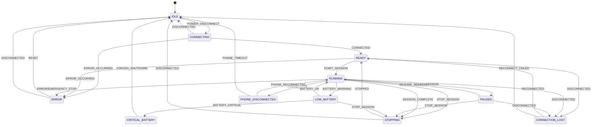
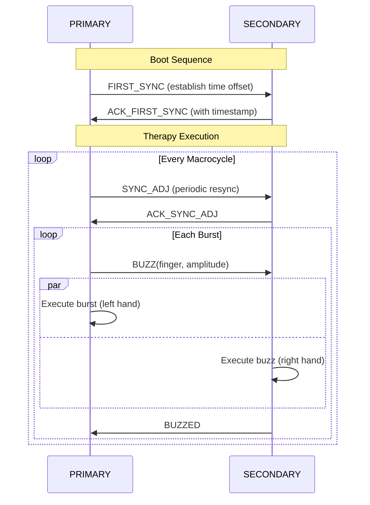
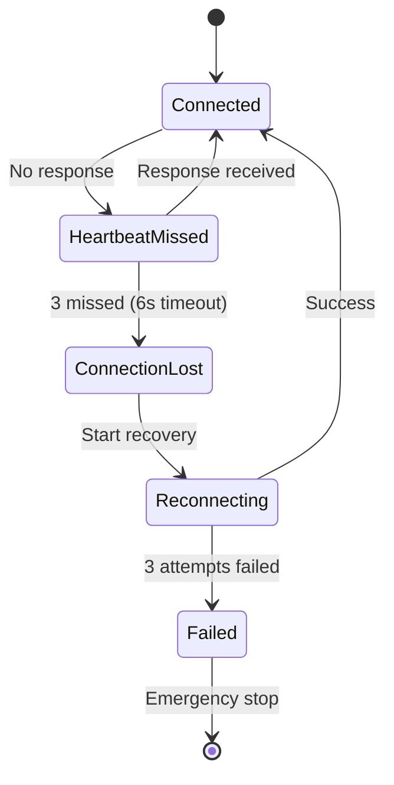
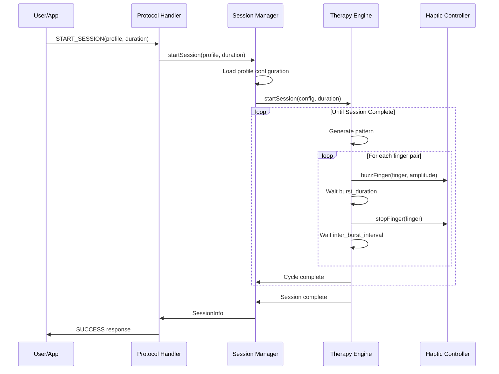
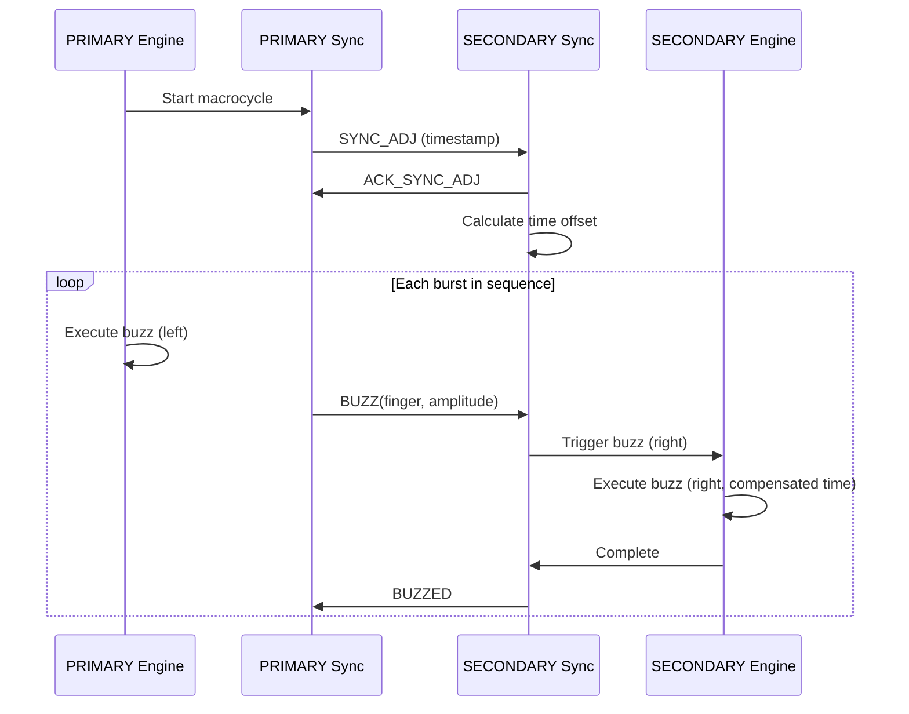

# BlueBuzzah v2 Architecture

This document provides a detailed explanation of the BlueBuzzah v2 system architecture, design patterns, and component interactions.

**Platform**: Arduino C++ on Adafruit Feather nRF52840 Express
**Build System**: PlatformIO with Adafruit nRF52 BSP

## Table of Contents

- [Overview](#overview)
- [Design Principles](#design-principles)
- [Module Organization](#module-organization)
- [Role-Based Architecture](#role-based-architecture)
- [Entry Point Flow](#entry-point-flow)
- [Layer Architecture](#layer-architecture)
- [Component Details](#component-details)
- [Hardware Abstraction](#hardware-abstraction)
- [Design Patterns](#design-patterns)
- [Data Flow](#data-flow)
- [Error Handling Strategy](#error-handling-strategy)
- [Memory Management](#memory-management)
- [Integration Points](#integration-points)
- [Scalability and Extensibility](#scalability-and-extensibility)
- [Development Guidelines](#development-guidelines)

## Overview

BlueBuzzah v2 is built using Clean Architecture principles, separating concerns into distinct layers with clear boundaries and dependencies flowing inward.

### Architecture Goals

1. **Testability**: Easy to test business logic without hardware
2. **Maintainability**: Clear module boundaries and responsibilities
3. **Extensibility**: Simple to add new features or change implementations
4. **Portability**: Hardware abstraction enables platform changes
5. **Reliability**: Explicit state management and error handling

### High-Level Structure

```
+-------------------------------------------------------------+
|                    Presentation Layer                       |
|  - BLE Command Handler  - Response Formatter  - LED UI      |
+-------------------------------------------------------------+
|                    Application Layer                        |
|  - Session Manager  - Profile Manager  - Command Processor  |
+-------------------------------------------------------------+
|                      Domain Layer                           |
|  - Therapy Engine  - Pattern Generator  - Sync Protocol     |
+-------------------------------------------------------------+
|                   Infrastructure Layer                      |
|  - BLE Service  - Haptic Driver  - Storage  - Battery Mon   |
+-------------------------------------------------------------+
|                      Hardware Layer                         |
|  - nRF52840  - DRV2605  - TCA9548A  - LRA Motors           |
+-------------------------------------------------------------+
```

## Design Principles

### 1. Clean Architecture

**Dependency Rule**: Dependencies point inward

- Presentation -> Application -> Domain -> Infrastructure -> Hardware
- Inner layers know nothing about outer layers
- Interfaces define boundaries

**Benefits**:

- Business logic independent of frameworks
- Testable without external dependencies
- UI and database can change independently

### 2. SOLID Principles

**Single Responsibility**: Each class has one reason to change

```cpp
// Each class has one responsibility
class TherapyEngine {
    // Responsible ONLY for executing therapy patterns
};

class PatternGenerator {
    // Responsible ONLY for generating patterns
};

class HardwareController {
    // Responsible ONLY for controlling motors
};
```

**Open/Closed**: Open for extension, closed for modification

```cpp
// include/pattern_generator.h

// Base pattern generator - extend by creating new generators
class PatternGenerator {
public:
    virtual ~PatternGenerator() = default;
    virtual Pattern generate(const PatternConfig& config) = 0;
};

// Concrete implementation - extends without modifying base
class RandomPermutationGenerator : public PatternGenerator {
public:
    Pattern generate(const PatternConfig& config) override {
        // Implementation here
    }
};
```

**Liskov Substitution**: Subtypes must be substitutable

```cpp
// Any HardwareController implementation can be used interchangeably
HardwareController* haptic = new DRV2605Controller(...);
HardwareController* haptic = new MockHapticController();  // For testing
```

**Interface Segregation**: Clients shouldn't depend on unused interfaces

```cpp
// Small, focused interfaces
class HapticInterface {
public:
    virtual void activate(uint8_t finger, uint8_t amplitude) = 0;
    virtual void deactivate(uint8_t finger) = 0;
};

// Not one massive "DeviceController" interface
```

**Dependency Inversion**: Depend on abstractions, not concretions

```cpp
class TherapyEngine {
public:
    // Depends on interfaces, not concrete implementations
    TherapyEngine(PatternGenerator& patternGen, HapticInterface& haptic)
        : _patternGenerator(patternGen)
        , _haptic(haptic)
    {}

private:
    PatternGenerator& _patternGenerator;
    HapticInterface& _haptic;
};
```

### 3. Domain-Driven Design

**Ubiquitous Language**: Common terminology

- **Session**: A therapy session from start to completion
- **Cycle**: One complete pattern repetition
- **Burst**: Three rapid buzzes on a finger
- **Macrocycle**: Collection of bursts with pauses
- **Profile**: Configuration for a therapy protocol

**Bounded Contexts**:

- **Therapy Context**: Pattern generation, cycle execution
- **Communication Context**: BLE protocol, messages
- **Hardware Context**: Device control, I2C communication
- **State Context**: Session states, transitions

## Module Organization

### File Structure

```text
BlueBuzzah-Firmware/
├── platformio.ini                    # Build configuration
├── include/
│   ├── config.h                      # Pin definitions, constants
│   ├── types.h                       # Enums, structs (DeviceRole, TherapyState)
│   ├── hardware.h                    # Hardware class declarations
│   ├── ble_manager.h                 # BLE management class
│   ├── therapy_engine.h              # Therapy execution class
│   ├── sync_protocol.h               # Sync command handling
│   ├── state_machine.h               # Therapy state machine
│   ├── menu_controller.h             # Command processing
│   ├── profile_manager.h             # Profile handling
│   ├── led_controller.h              # LED animations
│   ├── session_manager.h             # Session lifecycle
│   └── calibration_controller.h      # Calibration workflows
├── src/
│   ├── main.cpp                      # Entry point: setup() + loop()
│   ├── hardware.cpp                  # Hardware implementations
│   ├── ble_manager.cpp               # BLE implementations
│   ├── therapy_engine.cpp            # Therapy implementations
│   ├── sync_protocol.cpp             # Sync implementations
│   ├── state_machine.cpp             # State machine implementations
│   ├── menu_controller.cpp           # Menu implementations
│   ├── profile_manager.cpp           # Profile implementations
│   ├── led_controller.cpp            # LED implementations
│   ├── session_manager.cpp           # Session implementations
│   └── calibration_controller.cpp    # Calibration implementations
└── data/
    └── settings.json                 # Device configuration (uploaded via LittleFS)
```

### Module Responsibilities

| Module                          | Responsibility                   | Depends On                      |
| ------------------------------- | -------------------------------- | ------------------------------- |
| `main.cpp`                      | Entry point (setup/loop)         | All modules                     |
| `ble_manager.h/.cpp`            | BLE radio, connection management | `bluefruit.h`                   |
| `therapy_engine.h/.cpp`         | Therapy execution, pattern gen   | `hardware.h`, `sync_protocol.h` |
| `hardware.h/.cpp`               | Motor control, battery, I2C mux  | DRV2605, TCA9548A libs          |
| `menu_controller.h/.cpp`        | BLE command processing           | `profile_manager.h`             |
| `sync_protocol.h/.cpp`          | PRIMARY-SECONDARY messaging      | `ble_manager.h`                 |
| `profile_manager.h/.cpp`        | Therapy parameter management     | ArduinoJson                     |
| `state_machine.h/.cpp`          | Therapy state machine            | `types.h`                       |
| `led_controller.h/.cpp`         | LED animations                   | NeoPixel                        |
| `session_manager.h/.cpp`        | Session lifecycle                | `state_machine.h`               |
| `calibration_controller.h/.cpp` | Motor testing                    | `hardware.h`                    |

### Architecture Layers

- **Presentation**: `led_controller`, `menu_controller` (BLE command interface)
- **Application**: `session_manager`, `calibration_controller`
- **Domain**: `therapy_engine`, `sync_protocol`, `state_machine`
- **Infrastructure**: `ble_manager`, `hardware`, `profile_manager`

## Role-Based Architecture

BlueBuzzah implements a **PRIMARY-SECONDARY architecture** for bilateral haptic therapy using two synchronized gloves communicating via BLE.

### Unified Codebase

Both gloves run identical firmware with role-aware behavior controlled by `config.h` and `settings.json`:

```cpp
// config.h - Role detection from settings.json (LittleFS)
#include <LittleFS.h>
#include <ArduinoJson.h>

enum class DeviceRole { PRIMARY, SECONDARY };

struct DeviceConfig {
    DeviceRole role;
    const char* bleName;
    const char* deviceTag;
};

DeviceConfig loadDeviceConfig() {
    DeviceConfig config;
    File file = LittleFS.open("/settings.json", "r");

    if (!file) {
        // Default to PRIMARY if no settings
        config.role = DeviceRole::PRIMARY;
        config.bleName = "BlueBuzzah";
        config.deviceTag = "[PRIMARY]";
        return config;
    }

    JsonDocument doc;
    deserializeJson(doc, file);
    file.close();

    const char* roleStr = doc["deviceRole"] | "Primary";
    config.role = (strcmp(roleStr, "Primary") == 0)
        ? DeviceRole::PRIMARY
        : DeviceRole::SECONDARY;
    config.bleName = "BlueBuzzah";
    config.deviceTag = (config.role == DeviceRole::PRIMARY)
        ? "[PRIMARY]" : "[SECONDARY]";

    return config;
}

// settings.json for PRIMARY device
// {"deviceRole": "Primary"}

// settings.json for SECONDARY device
// {"deviceRole": "Secondary"}
```

### Role Polymorphism

Modules adapt behavior based on `deviceConfig.role`:

```cpp
// BLE Connection
if (deviceConfig.role == DeviceRole::PRIMARY) {
    primaryAdvertiseAndWait();
} else {
    secondaryScanAndConnect();
}

// Therapy Engine
if (deviceConfig.role == DeviceRole::PRIMARY) {
    syncProtocol.sendBuzz(finger, amplitude);
    haptic.buzzSequence(pattern);
} else {
    uint8_t finger = syncProtocol.receiveBuzz();  // Blocking
    haptic.buzzSequence(pattern);
}
```

### Command-Driven Synchronization

PRIMARY explicitly commands SECONDARY for every action using SYNC protocol:

```
PRIMARY -> SECONDARY: BUZZ:seq:timestamp:2|100
PRIMARY: <executes local buzz>
SECONDARY: <waits for command, then executes>
```

Benefits:
- Eliminates clock drift over 2-hour sessions
- Guarantees bilateral synchronization (+/-7.5ms BLE latency)
- Simplifies error recovery (SECONDARY halts if PRIMARY disconnects)

### Multi-Connection Support (PRIMARY Only)

PRIMARY supports **simultaneous connections** to:

1. **Smartphone** (phoneConnHandle) - Configuration, monitoring, control
2. **SECONDARY glove** (secondaryConnHandle) - Bilateral therapy coordination

### PRIMARY Responsibilities

1. **Advertise** as BLE peripheral ("BlueBuzzah")
2. **Accept connections** from smartphone + SECONDARY
3. **Execute boot sequence**: Wait for SECONDARY, optionally phone
4. **Orchestrate therapy**: Send BUZZ commands
5. **Send heartbeats** to SECONDARY during therapy
6. **Broadcast parameters** to SECONDARY on profile changes
7. **Process smartphone commands** via MenuController

| Function                         | Location              | Description                       |
| -------------------------------- | --------------------- | --------------------------------- |
| `primaryBootSequence()`          | `main.cpp`            | Boot and connection establishment |
| `runPrimaryLoop()`               | `main.cpp`            | Main therapy loop                 |
| `SessionManager::startSession()` | `session_manager.cpp` | Sends SYNC:START_SESSION          |
| `TherapyEngine::update()`        | `therapy_engine.cpp`  | Pattern generation and motor ctrl |

### SECONDARY Responsibilities

1. **Scan** for "BlueBuzzah" BLE advertisement
2. **Connect** to PRIMARY during boot sequence
3. **Receive SYNC commands**: START_SESSION, BUZZ, HEARTBEAT
4. **Execute synchronized buzzes** after command received
5. **Monitor heartbeat timeout** (6 seconds)
6. **Safety halt** if PRIMARY disconnects or heartbeat times out

| Function                   | Location            | Description                 |
| -------------------------- | ------------------- | --------------------------- |
| `secondaryBootSequence()`  | `main.cpp`          | Scan and connect to PRIMARY |
| `runSecondaryLoop()`       | `main.cpp`          | Wait for SYNC commands      |
| `handleSyncCommand()`      | `sync_protocol.cpp` | Process SYNC messages       |
| `handleHeartbeatTimeout()` | `main.cpp`          | Connection recovery         |

## Entry Point Flow

### Arduino setup()/loop() Paradigm

Arduino uses two entry functions:

- `setup()` - Called once at boot
- `loop()` - Called repeatedly forever

```cpp
// main.cpp

#include <Arduino.h>
#include <LittleFS.h>
#include "config.h"
#include "types.h"
#include "hardware.h"
#include "ble_manager.h"
#include "therapy_engine.h"
#include "state_machine.h"
#include "led_controller.h"

// Global instances
DeviceConfig deviceConfig;
TherapyConfig therapyConfig;
HardwareController hardware;
BLEManager bleManager;
TherapyEngine therapyEngine;
StateMachine stateMachine;
LEDController ledController;
BootResult bootResult;

void setup() {
    Serial.begin(115200);
    while (!Serial) delay(10);  // Wait for serial (optional)

    // 1. Initialize filesystem
    if (!LittleFS.begin()) {
        Serial.println(F("[ERROR] LittleFS mount failed"));
    }

    // 2. Load configuration from settings.json
    deviceConfig = loadDeviceConfig();
    therapyConfig = loadTherapyConfig();

    Serial.printf("[INFO] Role: %s\n", deviceConfig.deviceTag);

    // 3. Initialize hardware
    if (!hardware.begin()) {
        ledController.indicateFailure();
        while (true) { delay(1000); }  // Halt
    }

    // 4. Initialize BLE
    bleManager.begin(deviceConfig);

    // 5. Execute boot sequence (role-specific)
    #ifdef SKIP_BOOT_SEQUENCE
        bootResult = BootResult::SUCCESS_NO_PHONE;
    #else
        bootResult = executeBootSequence();
    #endif

    if (bootResult == BootResult::FAILED) {
        ledController.indicateFailure();
        while (true) { delay(1000); }  // Halt
    }

    // 6. Switch to therapy LED mode
    ledController.switchToTherapyMode();

    Serial.println(F("[INFO] Boot complete, entering main loop"));
}

void loop() {
    // Role-specific main loop
    if (deviceConfig.role == DeviceRole::PRIMARY) {
        runPrimaryLoop();
    } else {
        runSecondaryLoop();
    }
}
```

### Boot Sequence

**PRIMARY:**
1. Initialize BLE and advertise as "BlueBuzzah"
2. LED: Rapid blue flash during connection wait
3. Wait for SECONDARY connection (required)
4. Optionally wait for phone connection
5. Success: Solid blue LED

**SECONDARY:**
1. Initialize BLE and scan for "BlueBuzzah"
2. LED: Rapid blue flash during scanning
3. Connect to PRIMARY within timeout
4. Success: Solid blue LED

### Timing Breakdown

- Boot sequence: 0-30s (configurable via `BOOT_TIMEOUT_MS`)
- Connection handshake: 2-15s
- Therapy execution: 2-180 minutes
- Shutdown: <1s

## Layer Architecture

### Presentation Layer

**Purpose**: Handle external interactions (BLE commands, LED feedback)

**Components**:

- `menu_controller.h/.cpp`: Parse and validate BLE commands
- `led_controller.h/.cpp`: Visual feedback to user

**Characteristics**:

- No business logic
- Transforms external data to/from domain models
- Handles user interaction protocols

**Example**:

```cpp
// src/menu_controller.cpp

void MenuController::processCommand(const char* command,
                                     char* response,
                                     size_t responseSize) {
    // Parse command
    char cmdType[32];
    parseCommandType(command, cmdType, sizeof(cmdType));

    // Route to application layer
    if (strcmp(cmdType, "SESSION_START") == 0) {
        char profile[32];
        uint32_t duration;
        parseSessionParams(command, profile, &duration);

        if (_session.startSession(profile, duration)) {
            snprintf(response, responseSize, "OK:Session started\n\x04");
        } else {
            snprintf(response, responseSize, "ERROR:Cannot start session\n\x04");
        }
    }
    else if (strcmp(cmdType, "SESSION_STATUS") == 0) {
        _session.getStatus(response, responseSize);
    }
}
```

### Application Layer

**Purpose**: Orchestrate use cases and coordinate domain objects

**Components**:

- `session_manager.h/.cpp`: Session lifecycle management
- `profile_manager.h/.cpp`: Profile loading and validation
- `calibration_controller.h/.cpp`: Calibration workflows

**Characteristics**:

- Use case implementations
- Transaction boundaries
- Error handling and recovery

**Example**:

```cpp
// src/session_manager.cpp

bool SessionManager::startSession(const char* profileName, uint32_t durationSec) {
    // Load profile (application service)
    TherapyConfig config;
    if (!_profiles.loadProfile(profileName, config)) {
        return false;
    }

    // Validate preconditions
    if (!canStartSession()) {
        return false;
    }

    // Execute therapy (domain service)
    if (!_engine.startSession(config, durationSec)) {
        return false;
    }

    // Update state
    _stateMachine.transition(StateTrigger::START_SESSION);

    return true;
}
```

### Domain Layer

**Purpose**: Core business logic and rules

**Components**:

- `therapy_engine.h/.cpp`: Therapy execution logic
- `sync_protocol.h/.cpp`: Bilateral synchronization
- `state_machine.h/.cpp`: Therapy state machine

**Characteristics**:

- Pure business logic
- No external dependencies
- Framework-agnostic
- Highly testable

**Example**:

```cpp
// src/therapy_engine.cpp

void TherapyEngine::executeCycle() {
    // Generate pattern (domain logic)
    generatePattern();

    // Execute with precise timing
    for (uint8_t i = 0; i < _config.burstsPerCycle; i++) {
        uint8_t leftFinger = _leftSequence[i];
        uint8_t rightFinger = _rightSequence[i];

        // Bilateral activation (infrastructure call through interface)
        activateBilateral(leftFinger, rightFinger, _config.amplitudePercent);

        // Timing control (domain logic)
        delay(_config.burstDurationMs);

        deactivateBilateral(leftFinger, rightFinger);

        // Apply jitter if configured
        uint16_t interval = _config.interBurstIntervalMs;
        if (_config.jitterPercent > 0) {
            interval += calculateJitter();
        }
        delay(interval);
    }

    _cycleCount++;
}
```

### Infrastructure Layer

**Purpose**: Interface with external systems and hardware

**Components**:

- `ble_manager.h/.cpp`: BLE communication
- `hardware.h/.cpp`: Motor control (DRV2605), battery, I2C mux
- `profile_manager.h/.cpp`: LittleFS profile storage

**Characteristics**:

- Implements interfaces defined by domain
- Handles external resource management
- Deals with framework-specific code
- May have side effects

**Example**:

```cpp
// src/hardware.cpp

void HardwareController::buzzFinger(uint8_t finger, uint8_t amplitude) {
    // Infrastructure-level details
    _tca.select(finger);

    // Hardware-specific protocol
    uint8_t registerValue = (amplitude * 127) / 100;
    _drv[finger].setRealtimeValue(registerValue);

    _motorActive[finger] = true;
}

void HardwareController::stopFinger(uint8_t finger) {
    _tca.select(finger);
    _drv[finger].setRealtimeValue(0);
    _motorActive[finger] = false;
}
```

## Component Details

### State Management

The system has 11 distinct states to handle all operational scenarios:



**State Descriptions**:

| State | Value | Description |
|-------|-------|-------------|
| `IDLE` | 0 | No active session, system ready |
| `CONNECTING` | 1 | Establishing BLE connection |
| `READY` | 2 | Connected, ready for therapy |
| `RUNNING` | 3 | Active therapy session |
| `PAUSED` | 4 | Session paused, can resume |
| `STOPPING` | 5 | Session ending, cleanup |
| `ERROR` | 6 | Error condition, motors stopped |
| `LOW_BATTERY` | 7 | Battery < 20%, session can continue |
| `CRITICAL_BATTERY` | 8 | Battery < 5%, forced shutdown |
| `CONNECTION_LOST` | 9 | Inter-device BLE lost, attempting recovery |
| `PHONE_DISCONNECTED` | 10 | Phone BLE lost (PRIMARY only) |

**Implementation**:

```cpp
// src/state_machine.cpp

bool StateMachine::transition(StateTrigger trigger) {
    TherapyState nextState;

    switch (_currentState) {
        case TherapyState::IDLE:
            if (trigger == StateTrigger::CONNECTED) {
                nextState = TherapyState::READY;
            } else {
                return false;  // Invalid transition
            }
            break;

        case TherapyState::READY:
            if (trigger == StateTrigger::START_SESSION) {
                nextState = TherapyState::RUNNING;
            } else if (trigger == StateTrigger::DISCONNECTED) {
                nextState = TherapyState::CONNECTION_LOST;
            } else {
                return false;
            }
            break;

        // ... additional state transitions
    }

    // Notify callback if registered
    if (_callback) {
        _callback(_currentState, nextState);
    }

    _currentState = nextState;
    return true;
}
```

### Bilateral Mirroring

The `mirrorPattern` parameter controls whether both hands receive the same finger sequence or independent sequences. This is based on vCR research findings:

| vCR Type | `mirrorPattern` | Behavior | Rationale |
|----------|-----------------|----------|-----------|
| **Noisy vCR** | `true` | Same finger on both hands | Avoids bilateral masking interference |
| **Regular vCR** | `false` | Independent sequences per hand | Increases spatial randomization for synaptic decoupling |

**Implementation**:

```cpp
// src/therapy_engine.cpp

void TherapyEngine::generatePattern() {
    // Generate left hand sequence using Fisher-Yates shuffle
    for (uint8_t i = 0; i < 4; i++) {
        _leftSequence[i] = i;
    }
    for (uint8_t i = 3; i > 0; i--) {
        uint8_t j = random(0, i + 1);
        uint8_t temp = _leftSequence[i];
        _leftSequence[i] = _leftSequence[j];
        _leftSequence[j] = temp;
    }

    // Generate right hand sequence based on mirror setting
    if (_config.mirrorPattern) {
        // Mirrored: same finger on both hands (noisy vCR)
        memcpy(_rightSequence, _leftSequence, sizeof(_leftSequence));
    } else {
        // Non-mirrored: independent random sequence (regular vCR)
        for (uint8_t i = 0; i < 4; i++) {
            _rightSequence[i] = i;
        }
        for (uint8_t i = 3; i > 0; i--) {
            uint8_t j = random(0, i + 1);
            uint8_t temp = _rightSequence[i];
            _rightSequence[i] = _rightSequence[j];
            _rightSequence[j] = temp;
        }
    }
}
```

**Hardware Note**: Both gloves use identical channel-to-finger mapping (channel 0 = pinky on both gloves). The `mirrorPattern` setting controls whether the same channel number is sent to both devices (mirrored) or different channels (non-mirrored).

### Configuration System

**Layered Configuration**:

1. **Device Configuration** (`settings.json`): Device role
2. **Therapy Configuration** (profiles): Profile settings
3. **Runtime Configuration**: Dynamic adjustments

**Loading Hierarchy**:

```cpp
// src/main.cpp

DeviceConfig loadDeviceConfig() {
    DeviceConfig config;

    if (!LittleFS.begin()) {
        config.role = DeviceRole::PRIMARY;
        config.bleName = "BlueBuzzah";
        config.deviceTag = "[PRIMARY]";
        return config;
    }

    File file = LittleFS.open("/settings.json", "r");
    if (!file) {
        config.role = DeviceRole::PRIMARY;
        config.bleName = "BlueBuzzah";
        config.deviceTag = "[PRIMARY]";
        return config;
    }

    JsonDocument doc;
    deserializeJson(doc, file);
    file.close();

    const char* roleStr = doc["deviceRole"] | "Primary";
    config.role = (strcmp(roleStr, "Primary") == 0)
        ? DeviceRole::PRIMARY
        : DeviceRole::SECONDARY;
    config.bleName = "BlueBuzzah";
    config.deviceTag = (config.role == DeviceRole::PRIMARY)
        ? "[PRIMARY]" : "[SECONDARY]";

    return config;
}
```

### Synchronization Protocol

**PRIMARY-SECONDARY Communication**:



**Time Synchronization**:

```cpp
// src/sync_protocol.cpp

int32_t SyncProtocol::calculateOffset(uint32_t primaryTime, uint32_t secondaryTime) {
    // Offset = (T_primary - T_secondary) / 2
    // This compensates for message transmission time and ensures
    // sub-10ms synchronization accuracy.
    return (int32_t)(primaryTime - secondaryTime) / 2;
}

uint32_t SyncProtocol::applyCompensation(uint32_t timestamp, int32_t offset) {
    return timestamp + offset;
}
```

### Heartbeat Protocol

The heartbeat protocol ensures continuous connection monitoring between PRIMARY and SECONDARY devices:

| Parameter | Value | Description |
|-----------|-------|-------------|
| Interval | 2 seconds | Time between heartbeat messages |
| Timeout | 6 seconds | 3 missed heartbeats = connection lost |
| Recovery attempts | 3 | Number of reconnection attempts |
| Recovery delay | 2 seconds | Delay between reconnection attempts |

**Connection Recovery Flow**:



**Implementation**:

```cpp
// src/main.cpp

#define HEARTBEAT_INTERVAL_MS 2000
#define HEARTBEAT_TIMEOUT_MS 6000
#define RECONNECT_ATTEMPTS 3
#define RECONNECT_DELAY_MS 2000

void checkHeartbeat() {
    uint32_t elapsed = millis() - lastHeartbeatReceived;

    if (elapsed > HEARTBEAT_TIMEOUT_MS) {
        handleConnectionLost();
    }
}

void handleConnectionLost() {
    hardware.stopAllMotors();
    stateMachine.forceState(TherapyState::CONNECTION_LOST);
    ledController.indicateConnectionLost();

    // Attempt recovery
    for (uint8_t attempt = 0; attempt < RECONNECT_ATTEMPTS; attempt++) {
        delay(RECONNECT_DELAY_MS);
        if (bleManager.reconnectToPrimary()) {
            stateMachine.forceState(TherapyState::READY);
            lastHeartbeatReceived = millis();
            return;
        }
    }

    // Recovery failed
    stateMachine.forceState(TherapyState::IDLE);
}
```

### SYNC Message Format

Inter-device communication uses a structured message format:

**Format**:
```
SYNC:<command>:<key1>|<value1>|<key2>|<value2>...<EOT>
```

**Components**:
- `SYNC:` - Message prefix identifier
- `<command>` - Command type (see table below)
- `:` - Field separator
- `<key>|<value>` - Key-value pairs separated by pipe
- `<EOT>` - End of transmission marker (ASCII 0x04)

**Command Reference**:

| Command | Direction | Description |
|---------|-----------|-------------|
| `CONNECTED` | P->S | Connection established |
| `START_SESSION` | P->S | Begin therapy session |
| `PAUSE_SESSION` | P->S | Pause current session |
| `RESUME_SESSION` | P->S | Resume paused session |
| `STOP_SESSION` | P->S | Stop and end session |
| `STOPPED` | S->P | Session stopped confirmation |
| `BUZZ` | P->S | Trigger buzz on SECONDARY |
| `HEARTBEAT` | P<->S | Connection keepalive |
| `EMERGENCY_STOP` | P<->S | Immediate motor shutoff |
| `PHONE_DISCONNECTED` | P->S | Phone app disconnected |
| `ACK` | S->P | Acknowledgment |
| `ERROR` | P<->S | Error notification |

**Example Messages**:

```text
SYNC:START_SESSION:profile|noisy_vcr|duration|7200<EOT>
BUZZ:42:1234567890:2|100
SYNC:HEARTBEAT:timestamp|1234567890<EOT>
SYNC:ACK:command|START_SESSION<EOT>
```

## Hardware Abstraction

### Haptic Controller Architecture

```text
[HardwareController]
    └── I2C Bus (Wire @ 400kHz)
        └── TCA9548A Multiplexer (0x70)
            ├── Port 0: DRV2605 (Thumb)   @ 0x5A
            ├── Port 1: DRV2605 (Index)   @ 0x5A
            ├── Port 2: DRV2605 (Middle)  @ 0x5A
            ├── Port 3: DRV2605 (Ring)    @ 0x5A
            └── Port 4: DRV2605 (Pinky)   @ 0x5A
```

### I2C Initialization

```cpp
// hardware.cpp

#include <Wire.h>
#include <Adafruit_TCA9548A.h>
#include <Adafruit_DRV2605.h>

Adafruit_TCA9548A tca;
Adafruit_DRV2605 drv[5];

bool HardwareController::begin() {
    Wire.begin();
    Wire.setClock(400000);  // 400kHz I2C

    // Initialize multiplexer
    if (!tca.begin()) {
        Serial.println(F("[CRITICAL] TCA9548A not found"));
        return false;
    }

    // Initialize each DRV2605
    for (uint8_t i = 0; i < 5; i++) {
        tca.select(i);

        // Extra delay for channel 4 (longer I2C path)
        if (i == 4) {
            delay(10);
        } else {
            delay(5);
        }

        if (!drv[i].begin()) {
            Serial.printf("[ERROR] DRV2605 on channel %d failed\n", i);
            return false;
        }

        configureDRV2605(drv[i]);
        Serial.printf("[INFO] DRV2605 channel %d initialized\n", i);
    }

    return true;
}
```

### DRV2605 Configuration

```cpp
void HardwareController::configureDRV2605(Adafruit_DRV2605& driver) {
    // 1. Set actuator type (LRA - Linear Resonant Actuator)
    driver.useLRA();

    // 2. Enable open-loop mode (bypass auto-resonance)
    uint8_t control3 = driver.readRegister8(0x1D);
    driver.writeRegister8(0x1D, control3 | 0x21);  // Set bits 5 and 0

    // 3. Set peak voltage (register 0x17)
    // Formula: voltage / 0.02122
    driver.writeRegister8(0x17, (uint8_t)(ACTUATOR_VOLTAGE / 0.02122));

    // 4. Set driving frequency (register 0x20)
    // Formula: 1 / (frequency * 0.00009849)
    driver.writeRegister8(0x20, (uint8_t)(1.0 / (ACTUATOR_FREQUENCY * 0.00009849)));

    // 5. Activate Real-Time Playback (RTP) mode
    driver.setRealtimeValue(0);
    driver.setMode(DRV2605_MODE_REALTIME);
}
```

### DRV2605 Register Map

| Register | Name       | Purpose                                |
| -------- | ---------- | -------------------------------------- |
| `0x1D`   | Control3   | Open-loop enable, N/ERM+ mode          |
| `0x17`   | OD_CLAMP   | Peak voltage clamping (0-255 = 0-5.6V) |
| `0x20`   | LRA_PERIOD | Driving period for LRA resonance       |
| `0x00`   | STATUS     | Go bit (trigger playback)              |

### Battery Monitor

```cpp
class BatteryMonitor {
public:
    float getVoltage() {
        // nRF52840: 3.6V reference, 14-bit ADC
        uint16_t raw = analogRead(BATTERY_PIN);
        float voltage = (raw / 16383.0f) * 3.6f * 2.0f;  // Voltage divider
        return voltage;
    }

    uint8_t getPercentage() {
        float v = getVoltage();
        // LiPo: 4.2V = 100%, 3.2V = 0%
        if (v >= 4.2f) return 100;
        if (v <= 3.2f) return 0;
        return (uint8_t)((v - 3.2f) / 1.0f * 100.0f);
    }
};
```

## Design Patterns

### 1. Strategy Pattern (Pattern Generators)

**Purpose**: Pluggable algorithms for pattern generation

```cpp
// include/pattern_generator.h

class PatternGenerator {
public:
    virtual ~PatternGenerator() = default;
    virtual Pattern generate(const PatternConfig& config) = 0;
};

class RandomPermutationGenerator : public PatternGenerator {
public:
    Pattern generate(const PatternConfig& config) override {
        // Generate random permutation
        uint8_t sequence[4] = {0, 1, 2, 3};
        shuffleArray(sequence, 4);
        return Pattern(sequence, sequence, config);
    }
};

class SequentialGenerator : public PatternGenerator {
public:
    Pattern generate(const PatternConfig& config) override {
        uint8_t sequence[4] = {0, 1, 2, 3};  // Fixed order
        return Pattern(sequence, sequence, config);
    }
};

// Usage - strategy is interchangeable
PatternGenerator* generator = new RandomPermutationGenerator();
Pattern pattern = generator->generate(config);
```

### 2. Repository Pattern (Hardware Abstraction)

**Purpose**: Abstract data/hardware access

```cpp
// include/haptic_interface.h

class HapticInterface {
public:
    virtual ~HapticInterface() = default;
    virtual void activate(uint8_t finger, uint8_t amplitude) = 0;
    virtual void deactivate(uint8_t finger) = 0;
    virtual void stopAll() = 0;
};

// Concrete implementation: Real hardware
class DRV2605Controller : public HapticInterface {
    // ... implementation
};

// Concrete implementation: Mock for testing
class MockHapticController : public HapticInterface {
    // ... test implementation
};

// Application code doesn't know which implementation
void executeTherapy(HapticInterface& haptic) {
    haptic.activate(0, 75);
}
```

### 3. Dependency Injection

**Purpose**: Invert dependencies for testability

```cpp
class TherapyEngine {
public:
    // Dependencies injected through constructor
    TherapyEngine(HardwareController& hardware,
                  StateMachine& stateMachine)
        : _hardware(hardware)
        , _stateMachine(stateMachine)
    {}

private:
    HardwareController& _hardware;
    StateMachine& _stateMachine;
};

// Production setup
HardwareController hardware;
StateMachine stateMachine;
TherapyEngine engine(hardware, stateMachine);

// Test setup
MockHardwareController mockHardware;
StateMachine stateMachine;
TherapyEngine engine(mockHardware, stateMachine);
```

### 4. Observer Pattern (State Changes)

**Purpose**: Notify interested parties of state changes

```cpp
// include/state_machine.h

class StateMachine {
public:
    typedef void (*StateChangeCallback)(TherapyState from, TherapyState to);

    void setCallback(StateChangeCallback callback) {
        _callback = callback;
    }

    bool transition(StateTrigger trigger) {
        TherapyState oldState = _currentState;
        // ... perform transition logic ...

        if (_callback) {
            _callback(oldState, _currentState);
        }
        return true;
    }

private:
    TherapyState _currentState = TherapyState::IDLE;
    StateChangeCallback _callback = nullptr;
};

// Usage
void onStateChange(TherapyState from, TherapyState to) {
    Serial.printf("State: %d -> %d\n", (int)from, (int)to);
    ledController.setTherapyState(to);
}

stateMachine.setCallback(onStateChange);
```

### 5. Factory Pattern (Object Creation)

**Purpose**: Encapsulate object creation logic

```cpp
// include/profile_factory.h

class ProfileFactory {
public:
    static TherapyConfig createProfile(const char* profileType) {
        TherapyConfig config;

        if (strcmp(profileType, "regular_vcr") == 0) {
            strncpy(config.profileName, "Regular vCR", sizeof(config.profileName));
            config.burstDurationMs = 100;
            config.interBurstIntervalMs = 668;
            strncpy(config.patternType, "sequential", sizeof(config.patternType));
            config.mirrorPattern = false;
        }
        else if (strcmp(profileType, "noisy_vcr") == 0) {
            strncpy(config.profileName, "Noisy vCR", sizeof(config.profileName));
            config.burstDurationMs = 100;
            config.interBurstIntervalMs = 668;
            strncpy(config.patternType, "random", sizeof(config.patternType));
            config.mirrorPattern = true;
        }
        else if (strcmp(profileType, "hybrid_vcr") == 0) {
            strncpy(config.profileName, "Hybrid vCR", sizeof(config.profileName));
            config.burstDurationMs = 100;
            config.interBurstIntervalMs = 668;
            strncpy(config.patternType, "mirrored", sizeof(config.patternType));
            config.mirrorPattern = false;
        }

        return config;
    }
};

// Usage
TherapyConfig profile = ProfileFactory::createProfile("noisy_vcr");
```

## Data Flow

### Session Start Flow



### Bilateral Synchronization Flow



## Error Handling Strategy

### Hierarchical Error Responses

**Level 1: Fatal Errors** (Halt with LED indicator)

- Boot sequence failure -> Red LED flash, halt
- I2C initialization failure -> Diagnostic message + halt
- Heartbeat timeout -> Emergency stop motors, attempt reconnect

```cpp
void fatalError(const char* message) {
    Serial.printf("[FATAL] %s\n", message);
    hardware.stopAllMotors();
    ledController.indicateFailure();
    while (true) { delay(1000); }  // Halt forever
}
```

**Level 2: Recoverable Errors** (Log + Continue)

- SYNC command timeout -> Log warning, proceed
- Battery query timeout -> Return default value
- File read failure -> Return error code

```cpp
bool recoverableError(const char* context) {
    Serial.printf("[WARN] %s - continuing\n", context);
    return false;  // Indicate failure
}
```

**Level 3: User Errors** (BLE Error Response)

- Invalid command -> `ERROR:Unknown command`
- Invalid parameter -> `ERROR:Value out of range`
- Command during session -> `ERROR:Cannot modify during active session`

```cpp
void sendErrorResponse(const char* error) {
    char response[64];
    snprintf(response, sizeof(response), "ERROR:%s\n\x04", error);
    bleManager.sendToPhone(response);
}
```

### Timeout Handling Matrix

| Operation            | Timeout      | Failure Action    | Location            |
| -------------------- | ------------ | ----------------- | ------------------- |
| Boot sequence        | 30s          | Red LED, halt     | `main.cpp`          |
| BLE scan (SECONDARY) | 30s          | Red LED, halt     | `ble_manager.cpp`   |
| Heartbeat            | 6s           | Reconnect attempt | `main.cpp`          |
| SYNC command         | 10s          | Log warning       | `sync_protocol.cpp` |
| BLE receive          | Non-blocking | Callback-based    | `ble_manager.cpp`   |

### Return Code Pattern

```cpp
enum class Result : uint8_t {
    OK,
    ERROR_TIMEOUT,
    ERROR_INVALID_PARAM,
    ERROR_NOT_CONNECTED,
    ERROR_HARDWARE
};

Result HardwareController::buzzFinger(uint8_t finger, uint8_t amplitude) {
    if (finger > 4) return Result::ERROR_INVALID_PARAM;
    if (amplitude > 127) return Result::ERROR_INVALID_PARAM;

    tca.select(finger);
    drv[finger].setRealtimeValue(amplitude);

    return Result::OK;
}
```

## Memory Management

### nRF52840 Memory Budget

| Region          | Size    | Usage                             |
| --------------- | ------- | --------------------------------- |
| Flash           | 1 MB    | Program code, constants, LittleFS |
| SRAM            | 256 KB  | All runtime data                  |
| Bluefruit stack | ~15 KB  | Fixed BLE overhead                |
| UART buffers    | ~1 KB   | RX + TX buffers                   |
| Pattern storage | ~500 B  | Current + next pattern            |
| State machine   | ~200 B  | State + transitions               |
| Application     | ~3 KB   | All classes combined              |
| Stack           | ~4 KB   | Conservative estimate             |
| **Total Used**  | ~24 KB  |                                   |
| **Available**   | 256 KB  | nRF52840 SRAM                     |
| **Headroom**    | ~232 KB | Ample for future features         |

### Memory-Efficient Patterns

**Prefer static allocation:**

```cpp
// GOOD: Static arrays allocated at compile time
static uint8_t patternBuffer[32];
static char messageBuffer[128];

// AVOID: Dynamic allocation (heap fragmentation)
uint8_t* buffer = new uint8_t[32];  // Must delete[]!
char* msg = (char*)malloc(128);     // Must free()!
```

**Use PROGMEM/F() for string constants:**

```cpp
// GOOD: String stored in flash, not RAM
Serial.println(F("BlueBuzzah initialized"));

// BAD: String stored in RAM
Serial.println("BlueBuzzah initialized");
```

**Avoid Arduino String class:**

```cpp
// AVOID: String class causes heap fragmentation
String msg = "SYNC:" + String(timestamp);

// PREFER: Fixed char buffers with snprintf
char msg[64];
snprintf(msg, sizeof(msg), "SYNC:%lu", timestamp);
```

**Use fixed-size buffers:**

```cpp
// GOOD: Fixed buffer for BLE messages
static char rxBuffer[256];
static uint16_t rxBufferIndex = 0;

void rxCallback(uint16_t conn_handle) {
    while (bleuart.available()) {
        char c = bleuart.read();
        if (c == 0x04 || rxBufferIndex >= sizeof(rxBuffer) - 1) {
            rxBuffer[rxBufferIndex] = '\0';
            processMessage(rxBuffer);
            rxBufferIndex = 0;
        } else {
            rxBuffer[rxBufferIndex++] = c;
        }
    }
}
```

### No Garbage Collection

Memory management is deterministic:

- **Auto-reclaimed** when functions return (stack)
- **Persistent** until reset (static/global)
- **Manual management** if using heap (avoid!)

**Best practice:** Use only stack and static allocation. Never use `new`/`malloc` in embedded code unless absolutely necessary.

## Integration Points

### BLE Protocol Integration

**Command Structure** (string-based):

```text
COMMAND_NAME:ARG1:ARG2:...\n
```

**Response Structure**:

```text
KEY1:VALUE1\n
KEY2:VALUE2\n
\x04
```

### Hardware Integration

**I2C Communication**:

```cpp
// src/hardware.cpp

void HardwareController::selectChannel(uint8_t channel) {
    if (channel > 7) return;

    // TCA9548A: Write channel bitmask to control register
    uint8_t mask = 1 << channel;
    Wire.beginTransmission(I2C_MULTIPLEXER_ADDR);
    Wire.write(mask);
    Wire.endTransmission();
}

void HardwareController::buzzFinger(uint8_t finger, uint8_t amplitude) {
    // Select multiplexer channel for this finger
    selectChannel(finger);

    // Write to DRV2605 RTP register
    uint8_t registerValue = (amplitude * 127) / 100;
    _drv[finger].setRealtimeValue(registerValue);
}
```

## Scalability and Extensibility

### Adding New Pattern Generators

1. Create class that inherits from `PatternGenerator`
2. Implement `generate()` method

```cpp
class CustomPatternGenerator : public PatternGenerator {
public:
    Pattern generate(const PatternConfig& config) override {
        // Implement custom algorithm
        uint8_t sequence[4];
        customAlgorithm(sequence);
        return Pattern(sequence, sequence, config);
    }
};
```

### Adding New Therapy Profiles

1. Define profile parameters
2. Add to profile factory or LittleFS storage

```cpp
TherapyConfig createCustomProfile() {
    TherapyConfig config;
    strncpy(config.profileName, "Custom Research Profile", sizeof(config.profileName));
    config.burstDurationMs = 150;
    config.interBurstIntervalMs = 500;
    config.burstsPerCycle = 4;
    strncpy(config.patternType, "random", sizeof(config.patternType));
    config.mirrorPattern = true;
    config.frequencyHz = 175;
    config.amplitudePercent = 80;
    return config;
}
```

### Adding New Hardware Platforms

1. Create class implementing `HapticInterface`
2. Create battery monitor class
3. Update board configuration

```cpp
class NewHapticDriver : public HapticInterface {
public:
    void activate(uint8_t finger, uint8_t amplitude) override {
        // Platform-specific implementation
    }

    void deactivate(uint8_t finger) override {
        // Platform-specific implementation
    }

    void stopAll() override {
        // Platform-specific implementation
    }
};
```

### Adding New BLE Commands

1. Add handler in `MenuController`
2. Update application layer logic

```cpp
void MenuController::processCommand(const char* command,
                                     char* response,
                                     size_t responseSize) {
    char cmdType[32];
    parseCommandType(command, cmdType, sizeof(cmdType));

    if (strcmp(cmdType, "NEW_FEATURE") == 0) {
        handleNewFeature(command, response, responseSize);
    }
    // ... existing handlers
}

void MenuController::handleNewFeature(const char* params,
                                       char* response,
                                       size_t size) {
    // Implementation
    snprintf(response, size, "OK:New feature executed\n\x04");
}
```

## Development Guidelines

### Role-Aware Code Patterns

```cpp
// Clear role branching using enum class
if (deviceConfig.role == DeviceRole::PRIMARY) {
    runPrimaryLoop();
} else {
    runSecondaryLoop();
}

// Role configured via settings.json
// settings.json: {"deviceRole": "Primary"}
```

### BLE Message Protocol

**Phone -> PRIMARY Commands:**

```text
COMMAND_NAME:ARG1:ARG2:...\n
```

**PRIMARY -> Phone Responses:**

```text
KEY1:VALUE1\n
KEY2:VALUE2\n
\x04
```

**PRIMARY <-> SECONDARY SYNC Messages:**

```text
SYNC:<command>:<key1>|<val1>|<key2>|<val2>
```

### BLE Callback Pattern (Bluefruit)

```cpp
// Setup callbacks in setup()
void setup() {
    Bluefruit.Periph.setConnectCallback(connectCallback);
    Bluefruit.Periph.setDisconnectCallback(disconnectCallback);
    bleuart.setRxCallback(rxCallback);
}

// Connection callback
void connectCallback(uint16_t connHandle) {
    Serial.printf("[BLE] Connected: %d\n", connHandle);
    // Identify connection type, update state
}

// Disconnect callback
void disconnectCallback(uint16_t connHandle, uint8_t reason) {
    Serial.printf("[BLE] Disconnected: %d, reason: 0x%02X\n", connHandle, reason);
    // Handle disconnection, trigger recovery if needed
}

// RX callback - called when data received
void rxCallback(uint16_t connHandle) {
    while (bleuart.available()) {
        char c = bleuart.read();
        if (c == 0x04) {
            processMessage(rxBuffer);
            rxBufferIndex = 0;
        } else if (rxBufferIndex < sizeof(rxBuffer) - 1) {
            rxBuffer[rxBufferIndex++] = c;
        }
    }
}
```

### Testing Checklist

Before committing changes:

- [ ] **Build succeeds**: `pio run`
- [ ] **Upload succeeds**: `pio run -t upload`
- [ ] **Both roles tested**: Test with settings.json set to Primary and Secondary
- [ ] **BLE commands verified**: Test phone commands via nRF Connect app
- [ ] **Memory stable**: No crashes during 5-minute test
- [ ] **Synchronization accurate**: PRIMARY/SECONDARY buzz within 20ms (serial logs)
- [ ] **Heartbeat working**: Verify 2s heartbeat, 6s timeout detection
- [ ] **Error handling**: Test disconnection, invalid commands, low battery

### C++ Embedded Best Practices

**No exceptions (typically disabled):**

```cpp
// DON'T use try/catch
try {
    riskyOperation();
} catch (...) { }

// DO use return codes
Result result = riskyOperation();
if (result != Result::OK) {
    handleError(result);
}
```

**Integer overflow awareness:**

```cpp
// OK: Unsigned subtraction wraps correctly
uint32_t elapsed = millis() - startTime;

// DANGEROUS: Check before subtraction if result could be negative
uint32_t remaining = duration - elapsed;  // BAD if elapsed > duration!

// SAFE:
uint32_t remaining = (elapsed < duration) ? (duration - elapsed) : 0;
```

**Use appropriate integer types:**

```cpp
uint8_t fingerIndex;      // 0-255 (finger 0-4)
uint16_t connHandle;      // BLE connection handles
uint32_t timestamp;       // millis()/micros() values
int32_t signedValue;      // When negative values possible
```

**Minimize floating-point when possible:**

```cpp
// SLOWER: Floating-point math
float percent = (float)elapsed / (float)duration * 100.0f;

// FASTER: Integer math
uint8_t percent = (uint8_t)((elapsed * 100UL) / duration);
```

**Minimize string operations:**

```cpp
// AVOID: Multiple string operations
Serial.print("State: ");
Serial.print(stateName);
Serial.print(" at ");
Serial.println(millis());

// PREFER: Single formatted output
Serial.printf("State: %s at %lu\n", stateName, millis());
```

### Build Commands

```bash
# Build firmware
pio run

# Upload to device
pio run -t upload

# Upload LittleFS filesystem (settings.json)
pio run -t uploadfs

# Serial monitor
pio device monitor

# Clean build
pio run -t clean
```

## Summary

BlueBuzzah v2 architecture provides:

1. **Clean separation of concerns** through layered architecture
2. **High testability** via dependency injection and abstractions
3. **Maintainability** through SOLID principles and clear boundaries
4. **Extensibility** via strategy pattern and factory methods
5. **Reliability** through explicit state management and error handling
6. **Portability** through hardware abstraction layer

The architecture enables confident refactoring, easy testing, and straightforward feature additions while maintaining code quality and system reliability.

---

**Platform**: Arduino C++ with PlatformIO
**Last Updated**: 2025-12-01
