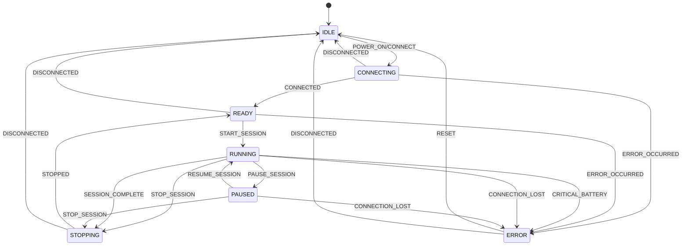
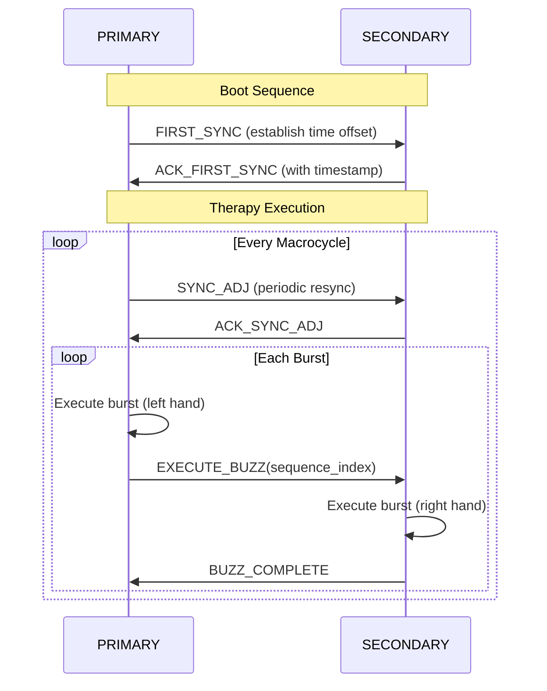
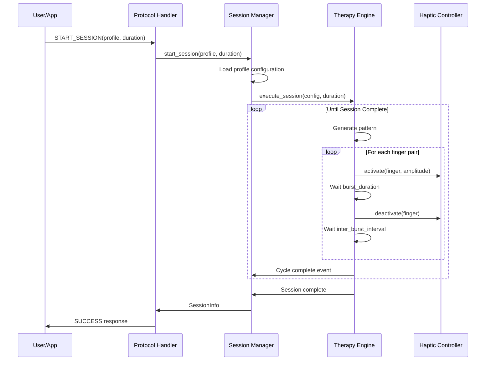
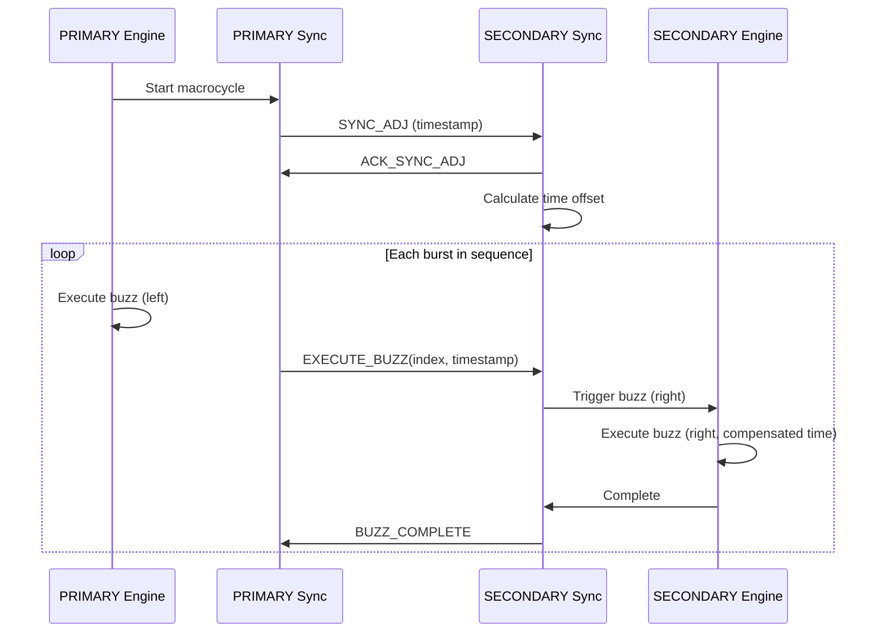

# BlueBuzzah v2 Architecture

This document provides a detailed explanation of the BlueBuzzah v2 system architecture, design patterns, and component interactions.

## Table of Contents

- [Overview](#overview)
- [Design Principles](#design-principles)
- [Layer Architecture](#layer-architecture)
- [Component Details](#component-details)
- [Design Patterns](#design-patterns)
- [Data Flow](#data-flow)
- [Integration Points](#integration-points)
- [Scalability and Extensibility](#scalability-and-extensibility)

## Overview

BlueBuzzah v2 is built using Clean Architecture principles, separating concerns into distinct layers with clear boundaries and dependencies flowing inward.

### Architecture Goals

1. **Testability**: Easy to test business logic without hardware
2. **Maintainability**: Clear module boundaries and responsibilities
3. **Extensibility**: Simple to add new features or change implementations
4. **Portability**: Hardware abstraction enables platform changes
5. **Reliability**: Explicit state management and error handling

### High-Level Structure

```
┌─────────────────────────────────────────────────────────────┐
│                    Presentation Layer                       │
│  • BLE Command Handler  • Response Formatter  • LED UI      │
├─────────────────────────────────────────────────────────────┤
│                    Application Layer                        │
│  • Session Manager  • Profile Manager  • Command Processor  │
├─────────────────────────────────────────────────────────────┤
│                      Domain Layer                           │
│  • Therapy Engine  • Pattern Generator  • Sync Protocol     │
├─────────────────────────────────────────────────────────────┤
│                   Infrastructure Layer                      │
│  • BLE Service  • Haptic Driver  • Storage  • Battery Mon   │
├─────────────────────────────────────────────────────────────┤
│                      Hardware Layer                         │
│  • nRF52840  • DRV2605  • TCA9548A  • LRA Motors           │
└─────────────────────────────────────────────────────────────┘
```

## Design Principles

### 1. Clean Architecture

**Dependency Rule**: Dependencies point inward
- Presentation → Application → Domain → Infrastructure → Hardware
- Inner layers know nothing about outer layers
- Interfaces define boundaries

**Benefits**:
- Business logic independent of frameworks
- Testable without external dependencies
- UI and database can change independently

### 2. SOLID Principles

**Single Responsibility**: Each class has one reason to change
```python
class TherapyEngine:
    """Responsible ONLY for executing therapy patterns"""

class PatternGenerator:
    """Responsible ONLY for generating patterns"""

class HapticController:
    """Responsible ONLY for controlling motors"""
```

**Open/Closed**: Open for extension, closed for modification
```python
class PatternGenerator(ABC):
    """Abstract base - extend by creating new generators"""
    @abstractmethod
    def generate(self, config: PatternConfig) -> Pattern:
        pass

class RandomPermutationGenerator(PatternGenerator):
    """Concrete implementation - extends without modifying base"""
```

**Liskov Substitution**: Subtypes must be substitutable
```python
# Any HapticController can be used interchangeably
haptic: HapticController = DRV2605Controller(...)
haptic: HapticController = MockHapticController()  # For testing
```

**Interface Segregation**: Clients shouldn't depend on unused interfaces
```python
# Small, focused interfaces
class HapticController(ABC):
    async def activate(finger: int, amplitude: int) -> None
    async def deactivate(finger: int) -> None

# Not one massive "DeviceController" interface
```

**Dependency Inversion**: Depend on abstractions, not concretions
```python
class TherapyEngine:
    def __init__(
        self,
        pattern_generator: PatternGenerator,  # Abstract
        haptic_controller: HapticController,  # Abstract
    ):
        # Depends on interfaces, not concrete implementations
```

### 3. Domain-Driven Design

**Ubiquitous Language**: Common terminology
- **Session**: A therapy session from start to completion
- **Cycle**: One complete pattern repetition
- **Burst**: Three rapid buzzes on a finger
- **Macrocycle**: Collection of bursts with pauses
- **Profile**: Configuration for a therapy protocol

**Bounded Contexts**:
- **Therapy Context**: Pattern generation, cycle execution
- **Communication Context**: BLE protocol, messages
- **Hardware Context**: Device control, I2C communication
- **State Context**: Session states, transitions

## Layer Architecture

### Presentation Layer

**Purpose**: Handle external interactions (BLE commands, LED feedback)

**Components**:
- `communication/protocol/handler.py`: Parse and validate BLE commands
- `ui/led_controller.py`: Visual feedback to user
- `ui/boot_led.py`: Boot sequence indicators
- `ui/therapy_led.py`: Therapy session indicators

**Characteristics**:
- No business logic
- Transforms external data to/from domain models
- Handles user interaction protocols

**Example**:
```python
class ProtocolHandler:
    """Parse BLE commands and route to application layer"""

    def handle_command(self, raw_command: bytes) -> Response:
        # Parse command
        command = self.parse(raw_command)

        # Route to application layer
        if command.type == "START_SESSION":
            result = self.session_manager.start_session(command.profile)
            return Response.success(result)

        elif command.type == "GET_STATUS":
            status = self.session_manager.get_status()
            return Response.success(status)
```

### Application Layer

**Purpose**: Orchestrate use cases and coordinate domain objects

**Components**:
- `application/session/manager.py`: Session lifecycle management
- `application/profile/manager.py`: Profile loading and validation
- `application/calibration/controller.py`: Calibration workflows
- `application/commands/processor.py`: Command routing

**Characteristics**:
- Use case implementations
- Transaction boundaries
- Error handling and recovery
- Event publishing

**Example**:
```python
class SessionManager:
    """Manage therapy session lifecycle"""

    async def start_session(
        self,
        profile_name: str,
        duration_sec: int
    ) -> SessionInfo:
        # Load profile (application service)
        profile = await self.profile_manager.load_profile(profile_name)

        # Validate preconditions
        if not self.can_start_session():
            raise RuntimeError("Cannot start session in current state")

        # Execute therapy (domain service)
        self.current_session = await self.therapy_engine.execute_session(
            config=profile.therapy_config,
            duration_sec=duration_sec
        )

        # Publish event
        self.event_bus.publish(SessionStartedEvent(self.current_session))

        return self.current_session
```

### Domain Layer

**Purpose**: Core business logic and rules

**Components**:
- `therapy/engine.py`: Therapy execution logic
- `therapy/patterns/generator.py`: Pattern generation algorithms
- `domain/sync/protocol.py`: Bilateral synchronization
- `state/machine.py`: Therapy state machine

**Characteristics**:
- Pure business logic
- No external dependencies
- Framework-agnostic
- Highly testable

**Example**:
```python
class TherapyEngine:
    """Core therapy execution - pure domain logic"""

    async def execute_cycle(self, config: PatternConfig) -> None:
        # Generate pattern (domain logic)
        pattern = self.pattern_generator.generate(config)

        # Execute with precise timing (domain logic)
        for i in range(len(pattern)):
            left_finger, right_finger = pattern.get_finger_pair(i)

            # Bilateral activation (infrastructure call through interface)
            await self._activate_bilateral(left_finger, right_finger, amplitude=100)

            # Timing control (domain logic)
            await asyncio.sleep(pattern.burst_duration_ms / 1000.0)

            await self._deactivate_bilateral(left_finger, right_finger)

            # Drift compensation (domain logic)
            adjusted_interval = self._calculate_timing_adjustment(pattern, i)
            await asyncio.sleep(adjusted_interval / 1000.0)
```

### Infrastructure Layer

**Purpose**: Interface with external systems and hardware

**Components**:
- `communication/ble/service.py`: BLE communication
- `hardware/haptic.py`: Motor control (DRV2605)
- `hardware/battery.py`: Battery monitoring
- `hardware/multiplexer.py`: I2C multiplexing

**Characteristics**:
- Implements interfaces defined by domain
- Handles external resource management
- Deals with framework-specific code
- May have side effects

**Example**:
```python
class DRV2605Controller(HapticController):
    """Concrete implementation of HapticController interface"""

    async def activate(self, finger: int, amplitude: int) -> None:
        # Infrastructure-level details
        self.multiplexer.select_channel(finger)

        # Hardware-specific protocol
        register_value = self._amplitude_to_register(amplitude)
        self.i2c.writeto(DRV2605_ADDR, bytes([RTP_REGISTER, register_value]))

        self._active_fingers[finger] = amplitude
```

## Component Details

### State Management



**Implementation**:
```python
class TherapyStateMachine:
    """Explicit state machine with validated transitions"""

    def __init__(self):
        self._current_state = TherapyState.IDLE
        self._transition_table = self._build_transition_table()

    def transition(self, trigger: StateTrigger) -> bool:
        """Attempt state transition"""
        key = (self._current_state, trigger)

        if key not in self._transition_table:
            return False  # Invalid transition

        next_state = self._transition_table[key]
        self._emit_state_change(self._current_state, next_state, trigger)
        self._current_state = next_state
        return True
```

### Event System

**Purpose**: Decouple components through event-driven communication

**Implementation**:
```python
class EventBus:
    """Publish-subscribe event bus"""

    def __init__(self):
        self._subscribers: Dict[Type[Event], List[Callable]] = {}

    def subscribe(self, event_type: Type[Event], handler: Callable) -> None:
        """Register event handler"""
        if event_type not in self._subscribers:
            self._subscribers[event_type] = []
        self._subscribers[event_type].append(handler)

    def publish(self, event: Event) -> None:
        """Publish event to all subscribers"""
        event_type = type(event)
        if event_type in self._subscribers:
            for handler in self._subscribers[event_type]:
                handler(event)
```

**Usage**:
```python
# In application layer
event_bus.subscribe(SessionStartedEvent, self._on_session_started)
event_bus.subscribe(BatteryLowEvent, self._on_battery_low)

# In domain layer
event_bus.publish(SessionStartedEvent(session_info))

# Handler
def _on_session_started(self, event: SessionStartedEvent):
    logger.info(f"Session {event.session_id} started")
    self.led_controller.indicate_therapy_running()
```

### Configuration System

**Layered Configuration**:
1. **Device Configuration** (`settings.json`): Device role
2. **Base Configuration** (`config/base.py`): System defaults
3. **Therapy Configuration** (`config/therapy.py`): Profile settings
4. **Runtime Configuration**: Dynamic adjustments

**Loading Hierarchy**:
```python
def load_configuration() -> Config:
    # 1. Load device role from settings.json
    device_config = DeviceConfig.from_settings_file("/settings.json")

    # 2. Load base configuration with role-specific defaults
    base_config = BaseConfig(device_role=device_config.role)

    # 3. Load therapy configuration (profile-specific)
    therapy_config = TherapyConfig.load_profile("noisy_vcr")

    # 4. Combine into complete configuration
    return Config(
        device=device_config,
        base=base_config,
        therapy=therapy_config
    )
```

### Synchronization Protocol

**PRIMARY-SECONDARY Communication**:



**Time Synchronization**:
```python
class SyncProtocol:
    """Bilateral time synchronization"""

    def calculate_offset(self, primary_time: int, secondary_time: int) -> int:
        """
        Calculate time offset between devices.

        Offset = (T_primary - T_secondary) / 2

        This compensates for message transmission time and ensures
        sub-10ms synchronization accuracy.
        """
        return (primary_time - secondary_time) // 2

    def apply_compensation(self, timestamp: int, offset: int) -> int:
        """Apply offset to timestamp for synchronized execution"""
        return timestamp + offset
```

## Design Patterns

### 1. Strategy Pattern (Pattern Generators)

**Purpose**: Pluggable algorithms for pattern generation

```python
class PatternGenerator(ABC):
    """Strategy interface"""
    @abstractmethod
    def generate(self, config: PatternConfig) -> Pattern:
        pass

class RandomPermutationGenerator(PatternGenerator):
    """Concrete strategy: Random permutation (RNDP)"""
    def generate(self, config: PatternConfig) -> Pattern:
        sequence = self._generate_random_permutation([0, 1, 2, 3, 4])
        return Pattern(left_sequence=sequence, right_sequence=sequence, ...)

class SequentialGenerator(PatternGenerator):
    """Concrete strategy: Sequential pattern"""
    def generate(self, config: PatternConfig) -> Pattern:
        sequence = [0, 1, 2, 3, 4]  # Fixed order
        return Pattern(left_sequence=sequence, right_sequence=sequence, ...)

# Usage - strategy is interchangeable
generator: PatternGenerator = RandomPermutationGenerator()
pattern = generator.generate(config)
```

### 2. Repository Pattern (Hardware Abstraction)

**Purpose**: Abstract data/hardware access

```python
class HapticController(ABC):
    """Repository interface for haptic control"""

    @abstractmethod
    async def activate(self, finger: int, amplitude: int) -> None:
        """Activate motor"""

    @abstractmethod
    async def deactivate(self, finger: int) -> None:
        """Deactivate motor"""

class DRV2605Controller(HapticController):
    """Concrete repository: Real hardware"""

class MockHapticController(HapticController):
    """Concrete repository: Mock for testing"""

# Application code doesn't know which implementation
def execute_therapy(haptic: HapticController):
    await haptic.activate(finger=0, amplitude=75)
```

### 3. Dependency Injection

**Purpose**: Invert dependencies for testability

```python
class TherapyEngine:
    """Dependencies injected through constructor"""

    def __init__(
        self,
        pattern_generator: PatternGenerator,
        haptic_controller: HapticController,
        battery_monitor: BatteryMonitor,
        state_machine: TherapyStateMachine,
    ):
        # All dependencies are interfaces, not concrete classes
        self.pattern_generator = pattern_generator
        self.haptic_controller = haptic_controller
        self.battery_monitor = battery_monitor
        self.state_machine = state_machine

# Production setup
engine = TherapyEngine(
    pattern_generator=RandomPermutationGenerator(),
    haptic_controller=DRV2605Controller(...),
    battery_monitor=BatteryMonitor(...),
    state_machine=TherapyStateMachine()
)

# Test setup
engine = TherapyEngine(
    pattern_generator=MockPatternGenerator(),
    haptic_controller=MockHapticController(),
    battery_monitor=MockBatteryMonitor(),
    state_machine=TherapyStateMachine()
)
```

### 4. Observer Pattern (Event System)

**Purpose**: Notify interested parties of state changes

```python
class TherapyStateMachine:
    """Observable - notifies observers of state changes"""

    def __init__(self):
        self._observers: List[Callable] = []

    def add_observer(self, callback: Callable[[StateTransition], None]):
        """Register observer"""
        self._observers.append(callback)

    def transition(self, trigger: StateTrigger) -> bool:
        """Transition and notify observers"""
        # ... perform transition ...
        self._notify_observers(transition)

    def _notify_observers(self, transition: StateTransition):
        """Notify all observers"""
        for observer in self._observers:
            observer(transition)

# Usage
def on_state_change(transition: StateTransition):
    logger.info(f"State: {transition.from_state} -> {transition.to_state}")

state_machine.add_observer(on_state_change)
```

### 5. Factory Pattern (Object Creation)

**Purpose**: Encapsulate object creation logic

```python
class ProfileFactory:
    """Create therapy profiles from configuration"""

    @staticmethod
    def create_profile(profile_type: str) -> TherapyConfig:
        """Factory method for profile creation"""

        if profile_type == "regular_vcr":
            return TherapyConfig(
                profile_name="Regular vCR",
                burst_duration_ms=100,
                inter_burst_interval_ms=668,
                pattern_type="sequential"
            )

        elif profile_type == "noisy_vcr":
            return TherapyConfig(
                profile_name="Noisy vCR",
                burst_duration_ms=100,
                inter_burst_interval_ms=668,
                pattern_type="random_permutation"
            )

        elif profile_type == "hybrid_vcr":
            return TherapyConfig(
                profile_name="Hybrid vCR",
                burst_duration_ms=100,
                inter_burst_interval_ms=668,
                pattern_type="mirrored"
            )

        else:
            raise ValueError(f"Unknown profile type: {profile_type}")

# Usage
profile = ProfileFactory.create_profile("noisy_vcr")
```

## Data Flow

### Session Start Flow



### Bilateral Synchronization Flow



## Integration Points

### BLE Protocol Integration

**Command Structure**:
```json
{
  "command": "START_SESSION",
  "payload": {
    "profile": "noisy_vcr",
    "duration_sec": 7200
  },
  "timestamp": 1234567890,
  "device_id": "primary"
}
```

**Response Structure**:
```json
{
  "status": "success",
  "data": {
    "session_id": "session_001",
    "profile": "noisy_vcr",
    "duration_sec": 7200,
    "start_time": 1234567890
  },
  "timestamp": 1234567891
}
```

### Hardware Integration

**I2C Communication**:
```python
class I2CMultiplexer:
    """TCA9548A integration"""

    def select_channel(self, channel: int) -> None:
        """Select I2C channel for finger"""
        if not 0 <= channel < 8:
            raise ValueError(f"Invalid channel: {channel}")

        # TCA9548A: Write channel bitmask to control register
        mask = 1 << channel
        self.i2c.writeto(self.address, bytes([mask]))

class DRV2605Controller:
    """DRV2605 haptic driver integration"""

    async def activate(self, finger: int, amplitude: int) -> None:
        """Activate motor via I2C"""
        # Select multiplexer channel for this finger
        self.multiplexer.select_channel(finger)

        # Write to DRV2605 RTP register
        register_value = int((amplitude / 100.0) * 127)
        self.i2c.writeto(
            DRV2605_ADDR,
            bytes([RTP_INPUT_REGISTER, register_value])
        )
```

## Scalability and Extensibility

### Adding New Pattern Generators

1. Subclass `PatternGenerator`
2. Implement `generate()` method
3. Register in factory

```python
class CustomPatternGenerator(PatternGenerator):
    """New pattern algorithm"""

    def generate(self, config: PatternConfig) -> Pattern:
        # Implement custom logic
        sequence = self._custom_algorithm(config)
        return Pattern(left_sequence=sequence, right_sequence=sequence, ...)

# Register
PatternGeneratorFactory.register("custom", CustomPatternGenerator)
```

### Adding New Therapy Profiles

1. Create configuration in `therapy/profiles/`
2. Define profile parameters
3. Add to profile factory

```python
def create_custom_profile() -> TherapyConfig:
    return TherapyConfig(
        profile_name="Custom Research Profile",
        burst_duration_ms=150,
        inter_burst_interval_ms=500,
        bursts_per_cycle=4,
        pattern_type="custom",
        actuator_type=ActuatorType.LRA,
        frequency_hz=175,
        amplitude_percent=80
    )
```

### Adding New Hardware Platforms

1. Implement `HapticController` interface
2. Implement `BatteryMonitor` interface
3. Update board configuration

```python
class NewHapticDriver(HapticController):
    """New hardware driver"""

    async def activate(self, finger: int, amplitude: int) -> None:
        # Platform-specific implementation
        pass

    async def deactivate(self, finger: int) -> None:
        # Platform-specific implementation
        pass
```

### Adding New BLE Commands

1. Define command in `communication/protocol/commands.py`
2. Add handler in `ProtocolHandler`
3. Update application layer logic

```python
@dataclass
class NewCommand(Command):
    command_type: str = "NEW_FEATURE"
    parameter: str = ""

class ProtocolHandler:
    def handle_command(self, command: Command) -> Response:
        if isinstance(command, NewCommand):
            result = self._handle_new_feature(command)
            return Response.success(result)
```

## Summary

BlueBuzzah v2 architecture provides:

1. **Clean separation of concerns** through layered architecture
2. **High testability** via dependency injection and abstractions
3. **Maintainability** through SOLID principles and clear boundaries
4. **Extensibility** via strategy pattern and factory methods
5. **Reliability** through explicit state management and error handling
6. **Portability** through hardware abstraction layer

The architecture enables confident refactoring, easy testing, and straightforward feature additions while maintaining code quality and system reliability.
