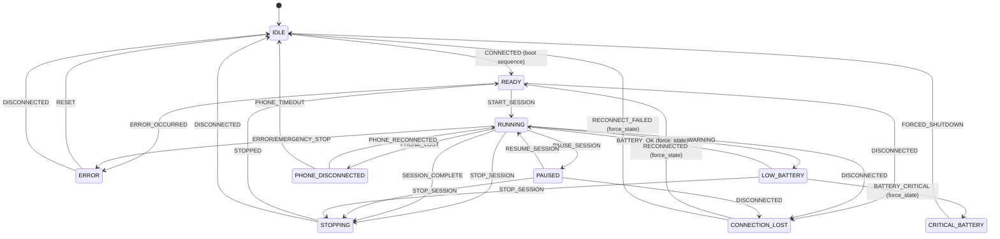

# BlueBuzzah Firmware Architecture

**Version:** 2.0.0
**Platform:** Arduino C++ on Adafruit Feather nRF52840 Express
**Build System:** PlatformIO with Adafruit nRF52 BSP

---

## Table of Contents

1. [System Overview](#system-overview)
2. [Architecture Principles](#architecture-principles)
3. [Module Organization](#module-organization)
4. [Role-Based Architecture](#role-based-architecture)
5. [Entry Point Flow](#entry-point-flow)
6. [Hardware Abstraction](#hardware-abstraction)
7. [State Management](#state-management)
8. [Error Handling Strategy](#error-handling-strategy)
9. [Heartbeat Protocol](#heartbeat-protocol)
10. [Memory Management](#memory-management)
11. [Development Guidelines](#development-guidelines)

---

## System Overview

BlueBuzzah implements a **PRIMARY-SECONDARY architecture** for bilateral haptic therapy using two synchronized gloves communicating via Bluetooth Low Energy (BLE).

### Design Philosophy

**Unified Codebase**: Both gloves run identical firmware with role-aware behavior controlled by `config.h` and `settings.json`:

```cpp
// config.h - Role detection from settings.json (LittleFS)
#include <LittleFS.h>
#include <ArduinoJson.h>

enum class DeviceRole { PRIMARY, SECONDARY };

struct DeviceConfig {
    DeviceRole role;
    const char* bleName;
    const char* deviceTag;
};

DeviceConfig loadDeviceConfig() {
    DeviceConfig config;
    File file = LittleFS.open("/settings.json", "r");

    if (!file) {
        // Default to PRIMARY if no settings
        config.role = DeviceRole::PRIMARY;
        config.bleName = "BlueBuzzah";
        config.deviceTag = "[PRIMARY]";
        return config;
    }

    JsonDocument doc;
    deserializeJson(doc, file);
    file.close();

    const char* roleStr = doc["deviceRole"] | "Primary";
    config.role = (strcmp(roleStr, "Primary") == 0)
        ? DeviceRole::PRIMARY
        : DeviceRole::SECONDARY;
    config.bleName = "BlueBuzzah";
    config.deviceTag = (config.role == DeviceRole::PRIMARY)
        ? "[PRIMARY]" : "[SECONDARY]";

    return config;
}

// settings.json for PRIMARY device
// {"deviceRole": "Primary"}

// settings.json for SECONDARY device
// {"deviceRole": "Secondary"}
```

**Benefits of Unified Architecture:**

- **Single source of truth**: Bug fixes and improvements apply to both gloves automatically
- **Simplified testing**: Same code paths ensure predictable bilateral operation
- **Streamlined deployment**: PlatformIO manages role-specific configuration via LittleFS
- **Consistent behavior**: Identical code paths ensure predictable bilateral operation

---

## Architecture Principles

### 1. Role Polymorphism

Modules adapt behavior based on `deviceConfig.role`:

```cpp
// BLE Connection
if (deviceConfig.role == DeviceRole::PRIMARY) {
    primaryAdvertiseAndWait();
} else {
    secondaryScanAndConnect();
}

// Therapy Engine
if (deviceConfig.role == DeviceRole::PRIMARY) {
    syncProtocol.sendExecuteBuzz(sequenceIdx);
    haptic.buzzSequence(pattern);
} else {
    uint8_t sequenceIdx = syncProtocol.receiveExecuteBuzz();  // Blocking
    haptic.buzzSequence(pattern);
}
```

### 2. Command-Driven Synchronization

PRIMARY explicitly commands SECONDARY for every action using SYNC protocol:

```
PRIMARY -> SECONDARY: SYNC:EXECUTE_BUZZ:left_finger|2|right_finger|2|amplitude|100
PRIMARY: <executes local buzz>
SECONDARY: <waits for command, then executes>
```

**Why not time-based?**

- Eliminates clock drift over 2-hour sessions
- Guarantees bilateral synchronization (+/-7.5ms BLE latency)
- Simplifies error recovery (SECONDARY halts if PRIMARY disconnects)

### 3. Multi-Connection Support (PRIMARY Only)

PRIMARY supports **simultaneous connections** to:

1. **Smartphone** (phoneConnHandle) - Configuration, monitoring, control
2. **SECONDARY glove** (secondaryConnHandle) - Bilateral therapy coordination

**Connection Detection:**

```cpp
// Boot sequence handles connection establishment
// PRIMARY advertises as "BlueBuzzah"
// SECONDARY scans for "BlueBuzzah" and connects
// Phone app connects to PRIMARY for control

void connectCallback(uint16_t connHandle) {
    BLEConnection* conn = Bluefruit.Connection(connHandle);
    // Identify connection type based on characteristics discovered
}
```

### 4. Separation of Concerns

| Module                          | Responsibility                   | Depends On                      |
| ------------------------------- | -------------------------------- | ------------------------------- |
| `main.cpp`                      | Entry point (setup/loop)         | All modules                     |
| `ble_manager.h/.cpp`            | BLE radio, connection management | `bluefruit.h`                   |
| `therapy_engine.h/.cpp`         | Therapy execution, pattern gen   | `hardware.h`, `sync_protocol.h` |
| `hardware.h/.cpp`               | Motor control, battery, I2C mux  | DRV2605, TCA9548A libs          |
| `menu_controller.h/.cpp`        | BLE command processing           | `profile_manager.h`             |
| `sync_protocol.h/.cpp`          | PRIMARY-SECONDARY messaging      | `ble_manager.h`                 |
| `profile_manager.h/.cpp`        | Therapy parameter management     | ArduinoJson                     |
| `state_machine.h/.cpp`          | Therapy state machine            | `types.h`                       |
| `led_controller.h/.cpp`         | LED animations                   | NeoPixel                        |
| `session_manager.h/.cpp`        | Session lifecycle                | `state_machine.h`               |
| `calibration_controller.h/.cpp` | Motor testing                    | `hardware.h`                    |

---

## Module Organization

```
BlueBuzzah-Arduino/
├── platformio.ini                    # Build configuration
├── include/
│   ├── config.h                      # Pin definitions, constants
│   ├── types.h                       # Enums, structs (DeviceRole, TherapyState)
│   ├── hardware.h                    # Hardware class declarations
│   ├── ble_manager.h                 # BLE management class
│   ├── therapy_engine.h              # Therapy execution class
│   ├── sync_protocol.h               # Sync command handling
│   ├── state_machine.h               # Therapy state machine
│   ├── menu_controller.h             # Command processing
│   ├── profile_manager.h             # Profile handling
│   ├── led_controller.h              # LED animations
│   ├── session_manager.h             # Session lifecycle
│   └── calibration_controller.h      # Calibration workflows
├── src/
│   ├── main.cpp                      # Entry point: setup() + loop()
│   ├── hardware.cpp                  # Hardware implementations
│   ├── ble_manager.cpp               # BLE implementations
│   ├── therapy_engine.cpp            # Therapy implementations
│   ├── sync_protocol.cpp             # Sync implementations
│   ├── state_machine.cpp             # State machine implementations
│   ├── menu_controller.cpp           # Menu implementations
│   ├── profile_manager.cpp           # Profile implementations
│   ├── led_controller.cpp            # LED implementations
│   ├── session_manager.cpp           # Session implementations
│   └── calibration_controller.cpp    # Calibration implementations
└── data/
    └── settings.json                 # Device configuration (uploaded via LittleFS)
```

**Architecture Layers:**

- **Presentation**: `led_controller`, `menu_controller` (BLE command interface)
- **Application**: `session_manager`, `calibration_controller`
- **Domain**: `therapy_engine`, `sync_protocol`, `state_machine`
- **Infrastructure**: `ble_manager`, `hardware`, `profile_manager`

**Header/Implementation Separation:**

```cpp
// hardware.h - Declaration
#ifndef HARDWARE_H
#define HARDWARE_H

#include <Arduino.h>
#include <Adafruit_DRV2605.h>

class HardwareController {
public:
    bool begin();
    void buzzFinger(uint8_t finger, uint8_t amplitude);
    void stopAllMotors();
    float getBatteryVoltage();

private:
    Adafruit_DRV2605 _drv[5];
    void configureDRV2605(Adafruit_DRV2605& driver);
};

#endif // HARDWARE_H

// hardware.cpp - Implementation
#include "hardware.h"

bool HardwareController::begin() {
    // Implementation
}
```

---

## Role-Based Architecture

### PRIMARY (Left Glove)

**Responsibilities:**

1. **Advertise** as BLE peripheral ("BlueBuzzah")
2. **Accept connections** from smartphone + SECONDARY
3. **Execute boot sequence**: Wait for SECONDARY, optionally phone
4. **Orchestrate therapy**: Send SYNC:EXECUTE_BUZZ commands
5. **Send heartbeats** to SECONDARY during therapy
6. **Broadcast parameters** to SECONDARY on profile changes
7. **Process smartphone commands** via MenuController

**Key Functions:**

| Function                         | Location              | Description                       |
| -------------------------------- | --------------------- | --------------------------------- |
| `primaryBootSequence()`          | `main.cpp`            | Boot and connection establishment |
| `runPrimaryLoop()`               | `main.cpp`            | Main therapy loop                 |
| `SessionManager::startSession()` | `session_manager.cpp` | Sends SYNC:START_SESSION          |
| `TherapyEngine::update()`        | `therapy_engine.cpp`  | Pattern generation and motor ctrl |

### SECONDARY (Right Glove)

**Responsibilities:**

1. **Scan** for "BlueBuzzah" BLE advertisement
2. **Connect** to PRIMARY during boot sequence
3. **Receive SYNC commands**: START_SESSION, EXECUTE_BUZZ, HEARTBEAT
4. **Execute synchronized buzzes** after command received
5. **Monitor heartbeat timeout** (6 seconds)
6. **Safety halt** if PRIMARY disconnects or heartbeat times out

**Key Functions:**

| Function                   | Location            | Description                 |
| -------------------------- | ------------------- | --------------------------- |
| `secondaryBootSequence()`  | `main.cpp`          | Scan and connect to PRIMARY |
| `runSecondaryLoop()`       | `main.cpp`          | Wait for SYNC commands      |
| `handleSyncCommand()`      | `sync_protocol.cpp` | Process SYNC messages       |
| `handleHeartbeatTimeout()` | `main.cpp`          | Connection recovery         |

---

## Entry Point Flow

### Arduino setup()/loop() Paradigm

Unlike Python's single-entry `main.py -> app.run()`, Arduino uses two functions:

- `setup()` - Called once at boot
- `loop()` - Called repeatedly forever

```cpp
// main.cpp

#include <Arduino.h>
#include <LittleFS.h>
#include "config.h"
#include "types.h"
#include "hardware.h"
#include "ble_manager.h"
#include "therapy_engine.h"
#include "state_machine.h"
#include "led_controller.h"

// Global instances
DeviceConfig deviceConfig;
TherapyConfig therapyConfig;
HardwareController hardware;
BLEManager bleManager;
TherapyEngine therapyEngine;
StateMachine stateMachine;
LEDController ledController;
BootResult bootResult;

void setup() {
    Serial.begin(115200);
    while (!Serial) delay(10);  // Wait for serial (optional)

    // 1. Initialize filesystem
    if (!LittleFS.begin()) {
        Serial.println(F("[ERROR] LittleFS mount failed"));
    }

    // 2. Load configuration from settings.json
    deviceConfig = loadDeviceConfig();
    therapyConfig = loadTherapyConfig();

    Serial.printf("[INFO] Role: %s\n", deviceConfig.deviceTag);

    // 3. Initialize hardware
    if (!hardware.begin()) {
        ledController.indicateFailure();
        while (true) { delay(1000); }  // Halt
    }

    // 4. Initialize BLE
    bleManager.begin(deviceConfig);

    // 5. Execute boot sequence (role-specific)
    #ifdef SKIP_BOOT_SEQUENCE
        bootResult = BootResult::SUCCESS_NO_PHONE;
    #else
        bootResult = executeBootSequence();
    #endif

    if (bootResult == BootResult::FAILED) {
        ledController.indicateFailure();
        while (true) { delay(1000); }  // Halt
    }

    // 6. Switch to therapy LED mode
    ledController.switchToTherapyMode();

    Serial.println(F("[INFO] Boot complete, entering main loop"));
}

void loop() {
    // Role-specific main loop
    if (deviceConfig.role == DeviceRole::PRIMARY) {
        runPrimaryLoop();
    } else {
        runSecondaryLoop();
    }
}
```

**Boot Sequence (PRIMARY):**

1. Initialize BLE and advertise as "BlueBuzzah"
2. LED: Rapid blue flash during connection wait
3. Wait for SECONDARY connection (required)
4. Optionally wait for phone connection
5. Success: Solid blue LED

**Boot Sequence (SECONDARY):**

1. Initialize BLE and scan for "BlueBuzzah"
2. LED: Rapid blue flash during scanning
3. Connect to PRIMARY within timeout
4. Success: Solid blue LED

**Timing Breakdown:**

- Boot sequence: 0-30s (configurable via `BOOT_TIMEOUT_MS`)
- Connection handshake: 2-15s
- Therapy execution: 2-180 minutes
- Shutdown: <1s

---

## Hardware Abstraction

### Haptic Controller Architecture

```
[HardwareController]
    └── I2C Bus (Wire @ 400kHz)
        └── TCA9548A Multiplexer (0x70)
            ├── Port 0: DRV2605 (Thumb)   @ 0x5A
            ├── Port 1: DRV2605 (Index)   @ 0x5A
            ├── Port 2: DRV2605 (Middle)  @ 0x5A
            ├── Port 3: DRV2605 (Ring)    @ 0x5A
            └── Port 4: DRV2605 (Pinky)   @ 0x5A
```

**I2C Initialization** (hardware.cpp):

```cpp
#include <Wire.h>
#include <Adafruit_TCA9548A.h>
#include <Adafruit_DRV2605.h>

Adafruit_TCA9548A tca;
Adafruit_DRV2605 drv[5];

bool HardwareController::begin() {
    Wire.begin();
    Wire.setClock(400000);  // 400kHz I2C

    // Initialize multiplexer
    if (!tca.begin()) {
        Serial.println(F("[CRITICAL] TCA9548A not found"));
        return false;
    }

    // Initialize each DRV2605
    for (uint8_t i = 0; i < 5; i++) {
        tca.select(i);

        // Extra delay for channel 4 (longer I2C path)
        if (i == 4) {
            delay(10);
        } else {
            delay(5);
        }

        if (!drv[i].begin()) {
            Serial.printf("[ERROR] DRV2605 on channel %d failed\n", i);
            return false;
        }

        configureDRV2605(drv[i]);
        Serial.printf("[INFO] DRV2605 channel %d initialized\n", i);
    }

    return true;
}
```

**DRV2605 Configuration:**

```cpp
void HardwareController::configureDRV2605(Adafruit_DRV2605& driver) {
    // 1. Set actuator type (LRA - Linear Resonant Actuator)
    driver.useLRA();

    // 2. Enable open-loop mode (bypass auto-resonance)
    uint8_t control3 = driver.readRegister8(0x1D);
    driver.writeRegister8(0x1D, control3 | 0x21);  // Set bits 5 and 0

    // 3. Set peak voltage (register 0x17)
    // Formula: voltage / 0.02122
    driver.writeRegister8(0x17, (uint8_t)(ACTUATOR_VOLTAGE / 0.02122));

    // 4. Set driving frequency (register 0x20)
    // Formula: 1 / (frequency * 0.00009849)
    driver.writeRegister8(0x20, (uint8_t)(1.0 / (ACTUATOR_FREQUENCY * 0.00009849)));

    // 5. Activate Real-Time Playback (RTP) mode
    driver.setRealtimeValue(0);
    driver.setMode(DRV2605_MODE_REALTIME);
}
```

**Register Map:**

| Register | Name       | Purpose                                |
| -------- | ---------- | -------------------------------------- |
| `0x1D`   | Control3   | Open-loop enable, N/ERM+ mode          |
| `0x17`   | OD_CLAMP   | Peak voltage clamping (0-255 = 0-5.6V) |
| `0x20`   | LRA_PERIOD | Driving period for LRA resonance       |
| `0x00`   | STATUS     | Go bit (trigger playback)              |

### Battery Monitor

```cpp
class BatteryMonitor {
public:
    float getVoltage() {
        // nRF52840: 3.6V reference, 14-bit ADC
        uint16_t raw = analogRead(BATTERY_PIN);
        float voltage = (raw / 16383.0f) * 3.6f * 2.0f;  // Voltage divider
        return voltage;
    }

    uint8_t getPercentage() {
        float v = getVoltage();
        // LiPo: 4.2V = 100%, 3.2V = 0%
        if (v >= 4.2f) return 100;
        if (v <= 3.2f) return 0;
        return (uint8_t)((v - 3.2f) / 1.0f * 100.0f);
    }
};
```

---

## State Management

### Therapy State Machine (11 States)

The system has 11 distinct states defined in `types.h`:



**State Definitions (types.h):**

```cpp
enum class TherapyState : uint8_t {
    IDLE,
    CONNECTING,
    READY,
    RUNNING,
    PAUSED,
    STOPPING,
    ERROR,
    LOW_BATTERY,
    CRITICAL_BATTERY,
    CONNECTION_LOST,
    PHONE_DISCONNECTED
};

enum class StateTrigger : uint8_t {
    CONNECTED,
    START_SESSION,
    PAUSE_SESSION,
    RESUME_SESSION,
    STOP_SESSION,
    SESSION_COMPLETE,
    BATTERY_WARNING,
    BATTERY_CRITICAL,
    BATTERY_OK,
    DISCONNECTED,
    RECONNECTED,
    RECONNECT_FAILED,
    PHONE_LOST,
    PHONE_RECONNECTED,
    PHONE_TIMEOUT,
    ERROR_OCCURRED,
    EMERGENCY_STOP,
    RESET,
    STOPPED,
    FORCED_SHUTDOWN
};
```

**State Machine Implementation (state_machine.h/.cpp):**

```cpp
class StateMachine {
public:
    bool transition(StateTrigger trigger);
    void forceState(TherapyState newState);
    TherapyState currentState() const { return _currentState; }
    const char* stateToString() const;

private:
    TherapyState _currentState = TherapyState::IDLE;
    bool validateTransition(StateTrigger trigger);
};

// Implementation
bool StateMachine::transition(StateTrigger trigger) {
    switch (_currentState) {
        case TherapyState::IDLE:
            if (trigger == StateTrigger::CONNECTED) {
                _currentState = TherapyState::READY;
                return true;
            }
            break;

        case TherapyState::READY:
            if (trigger == StateTrigger::START_SESSION) {
                _currentState = TherapyState::RUNNING;
                return true;
            }
            // ... other transitions
            break;

        // ... remaining states
    }
    return false;
}

void StateMachine::forceState(TherapyState newState) {
    // Bypass validation for emergency/recovery transitions
    _currentState = newState;
}
```

**State Descriptions:**

| State                | Description                                     |
| -------------------- | ----------------------------------------------- |
| `IDLE`               | No active session, system ready                 |
| `CONNECTING`         | Establishing BLE connection during boot         |
| `READY`              | Connected, ready for therapy                    |
| `RUNNING`            | Active therapy session                          |
| `PAUSED`             | Session paused, can resume                      |
| `STOPPING`           | Session ending, cleanup in progress             |
| `ERROR`              | Error condition, motors stopped                 |
| `LOW_BATTERY`        | Battery < 20%, session can continue             |
| `CRITICAL_BATTERY`   | Battery < 5%, forced shutdown                   |
| `CONNECTION_LOST`    | PRIMARY-SECONDARY BLE lost, attempting recovery |
| `PHONE_DISCONNECTED` | Phone BLE lost (PRIMARY only, informational)    |

**Timing Management (SessionManager):**

```cpp
class SessionManager {
public:
    void startSession(uint32_t durationMs);
    void pauseSession();
    void resumeSession();
    uint32_t getElapsedTime();
    uint8_t getProgressPercent();

private:
    uint32_t _sessionStartTime;
    uint32_t _pauseStartTime;
    uint32_t _totalPauseTime;
    uint32_t _sessionDurationMs;
};

uint32_t SessionManager::getElapsedTime() {
    // Elapsed time excludes pause durations
    return (millis() - _sessionStartTime) - _totalPauseTime;
}

uint8_t SessionManager::getProgressPercent() {
    return (uint8_t)((getElapsedTime() * 100UL) / _sessionDurationMs);
}
```

### Connection State

```cpp
struct ConnectionState {
    uint16_t phoneConnHandle = BLE_CONN_HANDLE_INVALID;
    uint16_t secondaryConnHandle = BLE_CONN_HANDLE_INVALID;  // PRIMARY only
    uint16_t primaryConnHandle = BLE_CONN_HANDLE_INVALID;    // SECONDARY only

    bool isPhoneConnected() const {
        return phoneConnHandle != BLE_CONN_HANDLE_INVALID;
    }

    bool isSecondaryConnected() const {
        return secondaryConnHandle != BLE_CONN_HANDLE_INVALID;
    }

    bool isPrimaryConnected() const {
        return primaryConnHandle != BLE_CONN_HANDLE_INVALID;
    }
};
```

---

## Error Handling Strategy

### Hierarchical Error Responses

**Level 1: Fatal Errors** (Halt with LED indicator)

- Boot sequence failure -> Red LED flash, halt
- I2C initialization failure -> Diagnostic message + halt
- Heartbeat timeout -> Emergency stop motors, attempt reconnect

```cpp
void fatalError(const char* message) {
    Serial.printf("[FATAL] %s\n", message);
    hardware.stopAllMotors();
    ledController.indicateFailure();
    while (true) { delay(1000); }  // Halt forever
}
```

**Level 2: Recoverable Errors** (Log + Continue)

- SYNC command timeout -> Log warning, proceed
- Battery query timeout -> Return default value
- File read failure -> Return error code

```cpp
bool recoverableError(const char* context) {
    Serial.printf("[WARN] %s - continuing\n", context);
    return false;  // Indicate failure
}
```

**Level 3: User Errors** (BLE Error Response)

- Invalid command -> `ERROR:Unknown command`
- Invalid parameter -> `ERROR:Value out of range`
- Command during session -> `ERROR:Cannot modify during active session`

```cpp
void sendErrorResponse(const char* error) {
    char response[64];
    snprintf(response, sizeof(response), "ERROR:%s\n\x04", error);
    bleManager.sendToPhone(response);
}
```

### Timeout Handling Matrix

| Operation            | Timeout      | Failure Action    | Location            |
| -------------------- | ------------ | ----------------- | ------------------- |
| Boot sequence        | 30s          | Red LED, halt     | `main.cpp`          |
| BLE scan (SECONDARY) | 30s          | Red LED, halt     | `ble_manager.cpp`   |
| Heartbeat            | 6s           | Reconnect attempt | `main.cpp`          |
| SYNC command         | 10s          | Log warning       | `sync_protocol.cpp` |
| BLE receive          | Non-blocking | Callback-based    | `ble_manager.cpp`   |

### Return Code Pattern

Arduino C++ typically disables exceptions for embedded targets. Use return codes:

```cpp
enum class Result : uint8_t {
    OK,
    ERROR_TIMEOUT,
    ERROR_INVALID_PARAM,
    ERROR_NOT_CONNECTED,
    ERROR_HARDWARE
};

Result HardwareController::buzzFinger(uint8_t finger, uint8_t amplitude) {
    if (finger > 4) return Result::ERROR_INVALID_PARAM;
    if (amplitude > 127) return Result::ERROR_INVALID_PARAM;

    tca.select(finger);
    drv[finger].setRealtimeValue(amplitude);

    return Result::OK;
}
```

---

## Heartbeat Protocol

PRIMARY sends periodic heartbeats during therapy to detect silent disconnections (BLE connections that drop without triggering disconnect events).

### Parameters

| Parameter         | Value     | Description                           |
| ----------------- | --------- | ------------------------------------- |
| Interval          | 2 seconds | Time between heartbeat messages       |
| Timeout           | 6 seconds | 3 missed heartbeats = connection lost |
| Recovery attempts | 3         | Number of reconnection attempts       |
| Recovery delay    | 2 seconds | Delay between reconnection attempts   |

### Message Format

```
SYNC:HEARTBEAT:ts|<microseconds>
```

Example: `SYNC:HEARTBEAT:ts|1234567890`

### Protocol Implementation

**PRIMARY (sender):**

```cpp
// In main.cpp
const uint32_t HEARTBEAT_INTERVAL_MS = 2000;
uint32_t lastHeartbeatSent = 0;

void runPrimaryLoop() {
    uint32_t now = millis();

    // Send heartbeat during active therapy
    if (stateMachine.currentState() == TherapyState::RUNNING) {
        if (now - lastHeartbeatSent >= HEARTBEAT_INTERVAL_MS) {
            uint32_t ts = micros();
            char msg[48];
            snprintf(msg, sizeof(msg), "SYNC:HEARTBEAT:ts|%lu", ts);
            syncProtocol.sendToSecondary(msg);
            lastHeartbeatSent = now;
        }
    }

    // Process other loop tasks...
}
```

**SECONDARY (receiver):**

```cpp
// In sync_protocol.cpp
uint32_t lastHeartbeatReceived = 0;

void SyncProtocol::handleCommand(const char* commandType, const char* data) {
    if (strcmp(commandType, "HEARTBEAT") == 0) {
        lastHeartbeatReceived = millis();
        return;
    }
    // Handle other commands...
}

// In main.cpp
const uint32_t HEARTBEAT_TIMEOUT_MS = 6000;

void runSecondaryLoop() {
    // Check for heartbeat timeout
    if (lastHeartbeatReceived > 0) {
        if (millis() - lastHeartbeatReceived > HEARTBEAT_TIMEOUT_MS) {
            handleHeartbeatTimeout();
        }
    }

    // Process other loop tasks...
}
```

### Connection Recovery

On heartbeat timeout, SECONDARY executes recovery:

1. Emergency stop all motors (safety)
2. Update state machine to CONNECTION_LOST
3. Update LED to indicate connection lost
4. Attempt reconnection (up to 3 attempts, 2s apart)
5. If successful: Return to READY state
6. If failed: Enter IDLE state

```cpp
void handleHeartbeatTimeout() {
    Serial.println(F("[WARN] Heartbeat timeout - attempting recovery"));

    // 1. Safety first
    hardware.stopAllMotors();

    // 2. Update state
    stateMachine.forceState(TherapyState::CONNECTION_LOST);
    ledController.indicateConnectionLost();

    // 3. Attempt recovery
    for (uint8_t attempt = 0; attempt < 3; attempt++) {
        delay(2000);
        if (bleManager.reconnectToPrimary()) {
            stateMachine.forceState(TherapyState::READY);
            lastHeartbeatReceived = millis();
            return;
        }
    }

    // 4. Recovery failed
    stateMachine.forceState(TherapyState::IDLE);
}
```

---

## Memory Management

### Arduino/C++ Memory Model

Unlike CircuitPython, Arduino C++ has no garbage collection:

- **Stack allocation**: Local variables, auto-freed on function return
- **Static allocation**: Global/static variables, persist for program lifetime
- **Heap allocation**: `new`/`malloc`, must be manually freed (avoid!)

### nRF52840 Memory Budget

| Region          | Size    | Usage                             |
| --------------- | ------- | --------------------------------- |
| Flash           | 1 MB    | Program code, constants, LittleFS |
| SRAM            | 256 KB  | All runtime data                  |
| Bluefruit stack | ~15 KB  | Fixed BLE overhead                |
| UART buffers    | ~1 KB   | RX + TX buffers                   |
| Pattern storage | ~500 B  | Current + next pattern            |
| State machine   | ~200 B  | State + transitions               |
| Application     | ~3 KB   | All classes combined              |
| Stack           | ~4 KB   | Conservative estimate             |
| **Total Used**  | ~24 KB  |                                   |
| **Available**   | 256 KB  | nRF52840 SRAM                     |
| **Headroom**    | ~232 KB | 10x better than CircuitPython     |

### Memory-Efficient Patterns

**Prefer static allocation:**

```cpp
// GOOD: Static arrays allocated at compile time
static uint8_t patternBuffer[32];
static char messageBuffer[128];

// AVOID: Dynamic allocation (heap fragmentation)
uint8_t* buffer = new uint8_t[32];  // Must delete[]!
char* msg = (char*)malloc(128);     // Must free()!
```

**Use PROGMEM/F() for string constants:**

```cpp
// GOOD: String stored in flash, not RAM
Serial.println(F("BlueBuzzah initialized"));

// BAD: String stored in RAM
Serial.println("BlueBuzzah initialized");
```

**Avoid Arduino String class:**

```cpp
// AVOID: String class causes heap fragmentation
String msg = "SYNC:" + String(timestamp);

// PREFER: Fixed char buffers with snprintf
char msg[64];
snprintf(msg, sizeof(msg), "SYNC:%lu", timestamp);
```

**Use fixed-size buffers:**

```cpp
// GOOD: Fixed buffer for BLE messages
static char rxBuffer[256];
static uint16_t rxBufferIndex = 0;

void rxCallback(uint16_t conn_handle) {
    while (bleuart.available()) {
        char c = bleuart.read();
        if (c == 0x04 || rxBufferIndex >= sizeof(rxBuffer) - 1) {
            rxBuffer[rxBufferIndex] = '\0';
            processMessage(rxBuffer);
            rxBufferIndex = 0;
        } else {
            rxBuffer[rxBufferIndex++] = c;
        }
    }
}
```

### No Garbage Collection

Unlike CircuitPython, there's no `gc.collect()` needed. Memory is:

- **Auto-reclaimed** when functions return (stack)
- **Persistent** until reset (static/global)
- **Manual management** if using heap (avoid!)

**Best practice:** Use only stack and static allocation. Never use `new`/`malloc` in embedded code unless absolutely necessary.

---

## Development Guidelines

### 1. Role-Aware Code Patterns

```cpp
// Clear role branching using enum class
if (deviceConfig.role == DeviceRole::PRIMARY) {
    runPrimaryLoop();
} else {
    runSecondaryLoop();
}

// Using settings.json for role configuration
// settings.json: {"deviceRole": "Primary"}
```

### 2. BLE Message Protocol

**Phone -> PRIMARY Commands:**

```
COMMAND_NAME:ARG1:ARG2:...\n
```

**PRIMARY -> Phone Responses:**

```
KEY1:VALUE1\n
KEY2:VALUE2\n
\x04
```

**PRIMARY <-> SECONDARY SYNC Messages:**

```
SYNC:<command>:<key1>|<val1>|<key2>|<val2>
```

**SYNC Commands:**

| Command        | Direction | Description               |
| -------------- | --------- | ------------------------- |
| START_SESSION  | P->S      | Begin therapy with config |
| PAUSE_SESSION  | P->S      | Pause current session     |
| RESUME_SESSION | P->S      | Resume paused session     |
| STOP_SESSION   | P->S      | Stop session              |
| EXECUTE_BUZZ   | P->S      | Trigger motor activation  |
| DEACTIVATE     | P->S      | Stop motor activation     |
| HEARTBEAT      | P->S      | Connection keepalive      |

**Examples:**

```
SYNC:START_SESSION:duration_sec|7200|pattern_type|rndp|jitter_percent|235
SYNC:EXECUTE_BUZZ:left_finger|2|right_finger|2|amplitude|100|timestamp|123456
SYNC:HEARTBEAT:ts|1234567890
```

### 3. BLE Callback Pattern (Bluefruit)

Unlike CircuitPython's polling model, Bluefruit uses callbacks:

```cpp
// Setup callbacks in setup()
void setup() {
    Bluefruit.Periph.setConnectCallback(connectCallback);
    Bluefruit.Periph.setDisconnectCallback(disconnectCallback);
    bleuart.setRxCallback(rxCallback);
}

// Connection callback
void connectCallback(uint16_t connHandle) {
    Serial.printf("[BLE] Connected: %d\n", connHandle);
    // Identify connection type, update state
}

// Disconnect callback
void disconnectCallback(uint16_t connHandle, uint8_t reason) {
    Serial.printf("[BLE] Disconnected: %d, reason: 0x%02X\n", connHandle, reason);
    // Handle disconnection, trigger recovery if needed
}

// RX callback - called when data received
void rxCallback(uint16_t connHandle) {
    while (bleuart.available()) {
        char c = bleuart.read();
        if (c == 0x04) {
            processMessage(rxBuffer);
            rxBufferIndex = 0;
        } else if (rxBufferIndex < sizeof(rxBuffer) - 1) {
            rxBuffer[rxBufferIndex++] = c;
        }
    }
}
```

### 4. Bilateral Mirroring

The `mirror_pattern` parameter controls finger sequence coordination:

| vCR Type        | mirror_pattern | Behavior                              |
| --------------- | -------------- | ------------------------------------- |
| **Noisy vCR**   | `true`         | Same finger activated on both hands   |
| **Regular vCR** | `false`        | Independent random sequences per hand |

**Implementation:**

```cpp
void TherapyEngine::generatePattern(bool mirrorPattern) {
    generateRandomPermutation(leftSequence);

    if (mirrorPattern) {
        // Same finger on both hands (noisy vCR)
        memcpy(rightSequence, leftSequence, sizeof(leftSequence));
    } else {
        // Independent sequences (regular vCR)
        generateRandomPermutation(rightSequence);
    }
}
```

### 5. Testing Checklist

Before committing changes:

- [ ] **Build succeeds**: `pio run`
- [ ] **Upload succeeds**: `pio run -t upload`
- [ ] **Both roles tested**: Test with settings.json set to Primary and Secondary
- [ ] **BLE commands verified**: Test phone commands via nRF Connect app
- [ ] **Memory stable**: No crashes during 5-minute test
- [ ] **Synchronization accurate**: PRIMARY/SECONDARY buzz within 20ms (serial logs)
- [ ] **Heartbeat working**: Verify 2s heartbeat, 6s timeout detection
- [ ] **Error handling**: Test disconnection, invalid commands, low battery

### 6. C++ Embedded Gotchas

**No exceptions (typically disabled):**

```cpp
// DON'T use try/catch
try {
    riskyOperation();
} catch (...) { }

// DO use return codes
Result result = riskyOperation();
if (result != Result::OK) {
    handleError(result);
}
```

**Integer overflow awareness:**

```cpp
// OK: Unsigned subtraction wraps correctly
uint32_t elapsed = millis() - startTime;

// DANGEROUS: Check before subtraction if result could be negative
uint32_t remaining = duration - elapsed;  // BAD if elapsed > duration!

// SAFE:
uint32_t remaining = (elapsed < duration) ? (duration - elapsed) : 0;
```

**Use appropriate integer types:**

```cpp
uint8_t fingerIndex;      // 0-255 (finger 0-4)
uint16_t connHandle;      // BLE connection handles
uint32_t timestamp;       // millis()/micros() values
int32_t signedValue;      // When negative values possible
```

**Avoid floating-point when possible:**

```cpp
// SLOW on Cortex-M4 (though it has FPU)
float percent = (float)elapsed / (float)duration * 100.0f;

// FASTER: Integer math
uint8_t percent = (uint8_t)((elapsed * 100UL) / duration);
```

**Minimize string operations:**

```cpp
// AVOID: Multiple string operations
Serial.print("State: ");
Serial.print(stateName);
Serial.print(" at ");
Serial.println(millis());

// PREFER: Single formatted output
Serial.printf("State: %s at %lu\n", stateName, millis());
```

### 7. Build Commands

```bash
# Navigate to Arduino project
cd BlueBuzzah-Arduino

# Build firmware
pio run

# Upload to device
pio run -t upload

# Upload LittleFS filesystem (settings.json)
pio run -t uploadfs

# Serial monitor
pio device monitor

# Clean build
pio run -t clean
```

---

## Quick Reference: CircuitPython to Arduino

| Aspect            | CircuitPython                      | Arduino C++                       |
| ----------------- | ---------------------------------- | --------------------------------- |
| Entry point       | `main.py` -> `app.run()`           | `setup()` + `loop()`              |
| Time              | `time.monotonic()` (float seconds) | `millis()` (unsigned long ms)     |
| Precise time      | `time.monotonic_ns()`              | `micros()`                        |
| BLE events        | Polling                            | Callbacks                         |
| I2C locking       | `i2c.try_lock()` / `unlock()`      | Not needed (single-threaded)      |
| Memory management | `gc.collect()`                     | Static allocation (no GC)         |
| String formatting | `.format()` or f-strings           | `snprintf()` or `Serial.printf()` |
| JSON              | `json.load()`                      | ArduinoJson library               |
| File storage      | CIRCUITPY filesystem               | LittleFS                          |
| Random            | `random.randint(a, b)`             | `random(min, max)`                |
| Constants         | Regular variables                  | `const` or `#define`              |
| Flash strings     | N/A                                | `F()` macro                       |

---

**Document Maintenance:**

Update this document when:

- Adding new modules or significant refactoring
- Changing role-based behavior patterns
- Modifying error handling strategy
- Updating hardware initialization logic

**Last Updated:** 2024-11-27
**Platform:** Arduino C++ with Adafruit nRF52 BSP
