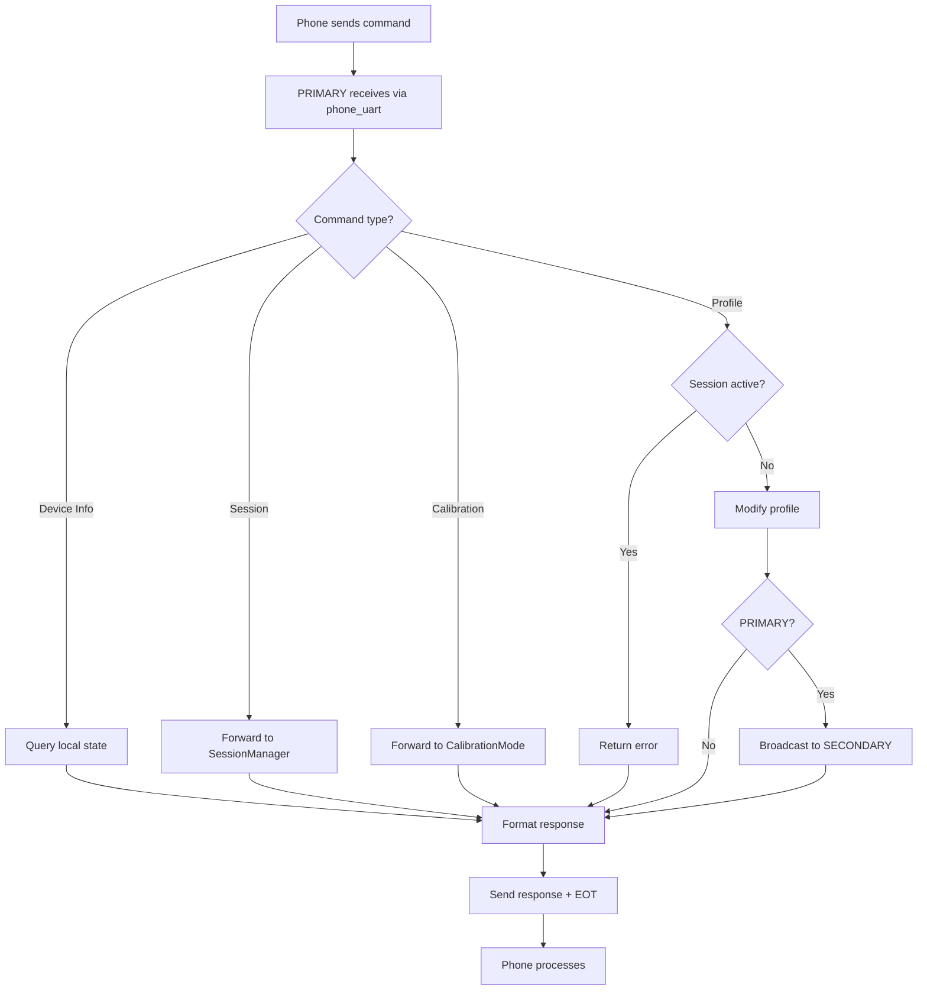

# BlueBuzzah BLE Protocol

**Version:** 2.0.0
**Platform:** Arduino C++ / PlatformIO
**Implementation:** MenuController (`src/menu_controller.cpp`)

---

## Table of Contents

1. [Connection](#connection)
2. [Message Format](#message-format)
3. [Command Processing Flow](#command-processing-flow)
4. [Timing & Performance](#timing--performance)
5. [Parameter Reference](#parameter-reference)
6. [Commands](#commands)
   - [Device Information](#device-information)
   - [Therapy Profiles](#therapy-profile-commands)
   - [Session Control](#session-control-commands)
   - [Parameter Adjustment](#parameter-commands)
   - [Calibration](#calibration-commands)
   - [System](#system-commands)
7. [Internal PRIMARY↔SECONDARY Commands](#internal-primarysecondary-commands)
8. [Legacy Commands](#legacy-single-character-commands)
9. [Response Format](#response-format)
10. [Error Codes](#error-codes)
11. [Message Interleaving](#message-interleaving)

---

## Connection

**BLE Service:** Nordic UART Service (NUS)

| UUID Type | UUID |
|-----------|------|
| Service | `6E400001-B5A3-F393-E0A9-E50E24DCCA9E` |
| TX (App → Glove) | `6E400002-B5A3-F393-E0A9-E50E24DCCA9E` |
| RX (Glove → App) | `6E400003-B5A3-F393-E0A9-E50E24DCCA9E` |

### Connection Model

```
[Smartphone] ──BLE UART──> [PRIMARY] ──BLE UART──> [SECONDARY]
                            │
                            ├── phone_uart: Smartphone commands
                            └── secondary_uart: SECONDARY synchronization
```

**Important:**
- Connect **only to PRIMARY** (device named "BlueBuzzah")
- PRIMARY automatically communicates with SECONDARY
- SECONDARY is never directly accessible to phone

### Device Roles

Both devices are **ambidextrous** and can be worn on either hand:
- **PRIMARY**: Receives phone commands, forwards to SECONDARY
- **SECONDARY**: Receives commands only via PRIMARY

Role is determined by `settings.bin` configuration (via `SET_ROLE` serial command).

---

## Message Format

### Command Format

**BLE commands** (Phone → PRIMARY):
```
COMMAND_NAME:ARG1:ARG2:...\x04
```

**Serial commands** (Terminal → PRIMARY):
```
COMMAND_NAME:ARG1:ARG2:...\n
```

### Response Format

```
KEY1:VALUE1\n
KEY2:VALUE2\n
\x04
```

### Rules

- **BLE commands** end with `\x04` (EOT character)
- **Serial commands** end with `\n` (newline)
- Arguments separated by `:` (colon)
- Responses are KEY:VALUE pairs (one per line)
- **All responses** end with `\x04` (EOT character)
- Errors: First line is `ERROR:description`

### Example

```
Send: BATTERY\x04
Recv: BATP:3.72\nBATS:3.68\n\x04
```

---

## Command Processing Flow



---

## Timing & Performance

### Command Response Times

| Command | Response Time | Notes |
|---------|---------------|-------|
| PING | <50ms | Instant response |
| INFO | 100-1100ms | Includes SECONDARY battery query |
| BATTERY | 100-1100ms | Queries both gloves via BLE |
| PROFILE_LIST | <50ms | Returns cached list |
| PROFILE_LOAD | 50-250ms | Includes SECONDARY sync |
| PROFILE_GET | <50ms | Returns cached values |
| PROFILE_CUSTOM | 50-250ms | Includes SECONDARY sync |
| SESSION_START | 100-500ms | Battery checks + SECONDARY handshake |
| SESSION_PAUSE/RESUME | <50ms | Updates both gloves |
| SESSION_STOP | <50ms | Stops both gloves |
| SESSION_STATUS | <50ms | Returns cached values |
| PARAM_SET | 50-250ms | Includes SECONDARY sync |
| CALIBRATE_BUZZ | 50-2050ms | Depends on duration parameter |

### Recommended Command Rate

- **Wait 100ms between commands** for reliable processing
- **Maximum rate:** 10 commands/second
- Commands are processed sequentially

### BLE Connection Specifications

| Parameter | Value |
|-----------|-------|
| Connection interval | 7.5-20ms (negotiated) |
| MTU size | 67 bytes (64 payload + 3 ATT header) |
| Supervision timeout | 4000ms |
| Message fragmentation | May occur for responses >MTU |

### Internal Synchronization Timing

During active therapy:
- **BUZZ messages:** Sent every ~200ms
- **BLE latency:** 7.5-20ms
- **Processing time:** <5ms per command
- **Synchronization accuracy:** ±20ms between gloves
- **Drift:** Zero (command-driven, not time-based)

---

## Parameter Reference

All parameter names use shorthand notation to minimize BLE bandwidth.

### Therapy Parameters

| Shorthand | Description | Range | Unit |
|-----------|-------------|-------|------|
| `TYPE` | Actuator type | LRA, ERM | - |
| `FREQ` | Actuator frequency | 150-300 | Hz |
| `ON` | Time ON duration | 0.050-0.500 | seconds |
| `OFF` | Time OFF duration | 0.020-0.200 | seconds |
| `SESSION` | Session duration | 1-180 | minutes |
| `AMPMIN` | Minimum amplitude | 0-100 | % |
| `AMPMAX` | Maximum amplitude | 0-100 | % |
| `PATTERN` | Pattern type | RNDP, SEQ | - |
| `MIRROR` | Mirror patterns | 0, 1 | boolean |
| `JITTER` | Timing jitter | 0-50 | % |

### Status Parameters

| Shorthand | Description | Unit |
|-----------|-------------|------|
| `BATP` | PRIMARY glove battery | V |
| `BATS` | SECONDARY glove battery | V |
| `ELAPSED` | Elapsed time | seconds |
| `TOTAL` | Total time | seconds |
| `PROGRESS` | Session progress | % (0-100) |

---

## Commands

### Command Summary

| Category | Commands | Count |
|----------|----------|-------|
| Device Information | INFO, BATTERY, PING | 3 |
| Therapy Profiles | PROFILE_LIST, PROFILE_LOAD, PROFILE_GET, PROFILE_CUSTOM | 4 |
| Session Control | SESSION_START, SESSION_PAUSE, SESSION_RESUME, SESSION_STOP, SESSION_STATUS | 5 |
| Parameter Adjustment | PARAM_SET | 1 |
| Calibration | CALIBRATE_START, CALIBRATE_BUZZ, CALIBRATE_STOP | 3 |
| System | HELP, RESTART | 2 |
| **Total** | | **18** |

---

### Device Information

#### INFO

Get comprehensive device information.

**Request:** `INFO\x04`

**Response:**
```
ROLE:PRIMARY
NAME:BlueBuzzah
FW:2.0.0
BATP:3.72
BATS:3.68
STATUS:IDLE
\x04
```

**Fields:**
- `ROLE`: PRIMARY or SECONDARY
- `NAME`: BLE device name
- `FW`: Firmware version
- `BATP`: PRIMARY battery voltage
- `BATS`: SECONDARY battery voltage (or "N/A")
- `STATUS`: IDLE | RUNNING | PAUSED

**Implementation:** `menu_controller.cpp:cmdInfo()`

---

#### BATTERY

Get battery voltage for both gloves.

**Request:** `BATTERY\x04`

**Response:**
```
BATP:3.72
BATS:3.68
\x04
```

**Battery Thresholds:**
| Status | Voltage | LED |
|--------|---------|-----|
| Good | >3.6V | Green |
| Low | 3.3-3.6V | Orange |
| Critical | <3.3V | Red (therapy blocked) |

**Implementation:** `menu_controller.cpp:cmdBattery()`

---

#### PING

Connection test for latency measurement.

**Request:** `PING\x04`

**Response:**
```
PONG
\x04
```

**Implementation:** `menu_controller.cpp:cmdPing()`

---

### Therapy Profile Commands

#### PROFILE_LIST

List available therapy profiles.

**Request:** `PROFILE_LIST\x04`

**Response:**
```
PROFILE:1:Regular VCR
PROFILE:2:Noisy VCR
PROFILE:3:Hybrid VCR
\x04
```

**Implementation:** `menu_controller.cpp:cmdProfileList()`

---

#### PROFILE_LOAD

Load therapy profile by ID.

**Request:** `PROFILE_LOAD:2\x04`

**Parameters:**
| ID | Profile | Description |
|----|---------|-------------|
| 1 | Regular VCR | 100ms ON, 67ms OFF, no jitter |
| 2 | Noisy VCR | 23.5% jitter, mirrored patterns (DEFAULT) |
| 3 | Hybrid VCR | Mixed frequency |

**Response (Success):**
```
STATUS:LOADED
PROFILE:Noisy VCR
\x04
```

**Response (Error):**
```
ERROR:Invalid profile ID
\x04
```
```
ERROR:Cannot modify parameters during active session
\x04
```

**Restrictions:** Cannot load during active session. Send `SESSION_STOP` first.

**Implementation:** `menu_controller.cpp:cmdProfileLoad()`

---

#### PROFILE_GET

Get current profile settings.

**Request:** `PROFILE_GET\x04`

**Response:**
```
TYPE:LRA
FREQ:250
ON:0.100
OFF:0.067
SESSION:120
AMPMIN:50
AMPMAX:100
PATTERN:RNDP
MIRROR:True
JITTER:23.5
\x04
```

**Implementation:** `menu_controller.cpp:cmdProfileGet()`

---

#### PROFILE_CUSTOM

Set custom therapy parameters (on-the-fly profile creation).

**Request:** `PROFILE_CUSTOM:ON:0.150:OFF:0.080:FREQ:210:JITTER:10\x04`

**Valid Parameters:** See [Parameter Reference](#therapy-parameters)

**Response (Success):**
```
STATUS:CUSTOM_LOADED
ON:0.150
OFF:0.080
FREQ:210
JITTER:10
\x04
```

**Response (Error):**
```
ERROR:Invalid parameter name
\x04
```
```
ERROR:Value out of range
\x04
```

**Note:** Only include parameters you want to change. Omitted parameters use current values.

**Implementation:** `menu_controller.cpp:cmdProfileCustom()`

---

### Session Control Commands

#### SESSION_START

Start therapy session.

**Request:** `SESSION_START\x04`

**Response (Success):**
```
SESSION_STATUS:RUNNING
\x04
```

**Response (Error):**
```
ERROR:SECONDARY not connected
\x04
```
```
ERROR:Battery too low
\x04
```

**Prerequisites:**
- SECONDARY must be connected (PRIMARY only)
- Both batteries >3.3V
- No session already running

**Implementation:** `menu_controller.cpp:cmdSessionStart()`

---

#### SESSION_PAUSE

Pause active session.

**Request:** `SESSION_PAUSE\x04`

**Response (Success):**
```
SESSION_STATUS:PAUSED
\x04
```

**Response (Error):**
```
ERROR:No active session
\x04
```

**Effect:**
- Motors immediately stop
- Timer paused (elapsed time frozen)
- LED flashes yellow
- Session can be resumed later

**Implementation:** `menu_controller.cpp:cmdSessionPause()`

---

#### SESSION_RESUME

Resume paused session.

**Request:** `SESSION_RESUME\x04`

**Response (Success):**
```
SESSION_STATUS:RUNNING
\x04
```

**Response (Error):**
```
ERROR:No paused session
\x04
```

**Implementation:** `menu_controller.cpp:cmdSessionResume()`

---

#### SESSION_STOP

Stop active session (graceful termination).

**Request:** `SESSION_STOP\x04`

**Response:**
```
SESSION_STATUS:IDLE
\x04
```

**Effect:**
- Therapy stops immediately
- Motors off
- Session cleared (cannot resume)
- Allows profile changes

**Implementation:** `menu_controller.cpp:cmdSessionStop()`

---

#### SESSION_STATUS

Get current session status and progress.

**Request:** `SESSION_STATUS\x04`

**Response (IDLE):**
```
SESSION_STATUS:IDLE
ELAPSED:0
TOTAL:0
PROGRESS:0
\x04
```

**Response (RUNNING):**
```
SESSION_STATUS:RUNNING
ELAPSED:300
TOTAL:7200
PROGRESS:4
\x04
```

**Response (PAUSED):**
```
SESSION_STATUS:PAUSED
ELAPSED:1500
TOTAL:7200
PROGRESS:21
\x04
```

**Fields:**
- `SESSION_STATUS`: IDLE | RUNNING | PAUSED
- `ELAPSED`: Seconds elapsed (excludes pause time)
- `TOTAL`: Total session duration in seconds
- `PROGRESS`: Percentage (0-100)

**Use Case:** Poll every 1-5 seconds for UI progress updates

**Implementation:** `menu_controller.cpp:cmdSessionStatus()`

---

### Parameter Commands

#### PARAM_SET

Set individual therapy parameter.

**Request:** `PARAM_SET:ON:0.150\x04`

**Response (Success):**
```
PARAM:ON
VALUE:0.150
\x04
```

**Response (Error):**
```
ERROR:Cannot modify parameters during active session
\x04
```
```
ERROR:Invalid parameter name
\x04
```
```
ERROR:Value out of range
\x04
```

**Note:** Use `PROFILE_CUSTOM` for multiple parameters, `PARAM_SET` for single changes.

**Implementation:** `menu_controller.cpp:cmdParamSet()`

---

### Calibration Commands

#### CALIBRATE_START

Enter calibration mode.

**Request:** `CALIBRATE_START\x04`

**Response:**
```
MODE:CALIBRATION
\x04
```

**Implementation:** `menu_controller.cpp:cmdCalibrateStart()`

---

#### CALIBRATE_BUZZ

Test individual finger motor.

**Request:** `CALIBRATE_BUZZ:0:80:500\x04`

**Parameters:**
| Parameter | Range | Description |
|-----------|-------|-------------|
| Finger | 0-7 | 0-3: PRIMARY, 4-7: SECONDARY |
| Intensity | 0-100 | Percentage |
| Duration | 50-2000 | Milliseconds |

**Finger Mapping:**
| Index | Device | Finger |
|-------|--------|--------|
| 0 | PRIMARY | Index |
| 1 | PRIMARY | Middle |
| 2 | PRIMARY | Ring |
| 3 | PRIMARY | Pinky |
| 4 | SECONDARY | Index |
| 5 | SECONDARY | Middle |
| 6 | SECONDARY | Ring |
| 7 | SECONDARY | Pinky |

**Response (Success):**
```
FINGER:0
INTENSITY:80
DURATION:500
\x04
```

**Response (Error):**
```
ERROR:Not in calibration mode
\x04
```
```
ERROR:Invalid finger index (must be 0-7)
\x04
```

**Note:** PRIMARY automatically relays commands for fingers 4-7 to SECONDARY.

**Implementation:** `menu_controller.cpp:cmdCalibrateBuzz()`

---

#### CALIBRATE_STOP

Exit calibration mode.

**Request:** `CALIBRATE_STOP\x04`

**Response:**
```
MODE:NORMAL
\x04
```

**Implementation:** `menu_controller.cpp:cmdCalibrateStop()`

---

### System Commands

#### HELP

List available commands.

**Request:** `HELP\x04`

**Response:**
```
COMMAND:INFO
COMMAND:BATTERY
COMMAND:PING
COMMAND:PROFILE_LIST
COMMAND:PROFILE_LOAD
COMMAND:PROFILE_GET
COMMAND:PROFILE_CUSTOM
COMMAND:SESSION_START
COMMAND:SESSION_PAUSE
COMMAND:SESSION_RESUME
COMMAND:SESSION_STOP
COMMAND:SESSION_STATUS
COMMAND:PARAM_SET
COMMAND:CALIBRATE_START
COMMAND:CALIBRATE_BUZZ
COMMAND:CALIBRATE_STOP
COMMAND:RESTART
COMMAND:HELP
\x04
```

**Implementation:** `menu_controller.cpp:cmdHelp()`

---

#### RESTART

Reboot glove to menu mode.

**Request:** `RESTART\x04`

**Response:**
```
STATUS:REBOOTING
\x04
```

**Note:** BLE connection will drop after this command.

**Implementation:** `menu_controller.cpp:cmdRestart()`

---

## Internal PRIMARY↔SECONDARY Commands

These commands are used for inter-device synchronization. They are **not user-facing** but may appear in BLE RX stream during therapy.

### PARAM_UPDATE

Broadcast parameter changes from PRIMARY to SECONDARY.

**Direction:** PRIMARY → SECONDARY (internal only)

**Format:**
```
PARAM_UPDATE:KEY1:VALUE1:KEY2:VALUE2:...
```

**Example:**
```
PARAM_UPDATE:ON:0.150:OFF:0.080:JITTER:10
```

**Note:** No terminator required (internal message)

---

### GET_BATTERY

Query SECONDARY battery voltage.

**Direction:** PRIMARY → SECONDARY

**Request:** `GET_BATTERY`

**Response:** `BATRESPONSE:3.68`

---

### SYNC Messages

During therapy, PRIMARY sends synchronization messages to SECONDARY:

| Message | Format | Purpose |
|---------|--------|---------|
| BUZZ | `SYNC:BUZZ:seq\|ts\|finger\|amplitude` | Execute motor activation |
| HEARTBEAT | `SYNC:HEARTBEAT:seq\|ts` | Connection keepalive (every 2s) |
| START_SESSION | `SYNC:START_SESSION:seq\|ts` | Start therapy |
| STOP_SESSION | `SYNC:STOP_SESSION:seq\|ts` | Stop therapy |
| PAUSE_SESSION | `SYNC:PAUSE_SESSION:seq\|ts` | Pause therapy |
| RESUME_SESSION | `SYNC:RESUME_SESSION:seq\|ts` | Resume therapy |
| SEED | `SEED:N` | Random seed for jitter sync |
| SEED_ACK | `SEED_ACK` | Seed acknowledgment |

---

## Legacy Single-Character Commands

For backward compatibility with BLE terminal apps:

| Old | New Equivalent | Description |
|-----|----------------|-------------|
| `g` | `BATTERY` | Check battery |
| `v` | `PROFILE_GET` | View settings |
| `1` | `PROFILE_LOAD:1` | Load Regular VCR |
| `2` | `PROFILE_LOAD:2` | Load Noisy VCR |
| `3` | `PROFILE_LOAD:3` | Load Hybrid VCR |
| `c` | `CALIBRATE_START` | Enter calibration |
| `r` | `RESTART` | Restart glove |

**Note:** All legacy commands work with modern response format (KEY:VALUE with `\x04`).

**Implementation:** `menu_controller.cpp:mapLegacyCommand()`

---

## Response Format

### Success Response

```cpp
// Implementation: menu_controller.cpp
void MenuController::sendResponse(const String& key, const String& value) {
    String response = key + ":" + value + "\n\x04";
    ble_.sendToPhone(response);
}

void MenuController::sendMultiResponse(const char* keys[], const String values[], uint8_t count) {
    String response = "";
    for (uint8_t i = 0; i < count; i++) {
        response += keys[i];
        response += ":";
        response += values[i];
        response += "\n";
    }
    response += "\x04";
    ble_.sendToPhone(response);
}
```

### Error Response

```cpp
// Implementation: menu_controller.cpp
void MenuController::sendError(const char* errorMessage) {
    String response = "ERROR:";
    response += errorMessage;
    response += "\n\x04";
    ble_.sendToPhone(response);
}
```

---

## Error Codes

| Error | Cause | Resolution |
|-------|-------|------------|
| `ERROR:Unknown command` | Invalid command name | Check HELP for valid commands |
| `ERROR:Invalid profile ID` | Profile ID not 1-3 | Use PROFILE_LIST to see valid IDs |
| `ERROR:SECONDARY not connected` | SECONDARY not paired | Connect SECONDARY before SESSION_START |
| `ERROR:Battery too low` | Voltage <3.3V | Charge glove(s) |
| `ERROR:No active session` | No session running | Start session first |
| `ERROR:No paused session` | Session not paused | Pause session first |
| `ERROR:Cannot modify parameters during active session` | Profile change during therapy | Stop session first |
| `ERROR:Invalid parameter name` | Unknown parameter key | Check PROFILE_GET for valid keys |
| `ERROR:Value out of range` | Parameter value invalid | See parameter ranges |
| `ERROR:Not in calibration mode` | Calibration not active | Send CALIBRATE_START first |
| `ERROR:Invalid finger index` | Finger not 0-7 | Valid range: 0-7 |
| `ERROR:Profile manager not initialized` | System initialization failure | Restart device |

---

## Message Interleaving

During active therapy sessions, PRIMARY sends internal synchronization messages to SECONDARY. These may appear in the BLE RX stream.

### Internal Messages to Filter

Messages that should be ignored (no `\x04` terminator):

- `SYNC:*` - All internal sync messages
- `BUZZ:*` - Motor activation commands
- `PARAM_UPDATE:*` - Parameter broadcasts
- `SEED:*` / `SEED_ACK` - Jitter synchronization
- `GET_BATTERY` / `BATRESPONSE:*` - Battery queries
- `ACK_PARAM_UPDATE` - Acknowledgments

### Filtering Strategy

**Rule:** If no `\x04` terminator, ignore the message.

```
// Example RX stream during therapy:
PONG\x04                             ← Response to PING (process)
SYNC:BUZZ:42|5000000|0|100           ← Internal (ignore - no EOT)
BATP:3.72\nBATS:3.68\x04             ← Response to BATTERY (process)
SYNC:BUZZ:43|5200000|1|100           ← Internal (ignore - no EOT)
```

---

## See Also

- [ARCHITECTURE.md](ARCHITECTURE.md) - System design and state machine
- [SYNCHRONIZATION_PROTOCOL.md](SYNCHRONIZATION_PROTOCOL.md) - PRIMARY↔SECONDARY coordination
- [CALIBRATION_GUIDE.md](CALIBRATION_GUIDE.md) - Motor calibration workflow
- [TESTING.md](TESTING.md) - Hardware integration testing
