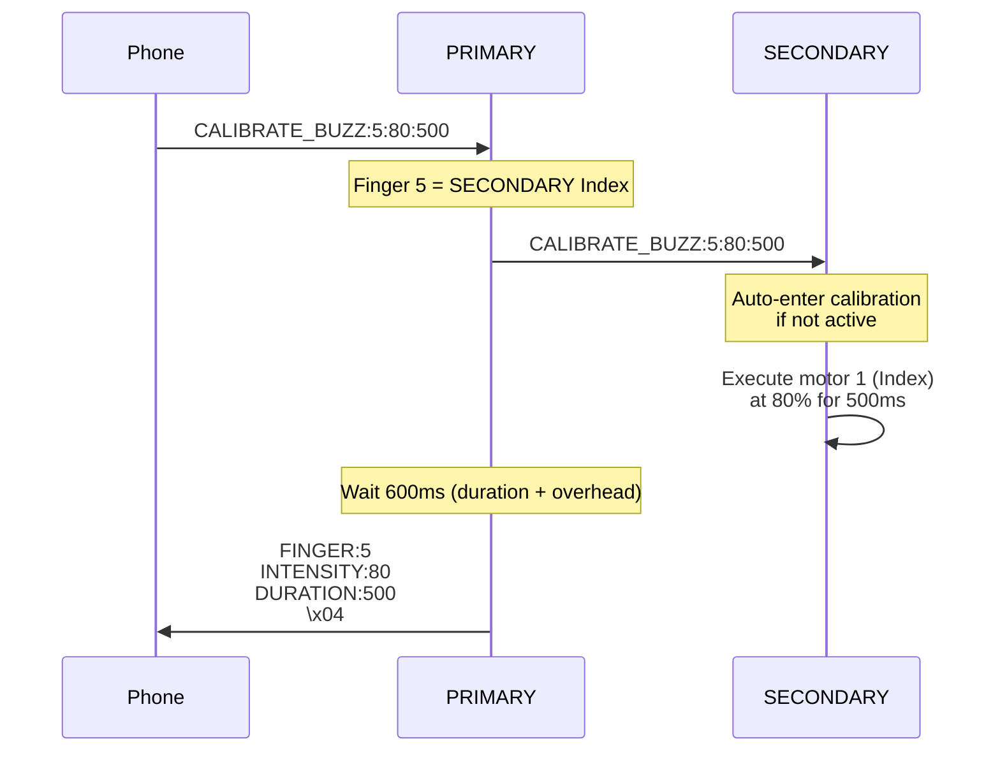

# BlueBuzzah Calibration Guide
**Version:** 2.0.0
**Date:** 2025-01-23
**Platform:** Arduino C++ / PlatformIO
**Module**: CalibrationMode (src/menu_controller.cpp)

---

## Table of Contents

1. [Overview](#overview)
2. [Calibration Architecture](#calibration-architecture)
3. [Finger Mapping](#finger-mapping)
4. [Calibration Workflow](#calibration-workflow)
5. [PRIMARY→SECONDARY Relay Protocol](#primarysecondary-relay-protocol)
6. [Intensity Mapping](#intensity-mapping)
7. [Clinical Tuning Guidelines](#clinical-tuning-guidelines)
8. [Troubleshooting](#troubleshooting)

---

## Terminology Note

This document uses the following device role terminology:
- **PRIMARY**: Initiates calibration, controls phone connection
- **SECONDARY**: Receives relayed commands via PRIMARY

Both devices run identical firmware and advertise as "BlueBuzzah". Role is determined by `settings.json` configuration.

---

## Overview

### Purpose

Calibration mode allows individual finger motor testing for:
- **Hardware Verification**: Confirm all 8 motors functional
- **Intensity Tuning**: Find optimal vibration strength per finger
- **User Comfort**: Adjust for individual sensation thresholds
- **Diagnostic Testing**: Identify motor failures or loose connections

### Features

- Test all 8 motors individually (0-7)
- Adjustable intensity (0-100%)
- Configurable duration (50-2000ms)
- **PRIMARY→SECONDARY relay**: Phone can test SECONDARY motors via PRIMARY
- Real-time feedback via BLE responses

---

## Calibration Architecture

### CalibrationMode Integration

**File**: `src/menu_controller.cpp`

Calibration functionality is integrated into the MenuController class in the Arduino C++ implementation.

**State Variables** (menu_controller.h):

```cpp
class MenuController {
private:
    Hardware& hardware_;
    BLEManager& ble_;
    DeviceRole role_;
    bool calibrationMode_;  // Calibration state flag

public:
    MenuController(Hardware& hw, BLEManager& ble, DeviceRole role)
        : hardware_(hw)
        , ble_(ble)
        , role_(role)
        , calibrationMode_(false)
    {}
};
```

### State Management

**Enter Calibration** (menu_controller.cpp):

```cpp
void MenuController::cmdCalibrateStart() {
    /**
     * Enter calibration mode.
     *
     * Validates session state before enabling calibration.
     */
    if (stateMachine_ && stateMachine_->isSessionActive()) {
        sendError("Cannot enter calibration during active session");
        return;
    }

    calibrationMode_ = true;
    ble_.sendToPhone("MODE:CALIBRATION\n\x04");
}
```

**Exit Calibration** (menu_controller.cpp):

```cpp
void MenuController::cmdCalibrateStop() {
    /**
     * Exit calibration mode.
     *
     * Disables calibration state and returns to normal operation.
     */
    calibrationMode_ = false;
    ble_.sendToPhone("MODE:NORMAL\n\x04");
}
```

---

## Finger Mapping

### Physical Layout

```text
PRIMARY GLOVE:                  SECONDARY GLOVE:
┌─────────────────────┐        ┌─────────────────────┐
│  0: Thumb           │        │  4: Thumb           │
│  1: Index           │        │  5: Index           │
│  2: Middle          │        │  6: Middle          │
│  3: Ring            │        │  7: Ring            │
└─────────────────────┘        └─────────────────────┘
```

### Index-to-Finger Mapping

| Index | Glove | Finger | Motor Channel | Control Path |
|-------|-------|--------|---------------|--------------|
| 0 | PRIMARY | Thumb | 0 | Direct (PRIMARY local) |
| 1 | PRIMARY | Index | 1 | Direct (PRIMARY local) |
| 2 | PRIMARY | Middle | 2 | Direct (PRIMARY local) |
| 3 | PRIMARY | Ring | 3 | Direct (PRIMARY local) |
| 4 | SECONDARY | Thumb | 0 | Relay (PRIMARY → SECONDARY) |
| 5 | SECONDARY | Index | 1 | Relay (PRIMARY → SECONDARY) |
| 6 | SECONDARY | Middle | 2 | Relay (PRIMARY → SECONDARY) |
| 7 | SECONDARY | Ring | 3 | Relay (PRIMARY → SECONDARY) |

**Motor Channel Calculation**:
```cpp
// PRIMARY (fingers 0-3)
uint8_t motorChannel = fingerIndex;  // 0→0, 1→1, 2→2, 3→3

// SECONDARY (fingers 4-7)
uint8_t motorChannel = fingerIndex - 4;  // 4→0, 5→1, 6→2, 7→3
```

---

## Calibration Workflow

### BLE Command Sequence

**Complete Calibration Session**:

```text
1. Phone → PRIMARY: CALIBRATE_START\n
2. PRIMARY → Phone: MODE:CALIBRATION\n\x04

3. Phone → PRIMARY: CALIBRATE_BUZZ:0:50:500\n
4. PRIMARY: <tests local thumb at 50% for 500ms>
5. PRIMARY → Phone: FINGER:0\nINTENSITY:50\nDURATION:500\n\x04

6. Phone → PRIMARY: CALIBRATE_BUZZ:4:75:500\n
7. PRIMARY → SECONDARY: CALIBRATE_BUZZ:4:75:500\n
8. SECONDARY: <tests local thumb at 75% for 500ms>
9. PRIMARY → Phone: FINGER:4\nINTENSITY:75\nDURATION:500\n\x04

... (repeat for all 8 fingers)

10. Phone → PRIMARY: CALIBRATE_STOP\n
11. PRIMARY → Phone: MODE:NORMAL\n\x04
```

### Main Buzz Method

**Entry Point** (menu_controller.cpp):

```cpp
void MenuController::cmdCalibrateBuzz(uint8_t finger, uint8_t intensity, uint16_t durationMs) {
    /**
     * Test individual finger motor.
     *
     * Args:
     *     finger: 0-7 (0-3=PRIMARY, 4-7=SECONDARY)
     *     intensity: 0-100 (percentage)
     *     durationMs: 50-2000 (milliseconds)
     */
    if (!calibrationMode_) {
        sendError("Not in calibration mode");
        return;
    }

    // Validate parameters
    if (finger > 7) {
        sendError("Invalid finger index (must be 0-7)");
        return;
    }

    if (intensity > 100) {
        sendError("Invalid intensity (must be 0-100)");
        return;
    }

    if (durationMs < 50 || durationMs > 2000) {
        sendError("Invalid duration (must be 50-2000ms)");
        return;
    }

    // Determine if motor is local or remote
    bool isLocal = (finger < 4 && role_ == DeviceRole::PRIMARY) ||
                   (finger >= 4 && role_ == DeviceRole::SECONDARY);

    if (isLocal) {
        // Test local motor directly
        buzzLocalFinger(finger, intensity, durationMs);
    } else if (role_ == DeviceRole::PRIMARY) {
        // Relay to remote glove (PRIMARY only)
        buzzRemoteFinger(finger, intensity, durationMs);
    } else {
        sendError("SECONDARY cannot control PRIMARY fingers");
        return;
    }

    // Send success response
    String response = "FINGER:";
    response += String(finger);
    response += "\nINTENSITY:";
    response += String(intensity);
    response += "\nDURATION:";
    response += String(durationMs);
    response += "\n\x04";
    ble_.sendToPhone(response);
}
```

**Routing Logic**:

| Role | Finger | Action |
|------|--------|--------|
| PRIMARY | 0-3 | `buzzLocalFinger()` - Direct motor control |
| PRIMARY | 4-7 | `buzzRemoteFinger()` - BLE relay to SECONDARY |
| SECONDARY | 0-3 | Error (SECONDARY can't control PRIMARY) |
| SECONDARY | 4-7 | `buzzLocalFinger()` - Direct motor control |

---

### Local Motor Control

**Implementation** (hardware.cpp):

```cpp
void MenuController::buzzLocalFinger(uint8_t finger, uint8_t intensity, uint16_t durationMs) {
    /**
     * Test local motor.
     *
     * Args:
     *     finger: 0-3 for PRIMARY, 4-7 for SECONDARY
     *     intensity: 0-100%
     *     durationMs: Duration in milliseconds
     */
    // 1. Convert finger index to motor channel (0-3)
    uint8_t motorChannel;
    if (role_ == DeviceRole::PRIMARY) {
        motorChannel = finger;  // 0-3 directly
    } else {
        motorChannel = finger - 4;  // 4-7 → 0-3
    }

    if (motorChannel > 3) {
        Serial.printf("[CalibrationMode] Invalid motor channel: %d\n", motorChannel);
        return;
    }

    // 2. Convert intensity percentage to DRV2605 value (0-127)
    uint8_t drvIntensity = (intensity * 127) / 100;
    drvIntensity = constrain(drvIntensity, 0, 127);

    Serial.printf("[CalibrationMode] Buzzing finger %d (motor %d) at %d%% for %dms\n",
                  finger, motorChannel, intensity, durationMs);

    // 3. Use Hardware class to buzz the finger
    hardware_.buzzFinger(motorChannel, drvIntensity, durationMs);
}

// Hardware class implementation (hardware.cpp)
void Hardware::buzzFinger(uint8_t channel, uint8_t amplitude, uint16_t durationMs) {
    // 1. Select motor via I2C multiplexer
    mux_.selectChannel(channel);

    // 2. Configure DRV2605 for Real-Time Playback mode
    const uint8_t MODE_RTP = 0x05;
    drv_.setMode(MODE_RTP);

    // 3. Set amplitude and trigger
    drv_.setRealtimeValue(amplitude);
    drv_.go();

    // 4. Wait for duration
    delay(durationMs);

    // 5. Stop motor
    drv_.setRealtimeValue(0);
    drv_.stop();
}
```

**DRV2605 Configuration**:
- **Mode**: Real-Time Playback (0x05)
- **Amplitude**: 0-127 (7-bit value)
- **Waveform**: Strong Click (effect #1) for consistent testing
- **Control**: Direct `realtime_value` register write

---

## PRIMARY→SECONDARY Relay Protocol

### Remote Motor Control

**PRIMARY Relay** (menu_controller.cpp):

```cpp
void MenuController::buzzRemoteFinger(uint8_t finger, uint8_t intensity, uint16_t durationMs) {
    /**
     * Relay buzz command to remote glove (PRIMARY → SECONDARY only).
     *
     * Args:
     *     finger: 4-7 (SECONDARY fingers)
     *     intensity: 0-100%
     *     durationMs: Duration in milliseconds
     */
    if (role_ != DeviceRole::PRIMARY) {
        Serial.println("[CalibrationMode] Only PRIMARY can relay to SECONDARY");
        return;
    }

    if (!ble_.isSecondaryConnected()) {
        Serial.println("[CalibrationMode] SECONDARY not connected");
        return;
    }

    // 1. Send calibration command to SECONDARY
    String cmd = "CALIBRATE_BUZZ:";
    cmd += String(finger);
    cmd += ":";
    cmd += String(intensity);
    cmd += ":";
    cmd += String(durationMs);
    cmd += "\n";

    ble_.sendToSecondary(cmd);
    Serial.printf("[CalibrationMode] Sent buzz command to SECONDARY: %s", cmd.c_str());

    // 2. Wait for duration + overhead
    delay(durationMs + 100);

    // 3. SECONDARY will acknowledge completion
    Serial.printf("[CalibrationMode] Relayed buzz to SECONDARY finger %d\n", finger);
}
```

**Message Flow**:



### SECONDARY Handler

**SECONDARY Receives Remote Request** (menu_controller.cpp):

```cpp
void MenuController::handleRemoteBuzzRequest(uint8_t finger, uint8_t intensity, uint16_t durationMs) {
    /**
     * Handle buzz request from PRIMARY (SECONDARY only).
     *
     * This is called when SECONDARY receives CALIBRATE_BUZZ from PRIMARY.
     *
     * Args:
     *     finger: 4-7 (should be for this glove)
     *     intensity: 0-100%
     *     durationMs: Duration in milliseconds
     */
    if (role_ != DeviceRole::SECONDARY) {
        Serial.println("[CalibrationMode] Only SECONDARY can handle remote requests");
        return;
    }

    if (!calibrationMode_) {
        // Auto-enter calibration mode for remote requests
        calibrationMode_ = true;
        Serial.println("[CalibrationMode] Auto-entered calibration mode for remote request");
    }

    // Execute local buzz
    buzzLocalFinger(finger, intensity, durationMs);
}
```

**Key Feature**: SECONDARY **automatically enters** calibration mode when receiving remote requests.

**Why?** Phone workflow is simpler - no need to send separate CALIBRATE_START to SECONDARY.

---

## Intensity Mapping

### User Perception to DRV2605 Value

**Conversion Formula**:

```cpp
// User intensity (0-100%) → DRV2605 amplitude (0-127)
uint8_t drvAmplitude = (userIntensity * 127) / 100;
drvAmplitude = constrain(drvAmplitude, 0, 127);  // Clamp to 0-127
```

**Lookup Table**:

| User % | DRV Value | Sensation | Clinical Use |
|--------|-----------|-----------|--------------|
| 0% | 0 | None | Motor off |
| 10% | 13 | Barely perceptible | Detection threshold testing |
| 25% | 32 | Light tap | Minimum therapeutic |
| 50% | 63 | Moderate buzz | Typical therapy level |
| 75% | 95 | Strong vibration | Higher therapeutic |
| 100% | 127 | Maximum output | Intensity verification |

### Clinical Intensity Ranges

**Recommended Therapy Intensities**:

```
Comfort Level          | Intensity Range | DRV Range
-----------------------|-----------------|------------
Sub-threshold          | 0-15%           | 0-19
Detection threshold    | 15-25%          | 19-32
Therapeutic minimum    | 25-50%          | 32-63
Optimal therapeutic    | 50-75%          | 63-95
Maximum therapeutic    | 75-90%          | 95-114
Above comfort          | 90-100%         | 114-127
```

**Typical User Preferences**:
- **Young adults**: 60-80% (comfortable vibration)
- **Older adults**: 40-60% (reduced sensation sensitivity)
- **Parkinson's patients**: 50-70% (based on tremor severity)

### Amplitude Scaling Factors

**Voltage Impact**:
```cpp
// Peak voltage affects maximum intensity
const float ACTUATOR_VOLTAGE = 2.50f;  // Default

// Effective intensity = drvAmplitude * (voltage / 2.50)
// Lower voltage → weaker sensation at same drvAmplitude
```

**Frequency Impact**:
```cpp
// LRAs are resonant devices
const uint16_t ACTUATOR_FREQUENCY = 250;  // Hz (resonance frequency)

// On-resonance (250 Hz): Maximum efficiency
// Off-resonance (±50 Hz): ~50% reduced intensity
// Far off-resonance (±100 Hz): ~80% reduced intensity
```

**Recommendation**: Always calibrate at therapy frequency (250 Hz) for accurate intensity tuning.

---

## Clinical Tuning Guidelines

### Initial Calibration Procedure

**Step 1: Detection Threshold** (5-10 minutes per glove)

```
For each finger (0-7):
    1. Start at 0% intensity
    2. Increase by 5% increments
    3. Ask patient: "Can you feel this?"
    4. Record first intensity where detected
    5. Repeat 3 times, average result
```

**Expected Thresholds**:
- Healthy adults: 10-20%
- Reduced sensation (aging/diabetes): 25-40%
- Hypersensitive: 5-15%

**Step 2: Comfort Maximum** (5-10 minutes per glove)

```
For each finger (0-7):
    1. Start at detection threshold + 20%
    2. Increase by 10% increments
    3. Ask patient: "Is this comfortable?"
    4. Record last comfortable intensity
    5. This is the patient's maximum
```

**Expected Maximums**:
- Healthy adults: 70-90%
- Reduced sensation: 80-100%
- Hypersensitive: 40-60%

**Step 3: Therapeutic Intensity** (finalization)

```
For each finger (0-7):
    Therapeutic intensity = Detection threshold + 50% of comfort range

    Example:
        Detection: 15%
        Comfort max: 75%
        Range: 75 - 15 = 60%
        Therapeutic: 15 + (60 * 0.50) = 45%
```

**Record in Patient Profile**:
```cpp
// Via BLE command:
// PROFILE_CUSTOM:AMPMIN:45:AMPMAX:45\n

// Or in TherapyParams struct:
TherapyParams profile;
profile.amplitudeMin = 45;  // Therapeutic intensity
profile.amplitudeMax = 45;  // Fixed intensity (no variation)
// Or allow ±10% variation:
// profile.amplitudeMin = 40;
// profile.amplitudeMax = 50;
```

### Inter-Finger Balancing

**Problem**: Not all fingers have equal sensation sensitivity.

**Solution**: Individual per-finger intensity tuning (future enhancement).

**Current Workaround**:
```
1. Calibrate all 8 fingers
2. Find finger with HIGHEST detection threshold (least sensitive)
3. Set AMPLITUDE_MIN/MAX based on that finger
4. All fingers will be above detection for that patient
5. Some fingers may be stronger, but therapy still effective
```

**Example**:
```
Detection Thresholds:
    Finger 0 (PRIMARY Thumb):  15%
    Finger 1 (PRIMARY Index):  20%  ← Highest
    Finger 2 (PRIMARY Middle): 12%
    Finger 3 (PRIMARY Ring):   18%
    Finger 4 (SECONDARY Thumb):  14%
    Finger 5 (SECONDARY Index):  16%
    Finger 6 (SECONDARY Middle): 11%
    Finger 7 (SECONDARY Ring):   19%

Set therapeutic intensity based on Finger 1 (20%):
    AMPLITUDE_MIN = 20 + 30 = 50%
    AMPLITUDE_MAX = 50%

Result: All fingers above detection, Finger 1 has optimal intensity
```

### Session-to-Session Variability

**Expected Variations**:
- Day-to-day: ±5-10% intensity
- Morning vs Evening: Up to ±15% (circadian effects)
- Medication state: ±20% (Parkinson's patients)

**Recommendation**: Re-calibrate every 4-6 weeks or when patient reports discomfort.

---

## Troubleshooting

### Motor Not Responding

**Symptom**: CALIBRATE_BUZZ succeeds but no vibration felt

**Diagnostic Steps**:

1. **Check voltage setting**:
   ```cpp
   // In TherapyParams or profile
   const float ACTUATOR_VOLTAGE = 2.50f;  // Should be 2.0-3.0V
   ```
   **Fix**: Increase voltage if <2.0V

2. **Check frequency**:
   ```cpp
   // In TherapyParams or profile
   const uint16_t ACTUATOR_FREQUENCY = 250;  // Should match LRA resonance
   ```
   **Fix**: Verify LRA specification (typically 200-300 Hz)

3. **Check intensity**:
   ```
   // Test at maximum intensity first via BLE command:
   CALIBRATE_BUZZ:0:100:1000
   ```
   **Fix**: If still no sensation, hardware issue

4. **Check I2C connection**:
   ```
   // Serial console should show:
   [PRIMARY] Secondary i2c Channel 0: 0x5A
   ```
   **Fix**: If empty, check wiring to multiplexer

5. **Check motor wiring**:
   - Measure motor terminals with multimeter
   - Should see ~10Ω resistance for LRA
   - If open circuit, motor cable disconnected

---

### SECONDARY Motor Testing Fails

**Symptom**: PRIMARY motors work, SECONDARY motors return error

**Diagnostic Steps**:

1. **Check SECONDARY connection**:
   ```
   // Send INFO command via BLE
   INFO
   // Response should include:
   // BATS:3.68  ← SECONDARY is connected
   ```
   **Fix**: If BATS:N/A, reconnect SECONDARY glove

2. **Check SECONDARY UART**:
   ```
   // In PRIMARY serial console:
   [PRIMARY] [SYNC] Broadcast X parameter(s) to SECONDARY
   ```
   **Fix**: If no sync messages, secondary UART not initialized

3. **Check SECONDARY calibration mode**:
   ```
   // SECONDARY serial console should show:
   [SECONDARY] [CalibrationMode] Auto-entered calibration mode
   ```
   **Fix**: If not shown, SECONDARY not receiving CALIBRATE_BUZZ

4. **Manual SECONDARY testing**:
   ```
   // Connect terminal to SECONDARY glove directly
   // Send: CALIBRATE_START
   // Send: CALIBRATE_BUZZ:4:80:500
   // If works: BLE relay issue
   // If fails: SECONDARY hardware issue
   ```

---

### Inconsistent Intensity

**Symptom**: Same intensity value feels different across sessions

**Possible Causes**:

1. **Battery voltage drop**:
   ```
   // Check battery via BLE command
   BATTERY
   // If <3.6V, sensation will be weaker
   ```
   **Fix**: Charge gloves to >3.7V before calibration

2. **Frequency mismatch**:
   ```
   // Verify frequency hasn't changed
   PROFILE_GET
   // FREQ should be 250
   ```
   **Fix**: Reload profile if changed

3. **Skin contact**:
   - Ensure motors pressed against skin
   - Check glove fit (should be snug)
   - Clean motor surfaces (oil/sweat reduces sensation)

4. **Temperature effects**:
   - LRAs perform differently when warm
   - First test may feel weaker (motor cold)
   **Fix**: Run 5-second warm-up buzz at 50% before calibration

---

### Helper Methods

**Test All Fingers** (menu_controller.cpp):

```cpp
void MenuController::testAllFingers(uint8_t intensity, uint16_t durationMs) {
    /**
     * Test all 8 fingers in sequence (quick verification).
     *
     * Args:
     *     intensity: Default 50%
     *     durationMs: Default 200ms
     */
    if (!calibrationMode_) {
        Serial.println("[CalibrationMode] Not in calibration mode");
        return;
    }

    for (uint8_t finger = 0; finger < 8; finger++) {
        cmdCalibrateBuzz(finger, intensity, durationMs);
        delay(100);  // Small gap between fingers
    }
}
```

**Usage via BLE**:
```cpp
// Phone can automate full calibration:
// for (int finger = 0; finger < 8; finger++) {
//     sendCommand("CALIBRATE_BUZZ:" + String(finger) + ":50:200");
//     waitForResponse();
//     delay(100);
// }
```

**Get Finger Name** (menu_controller.cpp):

```cpp
const char* MenuController::getFingerName(uint8_t fingerIndex) {
    /**
     * Get human-readable finger name.
     *
     * Args:
     *     fingerIndex: 0-7
     *
     * Returns:
     *     const char*: Finger name (e.g., "PRIMARY Thumb", "SECONDARY Index")
     */
    static const char* fingerNames[] = {
        "PRIMARY Thumb", "PRIMARY Index", "PRIMARY Middle", "PRIMARY Ring",
        "SECONDARY Thumb", "SECONDARY Index", "SECONDARY Middle", "SECONDARY Ring"
    };

    if (fingerIndex > 7) return "Unknown";
    return fingerNames[fingerIndex];
}
```

**Example**:
```cpp
getFingerName(0);  // "PRIMARY Thumb"
getFingerName(5);  // "SECONDARY Index"
```

---

## Future Enhancements

### Per-Finger Intensity Profiles

**Current Limitation**: Single intensity for all fingers

**Proposed Enhancement**:
```cpp
// In TherapyParams struct
struct TherapyParams {
    // ... existing fields ...
    uint8_t amplitudeFingerMap[8];  // Per-finger intensity (0-100%)
};

// Initialize per-finger map
uint8_t fingerMap[8] = {
    45,  // PRIMARY Thumb
    55,  // PRIMARY Index (less sensitive, needs higher)
    40,  // PRIMARY Middle
    50,  // PRIMARY Ring
    42,  // SECONDARY Thumb
    52,  // SECONDARY Index
    38,  // SECONDARY Middle
    48   // SECONDARY Ring
};

// In therapy engine
void TherapyEngine::fingersOn(uint8_t* fingers, uint8_t count) {
    for (uint8_t i = 0; i < count; i++) {
        uint8_t finger = fingers[i];
        uint8_t amplitude = params_.amplitudeFingerMap[finger];
        hardware_.setMotorAmplitude(finger % 4, amplitude);
    }
}
```

### Automated Calibration Algorithm

**Proposed**: Adaptive staircase method

```cpp
uint8_t autoCalibrateFinger(uint8_t fingerIndex) {
    /**
     * Automated detection threshold using adaptive staircase.
     *
     * Algorithm:
     *     1. Start at 50% (mid-point)
     *     2. Patient presses button when sensation detected
     *     3. Adjust intensity:
     *         - Detected: Decrease by 10%
     *         - Not detected: Increase by 10%
     *     4. Repeat until convergence (±5%)
     *     5. Return threshold
     */
    uint8_t intensity = 50;
    uint8_t step = 10;
    uint8_t detectedCount = 0;
    uint8_t notDetectedCount = 0;

    while (step > 5) {
        buzzFinger(fingerIndex, intensity, 500);
        bool detected = waitForButtonPress(3000);  // 3 second timeout

        if (detected) {
            intensity -= step;
            detectedCount++;
        } else {
            intensity += step;
            notDetectedCount++;
        }

        // Reduce step size after reversals
        if (detectedCount > 1 && notDetectedCount > 1) {
            step = step / 2;
        }
    }

    return intensity;
}
```

### Calibration Session Logging

**Proposed**: Record calibration data for analysis (stored in LittleFS)

```cpp
// Calibration log structure
struct CalibrationLog {
    uint32_t timestamp;           // Unix timestamp
    char patientId[16];           // Patient identifier
    uint8_t sessionNumber;        // Session count
    uint8_t thresholds[8];        // Detection thresholds per finger
    uint8_t comfortMax[8];        // Comfort maximum per finger
    uint8_t therapeutic[8];       // Final therapeutic intensity per finger
};

// Save to LittleFS
void saveCalibrationLog(const CalibrationLog& log) {
    File file = LittleFS.open("/calibration.log", "a");
    if (file) {
        file.write((uint8_t*)&log, sizeof(log));
        file.close();
    }
}
```

---

**Document Maintenance:**
Update this document when:
- Modifying calibration algorithms
- Changing intensity mapping formulas
- Adding new calibration features
- Updating clinical protocols
- Adding per-finger intensity support

**Last Updated:** 2025-01-23
**Clinical Protocol Version:** 1.0
**Reviewed By:** Clinical Engineering Team
