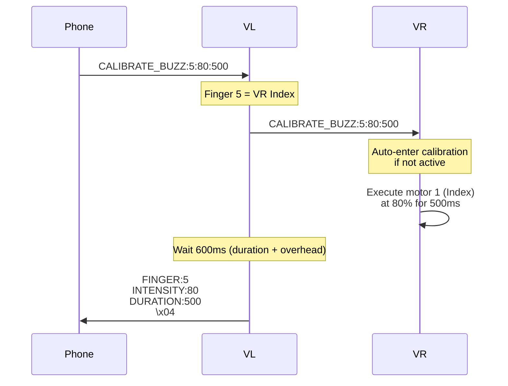

# BlueBuzzah Calibration Guide
**Version:** 1.0.0
**Date:** 2025-01-23
**Module**: CalibrationMode (src/modules/calibration_mode.py)

---

## Table of Contents

1. [Overview](#overview)
2. [Calibration Architecture](#calibration-architecture)
3. [Finger Mapping](#finger-mapping)
4. [Calibration Workflow](#calibration-workflow)
5. [VL→VR Relay Protocol](#vlvr-relay-protocol)
6. [Intensity Mapping](#intensity-mapping)
7. [Clinical Tuning Guidelines](#clinical-tuning-guidelines)
8. [Troubleshooting](#troubleshooting)

---

## Overview

### Purpose

Calibration mode allows individual finger motor testing for:
- **Hardware Verification**: Confirm all 8 motors functional
- **Intensity Tuning**: Find optimal vibration strength per finger
- **User Comfort**: Adjust for individual sensation thresholds
- **Diagnostic Testing**: Identify motor failures or loose connections

### Features

- Test all 8 motors individually (0-7)
- Adjustable intensity (0-100%)
- Configurable duration (50-2000ms)
- **VL→VR relay**: Phone can test VR motors via VL
- Real-time feedback via BLE responses

---

## Calibration Architecture

### CalibrationMode Class

**File**: `src/modules/calibration_mode.py` (275 lines)

**Initialization** (lines 28-40):

```python
class CalibrationMode:
    def __init__(self, haptic_controller, ble_connection, role):
        """
        Initialize calibration mode.

        Args:
            haptic_controller: HapticController instance for motor control
            ble_connection: BLEConnection instance for VL↔VR communication
            role: "PRIMARY" or "SECONDARY"
        """
        self.haptic = haptic_controller
        self.ble = ble_connection
        self.role = role
        self.active = False  # Calibration mode state
```

### State Management

**Enter Calibration** (lines 42-54):

```python
def enter_calibration(self):
    """
    Enter calibration mode.

    Returns:
        tuple: (success: bool, message: str)
    """
    if self.active:
        return (False, "Already in calibration mode")

    self.active = True
    return (True, "Calibration mode active")
```

**Exit Calibration** (lines 56-68):

```python
def exit_calibration(self):
    """
    Exit calibration mode.

    Returns:
        tuple: (success: bool, message: str)
    """
    if not self.active:
        return (False, "Not in calibration mode")

    self.active = False
    return (True, "Calibration mode disabled")
```

---

## Finger Mapping

### Physical Layout

```
LEFT GLOVE (VL - PRIMARY):     RIGHT GLOVE (VR - SECONDARY):
┌─────────────────────┐        ┌─────────────────────┐
│  0: Thumb           │        │  4: Thumb           │
│  1: Index           │        │  5: Index           │
│  2: Middle          │        │  6: Middle          │
│  3: Ring            │        │  7: Ring            │
└─────────────────────┘        └─────────────────────┘
```

### Index-to-Finger Mapping

| Index | Glove | Finger | Motor Channel | Control Path |
|-------|-------|--------|---------------|--------------|
| 0 | VL | Thumb | 0 | Direct (VL local) |
| 1 | VL | Index | 1 | Direct (VL local) |
| 2 | VL | Middle | 2 | Direct (VL local) |
| 3 | VL | Ring | 3 | Direct (VL local) |
| 4 | VR | Thumb | 0 | Relay (VL → VR) |
| 5 | VR | Index | 1 | Relay (VL → VR) |
| 6 | VR | Middle | 2 | Relay (VL → VR) |
| 7 | VR | Ring | 3 | Relay (VL → VR) |

**Motor Channel Calculation**:
```python
# VL (fingers 0-3)
motor_channel = finger_index  # 0→0, 1→1, 2→2, 3→3

# VR (fingers 4-7)
motor_channel = finger_index - 4  # 4→0, 5→1, 6→2, 7→3
```

---

## Calibration Workflow

### BLE Command Sequence

**Complete Calibration Session**:

```
1. Phone → VL: CALIBRATE_START\n
2. VL → Phone: MODE:CALIBRATION\n\x04

3. Phone → VL: CALIBRATE_BUZZ:0:50:500\n
4. VL: <tests local thumb at 50% for 500ms>
5. VL → Phone: FINGER:0\nINTENSITY:50\nDURATION:500\n\x04

6. Phone → VL: CALIBRATE_BUZZ:4:75:500\n
7. VL → VR: CALIBRATE_BUZZ:4:75:500\n
8. VR: <tests local thumb at 75% for 500ms>
9. VL → Phone: FINGER:4\nINTENSITY:75\nDURATION:500\n\x04

... (repeat for all 8 fingers)

10. Phone → VL: CALIBRATE_STOP\n
11. VL → Phone: MODE:NORMAL\n\x04
```

### Main Buzz Method

**Entry Point** (lines 74-105):

```python
def buzz_finger(self, finger_index, intensity, duration_ms):
    """
    Test individual finger motor.

    Args:
        finger_index: 0-7 (0-3=left VL, 4-7=right VR)
        intensity: 0-100 (percentage)
        duration_ms: 50-2000 (milliseconds)

    Returns:
        tuple: (success: bool, message: str)
    """
    if not self.active:
        return (False, "Not in calibration mode")

    # Determine if motor is local or remote
    is_local = (finger_index < 4 and self.role == "PRIMARY") or \
               (finger_index >= 4 and self.role == "SECONDARY")

    if is_local:
        # Test local motor directly
        return self._buzz_local_finger(finger_index, intensity, duration_ms)
    else:
        # Relay to remote glove (PRIMARY only)
        if self.role == "PRIMARY":
            return self._buzz_remote_finger(finger_index, intensity, duration_ms)
        else:
            return (False, "SECONDARY cannot control PRIMARY fingers")
```

**Routing Logic**:

| Role | Finger | Action |
|------|--------|--------|
| PRIMARY | 0-3 | `_buzz_local_finger()` - Direct motor control |
| PRIMARY | 4-7 | `_buzz_remote_finger()` - BLE relay to VR |
| SECONDARY | 0-3 | Error (VR can't control VL) |
| SECONDARY | 4-7 | `_buzz_local_finger()` - Direct motor control |

---

### Local Motor Control

**Implementation** (lines 107-168):

```python
def _buzz_local_finger(self, finger_index, intensity, duration_ms):
    """
    Test local motor.

    Args:
        finger_index: 0-3 for VL, 4-7 for VR
        intensity: 0-100%
        duration_ms: Duration in milliseconds

    Returns:
        tuple: (success: bool, message: str)
    """
    # 1. Convert finger index to motor channel (0-3)
    if self.role == "PRIMARY":
        motor_channel = finger_index  # 0-3 directly
    else:
        motor_channel = finger_index - 4  # 4-7 → 0-3

    if motor_channel < 0 or motor_channel > 3:
        return (False, f"Invalid motor channel: {motor_channel}")

    try:
        # 2. Convert intensity percentage to DRV2605 value (0-127)
        drv_intensity = int((intensity / 100.0) * 127)
        drv_intensity = max(0, min(127, drv_intensity))

        print(f"[CalibrationMode] Buzzing finger {finger_index} (motor {motor_channel}) at {intensity}% for {duration_ms}ms")

        # 3. Select motor via I2C multiplexer
        self.haptic.mux.select_channel(motor_channel)

        # 4. Set waveform (use Strong Click for testing)
        STRONG_CLICK_100 = 1  # DRV2605 waveform library constant
        self.haptic.drivers[motor_channel].sequence[0] = STRONG_CLICK_100

        # 5. Set intensity
        self.haptic.drivers[motor_channel].realtime_value = drv_intensity

        # 6. Trigger motor (Real-Time Playback mode)
        MODE_REAL_TIME_PLAYBACK = 0x05
        self.haptic.drivers[motor_channel].mode = MODE_REAL_TIME_PLAYBACK
        self.haptic.drivers[motor_channel].go = True

        # 7. Wait for duration
        time.sleep(duration_ms / 1000.0)

        # 8. Stop motor
        self.haptic.drivers[motor_channel].realtime_value = 0
        self.haptic.drivers[motor_channel].go = False

        return (True, f"Buzzed finger {finger_index}")

    except Exception as e:
        print(f"[CalibrationMode] Error buzzing finger {finger_index}: {e}")
        return (False, f"Motor control error: {e}")
```

**DRV2605 Configuration**:
- **Mode**: Real-Time Playback (0x05)
- **Amplitude**: 0-127 (7-bit value)
- **Waveform**: Strong Click (effect #1) for consistent testing
- **Control**: Direct `realtime_value` register write

---

## VL→VR Relay Protocol

### Remote Motor Control

**PRIMARY Relay** (lines 170-207):

```python
def _buzz_remote_finger(self, finger_index, intensity, duration_ms):
    """
    Relay buzz command to remote glove (VL → VR only).

    Args:
        finger_index: 4-7 (VR fingers)
        intensity: 0-100%
        duration_ms: Duration in milliseconds

    Returns:
        tuple: (success: bool, message: str)
    """
    if self.role != "PRIMARY":
        return (False, "Only PRIMARY can relay to SECONDARY")

    # Use vr_uart for VR communication, fallback to uart
    vr_uart = self.ble.vr_uart if self.ble.vr_uart else self.ble.uart

    if not vr_uart:
        return (False, "VR UART not available")

    try:
        # 1. Send calibration command to VR
        cmd = f"CALIBRATE_BUZZ:{finger_index}:{intensity}:{duration_ms}\n"
        vr_uart.write(cmd.encode())
        print(f"[CalibrationMode] Sent buzz command to VR: {cmd.strip()}")

        # 2. Wait for duration + overhead
        time.sleep((duration_ms + 100) / 1000.0)

        # 3. TODO: Wait for acknowledgment from VR
        # For now, assume success

        return (True, f"Relayed buzz to VR finger {finger_index}")

    except Exception as e:
        print(f"[CalibrationMode] Error relaying to VR: {e}")
        return (False, f"BLE relay error: {e}")
```

**Message Flow**:



### SECONDARY Handler

**VR Receives Remote Request** (lines 209-232):

```python
def handle_remote_buzz_request(self, finger_index, intensity, duration_ms):
    """
    Handle buzz request from VL (SECONDARY only).

    This is called by menu_controller when VR receives CALIBRATE_BUZZ from VL.

    Args:
        finger_index: 4-7 (should be for this glove)
        intensity: 0-100%
        duration_ms: Duration in milliseconds

    Returns:
        tuple: (success: bool, message: str)
    """
    if self.role != "SECONDARY":
        return (False, "Only SECONDARY can handle remote requests")

    if not self.active:
        # Auto-enter calibration mode for remote requests
        self.active = True
        print("[CalibrationMode] Auto-entered calibration mode for remote request")

    # Execute local buzz
    return self._buzz_local_finger(finger_index, intensity, duration_ms)
```

**Key Feature**: VR **automatically enters** calibration mode when receiving remote requests.

**Why?** Phone workflow is simpler - no need to send separate CALIBRATE_START to VR.

---

## Intensity Mapping

### User Perception to DRV2605 Value

**Conversion Formula**:

```python
# User intensity (0-100%) → DRV2605 amplitude (0-127)
drv_amplitude = int((user_intensity / 100.0) * 127)
drv_amplitude = max(0, min(127, drv_amplitude))  # Clamp to 0-127
```

**Lookup Table**:

| User % | DRV Value | Sensation | Clinical Use |
|--------|-----------|-----------|--------------|
| 0% | 0 | None | Motor off |
| 10% | 13 | Barely perceptible | Detection threshold testing |
| 25% | 32 | Light tap | Minimum therapeutic |
| 50% | 63 | Moderate buzz | Typical therapy level |
| 75% | 95 | Strong vibration | Higher therapeutic |
| 100% | 127 | Maximum output | Intensity verification |

### Clinical Intensity Ranges

**Recommended Therapy Intensities**:

```
Comfort Level          | Intensity Range | DRV Range
-----------------------|-----------------|------------
Sub-threshold          | 0-15%           | 0-19
Detection threshold    | 15-25%          | 19-32
Therapeutic minimum    | 25-50%          | 32-63
Optimal therapeutic    | 50-75%          | 63-95
Maximum therapeutic    | 75-90%          | 95-114
Above comfort          | 90-100%         | 114-127
```

**Typical User Preferences**:
- **Young adults**: 60-80% (comfortable vibration)
- **Older adults**: 40-60% (reduced sensation sensitivity)
- **Parkinson's patients**: 50-70% (based on tremor severity)

### Amplitude Scaling Factors

**Voltage Impact**:
```python
# Peak voltage affects maximum intensity
ACTUATOR_VOLTAGE = 2.50  # Default

# Effective intensity = drv_amplitude * (voltage / 2.50)
# Lower voltage → weaker sensation at same drv_amplitude
```

**Frequency Impact**:
```python
# LRAs are resonant devices
ACTUATOR_FREQUENCY = 250  # Hz (resonance frequency)

# On-resonance (250 Hz): Maximum efficiency
# Off-resonance (±50 Hz): ~50% reduced intensity
# Far off-resonance (±100 Hz): ~80% reduced intensity
```

**Recommendation**: Always calibrate at therapy frequency (250 Hz) for accurate intensity tuning.

---

## Clinical Tuning Guidelines

### Initial Calibration Procedure

**Step 1: Detection Threshold** (5-10 minutes per glove)

```
For each finger (0-7):
    1. Start at 0% intensity
    2. Increase by 5% increments
    3. Ask patient: "Can you feel this?"
    4. Record first intensity where detected
    5. Repeat 3 times, average result
```

**Expected Thresholds**:
- Healthy adults: 10-20%
- Reduced sensation (aging/diabetes): 25-40%
- Hypersensitive: 5-15%

**Step 2: Comfort Maximum** (5-10 minutes per glove)

```
For each finger (0-7):
    1. Start at detection threshold + 20%
    2. Increase by 10% increments
    3. Ask patient: "Is this comfortable?"
    4. Record last comfortable intensity
    5. This is the patient's maximum
```

**Expected Maximums**:
- Healthy adults: 70-90%
- Reduced sensation: 80-100%
- Hypersensitive: 40-60%

**Step 3: Therapeutic Intensity** (finalization)

```
For each finger (0-7):
    Therapeutic intensity = Detection threshold + 50% of comfort range

    Example:
        Detection: 15%
        Comfort max: 75%
        Range: 75 - 15 = 60%
        Therapeutic: 15 + (60 * 0.50) = 45%
```

**Record in Patient Profile**:
```python
PATIENT_PROFILE = {
    "AMPLITUDE_MIN": 45,  # Therapeutic intensity
    "AMPLITUDE_MAX": 45,  # Fixed intensity (no variation)
    # Or allow ±10% variation:
    # "AMPLITUDE_MIN": 40,
    # "AMPLITUDE_MAX": 50
}
```

### Inter-Finger Balancing

**Problem**: Not all fingers have equal sensation sensitivity.

**Solution**: Individual per-finger intensity tuning (future enhancement).

**Current Workaround**:
```
1. Calibrate all 8 fingers
2. Find finger with HIGHEST detection threshold (least sensitive)
3. Set AMPLITUDE_MIN/MAX based on that finger
4. All fingers will be above detection for that patient
5. Some fingers may be stronger, but therapy still effective
```

**Example**:
```
Detection Thresholds:
    Finger 0 (VL Thumb):  15%
    Finger 1 (VL Index):  20%  ← Highest
    Finger 2 (VL Middle): 12%
    Finger 3 (VL Ring):   18%
    Finger 4 (VR Thumb):  14%
    Finger 5 (VR Index):  16%
    Finger 6 (VR Middle): 11%
    Finger 7 (VR Ring):   19%

Set therapeutic intensity based on Finger 1 (20%):
    AMPLITUDE_MIN = 20 + 30 = 50%
    AMPLITUDE_MAX = 50%

Result: All fingers above detection, Finger 1 has optimal intensity
```

### Session-to-Session Variability

**Expected Variations**:
- Day-to-day: ±5-10% intensity
- Morning vs Evening: Up to ±15% (circadian effects)
- Medication state: ±20% (Parkinson's patients)

**Recommendation**: Re-calibrate every 4-6 weeks or when patient reports discomfort.

---

## Troubleshooting

### Motor Not Responding

**Symptom**: CALIBRATE_BUZZ succeeds but no vibration felt

**Diagnostic Steps**:

1. **Check voltage setting**:
   ```python
   # In profile
   ACTUATOR_VOLTAGE = 2.50  # Should be 2.0-3.0V
   ```
   **Fix**: Increase voltage if <2.0V

2. **Check frequency**:
   ```python
   # In profile
   ACTUATOR_FREQUENCY = 250  # Should match LRA resonance
   ```
   **Fix**: Verify LRA specification (typically 200-300 Hz)

3. **Check intensity**:
   ```python
   # Test at maximum intensity first
   CALIBRATE_BUZZ:0:100:1000
   ```
   **Fix**: If still no sensation, hardware issue

4. **Check I2C connection**:
   ```python
   # Serial console should show:
   "[VL] Secondary i2c Channel 0: ['0x5a']"
   ```
   **Fix**: If empty, check wiring to multiplexer

5. **Check motor wiring**:
   - Measure motor terminals with multimeter
   - Should see ~10Ω resistance for LRA
   - If open circuit, motor cable disconnected

---

### VR Motor Testing Fails

**Symptom**: VL motors work, VR motors return error

**Diagnostic Steps**:

1. **Check VR connection**:
   ```python
   # Send INFO command
   INFO
   # Response should include:
   # BAT_RIGHT:3.68  ← VR is connected
   ```
   **Fix**: If BAT_RIGHT:N/A, reconnect VR glove

2. **Check VR UART**:
   ```python
   # In VL serial console:
   "[VL] [SYNC] Broadcast X parameter(s) to VR"
   ```
   **Fix**: If no sync messages, vr_uart not initialized

3. **Check VR calibration mode**:
   ```python
   # VR serial console should show:
   "[VR] [CalibrationMode] Auto-entered calibration mode"
   ```
   **Fix**: If not shown, VR not receiving CALIBRATE_BUZZ

4. **Manual VR testing**:
   ```python
   # Connect terminal to VR glove directly
   # Send: CALIBRATE_START
   # Send: CALIBRATE_BUZZ:4:80:500
   # If works: BLE relay issue
   # If fails: VR hardware issue
   ```

---

### Inconsistent Intensity

**Symptom**: Same intensity value feels different across sessions

**Possible Causes**:

1. **Battery voltage drop**:
   ```python
   # Check battery
   BATTERY
   # If <3.6V, sensation will be weaker
   ```
   **Fix**: Charge gloves to >3.7V before calibration

2. **Frequency mismatch**:
   ```python
   # Verify frequency hasn't changed
   PROFILE_GET
   # ACTUATOR_FREQUENCY should be 250
   ```
   **Fix**: Reload profile if changed

3. **Skin contact**:
   - Ensure motors pressed against skin
   - Check glove fit (should be snug)
   - Clean motor surfaces (oil/sweat reduces sensation)

4. **Temperature effects**:
   - LRAs perform differently when warm
   - First test may feel weaker (motor cold)
   **Fix**: Run 5-second warm-up buzz at 50% before calibration

---

### Helper Methods

**Test All Fingers** (lines 249-269):

```python
def test_all_fingers(self, intensity=50, duration_ms=200):
    """
    Test all 8 fingers in sequence (quick verification).

    Args:
        intensity: Default 50%
        duration_ms: Default 200ms

    Returns:
        list: List of (finger_index, success, message) tuples
    """
    if not self.active:
        return [(0, False, "Not in calibration mode")]

    results = []
    for finger in range(8):
        success, message = self.buzz_finger(finger, intensity, duration_ms)
        results.append((finger, success, message))
        time.sleep(0.1)  # Small gap between fingers

    return results
```

**Usage via BLE**:
```python
# Phone can automate full calibration:
for finger in range(8):
    send_command(f"CALIBRATE_BUZZ:{finger}:50:200")
    wait_for_response()
    time.sleep(0.1)
```

**Get Finger Name** (lines 234-247):

```python
def get_finger_name(self, finger_index):
    """
    Get human-readable finger name.

    Args:
        finger_index: 0-7

    Returns:
        str: Finger name (e.g., "VL Thumb", "VR Index")
    """
    glove = "VL" if finger_index < 4 else "VR"
    finger_names = ["Thumb", "Index", "Middle", "Ring"]
    finger = finger_names[finger_index % 4]
    return f"{glove} {finger}"
```

**Example**:
```python
get_finger_name(0)  # "VL Thumb"
get_finger_name(5)  # "VR Index"
```

---

## Future Enhancements

### Per-Finger Intensity Profiles

**Current Limitation**: Single intensity for all fingers

**Proposed Enhancement**:
```python
# In profile
AMPLITUDE_FINGER_MAP = {
    0: 45,  # VL Thumb
    1: 55,  # VL Index (less sensitive, needs higher)
    2: 40,  # VL Middle
    3: 50,  # VL Ring
    4: 42,  # VR Thumb
    5: 52,  # VR Index
    6: 38,  # VR Middle
    7: 48   # VR Ring
}

# In haptic controller
def fingers_on(self, fingers):
    for finger in fingers:
        amplitude = AMPLITUDE_FINGER_MAP.get(finger, 50)
        self.drivers[finger].realtime_value = amplitude
```

### Automated Calibration Algorithm

**Proposed**: Adaptive staircase method

```python
def auto_calibrate_finger(uart, finger_index):
    """
    Automated detection threshold using adaptive staircase.

    Algorithm:
        1. Start at 50% (mid-point)
        2. Patient presses button when sensation detected
        3. Adjust intensity:
            - Detected: Decrease by 10%
            - Not detected: Increase by 10%
        4. Repeat until convergence (±5%)
        5. Return threshold
    """
    intensity = 50
    step = 10
    detected_count = 0
    not_detected_count = 0

    while step > 5:
        buzz_finger(uart, finger_index, intensity, 500)
        response = wait_for_button_press(timeout=3.0)

        if response == "DETECTED":
            intensity -= step
            detected_count += 1
        else:
            intensity += step
            not_detected_count += 1

        # Reduce step size after 3 reversals
        if detected_count > 1 and not_detected_count > 1:
            step = step / 2

    return intensity
```

### Calibration Session Logging

**Proposed**: Record calibration data for analysis

```python
# Save to flash storage
CALIBRATION_LOG = {
    "date": "2025-01-23T10:30:00",
    "patient_id": "P12345",
    "session_number": 5,
    "thresholds": {
        0: 15, 1: 20, 2: 12, 3: 18,
        4: 14, 5: 16, 6: 11, 7: 19
    },
    "comfort_max": {
        0: 75, 1: 80, 2: 70, 3: 78,
        4: 72, 5: 77, 6: 68, 7: 76
    },
    "therapeutic": {
        0: 45, 1: 50, 2: 41, 3: 48,
        4: 43, 5: 47, 6: 39, 7: 47
    }
}
```

---

**Document Maintenance:**
Update this document when:
- Modifying calibration algorithms
- Changing intensity mapping formulas
- Adding new calibration features
- Updating clinical protocols
- Adding per-finger intensity support

**Last Updated:** 2025-01-23
**Clinical Protocol Version:** 1.0
**Reviewed By:** Clinical Engineering Team
