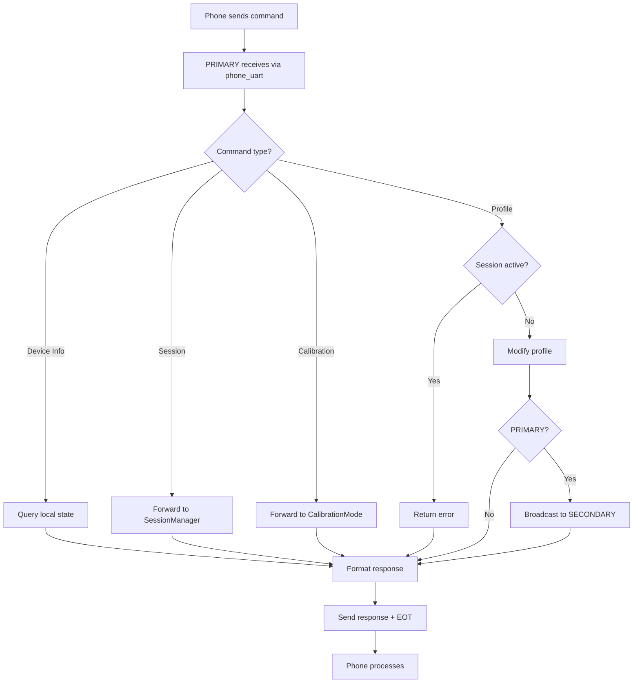

# BlueBuzzah Command Reference
**BLE Protocol Version:** 2.0.0
**Platform:** Arduino C++ / PlatformIO
**Implementation:** MenuController (src/menu_controller.cpp)

---

## Table of Contents

1. [Protocol Overview](#protocol-overview)
2. [Command Categories](#command-categories)
3. [Device Information Commands](#device-information-commands)
4. [Therapy Profile Commands](#therapy-profile-commands)
5. [Session Control Commands](#session-control-commands)
6. [Parameter Commands](#parameter-commands)
7. [Calibration Commands](#calibration-commands)
8. [System Commands](#system-commands)
9. [Internal PRIMARY↔SECONDARY Commands](#internal-primarysecondary-commands)
10. [Legacy Single-Character Commands](#legacy-single-character-commands)
11. [Response Format](#response-format)
12. [Error Codes](#error-codes)

---

## Terminology Note

This document uses the following device role terminology:
- **PRIMARY**: Receives phone commands, forwards to SECONDARY
- **SECONDARY**: Receives commands only via PRIMARY

Both devices run identical firmware and advertise as "BlueBuzzah". Role is determined by `settings.json` configuration.

---

> **See Also**: [BLE Protocol](BLE_PROTOCOL.md) for mobile app developer documentation including connection setup, timing specifications, parsing examples, and troubleshooting.

This document provides **firmware implementation details** with code line references. For client-side (mobile app) documentation, refer to the BLE Protocol guide.

---

## Protocol Overview

### Message Format

**Command** (Phone → PRIMARY via BLE):
```text
COMMAND_NAME:ARG1:ARG2:...\x04
```

**Command** (Terminal → PRIMARY via Serial):
```text
COMMAND_NAME:ARG1:ARG2:...\n
```

**Response** (PRIMARY → Phone/Terminal):
```text
KEY1:VALUE1\n
KEY2:VALUE2\n
\x04
```

**Rules**:
- **BLE commands** end with `\x04` (EOT character)
- **Serial commands** end with `\n` (newline)
- Arguments separated by `:` (colon)
- Responses are KEY:VALUE pairs (one per line)
- Responses always end with `\x04` (EOT character)
- Errors: First line is `ERROR:description`

### Connection Model

```text
[Smartphone] ──BLE UART──> [PRIMARY] ──BLE UART──> [SECONDARY]
                            │
                            ├── phone_uart: Smartphone commands
                            └── secondary_uart: SECONDARY synchronization
```

**Important**:
- Mobile apps **only connect to PRIMARY**
- PRIMARY automatically communicates with SECONDARY
- SECONDARY is never directly accessible to phone

### Command Processing Flow



---

## Command Categories

### Summary Table

| Category | Commands | Status |
|----------|----------|--------|
| Device Information | INFO, BATTERY, PING | ✅ Implemented |
| Therapy Profiles | PROFILE_LIST, PROFILE_LOAD, PROFILE_GET, PROFILE_CUSTOM | ✅ Implemented |
| Session Control | SESSION_START, SESSION_PAUSE, SESSION_RESUME, SESSION_STOP, SESSION_STATUS | ✅ Implemented |
| Parameter Adjustment | PARAM_SET | ✅ Implemented |
| Calibration | CALIBRATE_START, CALIBRATE_BUZZ, CALIBRATE_STOP | ✅ Implemented |
| System | HELP, RESTART | ✅ Implemented |
| Internal (PRIMARY↔SECONDARY) | PARAM_UPDATE, GET_BATTERY | ✅ Implemented |

**Total Commands**: 18 user-facing + 2 internal = 20 commands

---

## Device Information Commands

### INFO

Get comprehensive device information.

**Request**:
```
INFO\n
```

**Response**:
```text
ROLE:PRIMARY\n
NAME:BlueBuzzah\n
FW:1.0.0\n
BATP:3.72\n
BATS:3.68\n
STATUS:IDLE\n
\x04
```

**Fields**:
- `ROLE`: PRIMARY or SECONDARY
- `NAME`: BLE device name (BlueBuzzah)
- `FW`: Firmware version
- `BATP`: Primary glove voltage (PRIMARY local reading)
- `BATS`: Secondary glove voltage (queried from SECONDARY via GET_BATTERY)
- `STATUS`: IDLE | RUNNING | PAUSED

**Implementation** (menu_controller.cpp):

```cpp
void MenuController::cmdInfo() {
    // Query local battery
    float primaryVoltage = hardware_.getBatteryVoltage();

    // Query SECONDARY battery (PRIMARY only)
    float secondaryVoltage = 0.0f;
    if (role_ == DeviceRole::PRIMARY && ble_.isSecondaryConnected()) {
        secondaryVoltage = ble_.querySecondaryBattery(1000);  // 1 second timeout
    }

    // Get session status
    const char* sessionState = "IDLE";
    if (stateMachine_) {
        TherapyState state = stateMachine_->getCurrentState();
        sessionState = stateMachine_->stateToString(state);
    }

    // Format and send response
    String response = "ROLE:";
    response += (role_ == DeviceRole::PRIMARY) ? "PRIMARY" : "SECONDARY";
    response += "\nNAME:";
    response += BLE_NAME;
    response += "\nFW:2.0.0";
    response += "\nBATP:";
    response += String(primaryVoltage, 2);
    response += "\nBATS:";
    response += (secondaryVoltage > 0) ? String(secondaryVoltage, 2) : "N/A";
    response += "\nSTATUS:";
    response += sessionState;
    response += "\n\x04";

    ble_.sendToPhone(response);
}
```

**Timing**: 100-1100ms (includes SECONDARY battery query with 1s timeout)

---

### BATTERY

Get battery voltage for both gloves.

**Request**:
```
BATTERY\n
```

**Response**:
```
BATP:3.72\n
BATS:3.68\n
\x04
```

**Battery Thresholds**:
- **Good**: >3.6V (green LED)
- **Medium**: 3.3-3.6V (orange LED)
- **Critical**: <3.3V (red LED, therapy blocked)

**Implementation** (menu_controller.cpp):

```cpp
void MenuController::cmdBattery() {
    // Query local PRIMARY battery
    float primaryVoltage = hardware_.getBatteryVoltage();

    // Query SECONDARY battery (if PRIMARY and SECONDARY connected)
    float secondaryVoltage = 0.0f;
    if (role_ == DeviceRole::PRIMARY && ble_.isSecondaryConnected()) {
        secondaryVoltage = ble_.querySecondaryBattery(1000);  // 1 second timeout
    }

    // Format response
    String response = "BATP:";
    response += (primaryVoltage > 0) ? String(primaryVoltage, 2) : "N/A";
    response += "\nBATS:";
    response += (secondaryVoltage > 0) ? String(secondaryVoltage, 2) : "N/A";
    response += "\n\x04";

    ble_.sendToPhone(response);
}
```

**SECONDARY Query Process** (ble_manager.cpp):

```cpp
float BLEManager::querySecondaryBattery(uint32_t timeoutMs) {
    /**
     * Query SECONDARY battery voltage (PRIMARY only).
     *
     * Protocol:
     *     PRIMARY → SECONDARY: GET_BATTERY\n
     *     SECONDARY → PRIMARY: BAT_RESPONSE:3.68\n
     *
     * Returns:
     *     float: Voltage or 0.0 on timeout
     */
    if (!isSecondaryConnected()) {
        return 0.0f;
    }

    // Send query
    sendToSecondary("GET_BATTERY\n");

    // Wait for response
    uint32_t startTime = millis();
    while ((millis() - startTime) < timeoutMs) {
        if (hasSecondaryMessage()) {
            String message = readSecondaryMessage();
            if (message.startsWith("BAT_RESPONSE:")) {
                String voltageStr = message.substring(13);
                return voltageStr.toFloat();
            }
        }
        delay(10);
    }

    // Timeout
    return 0.0f;
}
```

**Timing**: 100-1100ms

---

### PING

Connection test for latency measurement.

**Request**:
```
PING\n
```

**Response**:
```
PONG\n
\x04
```

**Implementation** (menu_controller.cpp):

```cpp
void MenuController::cmdPing() {
    ble_.sendToPhone("PONG\n\x04");
}
```

**Use Case**: Measure BLE round-trip latency

**Timing**: <50ms

---

## Therapy Profile Commands

### PROFILE_LIST

List available therapy profiles.

**Request**:
```
PROFILE_LIST\n
```

**Response**:
```
PROFILE:1:Regular VCR\n
PROFILE:2:Noisy VCR\n
PROFILE:3:Hybrid VCR\n
\x04
```

**Implementation** (menu_controller.cpp):

```cpp
void MenuController::cmdProfileList() {
    if (!profileManager_) {
        sendError("Profile manager not initialized");
        return;
    }

    // Get list of profiles and format response
    String response = "";
    const ProfileInfo* profiles = profileManager_->getProfileList();
    uint8_t count = profileManager_->getProfileCount();

    for (uint8_t i = 0; i < count; i++) {
        response += "PROFILE:";
        response += String(profiles[i].id);
        response += ":";
        response += profiles[i].name;
        response += "\n";
    }
    response += "\x04";

    ble_.sendToPhone(response);
}
```

**Timing**: <50ms

---

### PROFILE_LOAD

Load therapy profile by ID.

**Request**:
```
PROFILE_LOAD:2\n
```

**Parameters**:
- 1 = Regular VCR
- 2 = Noisy VCR (default)
- 3 = Hybrid VCR

**Response (Success)**:
```
STATUS:LOADED\n
PROFILE:Noisy VCR\n
\x04
```

**Response (Error - Invalid ID)**:
```
ERROR:Invalid profile ID\n
\x04
```

**Response (Error - Session Active)**:
```
ERROR:Cannot modify parameters during active session\n
\x04
```

**Implementation** (menu_controller.cpp):

```cpp
void MenuController::cmdProfileLoad(uint8_t profileId) {
    // 1. Check if session is active
    if (stateMachine_ && stateMachine_->isSessionActive()) {
        sendError("Cannot modify parameters during active session");
        return;
    }

    // 2. Validate profile ID (1-3)
    if (profileId < 1 || profileId > 3) {
        sendError("Invalid profile ID");
        return;
    }

    // 3. Load profile
    if (!profileManager_->loadProfile(profileId)) {
        sendError("Failed to load profile");
        return;
    }

    // 4. Send success response
    String response = "STATUS:LOADED\nPROFILE:";
    response += profileManager_->getCurrentProfileName();
    response += "\n\x04";
    ble_.sendToPhone(response);

    // 5. Broadcast ALL parameters to SECONDARY
    if (role_ == DeviceRole::PRIMARY) {
        broadcastParamUpdate(profileManager_->getCurrentParams());
    }
}
```

**Parameter Broadcast** (menu_controller.cpp):

```cpp
void MenuController::broadcastParamUpdate(const TherapyParams& params) {
    /**
     * Broadcast parameters to SECONDARY.
     *
     * Protocol: PARAM_UPDATE:KEY1:VALUE1:KEY2:VALUE2:...\n
     *
     * Example:
     *     {ON: 0.150, JITTER: 10}
     *     → PARAM_UPDATE:ON:0.150:JITTER:10\n
     */
    String cmd = "PARAM_UPDATE";
    cmd += ":ON:";
    cmd += String(params.timeOnMs / 1000.0f, 3);
    cmd += ":OFF:";
    cmd += String(params.timeOffMs / 1000.0f, 3);
    cmd += ":FREQ:";
    cmd += String(params.frequency);
    cmd += ":VOLT:";
    cmd += String(params.voltage, 3);
    cmd += ":JITTER:";
    cmd += String(params.jitter, 1);
    cmd += ":MIRROR:";
    cmd += params.mirror ? "1" : "0";
    cmd += "\n";

    ble_.sendToSecondary(cmd);
}
```

**Timing**: 50-250ms (includes SECONDARY sync)

**Restrictions**:
- Cannot load during active session
- Must call SESSION_STOP first

---

### PROFILE_GET

Get current profile settings.

**Request**:
```
PROFILE_GET\n
```

**Response**:
```
TYPE:LRA\n
FREQ:250\n
VOLT:2.500\n
ON:0.100\n
OFF:0.067\n
SESSION:120\n
AMPMIN:100\n
AMPMAX:100\n
PATTERN:RNDP\n
MIRROR:True\n
JITTER:23.5\n
\x04
```

**Implementation** (menu_controller.cpp):

```cpp
void MenuController::cmdProfileGet() {
    if (!profileManager_) {
        sendError("Profile manager not initialized");
        return;
    }

    // Get all parameters and format response
    const TherapyParams& params = profileManager_->getCurrentParams();

    String response = "TYPE:LRA\n";
    response += "FREQ:";
    response += String(params.frequency);
    response += "\nVOLT:";
    response += String(params.voltage, 3);
    response += "\nON:";
    response += String(params.timeOnMs / 1000.0f, 3);
    response += "\nOFF:";
    response += String(params.timeOffMs / 1000.0f, 3);
    response += "\nSESSION:";
    response += String(params.sessionDurationMin);
    response += "\nAMPMIN:";
    response += String(params.amplitudeMin);
    response += "\nAMPMAX:";
    response += String(params.amplitudeMax);
    response += "\nPATTERN:";
    response += patternToString(params.pattern);
    response += "\nMIRROR:";
    response += params.mirror ? "True" : "False";
    response += "\nJITTER:";
    response += String(params.jitter, 1);
    response += "\n\x04";

    ble_.sendToPhone(response);
}
```

**Timing**: <50ms

---

### PROFILE_CUSTOM

Set custom therapy parameters (on-the-fly profile creation).

**Request**:
```
PROFILE_CUSTOM:ON:0.150:OFF:0.080:FREQ:210:JITTER:10\n
```

**Valid Parameters**:
- `ON` (0.050-0.500 seconds) - Buzz on time
- `OFF` (0.020-0.200 seconds) - Buzz off time
- `FREQ` (150-300 Hz) - Actuator frequency
- `VOLT` (1.0-3.3 V) - Actuator voltage
- `AMPMIN` (0-100%) - Minimum amplitude
- `AMPMAX` (0-100%) - Maximum amplitude
- `JITTER` (0-50%) - Pattern jitter percentage
- `MIRROR` (0 or 1 for False/True) - Mirror mode
- `SESSION` (1-180 minutes) - Session duration

**Response (Success)**:
```
STATUS:CUSTOM_LOADED\n
ON:0.150\n
OFF:0.080\n
FREQ:210\n
JITTER:10\n
\x04
```

**Response (Error)**:
```
ERROR:Invalid parameter name: FOO\n
\x04
```

**Implementation** (menu_controller.cpp):

```cpp
void MenuController::cmdProfileCustom(const String& args) {
    // 1. Check if session is active
    if (stateMachine_ && stateMachine_->isSessionActive()) {
        sendError("Cannot modify parameters during active session");
        return;
    }

    // 2. Parse key:value pairs from colon-delimited string
    // args format: "ON:0.150:OFF:0.080:JITTER:10"
    TherapyParams params = profileManager_->getCurrentParams();
    String appliedParams = "";

    int startIdx = 0;
    while (startIdx < args.length()) {
        int keyEnd = args.indexOf(':', startIdx);
        if (keyEnd < 0) break;

        int valueEnd = args.indexOf(':', keyEnd + 1);
        if (valueEnd < 0) valueEnd = args.length();

        String key = args.substring(startIdx, keyEnd);
        String value = args.substring(keyEnd + 1, valueEnd);

        // Apply parameter and track what was changed
        if (applyParameter(params, key, value)) {
            appliedParams += key + ":" + value + "\n";
        } else {
            sendError("Invalid parameter: " + key);
            return;
        }

        startIdx = valueEnd + 1;
    }

    // 3. Save updated parameters
    profileManager_->setCurrentParams(params);

    // 4. Send success response
    String response = "STATUS:CUSTOM_LOADED\n";
    response += appliedParams;
    response += "\x04";
    ble_.sendToPhone(response);

    // 5. Broadcast changed parameters to SECONDARY
    if (role_ == DeviceRole::PRIMARY) {
        broadcastParamUpdate(params);
    }
}
```

**Key Feature**: Only include parameters you want to change. Omitted parameters use current values.

**Timing**: 50-250ms (includes SECONDARY sync)

---

## Session Control Commands

### SESSION_START

Start therapy session.

**Request**:
```
SESSION_START\n
```

**Response (Success)**:
```
SESSION_STATUS:RUNNING\n
\x04
```

**Response (Error - SECONDARY Not Connected)**:
```text
ERROR:SECONDARY not connected\n
\x04
```

**Response (Error - Low Battery)**:
```
ERROR:Battery too low\n
\x04
```

**Implementation** (menu_controller.cpp):

```cpp
void MenuController::cmdSessionStart() {
    if (!stateMachine_) {
        sendError("State machine not initialized");
        return;
    }

    // 1. Check prerequisites
    if (role_ == DeviceRole::PRIMARY && !ble_.isSecondaryConnected()) {
        sendError("SECONDARY not connected");
        return;
    }

    // Check battery (both gloves)
    float vlVoltage = hardware_.getBatteryVoltage();
    if (vlVoltage < 3.3f) {
        sendError("Battery too low (PRIMARY)");
        return;
    }

    if (role_ == DeviceRole::PRIMARY) {
        float vrVoltage = ble_.querySecondaryBattery(1000);
        if (vrVoltage > 0 && vrVoltage < 3.3f) {
            sendError("Battery too low (SECONDARY)");
            return;
        }
    }

    // 2. Start session via state machine
    const TherapyParams& params = profileManager_->getCurrentParams();
    if (!stateMachine_->startSession(params)) {
        sendError("Failed to start session");
        return;
    }

    // 3. Send success response
    ble_.sendToPhone("SESSION_STATUS:RUNNING\n\x04");
}
```

**Timing**: 100-500ms (includes battery checks + SECONDARY handshake)

**Prerequisites**:
- SECONDARY must be connected (PRIMARY only)
- Both batteries >3.3V
- No session already running

---

### SESSION_PAUSE

Pause active session.

**Request**:
```
SESSION_PAUSE\n
```

**Response (Success)**:
```
SESSION_STATUS:PAUSED\n
\x04
```

**Response (Error)**:
```
ERROR:No active session\n
\x04
```

**Implementation** (menu_controller.cpp):

```cpp
void MenuController::cmdSessionPause() {
    if (!stateMachine_) {
        sendError("State machine not initialized");
        return;
    }

    if (!stateMachine_->pauseSession()) {
        sendError("No active session");
        return;
    }

    ble_.sendToPhone("SESSION_STATUS:PAUSED\n\x04");
}
```

**Timing**: <50ms

**Effect**:
- Motors immediately stop
- Timer paused (elapsed time frozen)
- LED flashes yellow
- Session can be resumed later

---

### SESSION_RESUME

Resume paused session.

**Request**:
```
SESSION_RESUME\n
```

**Response (Success)**:
```
SESSION_STATUS:RUNNING\n
\x04
```

**Response (Error)**:
```
ERROR:No paused session\n
\x04
```

**Implementation** (menu_controller.cpp):

```cpp
void MenuController::cmdSessionResume() {
    if (!stateMachine_) {
        sendError("State machine not initialized");
        return;
    }

    if (!stateMachine_->resumeSession()) {
        sendError("No paused session");
        return;
    }

    ble_.sendToPhone("SESSION_STATUS:RUNNING\n\x04");
}
```

**Timing**: <50ms

**Effect**:
- Therapy resumes from paused state
- Timer continues from previous elapsed time
- Motors reactivate

---

### SESSION_STOP

Stop active session (graceful termination).

**Request**:
```
SESSION_STOP\n
```

**Response**:
```
SESSION_STATUS:IDLE\n
\x04
```

**Implementation** (menu_controller.cpp):

```cpp
void MenuController::cmdSessionStop() {
    if (!stateMachine_) {
        sendError("State machine not initialized");
        return;
    }

    stateMachine_->stopSession();
    ble_.sendToPhone("SESSION_STATUS:IDLE\n\x04");
}
```

**Timing**: <50ms

**Effect**:
- Therapy stops immediately
- Motors off
- Session cleared (cannot resume)
- Allows profile changes

---

### SESSION_STATUS

Get current session status and progress.

**Request**:
```
SESSION_STATUS\n
```

**Response (IDLE)**:
```
SESSION_STATUS:IDLE\n
ELAPSED:0\n
TOTAL:0\n
PROGRESS:0\n
\x04
```

**Response (RUNNING)**:
```
SESSION_STATUS:RUNNING\n
ELAPSED:300\n
TOTAL:7200\n
PROGRESS:4\n
\x04
```

**Response (PAUSED)**:
```
SESSION_STATUS:PAUSED\n
ELAPSED:1500\n
TOTAL:7200\n
PROGRESS:21\n
\x04
```

**Fields**:
- `SESSION_STATUS`: IDLE | RUNNING | PAUSED
- `ELAPSED`: Seconds elapsed (excludes pause time)
- `TOTAL`: Total session duration in seconds
- `PROGRESS`: Percentage (0-100)

**Implementation** (menu_controller.cpp):

```cpp
void MenuController::cmdSessionStatus() {
    if (!stateMachine_) {
        sendError("State machine not initialized");
        return;
    }

    SessionStatus status = stateMachine_->getSessionStatus();

    String response = "SESSION_STATUS:";
    response += stateMachine_->stateToString(status.state);
    response += "\nELAPSED:";
    response += String(status.elapsedSeconds);
    response += "\nTOTAL:";
    response += String(status.totalSeconds);
    response += "\nPROGRESS:";
    response += String(status.progressPercent);
    response += "\n\x04";

    ble_.sendToPhone(response);
}
```

**Timing**: <50ms

**Use Case**: Poll every 1-5 seconds for UI progress bar updates

---

## Parameter Commands

### PARAM_SET

Set individual therapy parameter (alternative to PROFILE_CUSTOM for single changes).

**Request**:
```
PARAM_SET:ON:0.150\n
```

**Response (Success)**:
```
PARAM:ON\n
VALUE:0.150\n
\x04
```

**Response (Error)**:
```
ERROR:Value out of range\n
\x04
```

**Implementation** (menu_controller.cpp):

```cpp
void MenuController::cmdParamSet(const String& key, const String& value) {
    // 1. Check if session is active
    if (stateMachine_ && stateMachine_->isSessionActive()) {
        sendError("Cannot modify parameters during active session");
        return;
    }

    // 2. Get current params and apply single parameter
    TherapyParams params = profileManager_->getCurrentParams();

    if (!applyParameter(params, key, value)) {
        sendError("Invalid parameter or value");
        return;
    }

    // 3. Save updated parameters
    profileManager_->setCurrentParams(params);

    // 4. Send success response
    String response = "PARAM:";
    response += key;
    response += "\nVALUE:";
    response += value;
    response += "\n\x04";
    ble_.sendToPhone(response);

    // 5. Broadcast single parameter to SECONDARY
    if (role_ == DeviceRole::PRIMARY) {
        broadcastParamUpdate(params);
    }
}
```

**Timing**: 50-250ms (includes SECONDARY sync)

**Note**: Use `PROFILE_CUSTOM` for multiple parameters, `PARAM_SET` for single parameter changes.

---

## Calibration Commands

### CALIBRATE_START

Enter calibration mode.

**Request**:
```
CALIBRATE_START\n
```

**Response**:
```
MODE:CALIBRATION\n
\x04
```

**Implementation** (menu_controller.cpp):

```cpp
void MenuController::cmdCalibrateStart() {
    if (stateMachine_ && stateMachine_->isSessionActive()) {
        sendError("Cannot enter calibration during active session");
        return;
    }

    calibrationMode_ = true;
    ble_.sendToPhone("MODE:CALIBRATION\n\x04");
}
```

**Timing**: <50ms

**Effect**: Enable motor testing mode

---

### CALIBRATE_BUZZ

Test individual finger motor.

**Request**:
```
CALIBRATE_BUZZ:0:80:500\n
```

**Parameters**:
- **Finger**: 0-7
  - 0-3: PRIMARY glove - Thumb, Index, Middle, Ring
  - 4-7: SECONDARY glove - Thumb, Index, Middle, Ring
- **Intensity**: 0-100 (percentage)
- **Duration**: 50-2000 (milliseconds)

**Response (Success)**:
```
FINGER:0\n
INTENSITY:80\n
DURATION:500\n
\x04
```

**Response (Error - Not in Calibration)**:
```
ERROR:Not in calibration mode\n
\x04
```

**Response (Error - Invalid Finger)**:
```
ERROR:Invalid finger index (must be 0-7)\n
\x04
```

**Implementation** (menu_controller.cpp):

```cpp
void MenuController::cmdCalibrateBuzz(uint8_t finger, uint8_t intensity, uint16_t durationMs) {
    if (!calibrationMode_) {
        sendError("Not in calibration mode");
        return;
    }

    // 1. Validate parameters
    if (finger > 7) {
        sendError("Invalid finger index (must be 0-7)");
        return;
    }

    if (intensity > 100) {
        sendError("Invalid intensity (must be 0-100)");
        return;
    }

    if (durationMs < 50 || durationMs > 2000) {
        sendError("Invalid duration (must be 50-2000ms)");
        return;
    }

    // 2. Execute buzz (relay to SECONDARY if finger 4-7)
    if (finger >= 4 && role_ == DeviceRole::PRIMARY) {
        // Relay to SECONDARY for fingers 4-7
        String cmd = "CALIBRATE_BUZZ:";
        cmd += String(finger);
        cmd += ":";
        cmd += String(intensity);
        cmd += ":";
        cmd += String(durationMs);
        cmd += "\n";
        ble_.sendToSecondary(cmd);
    } else {
        // Execute locally for fingers 0-3
        uint8_t localFinger = finger % 4;
        hardware_.buzzFinger(localFinger, intensity, durationMs);
    }

    // 3. Send success response
    String response = "FINGER:";
    response += String(finger);
    response += "\nINTENSITY:";
    response += String(intensity);
    response += "\nDURATION:";
    response += String(durationMs);
    response += "\n\x04";

    ble_.sendToPhone(response);
}
```

**Timing**: 50-2050ms (depends on duration parameter)

**PRIMARY→SECONDARY Relay** (for fingers 4-7):

```cpp
// PRIMARY automatically relays to SECONDARY
if (finger >= 4) {
    String cmd = "CALIBRATE_BUZZ:" + String(finger) + ":" +
                 String(intensity) + ":" + String(durationMs) + "\n";
    ble_.sendToSecondary(cmd);
    // SECONDARY executes and responds
}
```

---

### CALIBRATE_STOP

Exit calibration mode.

**Request**:
```
CALIBRATE_STOP\n
```

**Response**:
```
MODE:NORMAL\n
\x04
```

**Implementation** (menu_controller.cpp):

```cpp
void MenuController::cmdCalibrateStop() {
    calibrationMode_ = false;
    ble_.sendToPhone("MODE:NORMAL\n\x04");
}
```

**Timing**: <50ms

---

## System Commands

### HELP

List available commands.

**Request**:
```
HELP\n
```

**Response**:
```
COMMAND:INFO\n
COMMAND:BATTERY\n
COMMAND:PING\n
COMMAND:PROFILE_LIST\n
COMMAND:PROFILE_LOAD\n
COMMAND:PROFILE_GET\n
COMMAND:PROFILE_CUSTOM\n
COMMAND:SESSION_START\n
COMMAND:SESSION_PAUSE\n
COMMAND:SESSION_RESUME\n
COMMAND:SESSION_STOP\n
COMMAND:SESSION_STATUS\n
COMMAND:PARAM_SET\n
COMMAND:CALIBRATE_START\n
COMMAND:CALIBRATE_BUZZ\n
COMMAND:CALIBRATE_STOP\n
COMMAND:RESTART\n
COMMAND:HELP\n
\x04
```

**Implementation** (menu_controller.cpp):

```cpp
void MenuController::cmdHelp() {
    // List all available commands
    static const char* commands[] = {
        "INFO", "BATTERY", "PING",
        "PROFILE_LIST", "PROFILE_LOAD", "PROFILE_GET", "PROFILE_CUSTOM",
        "SESSION_START", "SESSION_PAUSE", "SESSION_RESUME", "SESSION_STOP", "SESSION_STATUS",
        "PARAM_SET",
        "CALIBRATE_START", "CALIBRATE_BUZZ", "CALIBRATE_STOP",
        "RESTART", "HELP"
    };

    String response = "";
    for (uint8_t i = 0; i < sizeof(commands) / sizeof(commands[0]); i++) {
        response += "COMMAND:";
        response += commands[i];
        response += "\n";
    }
    response += "\x04";

    ble_.sendToPhone(response);
}
```

**Timing**: <50ms

---

### RESTART

Reboot glove to menu mode.

**Request**:
```
RESTART\n
```

**Response**:
```
STATUS:REBOOTING\n
\x04
```

**Implementation** (menu_controller.cpp):

```cpp
void MenuController::cmdRestart() {
    ble_.sendToPhone("STATUS:REBOOTING\n\x04");

    // Give time for response to send
    delay(500);

    // Reboot via NVIC system reset
    NVIC_SystemReset();
}
```

**Timing**: 500ms + reboot time (~2-5 seconds)

**Note**: BLE connection will drop after this command

---

## Internal PRIMARY↔SECONDARY Commands

### PARAM_UPDATE

Broadcast parameter changes from PRIMARY to SECONDARY.

**Direction**: PRIMARY → SECONDARY (internal only, not user-facing)

**Format**:
```
PARAM_UPDATE:KEY1:VALUE1:KEY2:VALUE2:...\n
```

**Example**:
```
PARAM_UPDATE:ON:0.150:OFF:0.080:JITTER:10\n
```

**SECONDARY Handler** (menu_controller.cpp):

```cpp
void MenuController::handleParamUpdate(const String& args) {
    // 1. Parse args into key:value pairs
    // args = "ON:0.150:OFF:0.080:JITTER:10"
    TherapyParams params = profileManager_->getCurrentParams();

    int startIdx = 0;
    while (startIdx < args.length()) {
        int keyEnd = args.indexOf(':', startIdx);
        if (keyEnd < 0) break;

        int valueEnd = args.indexOf(':', keyEnd + 1);
        if (valueEnd < 0) valueEnd = args.length();

        String key = args.substring(startIdx, keyEnd);
        String value = args.substring(keyEnd + 1, valueEnd);

        applyParameter(params, key, value);
        startIdx = valueEnd + 1;
    }

    // 2. Apply parameters
    profileManager_->setCurrentParams(params);

    // 3. Send acknowledgment
    ble_.sendToPrimary("ACK_PARAM_UPDATE\n");
}
```

**Timing**: 50-100ms

**Note**: No `\x04` terminator (internal message)

---

### GET_BATTERY

Query SECONDARY battery voltage (PRIMARY → SECONDARY).

**Direction**: PRIMARY → SECONDARY

**Format**:
```
GET_BATTERY\n
```

**SECONDARY Response**:
```
BAT_RESPONSE:3.68\n
```

**SECONDARY Handler** (menu_controller.cpp):

```cpp
void MenuController::handleBatteryQuery() {
    // Query local battery
    float voltage = hardware_.getBatteryVoltage();

    // Send response
    String response = "BAT_RESPONSE:";
    response += String(voltage, 2);
    response += "\n";
    ble_.sendToPrimary(response);
}
```

**Timing**: 10-50ms

**Note**: Can be received during active therapy (handled inline in `receive_execute_buzz`)

---

## Legacy Single-Character Commands

For backward compatibility with BLE terminal apps.

| Old | New Equivalent | Description |
|-----|----------------|-------------|
| `g` | `BATTERY` | Check battery |
| `v` | `PROFILE_GET` | View settings |
| `1` | `PROFILE_LOAD:1` | Load Regular VCR |
| `2` | `PROFILE_LOAD:2` | Load Noisy VCR (default) |
| `3` | `PROFILE_LOAD:3` | Load Hybrid VCR |
| `c` | `CALIBRATE_START` | Enter calibration |
| `r` | `RESTART` | Restart glove |

**Implementation** (menu_controller.cpp):

```cpp
// Legacy command map for single-character shortcuts
const char* MenuController::mapLegacyCommand(const String& cmd) {
    if (cmd.length() != 1) return nullptr;

    switch (cmd.charAt(0)) {
        case 'g': return "BATTERY";
        case 'v': return "PROFILE_GET";
        case '1': return "PROFILE_LOAD:1";
        case '2': return "PROFILE_LOAD:2";
        case '3': return "PROFILE_LOAD:3";
        case 'c': return "CALIBRATE_START";
        case 'r': return "RESTART";
        default:  return nullptr;
    }
}

// Command processing
void MenuController::processCommand(const String& rawCmd) {
    String cmd = rawCmd;
    const char* mapped = mapLegacyCommand(cmd);
    if (mapped) {
        cmd = mapped;
    }
    // Continue with normal command processing...
}
```

**Note**: All legacy commands work with modern response format (KEY:VALUE with `\x04`)

---

## Response Format

### Success Response Structure

**Format**:
```
KEY1:VALUE1\n
KEY2:VALUE2\n
...\n
\x04
```

**Example**:
```cpp
// C++
String response = "STATUS:LOADED\nPROFILE:Noisy VCR\n\x04";
ble_.sendToPhone(response);

// BLE transmission
// "STATUS:LOADED\nPROFILE:Noisy VCR\n\x04"
```

**Response Formatter** (menu_controller.cpp):

```cpp
void MenuController::sendResponse(const String& key, const String& value) {
    /**
     * Format and send KEY:VALUE response with EOT terminator.
     */
    String response = key + ":" + value + "\n\x04";
    ble_.sendToPhone(response);
}

void MenuController::sendMultiResponse(const char* keys[], const String values[], uint8_t count) {
    /**
     * Format and send multiple KEY:VALUE pairs with EOT terminator.
     */
    String response = "";
    for (uint8_t i = 0; i < count; i++) {
        response += keys[i];
        response += ":";
        response += values[i];
        response += "\n";
    }
    response += "\x04";
    ble_.sendToPhone(response);
}
```

---

### Error Response Structure

**Format**:
```
ERROR:description\n
\x04
```

**Example**:
```cpp
sendError("Invalid profile ID");

// BLE transmission
// "ERROR:Invalid profile ID\n\x04"
```

**Error Formatter** (menu_controller.cpp):

```cpp
void MenuController::sendError(const char* errorMessage) {
    /**
     * Format and send error response.
     *
     * Args:
     *     errorMessage: Error description string
     */
    String response = "ERROR:";
    response += errorMessage;
    response += "\n\x04";
    ble_.sendToPhone(response);
}

void MenuController::sendError(const String& errorMessage) {
    /**
     * Overload for String error messages.
     */
    sendError(errorMessage.c_str());
}
```

---

## Error Codes

### Common Error Messages

| Error | Cause | Resolution |
|-------|-------|------------|
| `ERROR:Unknown command` | Invalid command name | Check HELP for valid commands |
| `ERROR:Invalid profile ID` | Profile ID not 1-3 | Use PROFILE_LIST to see valid IDs |
| `ERROR:SECONDARY not connected` | SECONDARY not paired | Connect SECONDARY glove before SESSION_START |
| `ERROR:Battery too low` | Voltage <3.3V | Charge glove(s) |
| `ERROR:No active session` | No session running | Start session first |
| `ERROR:Cannot modify during active session` | Profile change during therapy | Stop session first |
| `ERROR:Invalid parameter name` | Unknown parameter key | Check PROFILE_GET for valid keys |
| `ERROR:Value out of range` | Parameter value invalid | See parameter ranges |
| `ERROR:Not in calibration mode` | Calibration not active | Send CALIBRATE_START first |
| `ERROR:Invalid finger index` | Finger not 0-7 | Valid range: 0-7 |
| `ERROR:Profile manager not initialized` | System initialization failure | Restart device |

### Error Handling Best Practices

**Phone App Implementation**:

```csharp
void ProcessResponse(Dictionary<string, string> data) {
    // 1. Check for error first
    if (data.ContainsKey("ERROR")) {
        string errorMessage = data["ERROR"];
        ShowErrorDialog(errorMessage);
        return;
    }

    // 2. Process successful response
    if (data.ContainsKey("SESSION_STATUS")) {
        UpdateSessionUI(data);
    }
    else if (data.ContainsKey("BATP")) {
        UpdateBatteryDisplay(data);
    }
    // ... other response handlers
}
```

---

## Message Interleaving (Phone Perspective)

**Problem**: Phone may receive internal PRIMARY↔SECONDARY messages during therapy.

**Example RX Stream**:
```text
PONG\n\x04                           ← Response to PING
BUZZ:42:5000000:0|100\n              ← PRIMARY→SECONDARY internal (NO EOT)
BATP:3.72\nBATS:3.68\n\x04           ← Response to BATTERY
BUZZED:42\n                          ← SECONDARY→PRIMARY internal (NO EOT)
BUZZ:43:5200000:1|100\n              ← PRIMARY→SECONDARY internal (NO EOT)
SESSION_STATUS:RUNNING\n...\n\x04    ← Response to SESSION_STATUS
PARAM_UPDATE:ON:0.150\n              ← PRIMARY→SECONDARY internal (NO EOT)
```

**Filtering Strategy** (C# example):

```csharp
private Dictionary<string, string> dataCache = new Dictionary<string, string>();

void OnBleNotification(byte[] data) {
    string message = Encoding.UTF8.GetString(data);

    // Filter internal messages: NO \x04 terminator
    if (!message.Contains("\x04")) {
        // Ignore: BUZZ, BUZZED, PARAM_UPDATE, GET_BATTERY, etc.
        return;
    }

    // Parse KEY:VALUE lines
    var lines = message.Split('\n');
    foreach (var line in lines) {
        if (line == "\x04") {
            // Response complete
            ProcessResponse(dataCache);
            dataCache.Clear();
            return;
        }

        var parts = line.Split(':', 2);
        if (parts.Length == 2) {
            dataCache[parts[0]] = parts[1];
        }
    }
}
```

**Internal Messages to Ignore**:
- `BUZZ:seq:ts:finger|amplitude`
- `BUZZED:seq`
- `PARAM_UPDATE:KEY:VAL:...`
- `GET_BATTERY`
- `BAT_RESPONSE:V`
- `ACK_PARAM_UPDATE`
- `SEED:N`
- `SEED_ACK`

**Rule**: If no `\x04` terminator, ignore message.

---

---

**Document Maintenance:**
Update this document when:
- Adding new BLE protocol commands
- Modifying response formats
- Changing error messages
- Adding command restrictions
- Updating parameter ranges
