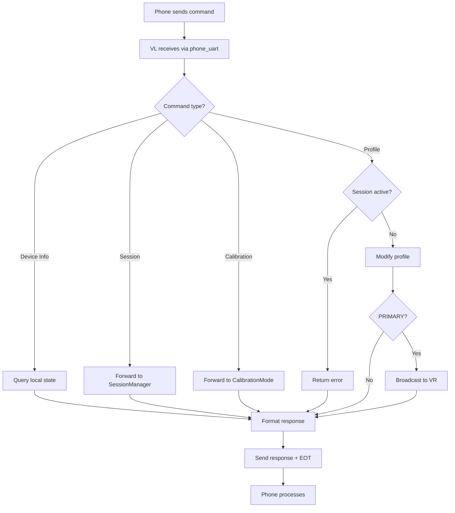

# BlueBuzzah Command Reference
**BLE Protocol Version:** 2.0.0
**Implementation:** MenuController (src/modules/menu_controller.py)

---

## Table of Contents

1. [Protocol Overview](#protocol-overview)
2. [Command Categories](#command-categories)
3. [Device Information Commands](#device-information-commands)
4. [Therapy Profile Commands](#therapy-profile-commands)
5. [Session Control Commands](#session-control-commands)
6. [Parameter Commands](#parameter-commands)
7. [Calibration Commands](#calibration-commands)
8. [System Commands](#system-commands)
9. [Internal VL↔VR Commands](#internal-vlvr-commands)
10. [Legacy Single-Character Commands](#legacy-single-character-commands)
11. [Response Format](#response-format)
12. [Error Codes](#error-codes)

---

## Protocol Overview

### Message Format

**Command** (Phone/Terminal → VL):
```
COMMAND_NAME:ARG1:ARG2:...\n
```

**Response** (VL → Phone):
```
KEY1:VALUE1\n
KEY2:VALUE2\n
\x04
```

**Rules**:
- Commands end with `\n` (newline)
- Arguments separated by `:` (colon)
- Responses are KEY:VALUE pairs (one per line)
- Responses end with `\x04` (EOT character)
- Errors: First line is `ERROR:description`
- All responses include `\x04` terminator

### Connection Model

```
[Smartphone] ──BLE UART──> [VL - PRIMARY] ──BLE UART──> [VR - SECONDARY]
                            │
                            ├── phone_uart: Smartphone commands
                            └── vr_uart: VR synchronization
```

**Important**:
- Mobile apps **only connect to VL (PRIMARY)**
- VL automatically communicates with VR
- VR is never directly accessible to phone

### Command Processing Flow



---

## Command Categories

### Summary Table

| Category | Commands | Status |
|----------|----------|--------|
| Device Information | INFO, BATTERY, PING | ✅ Implemented |
| Therapy Profiles | PROFILE_LIST, PROFILE_LOAD, PROFILE_GET, PROFILE_CUSTOM | ✅ Implemented |
| Session Control | SESSION_START, SESSION_PAUSE, SESSION_RESUME, SESSION_STOP, SESSION_STATUS | ✅ Implemented |
| Parameter Adjustment | PARAM_SET | ✅ Implemented |
| Calibration | CALIBRATE_START, CALIBRATE_BUZZ, CALIBRATE_STOP | ✅ Implemented |
| System | HELP, RESTART | ✅ Implemented |
| Internal (VL↔VR) | PARAM_UPDATE, GET_BATTERY | ✅ Implemented |

**Total Commands**: 18 user-facing + 2 internal = 20 commands

---

## Device Information Commands

### INFO

Get comprehensive device information.

**Request**:
```
INFO\n
```

**Response**:
```
ROLE:PRIMARY\n
NAME:VL\n
FW:1.0.0\n
BATP:3.72\n
BATS:3.68\n
STATUS:IDLE\n
\x04
```

**Fields**:
- `ROLE`: PRIMARY or SECONDARY
- `NAME`: BLE device name (VL or VR)
- `FW`: Firmware version
- `BATP`: Primary glove voltage (VL local reading)
- `BATS`: Secondary glove voltage (queried from VR via GET_BATTERY)
- `STATUS`: IDLE | RUNNING | PAUSED

**Implementation** (menu_controller.py:426-462):

```python
def _cmd_info(self):
    # Query local battery
    vl_voltage, _, _ = check_battery_voltage()

    # Query VR battery (PRIMARY only)
    if self.role == "PRIMARY":
        vr_voltage = self.ble.query_vr_battery(timeout=1.0)
    else:
        vr_voltage = None

    # Get session status
    if self.session_manager:
        status = self.session_manager.get_status()
        session_state = status["status"]
    else:
        session_state = "IDLE"

    # Format response
    response = {
        "ROLE": self.role,
        "NAME": BLE_NAME,
        "FW": "1.0.0",
        "BATP": f"{vl_voltage:.2f}" if vl_voltage else "N/A",
        "BATS": f"{vr_voltage:.2f}" if vr_voltage else "N/A",
        "STATUS": session_state
    }

    send_response(self.phone_uart, response)
```

**Timing**: 100-1100ms (includes VR battery query with 1s timeout)

---

### BATTERY

Get battery voltage for both gloves.

**Request**:
```
BATTERY\n
```

**Response**:
```
BATP:3.72\n
BATS:3.68\n
\x04
```

**Battery Thresholds**:
- **Good**: >3.6V (green LED)
- **Medium**: 3.3-3.6V (orange LED)
- **Critical**: <3.3V (red LED, therapy blocked)

**Implementation** (menu_controller.py:464-484):

```python
def _cmd_battery(self):
    # Query local VL battery
    vl_voltage, _, _ = check_battery_voltage()

    # Query VR battery (if PRIMARY and VR connected)
    vr_voltage = None
    if self.role == "PRIMARY" and self.ble.vr_uart:
        vr_voltage = self.ble.query_vr_battery(timeout=1.0)

    # Format response
    response = {
        "BATP": f"{vl_voltage:.2f}" if vl_voltage else "N/A",
        "BATS": f"{vr_voltage:.2f}" if vr_voltage else "N/A"
    }

    send_response(self.phone_uart, response)
```

**VR Query Process** (ble_connection.py:854-891):

```python
def query_vr_battery(self, timeout=1.0):
    """
    Query VR battery voltage (PRIMARY only).

    Protocol:
        VL → VR: GET_BATTERY\n
        VR → VL: BAT_RESPONSE:3.68\n

    Returns:
        float: Voltage or None on timeout
    """
    if not self.vr_uart:
        return None

    # Send query
    self.vr_uart.write("GET_BATTERY\n")

    # Wait for response
    start = time.monotonic()
    while (time.monotonic() - start) < timeout:
        if self.vr_uart.in_waiting:
            message = self.vr_uart.readline().decode().strip()
            if message.startswith("BAT_RESPONSE:"):
                voltage_str = message.split(":")[1]
                return float(voltage_str)
        time.sleep(0.01)

    # Timeout
    return None
```

**Timing**: 100-1100ms

---

### PING

Connection test for latency measurement.

**Request**:
```
PING\n
```

**Response**:
```
PONG\n
\x04
```

**Implementation** (menu_controller.py:486-491):

```python
def _cmd_ping(self):
    response = {"PONG": ""}
    send_response(self.phone_uart, response)
```

**Use Case**: Measure BLE round-trip latency

**Timing**: <50ms

---

## Therapy Profile Commands

### PROFILE_LIST

List available therapy profiles.

**Request**:
```
PROFILE_LIST\n
```

**Response**:
```
PROFILE:1:Regular VCR\n
PROFILE:2:Noisy VCR\n
PROFILE:3:Hybrid VCR\n
\x04
```

**Implementation** (menu_controller.py:493-507):

```python
def _cmd_profile_list(self):
    if not self.profile_manager:
        send_error(self.phone_uart, "Profile manager not initialized")
        return

    # Get list of (id, name) tuples
    profiles = self.profile_manager.list_profiles()

    # Format as PROFILE:ID:NAME lines
    response = {}
    for idx, (pid, name) in enumerate(profiles):
        response[f"PROFILE_{idx}"] = f"{pid}:{name}"

    send_response(self.phone_uart, response)
```

**Timing**: <50ms

---

### PROFILE_LOAD

Load therapy profile by ID.

**Request**:
```
PROFILE_LOAD:2\n
```

**Parameters**:
- 1 = Regular VCR
- 2 = Noisy VCR (default)
- 3 = Hybrid VCR

**Response (Success)**:
```
STATUS:LOADED\n
PROFILE:Noisy VCR\n
\x04
```

**Response (Error - Invalid ID)**:
```
ERROR:Invalid profile ID\n
\x04
```

**Response (Error - Session Active)**:
```
ERROR:Cannot modify parameters during active session\n
\x04
```

**Implementation** (menu_controller.py:509-650):

```python
def _cmd_profile_load(self, profile_id):
    # 1. Check if session is active
    if self.session_manager and self.session_manager.is_active():
        send_error(self.phone_uart, "Cannot modify parameters during active session")
        return

    # 2. Validate profile ID (1-3)
    is_valid, error, pid = validate_profile_id(profile_id)
    if not is_valid:
        send_error(self.phone_uart, error)
        return

    # 3. Load profile
    success, message, params = self.profile_manager.load_profile(pid)

    if success:
        # 4. Send success response
        response = {
            "STATUS": "LOADED",
            "PROFILE": self.profile_manager.current_profile_name
        }
        send_response(self.phone_uart, response)

        # 5. Broadcast ALL parameters to VR
        if self.role == "PRIMARY":
            all_params = self.profile_manager.get_current_profile()
            self._broadcast_param_update(all_params)
    else:
        send_error(self.phone_uart, message)
```

**Parameter Broadcast** (menu_controller.py:894-931):

```python
def _broadcast_param_update(self, params_dict):
    """
    Broadcast parameters to VR.

    Protocol: PARAM_UPDATE:KEY1:VALUE1:KEY2:VALUE2:...\n

    Example:
        {"ON": 0.150, "JITTER": 10}
        → PARAM_UPDATE:ON:0.150:JITTER:10\n
    """
    cmd_parts = ["PARAM_UPDATE"]

    for key, value in params_dict.items():
        cmd_parts.append(str(key))
        if isinstance(value, float):
            cmd_parts.append(f"{value:.3f}")
        else:
            cmd_parts.append(str(value))

    cmd_string = ":".join(cmd_parts) + "\n"
    self.vr_uart.write(cmd_string.encode())
```

**Timing**: 50-250ms (includes VR sync)

**Restrictions**:
- Cannot load during active session
- Must call SESSION_STOP first

---

### PROFILE_GET

Get current profile settings.

**Request**:
```
PROFILE_GET\n
```

**Response**:
```
TYPE:LRA\n
FREQ:250\n
VOLT:2.500\n
ON:0.100\n
OFF:0.067\n
SESSION:120\n
AMPMIN:100\n
AMPMAX:100\n
PATTERN:RNDP\n
MIRROR:True\n
JITTER:23.5\n
\x04
```

**Implementation** (menu_controller.py:652-667):

```python
def _cmd_profile_get(self):
    if not self.profile_manager:
        send_error(self.phone_uart, "Profile manager not initialized")
        return

    # Get all parameters as dict with string values
    params = self.profile_manager.export_to_dict()

    send_response(self.phone_uart, params)
```

**Timing**: <50ms

---

### PROFILE_CUSTOM

Set custom therapy parameters (on-the-fly profile creation).

**Request**:
```
PROFILE_CUSTOM:ON:0.150:OFF:0.080:FREQ:210:JITTER:10\n
```

**Valid Parameters**:
- `ON` (0.050-0.500 seconds) - Buzz on time
- `OFF` (0.020-0.200 seconds) - Buzz off time
- `FREQ` (150-300 Hz) - Actuator frequency
- `VOLT` (1.0-3.3 V) - Actuator voltage
- `AMPMIN` (0-100%) - Minimum amplitude
- `AMPMAX` (0-100%) - Maximum amplitude
- `JITTER` (0-50%) - Pattern jitter percentage
- `MIRROR` (0 or 1 for False/True) - Mirror mode
- `SESSION` (1-180 minutes) - Session duration

**Response (Success)**:
```
STATUS:CUSTOM_LOADED\n
ON:0.150\n
OFF:0.080\n
FREQ:210\n
JITTER:10\n
\x04
```

**Response (Error)**:
```
ERROR:Invalid parameter name: FOO\n
\x04
```

**Implementation** (menu_controller.py:669-702):

```python
def _cmd_profile_custom(self, args):
    # 1. Check if session is active
    if self.session_manager and self.session_manager.is_active():
        send_error(self.phone_uart, "Cannot modify parameters during active session")
        return

    # 2. Parse key:value pairs
    try:
        params_dict = parse_kvp_params(args)
    except ValueError as e:
        send_error(self.phone_uart, str(e))
        return

    # 3. Apply parameters (validates and converts types)
    success, message, applied_params = \
        self.profile_manager.apply_custom_params(params_dict)

    if success:
        # 4. Build response with applied parameters
        response = {"STATUS": "CUSTOM_LOADED"}
        response.update(applied_params)

        send_response(self.phone_uart, response)

        # 5. Broadcast only changed parameters to VR
        if self.role == "PRIMARY":
            self._broadcast_param_update(applied_params)
    else:
        send_error(self.phone_uart, message)
```

**Key Feature**: Only include parameters you want to change. Omitted parameters use current values.

**Timing**: 50-250ms (includes VR sync)

---

## Session Control Commands

### SESSION_START

Start therapy session.

**Request**:
```
SESSION_START\n
```

**Response (Success)**:
```
SESSION_STATUS:RUNNING\n
\x04
```

**Response (Error - VR Not Connected)**:
```
ERROR:VR not connected\n
\x04
```

**Response (Error - Low Battery)**:
```
ERROR:Battery too low\n
\x04
```

**Implementation** (menu_controller.py:704-742):

```python
def _cmd_session_start(self):
    if not self.session_manager:
        send_error(self.phone_uart, "Session manager not initialized")
        return

    # 1. Check prerequisites
    if self.role == "PRIMARY" and not self.ble.vr_uart:
        send_error(self.phone_uart, "VR not connected")
        return

    # Check battery (both gloves)
    vl_voltage, _, _ = check_battery_voltage()
    if vl_voltage and vl_voltage < 3.3:
        send_error(self.phone_uart, "Battery too low (VL)")
        return

    if self.role == "PRIMARY":
        vr_voltage = self.ble.query_vr_battery(timeout=1.0)
        if vr_voltage and vr_voltage < 3.3:
            send_error(self.phone_uart, "Battery too low (VR)")
            return

    # 2. Start session
    config = self.profile_manager.get_current_profile()
    success, message = self.session_manager.start_session(config)

    if success:
        # 3. Launch VCR engine in background (non-blocking)
        # Note: Actual implementation may vary
        response = {"SESSION_STATUS": "RUNNING"}
        send_response(self.phone_uart, response)
    else:
        send_error(self.phone_uart, message)
```

**Timing**: 100-500ms (includes battery checks + VR handshake)

**Prerequisites**:
- VR must be connected (PRIMARY only)
- Both batteries >3.3V
- No session already running

---

### SESSION_PAUSE

Pause active session.

**Request**:
```
SESSION_PAUSE\n
```

**Response (Success)**:
```
SESSION_STATUS:PAUSED\n
\x04
```

**Response (Error)**:
```
ERROR:No active session\n
\x04
```

**Implementation** (menu_controller.py:744-762):

```python
def _cmd_session_pause(self):
    if not self.session_manager:
        send_error(self.phone_uart, "Session manager not initialized")
        return

    success, message = self.session_manager.pause_session()

    if success:
        response = {"SESSION_STATUS": "PAUSED"}
        send_response(self.phone_uart, response)
    else:
        send_error(self.phone_uart, message)
```

**Timing**: <50ms

**Effect**:
- Motors immediately stop
- Timer paused (elapsed time frozen)
- LED flashes yellow
- Session can be resumed later

---

### SESSION_RESUME

Resume paused session.

**Request**:
```
SESSION_RESUME\n
```

**Response (Success)**:
```
SESSION_STATUS:RUNNING\n
\x04
```

**Response (Error)**:
```
ERROR:No paused session\n
\x04
```

**Implementation** (menu_controller.py:764-782):

```python
def _cmd_session_resume(self):
    if not self.session_manager:
        send_error(self.phone_uart, "Session manager not initialized")
        return

    success, message = self.session_manager.resume_session()

    if success:
        response = {"SESSION_STATUS": "RUNNING"}
        send_response(self.phone_uart, response)
    else:
        send_error(self.phone_uart, message)
```

**Timing**: <50ms

**Effect**:
- Therapy resumes from paused state
- Timer continues from previous elapsed time
- Motors reactivate

---

### SESSION_STOP

Stop active session (graceful termination).

**Request**:
```
SESSION_STOP\n
```

**Response**:
```
SESSION_STATUS:IDLE\n
\x04
```

**Implementation** (menu_controller.py:784-801):

```python
def _cmd_session_stop(self):
    if not self.session_manager:
        send_error(self.phone_uart, "Session manager not initialized")
        return

    success, message = self.session_manager.stop_session()

    if success:
        response = {"SESSION_STATUS": "IDLE"}
        send_response(self.phone_uart, response)
    else:
        send_error(self.phone_uart, message)
```

**Timing**: <50ms

**Effect**:
- Therapy stops immediately
- Motors off
- Session cleared (cannot resume)
- Allows profile changes

---

### SESSION_STATUS

Get current session status and progress.

**Request**:
```
SESSION_STATUS\n
```

**Response (IDLE)**:
```
SESSION_STATUS:IDLE\n
ELAPSED:0\n
TOTAL:0\n
PROGRESS:0\n
\x04
```

**Response (RUNNING)**:
```
SESSION_STATUS:RUNNING\n
ELAPSED:300\n
TOTAL:7200\n
PROGRESS:4\n
\x04
```

**Response (PAUSED)**:
```
SESSION_STATUS:PAUSED\n
ELAPSED:1500\n
TOTAL:7200\n
PROGRESS:21\n
\x04
```

**Fields**:
- `SESSION_STATUS`: IDLE | RUNNING | PAUSED
- `ELAPSED`: Seconds elapsed (excludes pause time)
- `TOTAL`: Total session duration in seconds
- `PROGRESS`: Percentage (0-100)

**Implementation** (menu_controller.py:803-821):

```python
def _cmd_session_status(self):
    if not self.session_manager:
        send_error(self.phone_uart, "Session manager not initialized")
        return

    status = self.session_manager.get_status()

    response = {
        "SESSION_STATUS": status["status"],
        "ELAPSED": str(status["elapsed_time"]),
        "TOTAL": str(status["total_time"]),
        "PROGRESS": str(status["progress"])
    }

    send_response(self.phone_uart, response)
```

**Timing**: <50ms

**Use Case**: Poll every 1-5 seconds for UI progress bar updates

---

## Parameter Commands

### PARAM_SET

Set individual therapy parameter (alternative to PROFILE_CUSTOM for single changes).

**Request**:
```
PARAM_SET:ON:0.150\n
```

**Response (Success)**:
```
PARAM:ON\n
VALUE:0.150\n
\x04
```

**Response (Error)**:
```
ERROR:Value out of range\n
\x04
```

**Implementation** (menu_controller.py:933-977):

```python
def _cmd_param_set(self, key, value):
    # 1. Check if session is active
    if self.session_manager and self.session_manager.is_active():
        send_error(self.phone_uart, "Cannot modify parameters during active session")
        return

    # 2. Set parameter (validates and converts)
    success, message, converted_value = \
        self.profile_manager.set_parameter(key, value)

    if success:
        # 3. Get full parameter name (handles short aliases)
        from modules.validators import get_full_param_name
        full_key = get_full_param_name(key)

        response = {
            "PARAM": full_key,
            "VALUE": str(converted_value)
        }

        send_response(self.phone_uart, response)

        # 4. Broadcast single parameter to VR
        if self.role == "PRIMARY":
            self._broadcast_param_update({full_key: converted_value})
    else:
        send_error(self.phone_uart, message)
```

**Timing**: 50-250ms (includes VR sync)

**Note**: Use `PROFILE_CUSTOM` for multiple parameters, `PARAM_SET` for single parameter changes.

---

## Calibration Commands

### CALIBRATE_START

Enter calibration mode.

**Request**:
```
CALIBRATE_START\n
```

**Response**:
```
MODE:CALIBRATION\n
\x04
```

**Implementation** (menu_controller.py:979-993):

```python
def _cmd_calibrate_start(self):
    if not self.calibration_mode:
        send_error(self.phone_uart, "Calibration mode not initialized")
        return

    success, message = self.calibration_mode.enter_calibration()

    if success:
        response = {"MODE": "CALIBRATION"}
        send_response(self.phone_uart, response)
    else:
        send_error(self.phone_uart, message)
```

**Timing**: <50ms

**Effect**: Enable motor testing mode

---

### CALIBRATE_BUZZ

Test individual finger motor.

**Request**:
```
CALIBRATE_BUZZ:0:80:500\n
```

**Parameters**:
- **Finger**: 0-7
  - 0-3: Left glove (VL) - Thumb, Index, Middle, Ring
  - 4-7: Right glove (VR) - Thumb, Index, Middle, Ring
- **Intensity**: 0-100 (percentage)
- **Duration**: 50-2000 (milliseconds)

**Response (Success)**:
```
FINGER:0\n
INTENSITY:80\n
DURATION:500\n
\x04
```

**Response (Error - Not in Calibration)**:
```
ERROR:Not in calibration mode\n
\x04
```

**Response (Error - Invalid Finger)**:
```
ERROR:Invalid finger index (must be 0-7)\n
\x04
```

**Implementation** (menu_controller.py:995-1033):

```python
def _cmd_calibrate_buzz(self, finger, intensity, duration):
    if not self.calibration_mode:
        send_error(self.phone_uart, "Calibration mode not initialized")
        return

    # 1. Validate parameters
    try:
        finger_idx = int(finger)
        intensity_val = int(intensity)
        duration_ms = int(duration)
    except ValueError:
        send_error(self.phone_uart, "Invalid parameter format")
        return

    if finger_idx < 0 or finger_idx > 7:
        send_error(self.phone_uart, "Invalid finger index (must be 0-7)")
        return

    if intensity_val < 0 or intensity_val > 100:
        send_error(self.phone_uart, "Invalid intensity (must be 0-100)")
        return

    if duration_ms < 50 or duration_ms > 2000:
        send_error(self.phone_uart, "Invalid duration (must be 50-2000ms)")
        return

    # 2. Execute buzz (may relay to VR if finger 4-7)
    success, message = self.calibration_mode.buzz_finger(
        finger_idx, intensity_val, duration_ms
    )

    if success:
        response = {
            "FINGER": str(finger_idx),
            "INTENSITY": str(intensity_val),
            "DURATION": str(duration_ms)
        }
        send_response(self.phone_uart, response)
    else:
        send_error(self.phone_uart, message)
```

**Timing**: 50-2050ms (depends on duration parameter)

**VL→VR Relay** (for fingers 4-7):

```python
# PRIMARY automatically relays to VR
if finger_idx >= 4:
    cmd = f"CALIBRATE_BUZZ:{finger_idx}:{intensity}:{duration}\n"
    vr_uart.write(cmd)
    # VR executes and responds
```

---

### CALIBRATE_STOP

Exit calibration mode.

**Request**:
```
CALIBRATE_STOP\n
```

**Response**:
```
MODE:NORMAL\n
\x04
```

**Implementation** (menu_controller.py:1035-1049):

```python
def _cmd_calibrate_stop(self):
    if not self.calibration_mode:
        send_error(self.phone_uart, "Calibration mode not initialized")
        return

    success, message = self.calibration_mode.exit_calibration()

    if success:
        response = {"MODE": "NORMAL"}
        send_response(self.phone_uart, response)
    else:
        send_error(self.phone_uart, message)
```

**Timing**: <50ms

---

## System Commands

### HELP

List available commands.

**Request**:
```
HELP\n
```

**Response**:
```
COMMAND:INFO\n
COMMAND:BATTERY\n
COMMAND:PING\n
COMMAND:PROFILE_LIST\n
COMMAND:PROFILE_LOAD\n
COMMAND:PROFILE_GET\n
COMMAND:PROFILE_CUSTOM\n
COMMAND:SESSION_START\n
COMMAND:SESSION_PAUSE\n
COMMAND:SESSION_RESUME\n
COMMAND:SESSION_STOP\n
COMMAND:SESSION_STATUS\n
COMMAND:PARAM_SET\n
COMMAND:CALIBRATE_START\n
COMMAND:CALIBRATE_BUZZ\n
COMMAND:CALIBRATE_STOP\n
COMMAND:RESTART\n
COMMAND:HELP\n
\x04
```

**Implementation** (menu_controller.py:1051-1067):

```python
def _cmd_help(self):
    # List all available commands
    commands = [
        "INFO", "BATTERY", "PING",
        "PROFILE_LIST", "PROFILE_LOAD", "PROFILE_GET", "PROFILE_CUSTOM",
        "SESSION_START", "SESSION_PAUSE", "SESSION_RESUME", "SESSION_STOP", "SESSION_STATUS",
        "PARAM_SET",
        "CALIBRATE_START", "CALIBRATE_BUZZ", "CALIBRATE_STOP",
        "RESTART", "HELP"
    ]

    response = {}
    for idx, cmd in enumerate(commands):
        response[f"COMMAND_{idx}"] = cmd

    send_response(self.phone_uart, response)
```

**Timing**: <50ms

---

### RESTART

Reboot glove to menu mode.

**Request**:
```
RESTART\n
```

**Response**:
```
STATUS:REBOOTING\n
\x04
```

**Implementation** (menu_controller.py:1069-1078):

```python
def _cmd_restart(self):
    response = {"STATUS": "REBOOTING"}
    send_response(self.phone_uart, response)

    # Give time for response to send
    time.sleep(0.5)

    # Reboot via supervisor
    import supervisor
    supervisor.reload()
```

**Timing**: 500ms + reboot time (~2-5 seconds)

**Note**: BLE connection will drop after this command

---

## Internal VL↔VR Commands

### PARAM_UPDATE

Broadcast parameter changes from VL to VR.

**Direction**: VL → VR (internal only, not user-facing)

**Format**:
```
PARAM_UPDATE:KEY1:VALUE1:KEY2:VALUE2:...\n
```

**Example**:
```
PARAM_UPDATE:ON:0.150:OFF:0.080:JITTER:10\n
```

**VR Handler** (menu_controller.py:844-892):

```python
def _handle_param_update(self, args):
    # 1. Parse args into key:value dict
    params_dict = parse_kvp_params(args)
    # args = ["ON", "0.150", "OFF", "0.080", "JITTER", "10"]
    # params_dict = {"ON": "0.150", "OFF": "0.080", "JITTER": "10"}

    # 2. Apply parameters
    success, message, applied_params = \
        self.profile_manager.apply_custom_params(params_dict)

    if success:
        # 3. Send acknowledgment (optional)
        self.ble.uart.write("ACK_PARAM_UPDATE\n")
    else:
        print(f"[VR] [ERROR] Failed to apply parameters: {message}")
```

**Timing**: 50-100ms

**Note**: No `\x04` terminator (internal message)

---

### GET_BATTERY

Query VR battery voltage (PRIMARY → VR).

**Direction**: VL → VR

**Format**:
```
GET_BATTERY\n
```

**VR Response**:
```
BAT_RESPONSE:3.68\n
```

**VR Handler** (menu_controller.py:823-842):

```python
def _handle_battery_query(self):
    # Query local battery
    voltage, _, _ = check_battery_voltage()

    # Send response
    response = f"BAT_RESPONSE:{voltage:.2f}\n"
    self.ble.uart.write(response.encode())
```

**Timing**: 10-50ms

**Note**: Can be received during active therapy (handled inline in `receive_execute_buzz`)

---

## Legacy Single-Character Commands

For backward compatibility with BLE terminal apps.

| Old | New Equivalent | Description |
|-----|----------------|-------------|
| `g` | `BATTERY` | Check battery |
| `v` | `PROFILE_GET` | View settings |
| `1` | `PROFILE_LOAD:1` | Load Regular VCR |
| `2` | `PROFILE_LOAD:2` | Load Noisy VCR (default) |
| `3` | `PROFILE_LOAD:3` | Load Hybrid VCR |
| `c` | `CALIBRATE_START` | Enter calibration |
| `r` | `RESTART` | Restart glove |

**Implementation** (menu_controller.py:104-121):

```python
LEGACY_COMMAND_MAP = {
    "g": "BATTERY",
    "v": "PROFILE_GET",
    "1": "PROFILE_LOAD:1",
    "2": "PROFILE_LOAD:2",
    "3": "PROFILE_LOAD:3",
    "c": "CALIBRATE_START",
    "r": "RESTART"
}

# Command processing
if len(cmd) == 1 and cmd in LEGACY_COMMAND_MAP:
    cmd = LEGACY_COMMAND_MAP[cmd]
```

**Note**: All legacy commands work with modern response format (KEY:VALUE with `\x04`)

---

## Response Format

### Success Response Structure

**Format**:
```
KEY1:VALUE1\n
KEY2:VALUE2\n
...\n
\x04
```

**Example**:
```python
# Python
response = {
    "STATUS": "LOADED",
    "PROFILE": "Noisy VCR"
}
send_response(uart, response)

# BLE transmission
b'STATUS:LOADED\nPROFILE:Noisy VCR\n\x04'
```

**Response Formatter** (response_formatter.py:16-46):

```python
def send_response(uart, data_dict):
    """
    Format and send KEY:VALUE response with EOT terminator.

    Args:
        uart: BLE UART service
        data_dict: Dictionary of key-value pairs
    """
    if not uart:
        return

    # Build response string
    lines = []
    for key, value in data_dict.items():
        # Skip internal keys like "COMMAND_0"
        if not key.startswith("_"):
            lines.append(f"{key}:{value}")

    # Add EOT terminator
    response = "\n".join(lines) + "\n\x04"

    # Send via BLE
    uart.write(response.encode())
```

---

### Error Response Structure

**Format**:
```
ERROR:description\n
\x04
```

**Example**:
```python
send_error(uart, "Invalid profile ID")

# BLE transmission
b'ERROR:Invalid profile ID\n\x04'
```

**Error Formatter** (response_formatter.py:49-62):

```python
def send_error(uart, error_message):
    """
    Format and send error response.

    Args:
        uart: BLE UART service
        error_message: Error description string
    """
    if not uart:
        return

    response = f"ERROR:{error_message}\n\x04"
    uart.write(response.encode())
```

---

## Error Codes

### Common Error Messages

| Error | Cause | Resolution |
|-------|-------|------------|
| `ERROR:Unknown command` | Invalid command name | Check HELP for valid commands |
| `ERROR:Invalid profile ID` | Profile ID not 1-3 | Use PROFILE_LIST to see valid IDs |
| `ERROR:VR not connected` | VR not paired | Connect VR glove before SESSION_START |
| `ERROR:Battery too low` | Voltage <3.3V | Charge glove(s) |
| `ERROR:No active session` | No session running | Start session first |
| `ERROR:Cannot modify during active session` | Profile change during therapy | Stop session first |
| `ERROR:Invalid parameter name` | Unknown parameter key | Check PROFILE_GET for valid keys |
| `ERROR:Value out of range` | Parameter value invalid | See parameter ranges |
| `ERROR:Not in calibration mode` | Calibration not active | Send CALIBRATE_START first |
| `ERROR:Invalid finger index` | Finger not 0-7 | Valid range: 0-7 |
| `ERROR:Profile manager not initialized` | System initialization failure | Restart device |

### Error Handling Best Practices

**Phone App Implementation**:

```csharp
void ProcessResponse(Dictionary<string, string> data) {
    // 1. Check for error first
    if (data.ContainsKey("ERROR")) {
        string errorMessage = data["ERROR"];
        ShowErrorDialog(errorMessage);
        return;
    }

    // 2. Process successful response
    if (data.ContainsKey("SESSION_STATUS")) {
        UpdateSessionUI(data);
    }
    else if (data.ContainsKey("BATP")) {
        UpdateBatteryDisplay(data);
    }
    // ... other response handlers
}
```

---

## Message Interleaving (Phone Perspective)

**Problem**: Phone may receive internal VL↔VR messages during therapy.

**Example RX Stream**:
```
PONG\n\x04                           ← Response to PING
EXECUTE_BUZZ:0\n                     ← VL→VR internal (NO EOT)
BATP:3.72\nBATS:3.68\n\x04           ← Response to BATTERY
BUZZ_COMPLETE:0\n                    ← VR→VL internal (NO EOT)
EXECUTE_BUZZ:1\n                     ← VL→VR internal (NO EOT)
SESSION_STATUS:RUNNING\n...\n\x04    ← Response to SESSION_STATUS
PARAM_UPDATE:ON:0.150\n              ← VL→VR internal (NO EOT)
```

**Filtering Strategy** (C# example):

```csharp
private Dictionary<string, string> dataCache = new Dictionary<string, string>();

void OnBleNotification(byte[] data) {
    string message = Encoding.UTF8.GetString(data);

    // Filter internal messages: NO \x04 terminator
    if (!message.Contains("\x04")) {
        // Ignore: EXECUTE_BUZZ, BUZZ_COMPLETE, PARAM_UPDATE, GET_BATTERY, etc.
        return;
    }

    // Parse KEY:VALUE lines
    var lines = message.Split('\n');
    foreach (var line in lines) {
        if (line == "\x04") {
            // Response complete
            ProcessResponse(dataCache);
            dataCache.Clear();
            return;
        }

        var parts = line.Split(':', 2);
        if (parts.Length == 2) {
            dataCache[parts[0]] = parts[1];
        }
    }
}
```

**Internal Messages to Ignore**:
- `EXECUTE_BUZZ:N`
- `BUZZ_COMPLETE:N`
- `PARAM_UPDATE:KEY:VAL:...`
- `GET_BATTERY`
- `BAT_RESPONSE:V`
- `ACK_PARAM_UPDATE`
- `SEED:N`
- `SEED_ACK`

**Rule**: If no `\x04` terminator, ignore message.

---

---

**Document Maintenance:**
Update this document when:
- Adding new BLE protocol commands
- Modifying response formats
- Changing error messages
- Adding command restrictions
- Updating parameter ranges
