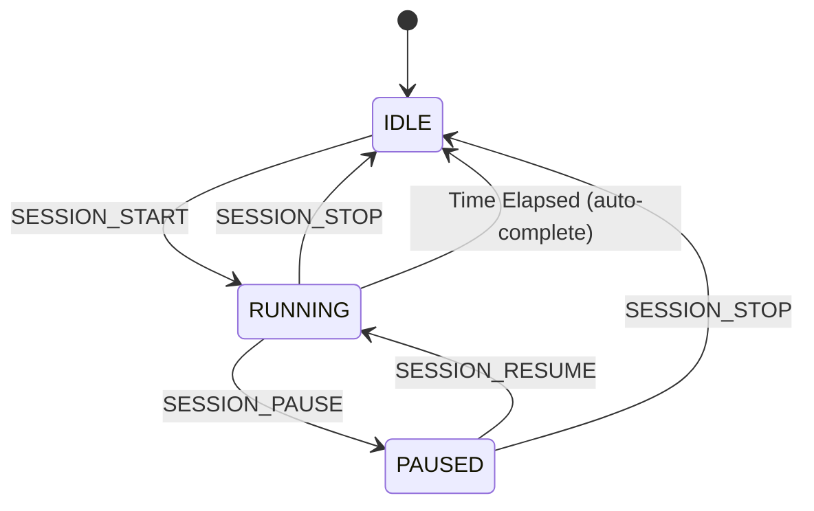

# BlueBuzzah Firmware Architecture
**Version:** 1.0.0
**Platform:** CircuitPython 9.x on nRF52840

---

## Table of Contents

1. [System Overview](#system-overview)
2. [Architecture Principles](#architecture-principles)
3. [Module Organization](#module-organization)
4. [Role-Based Architecture](#role-based-architecture)
5. [Entry Point Flow](#entry-point-flow)
6. [Hardware Abstraction](#hardware-abstraction)
7. [State Management](#state-management)
8. [Error Handling Strategy](#error-handling-strategy)
9. [Memory Management](#memory-management)
10. [Development Guidelines](#development-guidelines)

---

## System Overview

BlueBuzzah implements a **PRIMARY-SECONDARY architecture** for bilateral haptic therapy using two synchronized gloves communicating via Bluetooth Low Energy (BLE).

### Design Philosophy

**Unified Codebase**: Both gloves run identical firmware with role-aware behavior controlled by `config.py`:

```python
# Primary (Left Glove - VL)
GLOVE_ROLE = "PRIMARY"
BLE_NAME = "VL"
DEVICE_TAG = "[VL]"

# Secondary (Right Glove - VR)
GLOVE_ROLE = "SECONDARY"
BLE_NAME = "VR"
DEVICE_TAG = "[VR]"
```

**Benefits of Unified Architecture:**
- **Single source of truth**: Bug fixes and improvements apply to both gloves automatically
- **Simplified testing**: Desktop simulation possible without hardware dependencies
- **Streamlined deployment**: `deploy.py` manages role-specific configuration
- **Consistent behavior**: Identical code paths ensure predictable bilateral operation

---

## Architecture Principles

### 1. **Role Polymorphism**
Modules adapt behavior based on `GLOVE_ROLE`:

```python
# BLE Connection
if role == "PRIMARY":
    return self._primary_advertise_and_wait()
else:
    return self._secondary_scan_and_connect()

# VCR Engine
if role == "PRIMARY":
    send_execute_buzz(uart, sequence_idx)
    haptic.buzz_sequence(pattern)
else:
    sequence_idx = receive_execute_buzz(uart)  # Blocking
    haptic.buzz_sequence(pattern)
```

### 2. **Command-Driven Synchronization**
VL (PRIMARY) explicitly commands VR (SECONDARY) for every action:

```
VL → VR: EXECUTE_BUZZ:0
VL: <executes local buzz>
VR: <waits for command, then executes>
VR → VL: BUZZ_COMPLETE:0
```

**Why not time-based?**
- Eliminates clock drift over 2-hour sessions
- Guarantees bilateral synchronization (±7.5ms BLE latency)
- Simplifies error recovery (VR halts if PRIMARY disconnects)

### 3. **Multi-Connection Support** (PRIMARY Only)
PRIMARY supports **simultaneous connections** to:
1. **Smartphone** (phone_uart) - Configuration, monitoring, control
2. **SECONDARY glove** (vr_uart) - Bilateral therapy coordination

**Connection Detection:**
```python
conn_type = ble._detect_connection_type(connection, timeout=3.0)
# Returns: "PHONE", "VR", or None
# Phone sends: INFO, PING, BATTERY, PROFILE, SESSION commands
# VR sends: READY message immediately after connecting
```

### 4. **Separation of Concerns**

| Module | Responsibility | Depends On |
|--------|---------------|------------|
| `code.py` | Entry point, connection orchestration | All modules |
| `ble_connection.py` | BLE radio, connection management | `adafruit_ble` |
| `vcr_engine.py` | Therapy execution, pattern generation | `haptic_controller`, `sync_protocol` |
| `haptic_controller.py` | Motor control, I2C multiplexer | `adafruit_drv2605` |
| `menu_controller.py` | BLE command processing | `profile_manager`, `session_manager`, `calibration_mode` |
| `sync_protocol.py` | VL↔VR message passing | `ble_connection` |
| `profile_manager.py` | Therapy parameter management | `validators` |
| `session_manager.py` | Session state machine | None (pure state) |
| `calibration_mode.py` | Individual motor testing | `haptic_controller`, `ble_connection` |

---

## Module Organization

```
src/
├── code.py                     # Entry point (164 lines)
├── config.py                   # Device-specific configuration
├── auth_token.py               # Security validation
│
├── modules/
│   ├── __init__.py
│   ├── ble_connection.py       # BLE radio management (897 lines)
│   ├── vcr_engine.py           # Therapy execution (491 lines)
│   ├── haptic_controller.py    # Motor control (306 lines)
│   ├── menu_controller.py      # Command processor (1057 lines)
│   ├── sync_protocol.py        # VL↔VR messaging (338 lines)
│   ├── profile_manager.py      # Parameter management (274 lines)
│   ├── session_manager.py      # Session state machine (329 lines)
│   ├── calibration_mode.py     # Motor testing (275 lines)
│   ├── response_formatter.py   # BLE response formatting
│   ├── validators.py           # Parameter validation
│   └── utils.py                # Battery, LEDs, filesystem utilities
│
└── profiles/
    ├── __init__.py
    ├── defaults.py             # Active therapy profile (loaded at boot)
    ├── reg_vcr.py              # Regular VCR preset
    ├── noisy_vcr.py            # Noisy VCR preset (DEFAULT)
    ├── hybrid_vcr.py           # Hybrid VCR preset
    └── custom_vcr.py           # User-defined preset
```

**Total Source Lines**: ~4,500 lines (excluding libraries)

---

## Role-Based Architecture

### PRIMARY (VL - Left Glove)

**Responsibilities:**
1. **Advertise** as BLE peripheral ("VL")
2. **Accept connections** from smartphone + SECONDARY
3. **Detect connection types** (phone vs VR)
4. **Orchestrate therapy**: Send EXECUTE_BUZZ commands
5. **Broadcast parameters** to SECONDARY on profile changes
6. **Query VR battery** via GET_BATTERY command
7. **Process smartphone commands** (18 BLE protocol commands)

**Key Methods:**
- `BLEConnection._primary_advertise_and_wait()` - Legacy single connection
- `BLEConnection._detect_connection_type()` - Identify phone vs VR
- `BLEConnection._assign_connections_by_type()` - Multi-connection setup
- `BLEConnection._complete_vr_handshake()` - VR synchronization
- `BLEConnection.query_vr_battery()` - Remote battery query
- `MenuController._broadcast_param_update()` - Parameter sync to VR
- `vcr_engine.run_vcr()` - Therapy loop with EXECUTE_BUZZ sending

### SECONDARY (VR - Right Glove)

**Responsibilities:**
1. **Scan** for "VL" BLE advertisement
2. **Connect** to PRIMARY and send READY
3. **Receive time sync** (FIRST_SYNC with +21ms BLE compensation)
4. **Wait for commands**: EXECUTE_BUZZ (blocking)
5. **Execute synchronized buzzes** after command received
6. **Respond to queries**: GET_BATTERY, PARAM_UPDATE
7. **Safety halt** if PRIMARY disconnects (timeout detection)

**Key Methods:**
- `BLEConnection._secondary_scan_and_connect()` - Connect to VL
- `BLEConnection.initial_time_offset` - Stores sync timestamp
- `vcr_engine.receive_execute_buzz()` - Blocking wait for buzz command
- `vcr_engine.send_buzz_complete()` - Acknowledgment after execution
- `MenuController._handle_battery_query()` - Respond to VL query
- `MenuController._handle_param_update()` - Apply VL parameter changes

---

## Entry Point Flow

### Code.py Execution Sequence

```python
def main():
    # 1. Security Validation
    validate_auth_token()  # Halt with red LED if unauthorized

    # 2. Initialize BLE Connection
    ble = BLEConnection(GLOVE_ROLE, BLE_NAME)

    # 3. Initialize Menu Controller
    menu = MenuController(ble, GLOVE_ROLE)

    # 4. Startup Window (default 6 seconds)
    command_received = menu.wait_for_command(timeout_sec=STARTUP_WINDOW)

    if command_received:
        # User sent BLE command → Enter utility mode
        menu.run_utility_loop()  # Infinite loop accepting commands
    else:
        # No command → Auto-start therapy

        # 5. Connection Detection (PRIMARY only, multi-connection)
        if ble.ble.connected and len(ble.ble.connections) > 0:
            # Identify existing connections (phone/VR)
            for conn in ble.ble.connections:
                conn_type = ble._detect_connection_type(conn, timeout=2.0)

            # Assign connections by type
            assigned = ble._assign_connections_by_type(typed_connections)

            # Handle different scenarios
            if has_phone and has_vr:
                connection_success = ble._complete_vr_handshake()
            elif has_phone and not has_vr:
                connection_success = ble._scan_for_vr_while_advertising()
            elif has_vr and not has_phone:
                connection_success = ble._complete_vr_handshake()
        else:
            # Legacy single connection mode (VR only)
            connection_success = ble.establish_connection()

        # 6. Load Therapy Profile
        import profiles.defaults as config

        # 7. Execute Therapy Session
        vr_uart = ble.vr_uart if ble.vr_uart else ble.uart
        run_vcr(vr_uart, GLOVE_ROLE, config)

        # 8. Enter Low Power Mode
        enter_low_power_mode()
```

**Timing Breakdown:**
- **Lines 1-48**: Security check (~0.5s)
- **Lines 49-80**: Startup window (6-30s configurable)
- **Lines 82-136**: Connection detection/handshake (2-15s)
- **Lines 138-158**: Therapy execution (2-180 minutes)
- **Lines 160-162**: Cleanup and shutdown

---

## Hardware Abstraction

### Haptic Controller Architecture

```
[HapticController]
    └── I2C Bus (board.I2C())
        └── TCA9548A Multiplexer (0x70)
            ├── Port 0: DRV2605 (Thumb)   @ 0x5A
            ├── Port 1: DRV2605 (Index)   @ 0x5A
            ├── Port 2: DRV2605 (Middle)  @ 0x5A
            └── Port 3: DRV2605 (Ring)    @ 0x5A
```

**I2C Initialization Strategy** (lines 69-145 in `haptic_controller.py`):

```python
# 1. Try standard board.I2C() (3 retries with 0.5s delay)
for attempt in range(3):
    try:
        self.i2c = board.I2C()
        break
    except RuntimeError:
        time.sleep(0.5)

# 2. Fallback: Manual init with frequency stepping
frequencies = [100000, 50000, 10000]  # 100kHz → 50kHz → 10kHz
for freq in frequencies:
    try:
        self.i2c = busio.I2C(board.SCL, board.SDA, frequency=freq)
        if self.i2c.try_lock():
            self.i2c.unlock()
            break
    except RuntimeError:
        continue

# 3. Failure: Halt with detailed hardware diagnostics
if not initialized:
    print("[CRITICAL] Check SDA/SCL, pull-ups, power supply")
    raise RuntimeError("I2C bus initialization failed")
```

**Why aggressive retry logic?**
CircuitPython's I2C pull-up detection can fail if the bus is not stable at boot time. The firmware compensates with multiple strategies.

### DRV2605 Configuration

**Per-Driver Setup** (lines 183-210):

```python
def _configure_driver(driver, config):
    # 1. Set actuator type
    if config.ACTUATOR_TYPE == "LRA":
        driver.use_LRM()  # Linear Resonant Actuator
    else:
        driver.use_ERM()  # Eccentric Rotating Mass

    # 2. Enable open-loop mode (bypass auto-resonance)
    control3 = driver._read_u8(0x1D)
    driver._write_u8(0x1D, control3 | 0x21)  # Set bits 5 and 0

    # 3. Set peak voltage (register 0x17)
    # Formula: voltage / 0.02122
    driver._write_u8(0x17, int(config.ACTUATOR_VOLTAGE / 0.02122))

    # 4. Set driving frequency (register 0x20)
    # Formula: 1 / (frequency * 0.00009849)
    driver._write_u8(0x20, int(1 / (config.ACTUATOR_FREQUENCY * 0.00009849)))

    # 5. Activate Real-Time Playback (RTP) mode
    driver.realtime_value = 0
    driver.mode = adafruit_drv2605.MODE_REALTIME
```

**Register Map:**
- `0x1D` (Control3): Open-loop enable, N/ERM+ mode
- `0x17` (OD_CLAMP): Peak voltage clamping (0-255 = 0-5.6V)
- `0x20` (LRA_PERIOD): Driving period for LRA resonance
- `0x00` (STATUS): Go bit (trigger playback)

---

## State Management

### Session State Machine



**State Transitions** (session_manager.py):

| From | To | Command | Validation |
|------|----|---------| ------------|
| IDLE | RUNNING | SESSION_START | Profile loaded, VR connected |
| RUNNING | PAUSED | SESSION_PAUSE | - |
| PAUSED | RUNNING | SESSION_RESUME | - |
| RUNNING | IDLE | SESSION_STOP | - |
| PAUSED | IDLE | SESSION_STOP | - |
| RUNNING | IDLE | (auto) | elapsed >= duration |

**Timing Management:**
```python
# Elapsed time excludes pause durations
elapsed_time = (current_time - session_start_time) - total_pause_time

# Progress percentage
progress = int((elapsed_time / session_duration) * 100)
```

### Connection State (BLE)

**Primary Connection States:**
- `ble.phone_connection`: Phone connection object (or None)
- `ble.phone_uart`: Phone UART service (or None)
- `ble.vr_connection`: VR connection object (or None)
- `ble.vr_uart`: VR UART service (or None)
- `ble.uart`: Legacy single connection (fallback)

**Health Check** (line 734-777 in ble_connection.py):
```python
def check_connection_health():
    result = {"phone": False, "vr": False, "phone_lost": False, "vr_lost": False}

    if phone_connection and not phone_connection.connected:
        result["phone_lost"] = True
        phone_connection = None  # Clear stale reference

    if vr_connection and not vr_connection.connected:
        result["vr_lost"] = True
        vr_connection = None  # Clear stale reference
        # CRITICAL: VR disconnect halts therapy
```

---

## Error Handling Strategy

### Hierarchical Error Responses

**Level 1: Fatal Errors** (Halt with LED indicator)
- Authorization failure → Red LED flash loop (code.py:44-54)
- I2C initialization failure → Diagnostic message + halt (haptic_controller.py:138-145)
- VR timeout during EXECUTE_BUZZ → Red LED + motor shutoff (vcr_engine.py:206-218)

**Level 2: Recoverable Errors** (Log + Continue)
- SYNC_ADJ timeout → Log warning, proceed (sync_protocol.py:76-78)
- Battery query timeout → Return None (ble_connection.py:891)
- File read failure → Return error tuple (profile_manager.py:164-165)

**Level 3: User Errors** (BLE Error Response)
- Invalid command → `ERROR:Unknown command` (menu_controller.py:362)
- Invalid parameter → `ERROR:Value out of range` (validators.py)
- Command during session → `ERROR:Cannot modify during active session` (menu_controller.py:616)

### Timeout Handling Matrix

| Operation | Timeout | Failure Action | Location |
|-----------|---------|----------------|----------|
| BLE connection | 15s | Red LED, halt | ble_connection.py:323 |
| READY signal | 8s | Red LED, halt | ble_connection.py:358 |
| SYNC ACK | 2s | Warning, proceed | sync_protocol.py:76 |
| EXECUTE_BUZZ | 10s | Red LED, halt therapy | sync_protocol.py:219-244 |
| BUZZ_COMPLETE | 3s | Warning, proceed | sync_protocol.py:336 |
| Connection type detect | 3s | Treat as unknown | ble_connection.py:102 |
| VR battery query | 1s | Return None | ble_connection.py:869-891 |

---

## Memory Management

### CircuitPython Constraints
- **RAM**: ~256KB available on nRF52840
- **Storage**: ~2MB flash (CIRCUITPY filesystem)
- **No heap compaction**: Manual gc.collect() required

### Garbage Collection Strategy

**Periodic Collection** (vcr_engine.py:234):
```python
# After each buzz macrocycle (every ~2-3 seconds)
gc.collect()
```

**Why after macrocycles?**
- Pattern generation creates temporary lists
- BLE message parsing allocates strings
- Frequency: ~20-30 times per minute (minimal overhead)

### Memory-Efficient Patterns

**Bad** (allocates new lists every cycle):
```python
def rndp_sequence():
    L_RNDP = list(permutations(range(0, 4)))  # Allocates 24 tuples
    R_RNDP = list(permutations(range(4, 8)))  # Allocates 24 tuples
    return zip(random.choice(L_RNDP), random.choice(R_RNDP))
```

**Good** (pre-allocate at session start):
```python
# One-time allocation (line 78-79)
L_RNDP = list(permutations(range(0, 4)))
R_RNDP = list(permutations(range(4, 8)))

def rndp_sequence():
    # Reuse existing lists
    return zip(random.choice(L_RNDP), random.choice(R_RNDP))
```

### String Formatting

**Avoid** (f-string backslash continuations not supported):
```python
# CircuitPython ERROR
print(f"Primary: {timestamp} ms | \
         Adjusted: {adjusted} ms")
```

**Use** (format() or multi-line breaks):
```python
# OK
print("Primary: {} ms | Adjusted: {} ms".format(timestamp, adjusted))

# OK
msg = f"Primary: {timestamp} ms"
print(msg)
```

---

## Development Guidelines

### 1. **Role-Aware Code Patterns**

```python
# GOOD: Role check with clear branching
if self.role == "PRIMARY":
    # PRIMARY-specific behavior
    send_execute_buzz(uart, idx)
else:
    # SECONDARY-specific behavior
    idx = receive_execute_buzz(uart)

# AVOID: Duplicate code in separate files
# (Old architecture had VL/code_primary.py and VR/code_secondary.py)
```

### 2. **BLE Message Protocol**

**Command Format:**
```
COMMAND_NAME:ARG1:ARG2:...\n
```

**Response Format:**
```
KEY1:VALUE1\n
KEY2:VALUE2\n
\x04
```

**Internal VL↔VR Messages** (no EOT terminator):
```
EXECUTE_BUZZ:0\n
BUZZ_COMPLETE:0\n
PARAM_UPDATE:ON:0.150:JITTER:10\n
GET_BATTERY\n
BAT_RESPONSE:3.68\n
```

### 3. **Testing Checklist**

Before committing changes:

- [ ] **Desktop simulation passes**: `python test_desktop.py`
- [ ] **Both roles tested**: Set GLOVE_ROLE to PRIMARY/SECONDARY
- [ ] **BLE commands verified**: Test with Serial UART app
- [ ] **Memory stable**: No OOM crashes during 5-minute test
- [ ] **Synchronization accurate**: VL/VR buzz within 20ms (serial logs)
- [ ] **Error handling**: Test disconnection, invalid commands, low battery

### 4. **CircuitPython Gotchas**

**List Comprehensions** (limited):
```python
# AVOID: Nested comprehensions can crash
result = [[x*y for x in range(10)] for y in range(10)]

# USE: Explicit loops for complex operations
result = []
for y in range(10):
    row = [x*y for x in range(10)]
    result.append(row)
```

**Exception Handling** (no custom exceptions):
```python
# AVOID: Custom exception classes
class ProfileError(Exception):
    pass

# USE: Built-in exceptions with descriptive messages
raise ValueError("Invalid profile ID: must be 1-3")
```

**Type Hints** (not supported):
```python
# AVOID: Type annotations
def buzz_finger(index: int, intensity: float) -> bool:
    pass

# USE: Docstring parameter documentation
def buzz_finger(index, intensity):
    """
    Args:
        index (int): Finger index 0-7
        intensity (float): Intensity 0.0-1.0
    Returns:
        bool: Success status
    """
```

### 5. **Performance Optimization**

**Minimize BLE writes** (combine messages):
```python
# BAD: 3 separate writes
uart.write("KEY1:VAL1\n")
uart.write("KEY2:VAL2\n")
uart.write("\x04")

# GOOD: Single write
response = "KEY1:VAL1\nKEY2:VAL2\n\x04"
uart.write(response.encode())
```

**Avoid blocking operations** in therapy loop:
```python
# BAD: Blocking read in critical path
while therapy_active:
    if uart.in_waiting:
        cmd = uart.readline()  # Blocks until \n
    buzz_sequence()

# GOOD: Non-blocking poll
while therapy_active:
    if uart.in_waiting:
        cmd = uart.readline()  # Only called if data ready
    buzz_sequence()
```

---

## Next Steps

See companion documents:
- **SYNCHRONIZATION_PROTOCOL.md** - BLE timing, handshake, command protocol
- **THERAPY_ENGINE.md** - VCR patterns, haptic control, session execution
- **COMMAND_REFERENCE.md** - BLE Protocol v2.0.0 complete specification
- **CALIBRATION_GUIDE.md** - Motor testing, intensity tuning, finger mapping

---

**Document Maintenance:**
Update this document when:
- Adding new modules or significant refactoring
- Changing role-based behavior patterns
- Modifying error handling strategy
- Updating hardware initialization logic

**Last Updated:** 2025-01-23
**Reviewed By:** Technical Architecture Team
