# BlueBuzzah Firmware State & Communication Diagrams

This document provides visual representations of the firmware's states, transitions, and communication patterns between PRIMARY (left glove), SECONDARY (right glove), and Phone devices.

## Table of Contents

1. [TherapyState State Machine](#1-therapystate-state-machine)
2. [Boot Sequence](#2-boot-sequence)
3. [Therapy Session Flow](#3-therapy-session-flow)
4. [Connection Loss & Recovery](#4-connection-loss--recovery)
5. [Message Reference](#5-message-reference)

---

## 1. TherapyState State Machine

The `TherapyState` enum defines all possible states of the therapy system. Both PRIMARY and SECONDARY devices maintain their own state, synchronized via SYNC messages.

### 1.1 Complete State Diagram

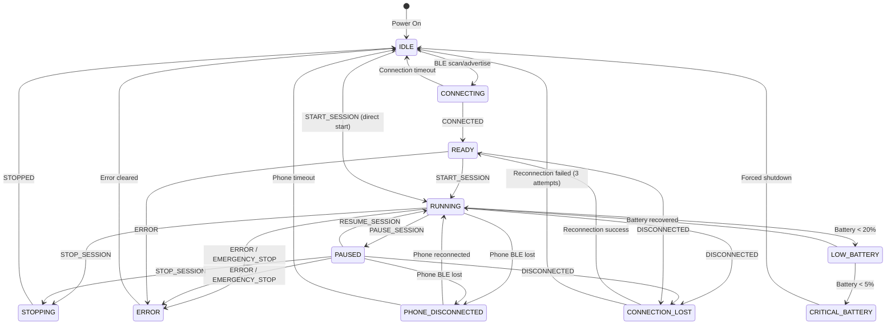

### 1.2 State Descriptions

| State | Value | Description |
|-------|-------|-------------|
| `IDLE` | 0 | No active session, system ready for connection |
| `CONNECTING` | 1 | Establishing BLE connection between devices |
| `READY` | 2 | Connected and ready to start therapy session |
| `RUNNING` | 3 | Active therapy session in progress |
| `PAUSED` | 4 | Session temporarily paused, can resume |
| `STOPPING` | 5 | Session ending, cleanup in progress |
| `ERROR` | 6 | Error condition, motors stopped |
| `LOW_BATTERY` | 7 | Battery below 20%, session can continue |
| `CRITICAL_BATTERY` | 8 | Battery below 5%, forced shutdown |
| `CONNECTION_LOST` | 9 | Inter-device connection lost, attempting recovery |
| `PHONE_DISCONNECTED` | 10 | Phone BLE connection lost (PRIMARY only) |

### 1.3 State Triggers

| Trigger | Description |
|---------|-------------|
| `CONNECTED` | BLE connection established |
| `DISCONNECTED` | BLE connection lost |
| `START_SESSION` | Begin therapy session |
| `PAUSE_SESSION` | Temporarily pause session |
| `RESUME_SESSION` | Resume paused session |
| `STOP_SESSION` | End therapy session |
| `STOPPED` | Session cleanup complete |
| `ERROR` | Error condition detected |
| `EMERGENCY_STOP` | Immediate motor shutdown required |

---

## 2. Boot Sequence

The boot sequence establishes BLE connections between PRIMARY, SECONDARY, and optionally a Phone.

### 2.1 Full Boot Sequence

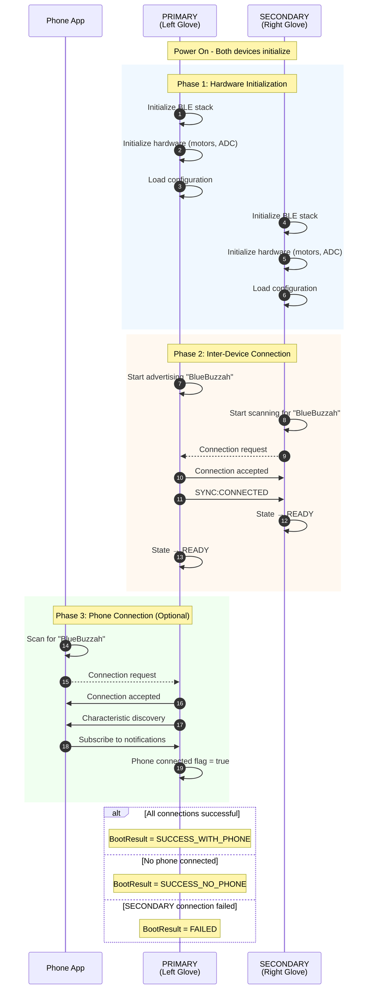

### 2.2 Boot Result States

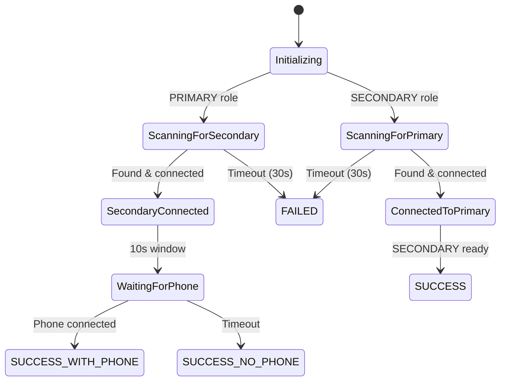

---

## 3. Therapy Session Flow

### 3.1 Session Start

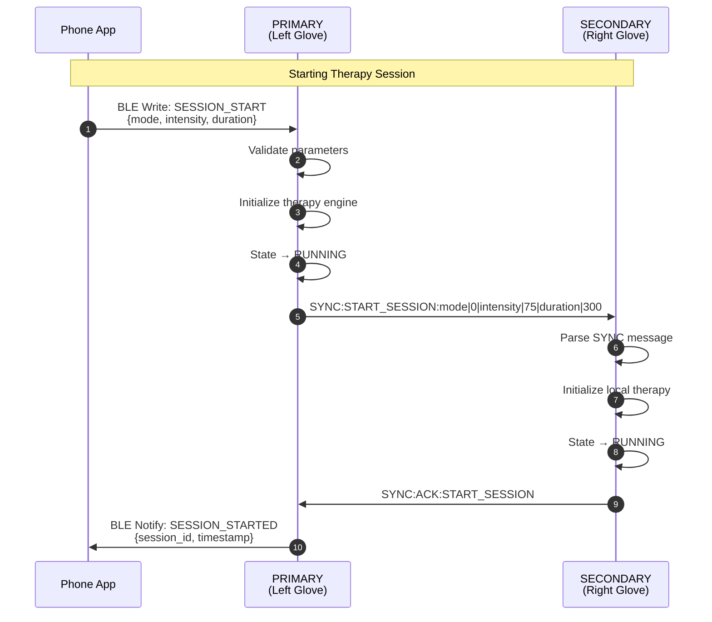

### 3.2 Active Session - Pattern Execution

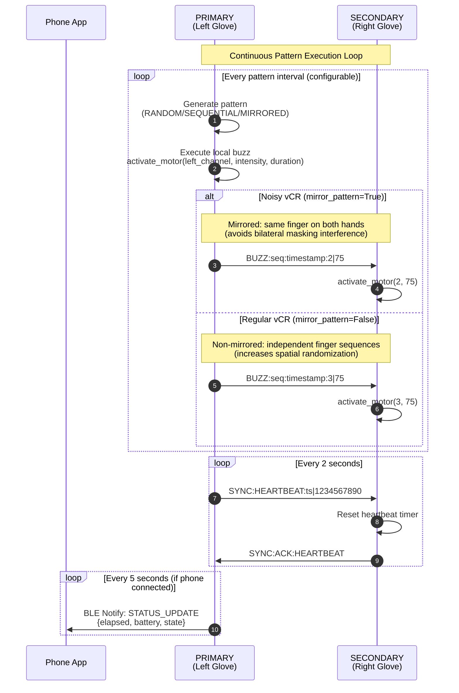

### 3.3 Session Pause/Resume

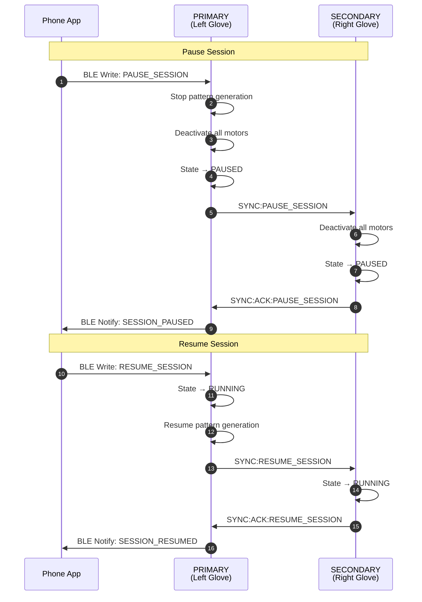

### 3.4 Session Stop

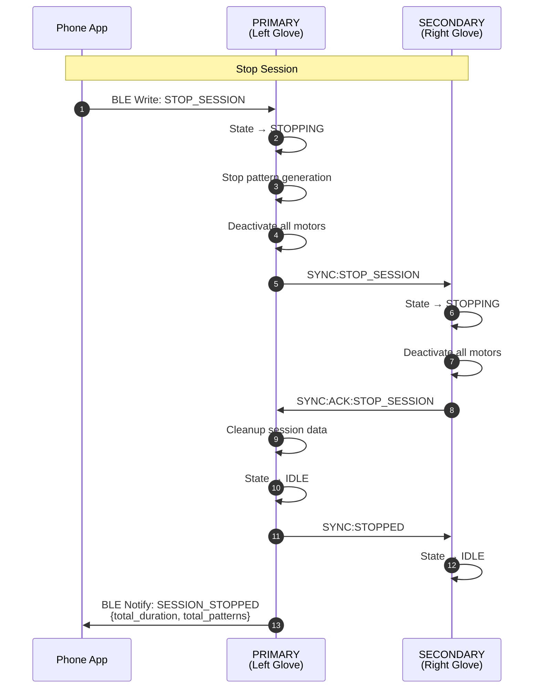

### 3.5 Emergency Stop

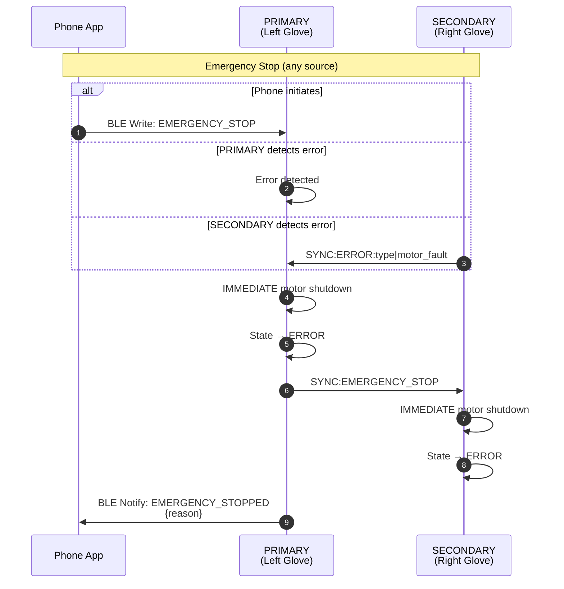

---

## 4. Connection Loss & Recovery

### 4.1 SECONDARY Detects Connection Loss

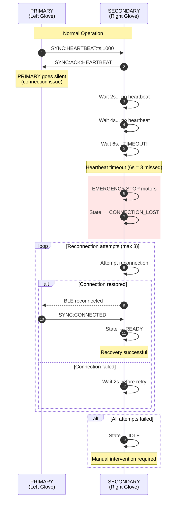

### 4.2 Phone Connection Loss (PRIMARY)

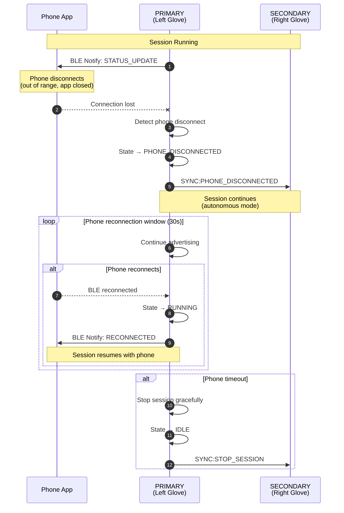

### 4.3 Complete Recovery Flow

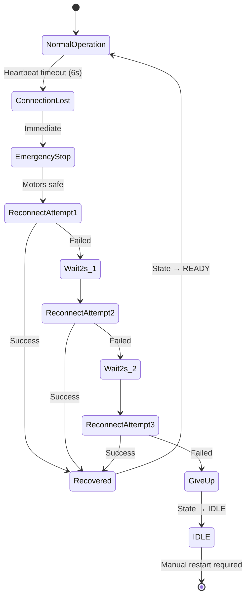

---

## 5. Message Reference

### 5.1 SYNC Message Format

All inter-device messages use the SYNC protocol:

```text
SYNC:<command>:<key1>|<value1>|<key2>|<value2>...<EOT>
```

- **Prefix**: `SYNC:` identifies synchronization messages
- **Command**: Action to perform
- **Parameters**: Pipe-delimited key-value pairs
- **Terminator**: EOT character (0x04)

### 5.2 SYNC Commands

| Command | Direction | Parameters | Description |
|---------|-----------|------------|-------------|
| `CONNECTED` | PRIMARY → SECONDARY | (none) | Connection established |
| `START_SESSION` | PRIMARY → SECONDARY | `mode`, `intensity`, `duration` | Begin therapy session |
| `PAUSE_SESSION` | PRIMARY → SECONDARY | (none) | Pause active session |
| `RESUME_SESSION` | PRIMARY → SECONDARY | (none) | Resume paused session |
| `STOP_SESSION` | PRIMARY → SECONDARY | (none) | End therapy session |
| `STOPPED` | PRIMARY → SECONDARY | (none) | Session cleanup complete |
| `BUZZ` | PRIMARY → SECONDARY | `finger`, `amplitude` | Activate specific motor |
| `HEARTBEAT` | PRIMARY → SECONDARY | `ts` | Keep-alive signal |
| `EMERGENCY_STOP` | PRIMARY → SECONDARY | (none) | Immediate motor shutdown |
| `PHONE_DISCONNECTED` | PRIMARY → SECONDARY | (none) | Phone BLE lost |
| `ACK` | SECONDARY → PRIMARY | `<command>` | Acknowledge received command |
| `ERROR` | Either → Either | `type`, `msg` | Error condition |

### 5.3 BLE Commands (Phone → PRIMARY)

| Command | Characteristic | Payload | Description |
|---------|---------------|---------|-------------|
| `SESSION_START` | Control | `{mode, intensity, duration}` | Start therapy session |
| `SESSION_PAUSE` | Control | (none) | Pause active session |
| `SESSION_RESUME` | Control | (none) | Resume paused session |
| `SESSION_STOP` | Control | (none) | End therapy session |
| `EMERGENCY_STOP` | Control | (none) | Immediate shutdown |
| `GET_STATUS` | Status | (none) | Request current state |
| `SET_CONFIG` | Config | `{key, value}` | Update configuration |

### 5.4 BLE Notifications (PRIMARY → Phone)

| Notification | Characteristic | Payload | Description |
|--------------|---------------|---------|-------------|
| `SESSION_STARTED` | Status | `{session_id, ts}` | Session began |
| `SESSION_PAUSED` | Status | `{elapsed}` | Session paused |
| `SESSION_RESUMED` | Status | `{elapsed}` | Session resumed |
| `SESSION_STOPPED` | Status | `{duration, patterns}` | Session ended |
| `STATUS_UPDATE` | Status | `{state, battery, elapsed}` | Periodic update |
| `ERROR` | Status | `{code, message}` | Error occurred |

### 5.5 Timing Parameters

| Parameter | Value | Description |
|-----------|-------|-------------|
| Heartbeat Interval | 2 seconds | Time between HEARTBEAT messages |
| Heartbeat Timeout | 6 seconds | 3 missed heartbeats triggers connection lost |
| Reconnection Attempts | 3 | Maximum reconnection tries |
| Reconnection Delay | 2 seconds | Wait between reconnection attempts |
| Phone Timeout | 30 seconds | Time to wait for phone reconnection |
| Status Update Interval | 5 seconds | Frequency of phone status notifications |
| Boot Scan Timeout | 30 seconds | Maximum time searching for devices |
| Phone Wait Window | 10 seconds | Time to wait for phone at boot |

---

## Related Documentation

- [BLE Protocol](BLE_PROTOCOL.md) - Detailed BLE characteristic definitions
- [Synchronization Protocol](SYNCHRONIZATION_PROTOCOL.md) - SYNC message implementation
- [API Reference](API_REFERENCE.md) - Complete API documentation
- [Technical Reference](TECHNICAL_REFERENCE.md) - System architecture details
