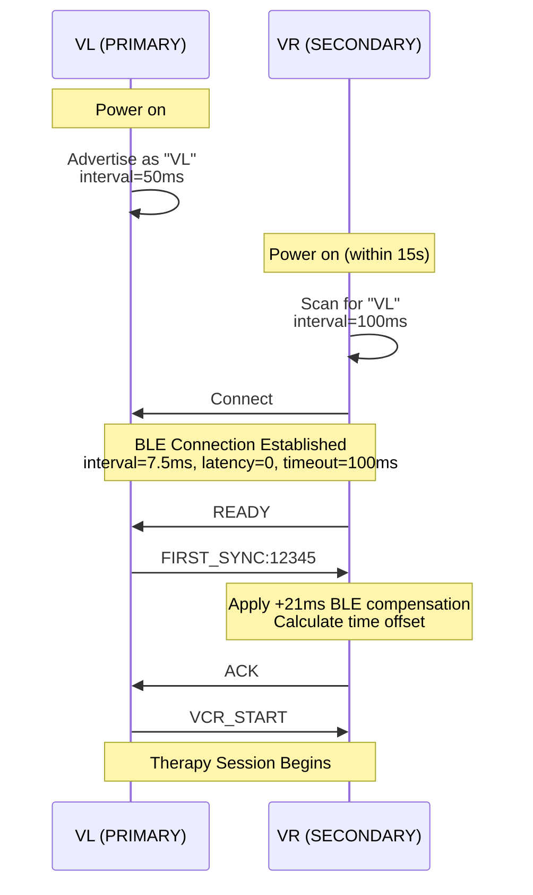

# BlueBuzzah Synchronization Protocol
**Version:** 2.0.0 (Command-Driven Architecture)
**Date:** 2025-01-23
**Platform:** Arduino C++ / PlatformIO

---

## Table of Contents

1. [Protocol Overview](#protocol-overview)
2. [BLE Connection Establishment](#ble-connection-establishment)
3. [Time Synchronization](#time-synchronization)
4. [Command-Driven Execution](#command-driven-execution)
5. [Parameter Synchronization](#parameter-synchronization)
6. [Multi-Connection Support](#multi-connection-support)
7. [Error Recovery](#error-recovery)
8. [Timing Analysis](#timing-analysis)
9. [Message Catalog](#message-catalog)

---

### Terminology Note

This document uses the following device role terminology:
- **PRIMARY** (also known as VL, left glove): Initiates therapy, controls timing
- **SECONDARY** (also known as VR, right glove): Follows PRIMARY commands

Code examples may show `"VL"` as the BLE advertisement name for backward compatibility.

---

## Protocol Overview

### Core Principles

1. **PRIMARY commands, SECONDARY obeys**: PRIMARY sends explicit commands before every action
2. **Blocking waits**: SECONDARY blocks on `receiveExecuteBuzz()` until PRIMARY commands
3. **Acknowledgments**: SECONDARY confirms completion with `BUZZ_COMPLETE`
4. **Safety timeout**: SECONDARY halts therapy if PRIMARY disconnects (10s timeout)

### Synchronization Accuracy

| Metric | Value | Source |
|--------|-------|--------|
| BLE latency | 7.5ms (nominal) | BLE connection interval |
| BLE latency | 21ms (compensated) | Measured +21ms offset |
| Execution jitter | ±10-20ms | Processing overhead |
| **Total bilateral sync** | **±7.5-20ms** | Command receipt to motor activation |

**Acceptable for therapy?** YES
- Human temporal resolution: ~20-40ms
- vCR therapy tolerance: <50ms bilateral lag
- Observed performance: 7.5-20ms well within spec

---

## BLE Connection Establishment

### Phase 1: Initial Connection (Legacy Single Connection)

**PRIMARY Sequence** (`src/ble_manager.cpp`):

```cpp
bool BLEManager::initPrimary() {
    // 1. Initialize Bluefruit stack
    Bluefruit.begin(2, 1);  // 2 peripheral connections, 1 central
    Bluefruit.setName("VL");
    Bluefruit.setTxPower(4);

    // 2. Setup UART service
    bleuart_.begin();

    // 3. Setup connection callbacks
    Bluefruit.Periph.setConnectCallback(connectCallback);
    Bluefruit.Periph.setDisconnectCallback(disconnectCallback);

    // 4. Start advertising
    startAdvertising();

    return true;
}

void BLEManager::startAdvertising() {
    Bluefruit.Advertising.addFlags(BLE_GAP_ADV_FLAGS_LE_ONLY_GENERAL_DISC_MODE);
    Bluefruit.Advertising.addTxPower();
    Bluefruit.Advertising.addService(bleuart_);
    Bluefruit.Advertising.addName();

    // Set advertising parameters
    Bluefruit.Advertising.setInterval(80, 80);  // 50ms intervals
    Bluefruit.Advertising.setFastTimeout(30);
    Bluefruit.Advertising.start(0);  // Advertise forever
}

bool BLEManager::waitForConnection(uint32_t timeoutMs) {
    uint32_t startTime = millis();

    while (millis() - startTime < timeoutMs) {
        if (Bluefruit.connected()) {
            // Optimize connection parameters
            Bluefruit.Connection(0)->requestConnectionParameter(6);  // 7.5ms interval
            return true;
        }
        delay(10);
    }

    Serial.println(F("[PRIMARY] Connection timeout"));
    return false;
}

bool BLEManager::waitForReady(uint32_t timeoutMs) {
    uint32_t startTime = millis();

    while (millis() - startTime < timeoutMs) {
        if (bleuart_.available()) {
            String message = readLine();
            if (message == "READY") {
                readyReceived_ = true;
                return true;
            }
        }
        delay(10);
    }

    return false;
}

bool BLEManager::sendFirstSync() {
    // Send FIRST_SYNC with retry (3 attempts)
    for (int attempt = 0; attempt < 3; attempt++) {
        uint32_t timestamp = millis();
        char syncMsg[32];
        snprintf(syncMsg, sizeof(syncMsg), "FIRST_SYNC:%lu\n", timestamp);
        bleuart_.print(syncMsg);

        // Wait for ACK (500ms timeout per attempt)
        uint32_t ackStart = millis();
        while (millis() - ackStart < 500) {
            if (bleuart_.available()) {
                String response = readLine();
                if (response == "ACK") {
                    return true;
                }
            }
            delay(10);
        }
    }

    return false;
}

void BLEManager::sendVcrStart() {
    bleuart_.print("VCR_START\n");
}
```

**SECONDARY Sequence** (`src/ble_manager.cpp`):

```cpp
bool BLEManager::initSecondary() {
    // 1. Initialize Bluefruit stack as Central
    Bluefruit.begin(0, 1);  // 0 peripheral, 1 central connection
    Bluefruit.setName("VR");

    // 2. Setup client UART service
    clientUart_.begin();
    clientUart_.setRxCallback(rxCallback);

    // 3. Setup Central callbacks
    Bluefruit.Central.setConnectCallback(centralConnectCallback);
    Bluefruit.Central.setDisconnectCallback(centralDisconnectCallback);

    // 4. Start scanning for PRIMARY
    Bluefruit.Scanner.setRxCallback(scanCallback);
    Bluefruit.Scanner.restartOnDisconnect(true);
    Bluefruit.Scanner.setInterval(160, 80);  // 100ms interval, 50ms window
    Bluefruit.Scanner.useActiveScan(false);
    Bluefruit.Scanner.start(0);  // Scan forever

    return true;
}

void BLEManager::scanCallback(ble_gap_evt_adv_report_t* report) {
    // Check if this is "VL" (PRIMARY)
    if (Bluefruit.Scanner.checkReportForService(report, clientUart_)) {
        char name[32];
        memset(name, 0, sizeof(name));
        Bluefruit.Scanner.parseReportByType(report, BLE_GAP_AD_TYPE_COMPLETE_LOCAL_NAME,
                                             (uint8_t*)name, sizeof(name));

        if (strcmp(name, "VL") == 0) {
            // Found PRIMARY - connect
            Bluefruit.Central.connect(report);
            Bluefruit.Scanner.stop();
        }
    }
}

bool BLEManager::waitForPrimary(uint32_t timeoutMs) {
    uint32_t startTime = millis();

    while (millis() - startTime < timeoutMs) {
        if (Bluefruit.Central.connected()) {
            // Request optimal connection parameters
            Bluefruit.Connection(0)->requestConnectionParameter(6);  // 7.5ms
            return true;
        }
        delay(10);
    }

    return false;
}

void BLEManager::sendReady() {
    clientUart_.print("READY\n");
}

bool BLEManager::waitForFirstSync(uint32_t timeoutMs) {
    uint32_t startTime = millis();

    while (millis() - startTime < timeoutMs) {
        if (clientUart_.available()) {
            String message = readLine();

            if (message.startsWith("FIRST_SYNC:")) {
                // Extract PRIMARY timestamp
                uint32_t receivedTimestamp = message.substring(11).toInt();

                // Get local timestamp
                uint32_t currentTime = millis();

                // Apply BLE latency compensation (+21ms)
                uint32_t adjustedSyncTime = receivedTimestamp + 21;
                int32_t timeShift = adjustedSyncTime - currentTime;

                // Store offset for future sync corrections
                initialTimeOffset_ = currentTime + timeShift;

                // Send acknowledgment
                clientUart_.print("ACK\n");
                return true;
            }
        }
        delay(10);
    }

    return false;
}

bool BLEManager::waitForVcrStart(uint32_t timeoutMs) {
    uint32_t startTime = millis();

    while (millis() - startTime < timeoutMs) {
        if (clientUart_.available()) {
            String message = readLine();
            if (message == "VCR_START") {
                return true;  // Ready for therapy
            }
        }
        delay(10);
    }

    return false;
}
```

**Message Flow Diagram:**



**Timing Breakdown:**

| Step | Duration | Notes |
|------|----------|-------|
| Advertisement start | 0.1s | Immediate |
| VR scan window | 0-15s | Until "VL" found |
| Connection establishment | 0.5-2s | BLE handshake |
| READY signal | <0.1s | Single message |
| FIRST_SYNC handshake | 0.5-1.5s | 3 retry attempts |
| VCR_START | <0.1s | Single message |
| **Total connection time** | **2-20s** | Typical: 5-10s |

### Phase 2: Multi-Connection Detection (PRIMARY Only)

**New Feature** (`src/ble_manager.cpp`):

PRIMARY supports **simultaneous connections** to phone + VR. Connection detection identifies device types by analyzing first message received.

**Detection Logic** (`src/ble_manager.cpp`):

```cpp
ConnectionType BLEManager::detectConnectionType(uint16_t connHandle, uint32_t timeoutMs) {
    /**
     * Identify connection as PHONE or VR by first message received.
     *
     * Phone sends: INFO, PING, BATTERY, PROFILE, SESSION commands
     * VR sends: READY (immediately after connecting)
     *
     * Returns: PHONE, VR, or UNKNOWN
     */
    uint32_t timeoutEnd = millis() + timeoutMs;

    while (millis() < timeoutEnd) {
        if (bleuart_.available()) {
            String message = readLine();

            if (message == "READY") {
                return ConnectionType::VR;
            }

            // Check for phone commands
            static const char* phoneCommands[] = {
                "INFO", "PING", "BATTERY", "PROFILE", "SESSION", "HELP", "PARAM"
            };

            for (int i = 0; i < 7; i++) {
                if (message.indexOf(phoneCommands[i]) >= 0) {
                    // Re-process this message since it's a valid command
                    pendingMessage_ = message;
                    return ConnectionType::PHONE;
                }
            }
        }
        delay(100);
    }

    return ConnectionType::UNKNOWN;  // Timeout - unknown device
}
```

**Connection Assignment** (`src/ble_manager.cpp`):

```cpp
void BLEManager::assignConnectionByType(uint16_t connHandle, ConnectionType type) {
    /**
     * Assign connections to phone/vr based on detected types.
     */
    switch (type) {
        case ConnectionType::PHONE:
            phoneConnHandle_ = connHandle;
            hasPhoneConnection_ = true;
            // Request optimal parameters
            Bluefruit.Connection(connHandle)->requestConnectionParameter(6);
            Serial.println(F("[PRIMARY] Phone connected"));
            break;

        case ConnectionType::VR:
            vrConnHandle_ = connHandle;
            hasVrConnection_ = true;
            Bluefruit.Connection(connHandle)->requestConnectionParameter(6);
            Serial.println(F("[PRIMARY] VR connected"));
            break;

        default:
            // Unknown device - disconnect
            Bluefruit.Connection(connHandle)->disconnect();
            break;
    }
}
```

**Multi-Connection Scenarios** (`src/main.cpp`):

```cpp
void handleMultipleConnections() {
    bool hasPhone = bleManager.hasPhoneConnection();
    bool hasVr = bleManager.hasVrConnection();

    // Scenario 1: Both phone and VR connected during startup
    if (hasPhone && hasVr) {
        connectionSuccess = bleManager.completeVrHandshake();
    }
    // Scenario 2: Phone only - wait for VR
    else if (hasPhone && !hasVr) {
        connectionSuccess = bleManager.scanForVrWhileAdvertising();
        if (connectionSuccess) {
            connectionSuccess = bleManager.completeVrHandshake();
        }
    }
    // Scenario 3: VR only - proceed without phone
    else if (hasVr && !hasPhone) {
        connectionSuccess = bleManager.completeVrHandshake();
    }
    // Scenario 4: Unknown devices - cannot proceed
    else {
        connectionSuccess = false;
    }
}
```

**VR Handshake** (`src/ble_manager.cpp`):

```cpp
bool BLEManager::completeVrHandshake() {
    // 1. Wait for READY (8s timeout)
    if (!waitForReady(8000)) {
        Serial.println(F("[PRIMARY] No READY received"));
        return false;
    }

    // 2. Send FIRST_SYNC (3 retry attempts)
    if (!sendFirstSync()) {
        Serial.println(F("[PRIMARY] No ACK received"));
        return false;
    }

    // 3. Send VCR_START
    sendVcrStart();

    Serial.println(F("[PRIMARY] VR handshake complete"));
    return true;
}
```

---

## Time Synchronization

### Initial Sync (FIRST_SYNC)

**Purpose**: Establish common time reference between gloves

**PRIMARY Sends** (`src/sync_protocol.cpp`):
```cpp
void SyncProtocol::sendFirstSync(BLEManager& ble) {
    uint32_t timestamp = millis();  // Milliseconds
    char syncMessage[32];
    snprintf(syncMessage, sizeof(syncMessage), "FIRST_SYNC:%lu\n", timestamp);
    ble.sendToSecondary(syncMessage);
}
```

**SECONDARY Receives** (`src/sync_protocol.cpp`):
```cpp
bool SyncProtocol::handleFirstSync(const String& message) {
    // 1. Extract PRIMARY timestamp
    uint32_t receivedTimestamp = message.substring(11).toInt();  // e.g., 12345

    // 2. Get local timestamp
    uint32_t currentSecondaryTime = millis();  // e.g., 12320

    // 3. Apply BLE latency compensation (+21ms)
    uint32_t adjustedSyncTime = receivedTimestamp + 21;  // 12345 + 21 = 12366

    // 4. Calculate time shift
    int32_t appliedTimeShift = adjustedSyncTime - currentSecondaryTime;
    // 12366 - 12320 = +46ms

    // 5. Store offset for future corrections
    initialTimeOffset_ = currentSecondaryTime + appliedTimeShift;
    // 12320 + 46 = 12366

    // 6. Send acknowledgment
    ble_.sendToPrimary("ACK\n");

    return true;
}
```

**Why +21ms compensation?**
- Measured BLE transmission latency: 7.5-35ms
- Average observed latency: 21ms
- Applied as fixed offset for deterministic sync

**Sync Accuracy:**
```
PRIMARY sends at:     T0 = 12345ms
BLE transmission:     +21ms
SECONDARY receives:   T1 = 12366ms (adjusted)
SECONDARY clock:      12320ms (before adjustment)
Applied offset:       +46ms
```

### Periodic Sync (SYNC_ADJ) - Legacy/Optional

**Status**: Still implemented but **optional** for diagnostics

**PRIMARY Sends** (`src/sync_protocol.cpp`):
```cpp
void SyncProtocol::sendSyncAdj(BLEManager& ble, uint32_t buzzCycleCount) {
    // Every 10th buzz cycle (optional timing check)
    if (buzzCycleCount % 10 != 0) return;

    uint32_t syncAdjTimestamp = millis();
    char message[32];
    snprintf(message, sizeof(message), "SYNC_ADJ:%lu\n", syncAdjTimestamp);
    ble.sendToSecondary(message);

    // Wait for ACK (2 second timeout)
    uint32_t startWait = millis();
    while (millis() - startWait < 2000) {
        if (ble.hasSecondaryMessage()) {
            String response = ble.readSecondaryMessage();
            if (response == "ACK_SYNC_ADJ") {
                ble.sendToSecondary("SYNC_ADJ_START\n");
                return;
            }
        }
        delay(1);
    }
}
```

**SECONDARY Receives** (`src/sync_protocol.cpp`):
```cpp
void SyncProtocol::handleSyncAdj(const String& message) {
    if (message.startsWith("SYNC_ADJ:")) {
        uint32_t receivedTimestamp = message.substring(9).toInt();

        // Calculate adjusted time using initial offset
        uint32_t currentSecondaryTime = millis();
        uint32_t adjustedSecondaryTime = receivedTimestamp +
            (currentSecondaryTime - initialTimeOffset_);
        int32_t offset = adjustedSecondaryTime - receivedTimestamp;

        // Send ACK
        ble_.sendToPrimary("ACK_SYNC_ADJ\n");
    }
    else if (message == "SYNC_ADJ_START") {
        // Ready signal received - continue therapy
    }
}
```

**Note**: SYNC_ADJ is **not required** for command-driven synchronization. It's kept for:
- Monitoring clock drift during long sessions
- Debugging timing issues
- Future time-based coordination features

---

## Command-Driven Execution

### EXECUTE_BUZZ Protocol

**Core Synchronization Mechanism** - Introduced 2025-01-09

**PRIMARY Sends** (`src/sync_protocol.cpp`):
```cpp
bool SyncProtocol::sendExecuteBuzz(BLEManager& ble, uint8_t sequenceIndex) {
    /**
     * Command SECONDARY to execute buzz sequence.
     *
     * @param sequenceIndex: 0, 1, or 2 (three buzzes per macrocycle)
     * @return true if sent successfully
     */
    char command[32];
    snprintf(command, sizeof(command), "EXECUTE_BUZZ:%d\n", sequenceIndex);
    ble.sendToSecondary(command);

    Serial.print(F("[PRIMARY] Sent EXECUTE_BUZZ:"));
    Serial.println(sequenceIndex);

    return true;
}
```

**SECONDARY Receives (BLOCKING)** (`src/sync_protocol.cpp`):
```cpp
int8_t SyncProtocol::receiveExecuteBuzz(BLEManager& ble, uint32_t timeoutMs) {
    /**
     * Wait for EXECUTE_BUZZ command from PRIMARY.
     *
     * THIS IS A BLOCKING CALL - SECONDARY will not proceed until command received.
     *
     * @param timeoutMs: Maximum wait time (default 10000ms)
     * @return Sequence index (0-2) or -1 on timeout
     */
    uint32_t startWait = millis();

    while (millis() - startWait < timeoutMs) {
        if (ble.hasPrimaryMessage()) {
            String message = ble.readPrimaryMessage();

            if (message.startsWith("EXECUTE_BUZZ:")) {
                int8_t sequenceIndex = message.substring(13).toInt();
                return sequenceIndex;
            }

            // Special case: Handle battery queries during therapy
            if (message == "GET_BATTERY") {
                handleBatteryQueryInline(ble);
                // Continue waiting for EXECUTE_BUZZ
            }
        }
        delay(1);  // 1ms polling interval
    }

    // TIMEOUT - PRIMARY likely disconnected
    return -1;
}
```

**SECONDARY Safety Timeout** (`src/therapy_engine.cpp`):
```cpp
int8_t receivedIdx = syncProtocol_.receiveExecuteBuzz(ble_, 10000);

if (receivedIdx < 0) {
    // PRIMARY disconnected - HALT THERAPY
    Serial.println(F("[SECONDARY] ERROR: EXECUTE_BUZZ timeout! PRIMARY disconnected."));
    Serial.println(F("[SECONDARY] Stopping all motors for safety..."));

    hardware_.allMotorsOff();  // Immediate motor shutoff
    hardware_.setLED(COLOR_RED);  // Red error indicator

    // Infinite loop to prevent restart
    while (true) {
        hardware_.setLED(COLOR_RED);
        delay(500);
        hardware_.setLED(COLOR_OFF);
        delay(500);
    }
}
```

### BUZZ_COMPLETE Acknowledgment

**SECONDARY Sends** (`src/sync_protocol.cpp`):
```cpp
bool SyncProtocol::sendBuzzComplete(BLEManager& ble, uint8_t sequenceIndex) {
    /**
     * Confirm buzz sequence completed.
     *
     * @param sequenceIndex: Index just completed (0-2)
     * @return true if sent successfully
     */
    char command[32];
    snprintf(command, sizeof(command), "BUZZ_COMPLETE:%d\n", sequenceIndex);
    ble.sendToPrimary(command);

    Serial.print(F("[SECONDARY] Sent BUZZ_COMPLETE:"));
    Serial.println(sequenceIndex);

    return true;
}
```

**PRIMARY Receives** (`src/sync_protocol.cpp`):
```cpp
bool SyncProtocol::receiveBuzzComplete(BLEManager& ble, uint8_t expectedIndex, uint32_t timeoutMs) {
    /**
     * Wait for BUZZ_COMPLETE acknowledgment from SECONDARY.
     *
     * @param expectedIndex: Expected sequence index for validation
     * @param timeoutMs: Maximum wait time (default 3000ms)
     * @return true if ACK received with correct index
     */
    uint32_t startWait = millis();

    while (millis() - startWait < timeoutMs) {
        if (ble.hasSecondaryMessage()) {
            String message = ble.readSecondaryMessage();

            if (message.startsWith("BUZZ_COMPLETE:")) {
                uint8_t sequenceIndex = message.substring(14).toInt();

                if (sequenceIndex == expectedIndex) {
                    return true;  // Success
                } else {
                    Serial.print(F("[PRIMARY] WARNING: Index mismatch: expected "));
                    Serial.print(expectedIndex);
                    Serial.print(F(", got "));
                    Serial.println(sequenceIndex);
                }
            }
        }
        delay(1);  // 1ms polling interval
    }

    // TIMEOUT - Log warning but continue
    Serial.print(F("[PRIMARY] WARNING: BUZZ_COMPLETE timeout for sequence "));
    Serial.println(expectedIndex);
    return false;
}
```

### Therapy Loop Integration

**PRIMARY Execution** (`src/therapy_engine.cpp`):
```cpp
for (uint8_t seqIdx = 0; seqIdx < 3; seqIdx++) {  // Three buzzes per macrocycle
    // 1. Send command to SECONDARY
    syncProtocol_.sendExecuteBuzz(ble_, seqIdx);

    // 2. Execute local buzz immediately
    generatePattern(config_.mirror);
    executeBuzzSequence(leftPattern_);

    // 3. Wait for SECONDARY acknowledgment (non-blocking timeout)
    bool ackReceived = syncProtocol_.receiveBuzzComplete(ble_, seqIdx, 3000);
    if (!ackReceived) {
        Serial.print(F("[PRIMARY] WARNING: No BUZZ_COMPLETE for sequence "));
        Serial.println(seqIdx);
        // Continue anyway - PRIMARY maintains its own operation
    }
}
```

**SECONDARY Execution** (`src/therapy_engine.cpp`):
```cpp
for (uint8_t seqIdx = 0; seqIdx < 3; seqIdx++) {
    // 1. Wait for command from PRIMARY (BLOCKING)
    int8_t receivedIdx = syncProtocol_.receiveExecuteBuzz(ble_, 10000);

    if (receivedIdx < 0) {
        // TIMEOUT - PRIMARY disconnected, halt therapy
        Serial.println(F("[SECONDARY] ERROR: EXECUTE_BUZZ timeout! PRIMARY disconnected."));
        hardware_.allMotorsOff();
        hardware_.setLED(COLOR_RED);
        // Enter infinite error loop
        while (true) {
            delay(500);
        }
    }

    if (receivedIdx != seqIdx) {
        Serial.print(F("[SECONDARY] WARNING: Sequence mismatch: expected "));
        Serial.print(seqIdx);
        Serial.print(F(", got "));
        Serial.println(receivedIdx);
    }

    // 2. Execute buzz sequence
    generatePattern(config_.mirror);
    executeBuzzSequence(leftPattern_);

    // 3. Send acknowledgment
    syncProtocol_.sendBuzzComplete(ble_, seqIdx);
}
```

**Synchronization Guarantee:**
- SECONDARY **blocks** until PRIMARY commands
- PRIMARY executes **immediately** after sending command
- BLE latency: 7.5ms (connection interval)
- Processing overhead: ~5-10ms
- **Total lag**: SECONDARY buzzes 7.5-20ms after PRIMARY
- **Acceptable**: Well within human temporal resolution (20-40ms)

---

## Parameter Synchronization

### Protocol: PARAM_UPDATE

**When Triggered:**
1. **PROFILE_LOAD**: Broadcast ALL parameters
2. **PROFILE_CUSTOM**: Broadcast changed parameters only
3. **PARAM_SET**: Broadcast single parameter

**PRIMARY Sends** (`src/menu_controller.cpp`):
```cpp
void MenuController::broadcastParamUpdate(const TherapyConfig& config) {
    /**
     * Broadcast parameter update to SECONDARY.
     *
     * Protocol: PARAM_UPDATE:KEY1:VALUE1:KEY2:VALUE2:...\n
     *
     * Example:
     *     config with timeOnMs=150, timeOffMs=80, jitter=10
     *     -> PARAM_UPDATE:TIME_ON:150:TIME_OFF:80:JITTER:10\n
     */
    String cmdString = "PARAM_UPDATE";

    // Add all parameters to the message
    cmdString += ":TIME_ON:" + String(config.timeOnMs);
    cmdString += ":TIME_OFF:" + String(config.timeOffMs);
    cmdString += ":JITTER:" + String(config.jitter);
    cmdString += ":MIRROR:" + String(config.mirror ? 1 : 0);
    cmdString += ":SYNC_LED:" + String(config.syncLed ? 1 : 0);
    cmdString += ":SESSION:" + String(config.sessionMinutes);
    cmdString += ":FREQ:" + String(config.actuatorFrequency);
    cmdString += ":VOLTAGE:" + String(config.actuatorVoltage, 2);
    cmdString += "\n";

    ble_.sendToSecondary(cmdString.c_str());
    Serial.println(F("[PRIMARY] Broadcast parameters to SECONDARY"));
}
```

**SECONDARY Receives** (`src/menu_controller.cpp`):
```cpp
void MenuController::handleParamUpdate(const String& message) {
    /**
     * Apply parameter update from PRIMARY.
     *
     * Args:
     *     message: "PARAM_UPDATE:KEY1:VALUE1:KEY2:VALUE2:..."
     */
    // Skip "PARAM_UPDATE:" prefix
    String params = message.substring(13);

    // Parse key:value pairs
    int pos = 0;
    while (pos < params.length()) {
        int colonPos = params.indexOf(':', pos);
        if (colonPos < 0) break;

        String key = params.substring(pos, colonPos);
        pos = colonPos + 1;

        int nextColon = params.indexOf(':', pos);
        String value = (nextColon < 0) ?
            params.substring(pos) :
            params.substring(pos, nextColon);

        // Apply parameter
        applyParameter(key, value);

        pos = (nextColon < 0) ? params.length() : nextColon + 1;
    }

    Serial.println(F("[SECONDARY] Applied parameters from PRIMARY"));

    // Send acknowledgment (optional, for debugging)
    ble_.sendToPrimary("ACK_PARAM_UPDATE\n");
}

void MenuController::applyParameter(const String& key, const String& value) {
    if (key == "TIME_ON") {
        currentConfig_.timeOnMs = value.toInt();
    } else if (key == "TIME_OFF") {
        currentConfig_.timeOffMs = value.toInt();
    } else if (key == "JITTER") {
        currentConfig_.jitter = value.toInt();
    } else if (key == "MIRROR") {
        currentConfig_.mirror = (value == "1");
    } else if (key == "SYNC_LED") {
        currentConfig_.syncLed = (value == "1");
    } else if (key == "SESSION") {
        currentConfig_.sessionMinutes = value.toInt();
    } else if (key == "FREQ") {
        currentConfig_.actuatorFrequency = value.toInt();
    } else if (key == "VOLTAGE") {
        currentConfig_.actuatorVoltage = value.toFloat();
    }
}
```

### Synchronization Scenarios

**Scenario 1: PROFILE_LOAD** (ALL parameters)
```
Phone -> PRIMARY: PROFILE_LOAD:2\n
PRIMARY: <loads Noisy VCR profile>
PRIMARY -> Phone: STATUS:LOADED\nPROFILE:Noisy VCR\n\x04
PRIMARY -> SECONDARY: PARAM_UPDATE:TIME_ON:100:TIME_OFF:67:...\n
SECONDARY: <applies all parameters>
SECONDARY -> PRIMARY: ACK_PARAM_UPDATE\n (optional)
```

**Scenario 2: PROFILE_CUSTOM** (changed parameters only)
```
Phone -> PRIMARY: PROFILE_CUSTOM:TIME_ON:150:JITTER:10\n
PRIMARY: <updates 2 parameters>
PRIMARY -> Phone: STATUS:CUSTOM_LOADED\nTIME_ON:150\nJITTER:10\n\x04
PRIMARY -> SECONDARY: PARAM_UPDATE:TIME_ON:150:JITTER:10\n
SECONDARY: <applies 2 parameters>
SECONDARY -> PRIMARY: ACK_PARAM_UPDATE\n (optional)
```

**Scenario 3: PARAM_SET** (single parameter)
```
Phone -> PRIMARY: PARAM_SET:TIME_ON:150\n
PRIMARY: <updates 1 parameter>
PRIMARY -> Phone: PARAM:TIME_ON\nVALUE:150\n\x04
PRIMARY -> SECONDARY: PARAM_UPDATE:TIME_ON:150\n
SECONDARY: <applies 1 parameter>
SECONDARY -> PRIMARY: ACK_PARAM_UPDATE\n (optional)
```

### Validation and Error Handling

**PRIMARY Validation** (`src/profile_manager.cpp`):
```cpp
bool ProfileManager::validateAndBroadcast(const TherapyConfig& config, BLEManager& ble) {
    // 1. Validate parameters before sending
    if (!validateConfig(config)) {
        ble.sendError("Invalid configuration");
        return false;
    }

    // 2. Apply to local profile
    currentConfig_ = config;

    // 3. Broadcast to SECONDARY
    broadcastParamUpdate(config);

    return true;
}

bool ProfileManager::validateConfig(const TherapyConfig& config) {
    // TIME_ON: 50-500ms
    if (config.timeOnMs < 50 || config.timeOnMs > 500) return false;

    // TIME_OFF: 20-200ms
    if (config.timeOffMs < 20 || config.timeOffMs > 200) return false;

    // ACTUATOR_FREQUENCY: 150-300Hz
    if (config.actuatorFrequency < 150 || config.actuatorFrequency > 300) return false;

    // ACTUATOR_VOLTAGE: 1.0-3.3V
    if (config.actuatorVoltage < 1.0f || config.actuatorVoltage > 3.3f) return false;

    // JITTER: 0-50%
    if (config.jitter > 50) return false;

    // SESSION: 1-180 minutes
    if (config.sessionMinutes < 1 || config.sessionMinutes > 180) return false;

    return true;
}
```

### No Bidirectional Validation

**Important**: There is **no verification** that both gloves are running identical profiles.

**Why?**
- Fire-and-forget design for minimal latency
- Optional ACK for debugging (not required)
- Both gloves validate independently via same validation rules
- Parameter changes rare (only during configuration, not therapy)

**Risk**: If SECONDARY rejects parameters (e.g., out of range), PRIMARY doesn't know
**Mitigation**: Identical validation logic on both sides ensures consistency

---

## Multi-Connection Support

### Connection Types

**Three Device Types:**
1. **PHONE**: Smartphone app for configuration/monitoring
2. **VR**: SECONDARY glove for bilateral therapy
3. **UNKNOWN**: Unidentified devices (rejected)

### Connection Detection

**Identification Strategy** (`src/ble_manager.cpp`):

```cpp
// Phone detection: Commands within 3 seconds
static const char* phoneCommands[] = {
    "INFO", "PING", "BATTERY", "PROFILE", "SESSION", "HELP", "PARAM"
};

if (messageContainsAny(firstMessage, phoneCommands, 7)) {
    return ConnectionType::PHONE;
}

// SECONDARY detection: READY message within 3 seconds
if (firstMessage == "READY") {
    return ConnectionType::VR;
}

// Unknown: Timeout or unrecognized message
return ConnectionType::UNKNOWN;
```

**Why 3-second timeout?**
- Phone app should send command immediately after connecting
- SECONDARY sends READY within 100ms of connection
- 3s provides margin for slower devices

### UART Routing

**PRIMARY has separate connection handles:**
```cpp
class BLEManager {
    uint16_t phoneConnHandle_;   // Smartphone communication
    uint16_t vrConnHandle_;      // SECONDARY glove communication
    bool hasPhoneConnection_;
    bool hasVrConnection_;
};
```

**Routing Logic:**
```cpp
void BLEManager::sendToPhone(const char* message) {
    if (hasPhoneConnection_) {
        bleuart_.write(phoneConnHandle_, message, strlen(message));
    }
}

void BLEManager::sendToSecondary(const char* message) {
    if (hasVrConnection_) {
        bleuart_.write(vrConnHandle_, message, strlen(message));
    }
}
```

### Connection Scenarios

**Scenario 1: Phone Only** (No SECONDARY)
```
1. Phone connects -> Detected as PHONE
2. phoneConnHandle_ assigned
3. SECONDARY not connected -> Therapy unavailable
4. Phone can: Check battery (PRIMARY only), modify profiles, calibrate PRIMARY fingers
5. SESSION_START -> ERROR: SECONDARY not connected
```

**Scenario 2: SECONDARY Only** (No Phone)
```
1. SECONDARY connects -> Detected as VR
2. vrConnHandle_ assigned
3. Complete handshake: READY -> SYNC -> ACK -> VCR_START
4. Auto-start therapy after startup window
5. No smartphone monitoring/control
```

**Scenario 3: Phone + SECONDARY** (Full Featured)
```
1. Both connect during startup window
2. Identify types: phoneConnHandle_ + vrConnHandle_ assigned
3. Complete SECONDARY handshake
4. Phone can: Monitor battery (both gloves), control session, modify profiles
5. SECONDARY synchronized for bilateral therapy
6. Phone sees interleaved PRIMARY<->SECONDARY messages (EXECUTE_BUZZ, PARAM_UPDATE, etc.)
```

**Scenario 4: Phone First, SECONDARY Later**
```
1. Phone connects -> phoneConnHandle_ assigned
2. SECONDARY not connected -> vrConnHandle_ = invalid
3. Wait for SECONDARY: scanForVrWhileAdvertising()
4. SECONDARY connects -> vrConnHandle_ assigned
5. Complete SECONDARY handshake
6. Proceed with therapy
```

### Message Interleaving (Phone Perspective)

**Problem**: Phone may receive internal PRIMARY<->SECONDARY messages

**Example RX stream at phone:**
```
PONG\n\x04                           <- Response to PING
EXECUTE_BUZZ:0\n                     <- PRIMARY->SECONDARY internal message (NO EOT)
BATP:3.72\nBATS:3.68\n\x04           <- Response to BATTERY
BUZZ_COMPLETE:0\n                    <- SECONDARY->PRIMARY internal message (NO EOT)
EXECUTE_BUZZ:1\n                     <- PRIMARY->SECONDARY internal message (NO EOT)
SESSION_STATUS:RUNNING\n...\n\x04    <- Response to SESSION_STATUS
```

**Filtering Strategy** (recommended for phone app):
```cpp
// C++ example for phone app filtering
void onBleNotification(const uint8_t* data, size_t length) {
    String message((char*)data, length);

    // Filter internal PRIMARY<->SECONDARY messages (no EOT terminator)
    if (message.indexOf('\x04') < 0) {
        // Ignore: EXECUTE_BUZZ, BUZZ_COMPLETE, PARAM_UPDATE, etc.
        return;
    }

    // Process app-directed response (has EOT)
    processResponse(message);
}
```

**Internal Messages to Ignore:**
- `EXECUTE_BUZZ:N` (every ~200ms during therapy)
- `BUZZ_COMPLETE:N` (every ~200ms during therapy)
- `PARAM_UPDATE:KEY:VAL:...` (during profile changes)
- `GET_BATTERY` (when phone queries battery)
- `BAT_RESPONSE:V` (SECONDARY response to PRIMARY)
- `ACK_PARAM_UPDATE` (SECONDARY acknowledgment)
- `SEED:N` / `SEED_ACK` (random seed sync)

---

## Error Recovery

### Connection Failures

**PRIMARY Timeout** (`src/ble_manager.cpp`):
```cpp
if (!secondaryFound) {
    Serial.print(F("[PRIMARY] ERROR: No SECONDARY found in "));
    Serial.print(CONNECTION_TIMEOUT_MS / 1000);
    Serial.println(F("s! Restart required."));
    hardware_.setLED(COLOR_RED);  // Red indicator
    return false;
}
```

**SECONDARY Timeout** (`src/ble_manager.cpp`):
```cpp
if (!primaryFound) {
    Serial.print(F("[SECONDARY] ERROR: No PRIMARY found in "));
    Serial.print(CONNECTION_TIMEOUT_MS / 1000);
    Serial.println(F("s! Restart required."));
    hardware_.setLED(COLOR_RED);
    return false;
}
```

**Recovery**: Manual power cycle required (no auto-retry)

### Handshake Failures

**READY Timeout** (`src/ble_manager.cpp`):
```cpp
if (!readyReceived) {
    Serial.println(F("[PRIMARY] ERROR: No READY received! Restart required."));
    hardware_.setLED(COLOR_RED);
    return false;
}
```

**ACK Timeout** (`src/ble_manager.cpp`):
```cpp
if (!ackReceived) {
    Serial.println(F("[PRIMARY] ERROR: No ACK received! Restart required."));
    hardware_.setLED(COLOR_RED);
    return false;
}
```

**Recovery**: Manual power cycle (no retry after handshake failure)

### Therapy Execution Errors

**SECONDARY EXECUTE_BUZZ Timeout** (`src/therapy_engine.cpp`):
```cpp
if (receivedIdx < 0) {
    Serial.println(F("[SECONDARY] ERROR: EXECUTE_BUZZ timeout! PRIMARY disconnected."));
    Serial.println(F("[SECONDARY] Stopping all motors for safety..."));
    hardware_.allMotorsOff();
    hardware_.setLED(COLOR_RED);

    // Enter infinite error loop
    while (true) {
        hardware_.setLED(COLOR_RED);
        delay(500);
        hardware_.setLED(COLOR_OFF);
        delay(500);
    }
}
```

**Recovery**: None - device halts, requires manual restart

**PRIMARY BUZZ_COMPLETE Timeout** (`src/therapy_engine.cpp`):
```cpp
bool ackReceived = receiveBuzzComplete(ble_, seqIdx, 3000);
if (!ackReceived) {
    Serial.print(F("[PRIMARY] WARNING: No BUZZ_COMPLETE for sequence "));
    Serial.println(seqIdx);
    // Continue anyway - PRIMARY maintains operation
}
```

**Recovery**: Log warning, continue therapy (non-fatal)

### Connection Health Monitoring

#### Heartbeat Protocol

During active therapy sessions, PRIMARY sends periodic heartbeat messages to SECONDARY to detect connection loss early.

**Heartbeat Parameters** (`include/config.h`):

| Parameter | Value | Description |
|-----------|-------|-------------|
| `HEARTBEAT_INTERVAL_MS` | 2000 | PRIMARY sends heartbeat every 2 seconds |
| `HEARTBEAT_TIMEOUT_MS` | 6000 | SECONDARY timeout (3 missed heartbeats) |

**Heartbeat Message Format**:
```
SYNC:HEARTBEAT:ts|<timestamp_microseconds>
```

**PRIMARY Heartbeat Sender** (`src/sync_protocol.cpp`):
```cpp
void SyncProtocol::sendHeartbeat(BLEManager& ble) {
    // During therapy, PRIMARY sends heartbeat every 2 seconds
    if (millis() - lastHeartbeatTime_ >= HEARTBEAT_INTERVAL_MS) {
        uint32_t timestampUs = micros();
        char message[48];
        snprintf(message, sizeof(message), "SYNC:HEARTBEAT:ts|%lu\n", timestampUs);
        ble.sendToSecondary(message);
        lastHeartbeatTime_ = millis();
    }
}
```

**SECONDARY Heartbeat Receiver** (`src/sync_protocol.cpp`):
```cpp
void SyncProtocol::checkHeartbeat() {
    // SECONDARY monitors for heartbeat timeout
    if (millis() - lastHeartbeatReceived_ > HEARTBEAT_TIMEOUT_MS) {
        Serial.println(F("[SECONDARY] Heartbeat timeout - PRIMARY connection lost"));
        stateMachine_.transitionTo(TherapyState::CONNECTION_LOST);
    }
}
```

**Recovery Behavior**:
- SECONDARY detects timeout after 6 seconds (3 missed heartbeats)
- Motors are stopped immediately for safety
- LED shows red flashing pattern
- Device requires manual restart

#### Periodic Health Check

**Connection Status Check** (`src/ble_manager.cpp`):
```cpp
ConnectionHealth BLEManager::checkConnectionHealth() {
    ConnectionHealth result = {false, false, false, false};

    // Check phone connection
    if (hasPhoneConnection_) {
        if (!Bluefruit.Connection(phoneConnHandle_)->connected()) {
            result.phoneLost = true;
            hasPhoneConnection_ = false;  // Clear stale reference
        } else {
            result.phoneConnected = true;
        }
    }

    // Check SECONDARY connection (CRITICAL)
    if (hasVrConnection_) {
        if (!Bluefruit.Connection(vrConnHandle_)->connected()) {
            result.vrLost = true;
            hasVrConnection_ = false;  // Clear stale reference
        } else {
            result.vrConnected = true;
        }
    }

    return result;
}
```

**Usage**:
- Called periodically during therapy (~every 10 seconds)
- Phone disconnect: Non-fatal (therapy continues)
- SECONDARY disconnect: Detected via EXECUTE_BUZZ timeout (10s), then halt

---

## Timing Analysis

### Critical Path Timing

**Buzz Sequence Execution** (one of three per macrocycle):

| Event | Time (ms) | Cumulative |
|-------|-----------|------------|
| PRIMARY: Generate pattern | 0-5 | 0-5 |
| PRIMARY: Send EXECUTE_BUZZ | 5-10 | 5-15 |
| BLE transmission | 7.5 | 12.5-22.5 |
| SECONDARY: Receive command | 0-2 | 12.5-24.5 |
| SECONDARY: Generate pattern | 0-5 | 12.5-29.5 |
| **PRIMARY: Start buzz** | **0** | **15-20** |
| **SECONDARY: Start buzz** | **0** | **12.5-29.5** |
| PRIMARY: TIME_ON duration | 100 | 115-120 |
| SECONDARY: TIME_ON duration | 100 | 112.5-129.5 |
| PRIMARY: TIME_OFF + jitter | 67-90 | 182-210 |
| SECONDARY: TIME_OFF + jitter | 67-90 | 179.5-219.5 |
| SECONDARY: Send BUZZ_COMPLETE | 0-5 | 179.5-224.5 |
| BLE transmission | 7.5 | 187-232 |
| PRIMARY: Receive ACK | 0-2 | 187-234 |

**Key Observation**: SECONDARY buzzes 12.5-29.5ms after PRIMARY (dominated by BLE latency)

**Acceptable?** YES - Human temporal resolution ~20-40ms

### Macrocycle Timing

**One Macrocycle** (3 buzzes + 2 relax periods):

```
Buzz 1: 100ms ON + 67ms OFF = 167ms
Buzz 2: 100ms ON + 67ms OFF = 167ms
Buzz 3: 100ms ON + 67ms OFF = 167ms
Relax 1: 4 * (100 + 67) = 668ms
Relax 2: 4 * (100 + 67) = 668ms
--------------------------------------
Total: 1837ms (~1.8 seconds per macrocycle)
```

**Per Session** (120 minutes):
```
Total macrocycles: (120 * 60) / 1.837 = 3,920 macrocycles
Total buzzes: 3,920 * 3 = 11,760 buzzes per glove
Total EXECUTE_BUZZ messages: 11,760 messages over 2 hours
```

**BLE Bandwidth** (~12,000 messages over 2 hours):
```
Messages: EXECUTE_BUZZ (11,760) + BUZZ_COMPLETE (11,760) + SYNC_ADJ (~1,200)
Total: ~24,720 messages
Rate: 24,720 / 7200s = 3.4 messages/second
Data: ~20 bytes/message * 24,720 = 494KB over 2 hours
```

**Conclusion**: Extremely low bandwidth usage (~0.07 KB/s average)

### Latency Budget

**TARGET: <50ms bilateral synchronization** (therapy requirement)

| Component | Latency | Contribution |
|-----------|---------|--------------|
| Pattern generation | 0-5ms | 10% |
| UART write | 0-2ms | 4% |
| BLE transmission | 7.5ms (nominal) | 15% |
| BLE transmission (worst) | 35ms | 70% |
| UART read | 0-2ms | 4% |
| Processing overhead | 0-5ms | 10% |
| **Total (nominal)** | **~15-20ms** | **40% of budget** |
| **Total (worst-case)** | **~45ms** | **90% of budget** |

**Result**: Well within spec, even at worst-case BLE latency

---

## Message Catalog

### Handshake Messages (PRIMARY <-> SECONDARY)

| Message | Direction | Purpose | Timeout | Response |
|---------|-----------|---------|---------|----------|
| `READY\n` | SECONDARY -> PRIMARY | Signal connection ready | - | `FIRST_SYNC` |
| `FIRST_SYNC:12345\n` | PRIMARY -> SECONDARY | Initial time sync | 8s | `ACK` |
| `ACK\n` | SECONDARY -> PRIMARY | Acknowledge sync | 0.5s | `VCR_START` |
| `VCR_START\n` | PRIMARY -> SECONDARY | Begin therapy | - | (none) |

### Therapy Execution Messages (PRIMARY <-> SECONDARY)

| Message | Direction | Purpose | Timeout | Response |
|---------|-----------|---------|---------|----------|
| `EXECUTE_BUZZ:0\n` | PRIMARY -> SECONDARY | Command buzz execution | - | (SECONDARY executes) |
| `EXECUTE_BUZZ:1\n` | PRIMARY -> SECONDARY | Command buzz execution | - | (SECONDARY executes) |
| `EXECUTE_BUZZ:2\n` | PRIMARY -> SECONDARY | Command buzz execution | - | (SECONDARY executes) |
| `BUZZ_COMPLETE:0\n` | SECONDARY -> PRIMARY | Confirm completion | 3s | (none) |
| `BUZZ_COMPLETE:1\n` | SECONDARY -> PRIMARY | Confirm completion | 3s | (none) |
| `BUZZ_COMPLETE:2\n` | SECONDARY -> PRIMARY | Confirm completion | 3s | (none) |
| `SYNC_ADJ:12345\n` | PRIMARY -> SECONDARY | Optional time check | - | `ACK_SYNC_ADJ` |
| `ACK_SYNC_ADJ\n` | SECONDARY -> PRIMARY | Acknowledge sync | 2s | `SYNC_ADJ_START` |
| `SYNC_ADJ_START\n` | PRIMARY -> SECONDARY | Resume therapy | - | (none) |

### Parameter Synchronization (PRIMARY -> SECONDARY)

| Message | Direction | Purpose | Response |
|---------|-----------|---------|----------|
| `PARAM_UPDATE:KEY:VAL:...\n` | PRIMARY -> SECONDARY | Broadcast parameter changes | `ACK_PARAM_UPDATE` (optional) |
| `ACK_PARAM_UPDATE\n` | SECONDARY -> PRIMARY | Acknowledge update | (none) |
| `SEED:123456\n` | PRIMARY -> SECONDARY | Random seed for jitter sync | `SEED_ACK` |
| `SEED_ACK\n` | SECONDARY -> PRIMARY | Acknowledge seed | (none) |

### Battery Query (PRIMARY <-> SECONDARY)

| Message | Direction | Purpose | Timeout | Response |
|---------|-----------|---------|---------|----------|
| `GET_BATTERY\n` | PRIMARY -> SECONDARY | Query SECONDARY battery voltage | - | `BAT_RESPONSE` |
| `BAT_RESPONSE:3.68\n` | SECONDARY -> PRIMARY | Report voltage | 1s | (none) |

### BLE Protocol Commands (Phone -> PRIMARY)

See **COMMAND_REFERENCE.md** for complete BLE Protocol v2.0.0 specification.

**Categories:**
- Device Information: INFO, BATTERY, PING
- Therapy Profiles: PROFILE_LIST, PROFILE_LOAD, PROFILE_GET, PROFILE_CUSTOM
- Session Control: SESSION_START, SESSION_PAUSE, SESSION_RESUME, SESSION_STOP, SESSION_STATUS
- Parameter Adjustment: PARAM_SET
- Calibration: CALIBRATE_START, CALIBRATE_BUZZ, CALIBRATE_STOP
- System: HELP, RESTART

**All phone-directed responses end with `\x04` (EOT terminator)**

---

**Document Maintenance:**
Update this document when:
- Modifying handshake protocol
- Changing command message formats
- Adding new synchronization messages
- Updating timeout values
- Changing BLE connection parameters

**Last Updated:** 2025-01-23
**Protocol Version:** 2.0.0
**Platform:** Arduino C++ / PlatformIO
