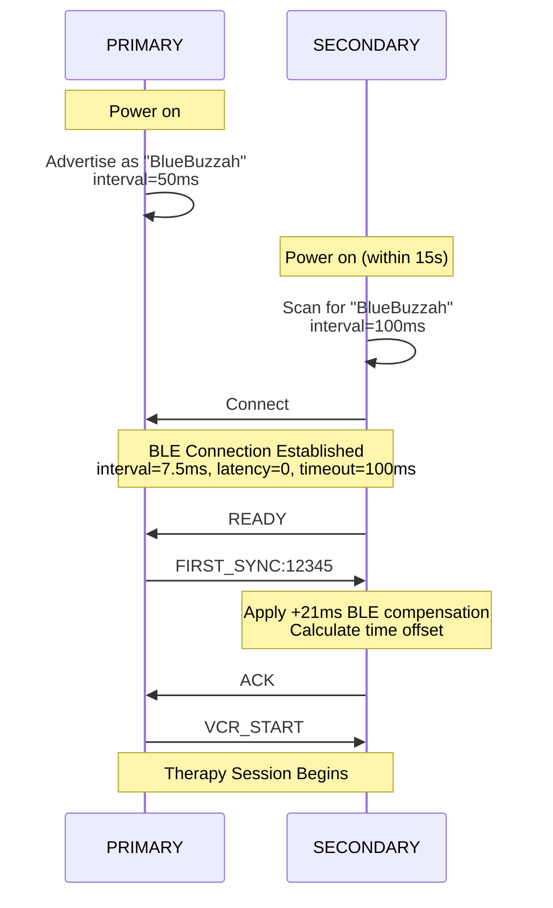
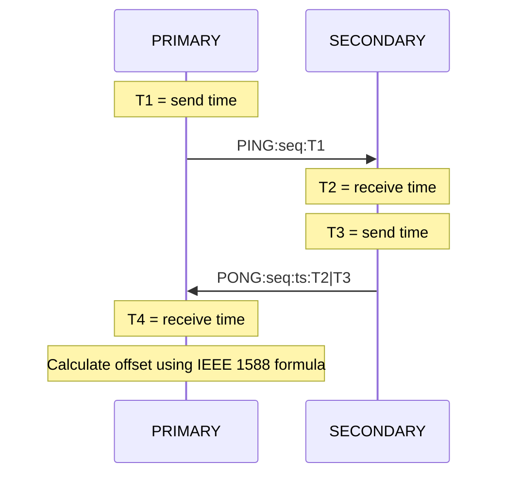
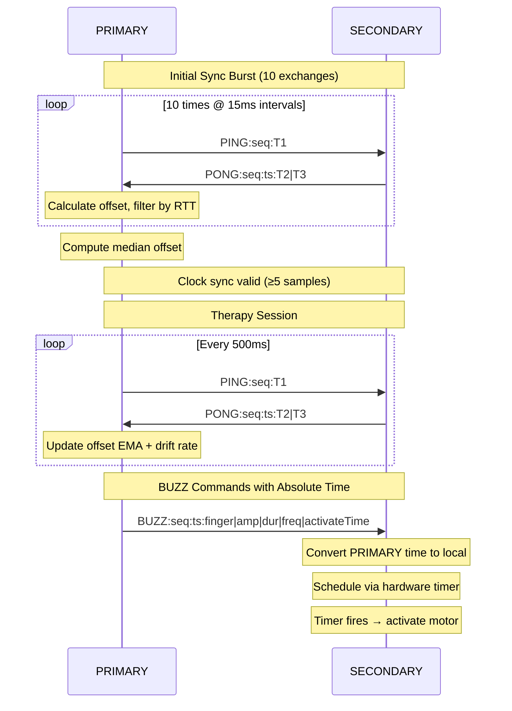
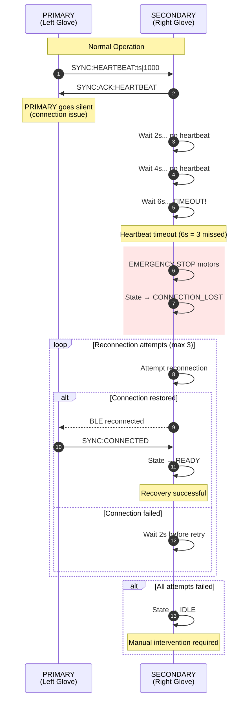
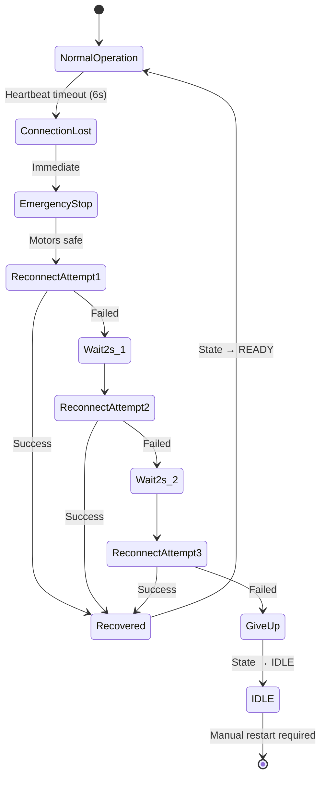

# BlueBuzzah Synchronization Protocol
**Version:** 2.1.0 (PTP Clock Synchronization)
**Date:** 2025-12-07
**Platform:** Arduino C++ / PlatformIO

---

## Table of Contents

1. [Protocol Overview](#protocol-overview)
2. [BLE Connection Establishment](#ble-connection-establishment)
3. [Time Synchronization](#time-synchronization)
4. [Command-Driven Execution](#command-driven-execution)
5. [Parameter Synchronization](#parameter-synchronization)
6. [Multi-Connection Support](#multi-connection-support)
7. [Error Recovery](#error-recovery)
8. [Timing Analysis](#timing-analysis)
9. [Message Catalog](#message-catalog)

---

### Terminology Note

This document uses the following device role terminology:
- **PRIMARY**: Initiates therapy, controls timing, connects to phone and SECONDARY
- **SECONDARY**: Follows PRIMARY commands, receives therapy instructions via BLE

Both devices run identical firmware and advertise as "BlueBuzzah". The role is determined by the `settings.json` configuration file stored in LittleFS.

---

## Protocol Overview

### Core Principles

1. **PRIMARY commands, SECONDARY obeys**: PRIMARY sends explicit commands before every action
2. **Scheduled execution**: SECONDARY receives BUZZ commands with scheduled execution timestamps
3. **Safety timeout**: SECONDARY halts therapy if PRIMARY disconnects (10s timeout)

### Synchronization Accuracy

| Metric | Value | Source |
|--------|-------|--------|
| Clock offset accuracy | <1ms | PTP median filtering |
| BLE one-way latency | 3-15ms | Measured via PING/PONG |
| Hardware timer precision | <100µs | NRF52 TIMER2 |
| **Total bilateral sync** | **±1-5ms** | Absolute time scheduling |

**Acceptable for therapy?** YES
- Human temporal resolution: ~20-40ms
- vCR therapy tolerance: <50ms bilateral lag
- Observed performance: 1-5ms well within spec

**Synchronization Method:** IEEE 1588 PTP-inspired 4-timestamp exchange with median filtering, drift compensation, and absolute time scheduling.

---

## BLE Connection Establishment

### Phase 1: Initial Connection (Legacy Single Connection)

**PRIMARY Sequence** (`src/ble_manager.cpp`):

```cpp
bool BLEManager::initPrimary() {
    // 1. Initialize Bluefruit stack
    Bluefruit.begin(2, 1);  // 2 peripheral connections, 1 central
    Bluefruit.setName("BlueBuzzah");
    Bluefruit.setTxPower(4);

    // 2. Setup UART service
    bleuart_.begin();

    // 3. Setup connection callbacks
    Bluefruit.Periph.setConnectCallback(connectCallback);
    Bluefruit.Periph.setDisconnectCallback(disconnectCallback);

    // 4. Start advertising
    startAdvertising();

    return true;
}

void BLEManager::startAdvertising() {
    Bluefruit.Advertising.addFlags(BLE_GAP_ADV_FLAGS_LE_ONLY_GENERAL_DISC_MODE);
    Bluefruit.Advertising.addTxPower();
    Bluefruit.Advertising.addService(bleuart_);
    Bluefruit.Advertising.addName();

    // Set advertising parameters
    Bluefruit.Advertising.setInterval(80, 80);  // 50ms intervals
    Bluefruit.Advertising.setFastTimeout(30);
    Bluefruit.Advertising.start(0);  // Advertise forever
}

bool BLEManager::waitForConnection(uint32_t timeoutMs) {
    uint32_t startTime = millis();

    while (millis() - startTime < timeoutMs) {
        if (Bluefruit.connected()) {
            // Optimize connection parameters
            Bluefruit.Connection(0)->requestConnectionParameter(6);  // 7.5ms interval
            return true;
        }
        delay(10);
    }

    Serial.println(F("[PRIMARY] Connection timeout"));
    return false;
}

bool BLEManager::waitForReady(uint32_t timeoutMs) {
    uint32_t startTime = millis();

    while (millis() - startTime < timeoutMs) {
        if (bleuart_.available()) {
            String message = readLine();
            if (message == "READY") {
                readyReceived_ = true;
                return true;
            }
        }
        delay(10);
    }

    return false;
}

bool BLEManager::sendFirstSync() {
    // Send FIRST_SYNC with retry (3 attempts)
    for (int attempt = 0; attempt < 3; attempt++) {
        uint32_t timestamp = millis();
        char syncMsg[32];
        snprintf(syncMsg, sizeof(syncMsg), "FIRST_SYNC:%lu", timestamp);
        bleuart_.print(syncMsg);

        // Wait for ACK (500ms timeout per attempt)
        uint32_t ackStart = millis();
        while (millis() - ackStart < 500) {
            if (bleuart_.available()) {
                String response = readLine();
                if (response == "ACK") {
                    return true;
                }
            }
            delay(10);
        }
    }

    return false;
}

void BLEManager::sendVcrStart() {
    bleuart_.print("VCR_START");
}
```

**SECONDARY Sequence** (`src/ble_manager.cpp`):

```cpp
bool BLEManager::initSecondary() {
    // 1. Initialize Bluefruit stack as Central
    Bluefruit.begin(0, 1);  // 0 peripheral, 1 central connection
    Bluefruit.setName("BlueBuzzah");

    // 2. Setup client UART service
    clientUart_.begin();
    clientUart_.setRxCallback(rxCallback);

    // 3. Setup Central callbacks
    Bluefruit.Central.setConnectCallback(centralConnectCallback);
    Bluefruit.Central.setDisconnectCallback(centralDisconnectCallback);

    // 4. Start scanning for PRIMARY
    Bluefruit.Scanner.setRxCallback(scanCallback);
    Bluefruit.Scanner.restartOnDisconnect(true);
    Bluefruit.Scanner.setInterval(160, 80);  // 100ms interval, 50ms window
    Bluefruit.Scanner.useActiveScan(false);
    Bluefruit.Scanner.start(0);  // Scan forever

    return true;
}

void BLEManager::scanCallback(ble_gap_evt_adv_report_t* report) {
    // Check if this is a BlueBuzzah device (potential PRIMARY)
    if (Bluefruit.Scanner.checkReportForService(report, clientUart_)) {
        char name[32];
        memset(name, 0, sizeof(name));
        Bluefruit.Scanner.parseReportByType(report, BLE_GAP_AD_TYPE_COMPLETE_LOCAL_NAME,
                                             (uint8_t*)name, sizeof(name));

        if (strcmp(name, "BlueBuzzah") == 0) {
            // Found PRIMARY - connect
            Bluefruit.Central.connect(report);
            Bluefruit.Scanner.stop();
        }
    }
}

bool BLEManager::waitForPrimary(uint32_t timeoutMs) {
    uint32_t startTime = millis();

    while (millis() - startTime < timeoutMs) {
        if (Bluefruit.Central.connected()) {
            // Request optimal connection parameters
            Bluefruit.Connection(0)->requestConnectionParameter(6);  // 7.5ms
            return true;
        }
        delay(10);
    }

    return false;
}

void BLEManager::sendReady() {
    clientUart_.print("READY");
}

bool BLEManager::waitForFirstSync(uint32_t timeoutMs) {
    uint32_t startTime = millis();

    while (millis() - startTime < timeoutMs) {
        if (clientUart_.available()) {
            String message = readLine();

            if (message.startsWith("FIRST_SYNC:")) {
                // Extract PRIMARY timestamp
                uint32_t receivedTimestamp = message.substring(11).toInt();

                // Get local timestamp
                uint32_t currentTime = millis();

                // Apply BLE latency compensation (+21ms)
                uint32_t adjustedSyncTime = receivedTimestamp + 21;
                int32_t timeShift = adjustedSyncTime - currentTime;

                // Store offset for future sync corrections
                initialTimeOffset_ = currentTime + timeShift;

                // Send acknowledgment
                clientUart_.print("ACK");
                return true;
            }
        }
        delay(10);
    }

    return false;
}

bool BLEManager::waitForVcrStart(uint32_t timeoutMs) {
    uint32_t startTime = millis();

    while (millis() - startTime < timeoutMs) {
        if (clientUart_.available()) {
            String message = readLine();
            if (message == "VCR_START") {
                return true;  // Ready for therapy
            }
        }
        delay(10);
    }

    return false;
}
```

**Message Flow Diagram:**



**Timing Breakdown:**

| Step | Duration | Notes |
|------|----------|-------|
| Advertisement start | 0.1s | Immediate |
| SECONDARY scan window | 0-15s | Until PRIMARY found |
| Connection establishment | 0.5-2s | BLE handshake |
| READY signal | <0.1s | Single message |
| FIRST_SYNC handshake | 0.5-1.5s | 3 retry attempts |
| VCR_START | <0.1s | Single message |
| **Total connection time** | **2-20s** | Typical: 5-10s |

### Phase 2: Multi-Connection Detection (PRIMARY Only)

**New Feature** (`src/ble_manager.cpp`):

PRIMARY supports **simultaneous connections** to phone + SECONDARY. Connection detection identifies device types by analyzing first message received.

**Detection Logic** (`src/ble_manager.cpp`):

```cpp
ConnectionType BLEManager::detectConnectionType(uint16_t connHandle, uint32_t timeoutMs) {
    /**
     * Identify connection as PHONE or SECONDARY by first message received.
     *
     * Phone sends: INFO, PING, BATTERY, PROFILE, SESSION commands
     * SECONDARY sends: READY (immediately after connecting)
     *
     * Returns: PHONE, SECONDARY, or UNKNOWN
     */
    uint32_t timeoutEnd = millis() + timeoutMs;

    while (millis() < timeoutEnd) {
        if (bleuart_.available()) {
            String message = readLine();

            if (message == "READY") {
                return ConnectionType::SECONDARY;
            }

            // Check for phone commands
            static const char* phoneCommands[] = {
                "INFO", "PING", "BATTERY", "PROFILE", "SESSION", "HELP", "PARAM"
            };

            for (int i = 0; i < 7; i++) {
                if (message.indexOf(phoneCommands[i]) >= 0) {
                    // Re-process this message since it's a valid command
                    pendingMessage_ = message;
                    return ConnectionType::PHONE;
                }
            }
        }
        delay(100);
    }

    return ConnectionType::UNKNOWN;  // Timeout - unknown device
}
```

**Connection Assignment** (`src/ble_manager.cpp`):

```cpp
void BLEManager::assignConnectionByType(uint16_t connHandle, ConnectionType type) {
    /**
     * Assign connections to phone/secondary based on detected types.
     */
    switch (type) {
        case ConnectionType::PHONE:
            phoneConnHandle_ = connHandle;
            hasPhoneConnection_ = true;
            // Request optimal parameters
            Bluefruit.Connection(connHandle)->requestConnectionParameter(6);
            Serial.println(F("[PRIMARY] Phone connected"));
            break;

        case ConnectionType::SECONDARY:
            secondaryConnHandle_ = connHandle;
            hasSecondaryConnection_ = true;
            Bluefruit.Connection(connHandle)->requestConnectionParameter(6);
            Serial.println(F("[PRIMARY] SECONDARY connected"));
            break;

        default:
            // Unknown device - disconnect
            Bluefruit.Connection(connHandle)->disconnect();
            break;
    }
}
```

**Multi-Connection Scenarios** (`src/main.cpp`):

```cpp
void handleMultipleConnections() {
    bool hasPhone = bleManager.hasPhoneConnection();
    bool hasSecondary = bleManager.hasSecondaryConnection();

    // Scenario 1: Both phone and SECONDARY connected during startup
    if (hasPhone && hasSecondary) {
        connectionSuccess = bleManager.completeSecondaryHandshake();
    }
    // Scenario 2: Phone only - wait for SECONDARY
    else if (hasPhone && !hasSecondary) {
        connectionSuccess = bleManager.scanForSecondaryWhileAdvertising();
        if (connectionSuccess) {
            connectionSuccess = bleManager.completeSecondaryHandshake();
        }
    }
    // Scenario 3: SECONDARY only - proceed without phone
    else if (hasSecondary && !hasPhone) {
        connectionSuccess = bleManager.completeSecondaryHandshake();
    }
    // Scenario 4: Unknown devices - cannot proceed
    else {
        connectionSuccess = false;
    }
}
```

**SECONDARY Handshake** (`src/ble_manager.cpp`):

```cpp
bool BLEManager::completeSecondaryHandshake() {
    // 1. Wait for READY (8s timeout)
    if (!waitForReady(8000)) {
        Serial.println(F("[PRIMARY] No READY received"));
        return false;
    }

    // 2. Send FIRST_SYNC (3 retry attempts)
    if (!sendFirstSync()) {
        Serial.println(F("[PRIMARY] No ACK received"));
        return false;
    }

    // 3. Send VCR_START
    sendVcrStart();

    Serial.println(F("[PRIMARY] SECONDARY handshake complete"));
    return true;
}
```

---

## Time Synchronization

BlueBuzzah uses an IEEE 1588 PTP-inspired clock synchronization protocol to achieve sub-millisecond bilateral coordination between PRIMARY and SECONDARY devices.

### PTP Clock Synchronization

**Overview**: The Precision Time Protocol (PTP) uses 4 timestamps to calculate clock offset independent of network asymmetry.

**Timestamp Exchange:**



**PTP Offset Formula** (`src/sync_protocol.cpp`):
```cpp
int64_t SimpleSyncProtocol::calculatePTPOffset(uint64_t t1, uint64_t t2,
                                                uint64_t t3, uint64_t t4) {
    // IEEE 1588 PTP clock offset formula:
    // offset = ((T2 - T1) + (T3 - T4)) / 2
    //
    // This formula is mathematically independent of network asymmetry.
    // Positive offset means SECONDARY clock is ahead of PRIMARY.

    int64_t term1 = (int64_t)t2 - (int64_t)t1;  // Forward delay + offset
    int64_t term2 = (int64_t)t3 - (int64_t)t4;  // Reverse delay - offset

    return (term1 + term2) / 2;
}
```

**Why PTP?**
- Eliminates fixed latency assumptions (no +21ms hardcode)
- Compensates for asymmetric network delays
- Achieves <1ms accuracy with median filtering

### Initial Sync Burst

**Purpose**: Establish accurate clock offset before therapy begins

**Protocol Parameters** (`include/config.h`):
| Parameter | Value | Purpose |
|-----------|-------|---------|
| `SYNC_BURST_COUNT` | 10 | Number of PING/PONG exchanges |
| `SYNC_BURST_INTERVAL_MS` | 15 | Interval between PINGs |
| `SYNC_MIN_VALID_SAMPLES` | 5 | Minimum samples for valid sync |
| `SYNC_RTT_QUALITY_THRESHOLD_US` | 30000 | Reject RTT > 30ms |

**Burst Sequence:**
1. PRIMARY sends 10 PINGs at 15ms intervals
2. SECONDARY responds to each with PONG containing T2 and T3
3. PRIMARY calculates offset for each exchange
4. Samples with RTT > 30ms are rejected (quality filtering)
5. Median offset is computed from valid samples
6. Sync is valid when ≥5 samples collected

**Median Filtering** (`src/sync_protocol.cpp`):
```cpp
void SimpleSyncProtocol::addOffsetSample(int64_t offset) {
    // Add sample to circular buffer (10 samples)
    _offsetSamples[_offsetSampleIndex] = offset;
    _offsetSampleIndex = (_offsetSampleIndex + 1) % OFFSET_SAMPLE_COUNT;

    if (_offsetSampleCount < OFFSET_SAMPLE_COUNT) {
        _offsetSampleCount++;
    }

    // Compute median when we have enough samples
    if (_offsetSampleCount >= SYNC_MIN_VALID_SAMPLES) {
        // Sort and extract median...
        _clockSyncValid = true;
    }
}
```

**RTT Quality Filtering** (`src/sync_protocol.cpp`):
```cpp
bool SimpleSyncProtocol::addOffsetSampleWithQuality(int64_t offset, uint32_t rttUs) {
    // Reject samples with excessive RTT - these likely have asymmetric delays
    if (rttUs > SYNC_RTT_QUALITY_THRESHOLD_US) {
        return false;  // Sample rejected
    }
    addOffsetSample(offset);
    return true;  // Sample accepted
}
```

### Drift Compensation

**Purpose**: Maintain sync accuracy during long therapy sessions

Crystal oscillators drift over time. Without compensation, a 20ppm drift accumulates ~1.2ms error per minute.

**Protocol Parameters:**
| Parameter | Value | Purpose |
|-----------|-------|---------|
| `SYNC_MAINTENANCE_INTERVAL_MS` | 500 | Periodic PING/PONG interval |
| `SYNC_OFFSET_EMA_ALPHA` | 0.1 | Slow EMA smoothing factor |

**EMA Offset Update** (`src/sync_protocol.cpp`):
```cpp
void SimpleSyncProtocol::updateOffsetEMA(int64_t offset) {
    // Update drift rate estimate
    uint32_t elapsed = now - _lastOffsetTime;
    if (elapsed >= 100) {
        int64_t delta = offset - _lastMeasuredOffset;
        float newRate = (float)delta / (float)elapsed;  // μs per ms
        _driftRateUsPerMs = 0.3f * newRate + 0.7f * _driftRateUsPerMs;
    }

    // EMA: new = α * measured + (1-α) * previous
    _medianOffset = (SYNC_OFFSET_EMA_ALPHA_NUM * offset +
                     (SYNC_OFFSET_EMA_ALPHA_DEN - SYNC_OFFSET_EMA_ALPHA_NUM) * _medianOffset)
                    / SYNC_OFFSET_EMA_ALPHA_DEN;
}
```

**Drift-Corrected Offset:**
```cpp
int64_t SimpleSyncProtocol::getCorrectedOffset() const {
    // Apply drift compensation based on time since last measurement
    uint32_t elapsed = millis() - _lastOffsetTime;
    int64_t driftCorrection = (int64_t)(_driftRateUsPerMs * (float)elapsed);
    return _medianOffset + driftCorrection;
}
```

### Adaptive Lead Time

**Purpose**: Calculate optimal lead time for scheduling commands

BUZZ commands include an absolute activation time. The lead time determines how far in the future to schedule, accounting for BLE transmission delay plus safety margin.

**Calculation** (`src/sync_protocol.cpp`):
```cpp
uint32_t SimpleSyncProtocol::calculateAdaptiveLeadTime() const {
    if (_sampleCount < MIN_SAMPLES) {
        return SYNC_LEAD_TIME_US;  // Default 50ms
    }

    // Lead time = RTT + 3σ margin
    uint32_t avgRTT = _smoothedLatencyUs * 2;  // RTT = 2 * one-way
    uint32_t margin = _rttVariance * 6;        // 3-sigma * 2 (one-way to RTT scale)

    uint32_t leadTime = avgRTT + margin;

    // Clamp to reasonable bounds: 15-50ms
    // CRITICAL: Max 50ms because TIME_ON = 100ms
    // If lead time > TIME_ON, deactivate() fires before activation!
    if (leadTime < 15000) leadTime = 15000;
    else if (leadTime > 50000) leadTime = 50000;

    return leadTime;
}
```

**Why 50ms Maximum?**
- Therapy TIME_ON = 100ms (motor activation duration)
- If lead time exceeds TIME_ON, the motor is deactivated before activation fires
- 50ms maximum provides 50ms buffer for timing safety

### Hardware Timer Scheduling

**Purpose**: Microsecond-precision motor activation timing

SECONDARY uses NRF52840 hardware TIMER2 to schedule motor activations at exact times.

**Time Conversion** (`src/sync_protocol.cpp`):
```cpp
// Convert PRIMARY clock time to SECONDARY local time
uint64_t SimpleSyncProtocol::primaryToLocalTime(uint64_t primaryTime) const {
    // offset = SECONDARY - PRIMARY, so local = primary + offset
    return primaryTime + getCorrectedOffset();
}
```

**Hardware Timer** (`src/sync_timer.cpp`):
```cpp
bool SyncTimer::scheduleAbsoluteActivation(uint64_t absoluteTimeUs,
                                            uint8_t finger, uint8_t amplitude) {
    uint64_t now = getMicros();

    // Check if target time has already passed
    if (absoluteTimeUs <= now) {
        _activationPending = true;  // Activate immediately
        return false;
    }

    // Calculate delay from now to target time
    uint32_t delayUs = (uint32_t)(absoluteTimeUs - now);

    // Arm hardware timer
    scheduleActivation(delayUs, finger, amplitude);
    return true;
}
```

**ISR Architecture:**
```
scheduleAbsoluteActivation() → arms TIMER2
                                   ↓
                            Timer fires (ISR)
                                   ↓
                      Sets _activationPending = true
                                   ↓
          processPendingActivation() called in loop()
                                   ↓
                    Executes motor activation (I2C-safe)
```

### Sync Flow Diagram



---

## Command-Driven Execution

### BUZZ Protocol

**Core Synchronization Mechanism** - Absolute time scheduling with compact positional format

**Message Format (with scheduled time)**:
```
BUZZ:sequence_id|timestamp|finger|amplitude|duration|frequency|activateTime
```

**Example**:
```
BUZZ:42|5000000|0|100|100|235|5050000
```
- `42` = sequence ID
- `5000000` = command timestamp (microseconds)
- `0` = finger index
- `100` = amplitude percentage (0-100)
- `100` = duration in ms (TIME_ON)
- `235` = frequency in Hz
- `5050000` = scheduled activation time (PRIMARY clock, microseconds)

**PRIMARY Sends with Scheduled Time** (`src/sync_protocol.cpp`):
```cpp
// Calculate activation time: now + lead time
uint64_t activateTime = getMicros() + syncProtocol.calculateAdaptiveLeadTime();

// Create BUZZ with scheduled activation
SyncCommand cmd = SyncCommand::createBuzzWithTime(
    sequenceId, finger, amplitude, durationMs, frequencyHz, activateTime);

char buffer[128];
cmd.serialize(buffer, sizeof(buffer));
ble.sendToSecondary(buffer);
// Result: "BUZZ:42|5000000|0|100|100|235|5050000"

// PRIMARY also schedules own activation at same absolute time
syncTimer.scheduleAbsoluteActivation(activateTime, finger, amplitude);
```

**SECONDARY Receives and Schedules**:
```cpp
SyncCommand cmd;
if (cmd.deserialize(message)) {
    if (cmd.getType() == SyncCommandType::BUZZ) {
        int32_t finger = cmd.getDataInt("0", -1);
        int32_t amplitude = cmd.getDataInt("1", 50);
        int32_t durationMs = cmd.getDataInt("2", 100);
        int32_t frequencyHz = cmd.getDataInt("3", 235);
        uint64_t activateTime = cmd.getDataInt("4", 0);  // PRIMARY clock time

        // Convert PRIMARY time to local SECONDARY time
        uint64_t localTime = syncProtocol.primaryToLocalTime(activateTime);

        // Schedule via hardware timer for precise activation
        syncTimer.scheduleAbsoluteActivation(localTime, finger, amplitude);
    }
}
```

**Synchronization Flow:**
```
PRIMARY                                    SECONDARY
   │                                           │
   │ activateTime = now + leadTime             │
   │ Send BUZZ with activateTime ──────────────│───▶ Receive BUZZ
   │ Schedule local timer                      │     Convert to local time
   │                                           │     Schedule local timer
   │                                           │
   │ ◄─────── Both timers fire at same absolute time ───────►
   │ Activate motor                            │     Activate motor
   │                                           │
```

**SECONDARY Safety Timeout** (`src/therapy_engine.cpp`):
```cpp
// If no BUZZ received within 10 seconds, PRIMARY likely disconnected
if (timeout) {
    Serial.println(F("[SECONDARY] ERROR: BUZZ timeout! PRIMARY disconnected."));
    hardware_.allMotorsOff();  // Immediate motor shutoff
    hardware_.setLED(COLOR_RED);  // Red error indicator
}
```

### Therapy Loop Integration

**PRIMARY Execution** (`src/therapy_engine.cpp`):
```cpp
for (uint8_t seqIdx = 0; seqIdx < 3; seqIdx++) {  // Three buzzes per macrocycle
    // 1. Calculate scheduled activation time
    uint64_t activateTime = getMicros() + sync.calculateAdaptiveLeadTime();

    // 2. Send BUZZ command to SECONDARY with scheduled time
    sendBuzzWithScheduledTime(ble_, seqIdx, activateTime);

    // 3. Schedule local activation at same absolute time
    syncTimer.scheduleAbsoluteActivation(activateTime, finger, amplitude);
}
```

**SECONDARY Execution**:
```cpp
// Non-blocking - processes BUZZ commands as they arrive
void handleBuzzCommand(const SyncCommand& cmd) {
    uint64_t activateTime = cmd.getActivateTime();

    // Convert PRIMARY time to local time
    uint64_t localTime = syncProtocol.primaryToLocalTime(activateTime);

    // Schedule via hardware timer
    syncTimer.scheduleAbsoluteActivation(localTime, finger, amplitude);
}

// In loop(): poll for pending timer activations
syncTimer.processPendingActivation();
```

**Synchronization Guarantee:**
- SECONDARY receives BUZZ commands with absolute activation timestamps
- PRIMARY and SECONDARY both schedule activations at same absolute time
- Clock offset compensated via PTP synchronization
- Hardware timer provides <100µs scheduling precision
- Processing overhead: ~5-10ms
- **Total lag**: SECONDARY buzzes 7.5-20ms after PRIMARY
- **Acceptable**: Well within human temporal resolution (20-40ms)

---

## Parameter Synchronization

### Protocol: PARAM_UPDATE

**When Triggered:**
1. **PROFILE_LOAD**: Broadcast ALL parameters
2. **PROFILE_CUSTOM**: Broadcast changed parameters only
3. **PARAM_SET**: Broadcast single parameter

**PRIMARY Sends** (`src/menu_controller.cpp`):
```cpp
void MenuController::broadcastParamUpdate(const TherapyConfig& config) {
    /**
     * Broadcast parameter update to SECONDARY.
     *
     * Protocol: PARAM_UPDATE:KEY1:VALUE1:KEY2:VALUE2:...\n
     *
     * Example:
     *     config with timeOnMs=150, timeOffMs=80, jitter=10
     *     -> PARAM_UPDATE:TIME_ON:150:TIME_OFF:80:JITTER:10\n
     */
    String cmdString = "PARAM_UPDATE";

    // Add all parameters to the message
    cmdString += ":TIME_ON:" + String(config.timeOnMs);
    cmdString += ":TIME_OFF:" + String(config.timeOffMs);
    cmdString += ":JITTER:" + String(config.jitter);
    cmdString += ":MIRROR:" + String(config.mirror ? 1 : 0);
    cmdString += ":SYNC_LED:" + String(config.syncLed ? 1 : 0);
    cmdString += ":SESSION:" + String(config.sessionMinutes);
    cmdString += ":FREQ:" + String(config.actuatorFrequency);
    cmdString += ":VOLTAGE:" + String(config.actuatorVoltage, 2);

    ble_.sendToSecondary(cmdString.c_str());
    Serial.println(F("[PRIMARY] Broadcast parameters to SECONDARY"));
}
```

**SECONDARY Receives** (`src/menu_controller.cpp`):
```cpp
void MenuController::handleParamUpdate(const String& message) {
    /**
     * Apply parameter update from PRIMARY.
     *
     * Args:
     *     message: "PARAM_UPDATE:KEY1:VALUE1:KEY2:VALUE2:..."
     */
    // Skip "PARAM_UPDATE:" prefix
    String params = message.substring(13);

    // Parse key:value pairs
    int pos = 0;
    while (pos < params.length()) {
        int colonPos = params.indexOf(':', pos);
        if (colonPos < 0) break;

        String key = params.substring(pos, colonPos);
        pos = colonPos + 1;

        int nextColon = params.indexOf(':', pos);
        String value = (nextColon < 0) ?
            params.substring(pos) :
            params.substring(pos, nextColon);

        // Apply parameter
        applyParameter(key, value);

        pos = (nextColon < 0) ? params.length() : nextColon + 1;
    }

    Serial.println(F("[SECONDARY] Applied parameters from PRIMARY"));

    // Send acknowledgment (optional, for debugging)
    ble_.sendToPrimary("ACK_PARAM_UPDATE");
}

void MenuController::applyParameter(const String& key, const String& value) {
    if (key == "TIME_ON") {
        currentConfig_.timeOnMs = value.toInt();
    } else if (key == "TIME_OFF") {
        currentConfig_.timeOffMs = value.toInt();
    } else if (key == "JITTER") {
        currentConfig_.jitter = value.toInt();
    } else if (key == "MIRROR") {
        currentConfig_.mirror = (value == "1");
    } else if (key == "SYNC_LED") {
        currentConfig_.syncLed = (value == "1");
    } else if (key == "SESSION") {
        currentConfig_.sessionMinutes = value.toInt();
    } else if (key == "FREQ") {
        currentConfig_.actuatorFrequency = value.toInt();
    } else if (key == "VOLTAGE") {
        currentConfig_.actuatorVoltage = value.toFloat();
    }
}
```

### Synchronization Scenarios

**Scenario 1: PROFILE_LOAD** (ALL parameters)
```
Phone -> PRIMARY: PROFILE_LOAD:2\x04
PRIMARY: <loads Noisy VCR profile>
PRIMARY -> Phone: STATUS:LOADED\nPROFILE:Noisy VCR\x04
PRIMARY -> SECONDARY: PARAM_UPDATE:TIME_ON:100:TIME_OFF:67:...
SECONDARY: <applies all parameters>
SECONDARY -> PRIMARY: ACK_PARAM_UPDATE (optional)
```

**Scenario 2: PROFILE_CUSTOM** (changed parameters only)
```
Phone -> PRIMARY: PROFILE_CUSTOM:TIME_ON:150:JITTER:10\x04
PRIMARY: <updates 2 parameters>
PRIMARY -> Phone: STATUS:CUSTOM_LOADED\nTIME_ON:150\nJITTER:10\x04
PRIMARY -> SECONDARY: PARAM_UPDATE:TIME_ON:150:JITTER:10
SECONDARY: <applies 2 parameters>
SECONDARY -> PRIMARY: ACK_PARAM_UPDATE (optional)
```

**Scenario 3: PARAM_SET** (single parameter)
```
Phone -> PRIMARY: PARAM_SET:TIME_ON:150\x04
PRIMARY: <updates 1 parameter>
PRIMARY -> Phone: PARAM:TIME_ON\nVALUE:150\x04
PRIMARY -> SECONDARY: PARAM_UPDATE:TIME_ON:150
SECONDARY: <applies 1 parameter>
SECONDARY -> PRIMARY: ACK_PARAM_UPDATE (optional)
```

### Validation and Error Handling

**PRIMARY Validation** (`src/profile_manager.cpp`):
```cpp
bool ProfileManager::validateAndBroadcast(const TherapyConfig& config, BLEManager& ble) {
    // 1. Validate parameters before sending
    if (!validateConfig(config)) {
        ble.sendError("Invalid configuration");
        return false;
    }

    // 2. Apply to local profile
    currentConfig_ = config;

    // 3. Broadcast to SECONDARY
    broadcastParamUpdate(config);

    return true;
}

bool ProfileManager::validateConfig(const TherapyConfig& config) {
    // TIME_ON: 50-500ms
    if (config.timeOnMs < 50 || config.timeOnMs > 500) return false;

    // TIME_OFF: 20-200ms
    if (config.timeOffMs < 20 || config.timeOffMs > 200) return false;

    // ACTUATOR_FREQUENCY: 150-300Hz
    if (config.actuatorFrequency < 150 || config.actuatorFrequency > 300) return false;

    // ACTUATOR_VOLTAGE: 1.0-3.3V
    if (config.actuatorVoltage < 1.0f || config.actuatorVoltage > 3.3f) return false;

    // JITTER: 0-50%
    if (config.jitter > 50) return false;

    // SESSION: 1-180 minutes
    if (config.sessionMinutes < 1 || config.sessionMinutes > 180) return false;

    return true;
}
```

### No Bidirectional Validation

**Important**: There is **no verification** that both gloves are running identical profiles.

**Why?**
- Fire-and-forget design for minimal latency
- Optional ACK for debugging (not required)
- Both gloves validate independently via same validation rules
- Parameter changes rare (only during configuration, not therapy)

**Risk**: If SECONDARY rejects parameters (e.g., out of range), PRIMARY doesn't know
**Mitigation**: Identical validation logic on both sides ensures consistency

---

## Multi-Connection Support

### Connection Types

**Three Device Types:**
1. **PHONE**: Smartphone app for configuration/monitoring
2. **SECONDARY**: SECONDARY glove for bilateral therapy
3. **UNKNOWN**: Unidentified devices (rejected)

### Connection Detection

**Identification Strategy** (`src/ble_manager.cpp`):

```cpp
// Phone detection: Commands within 3 seconds
static const char* phoneCommands[] = {
    "INFO", "PING", "BATTERY", "PROFILE", "SESSION", "HELP", "PARAM"
};

if (messageContainsAny(firstMessage, phoneCommands, 7)) {
    return ConnectionType::PHONE;
}

// SECONDARY detection: READY message within 3 seconds
if (firstMessage == "READY") {
    return ConnectionType::SECONDARY;
}

// Unknown: Timeout or unrecognized message
return ConnectionType::UNKNOWN;
```

**Why 3-second timeout?**
- Phone app should send command immediately after connecting
- SECONDARY sends READY within 100ms of connection
- 3s provides margin for slower devices

### UART Routing

**PRIMARY has separate connection handles:**
```cpp
class BLEManager {
    uint16_t phoneConnHandle_;       // Smartphone communication
    uint16_t secondaryConnHandle_;   // SECONDARY glove communication
    bool hasPhoneConnection_;
    bool hasSecondaryConnection_;
};
```

**Routing Logic:**
```cpp
void BLEManager::sendToPhone(const char* message) {
    if (hasPhoneConnection_) {
        bleuart_.write(phoneConnHandle_, message, strlen(message));
    }
}

void BLEManager::sendToSecondary(const char* message) {
    if (hasSecondaryConnection_) {
        bleuart_.write(secondaryConnHandle_, message, strlen(message));
    }
}
```

### Connection Scenarios

**Scenario 1: Phone Only** (No SECONDARY)
```
1. Phone connects -> Detected as PHONE
2. phoneConnHandle_ assigned
3. SECONDARY not connected -> Therapy unavailable
4. Phone can: Check battery (PRIMARY only), modify profiles, calibrate PRIMARY fingers
5. SESSION_START -> ERROR: SECONDARY not connected
```

**Scenario 2: SECONDARY Only** (No Phone)
```
1. SECONDARY connects -> Detected as SECONDARY
2. secondaryConnHandle_ assigned
3. Complete handshake: READY -> SYNC -> ACK -> VCR_START
4. Auto-start therapy after startup window
5. No smartphone monitoring/control
```

**Scenario 3: Phone + SECONDARY** (Full Featured)
```
1. Both connect during startup window
2. Identify types: phoneConnHandle_ + secondaryConnHandle_ assigned
3. Complete SECONDARY handshake
4. Phone can: Monitor battery (both gloves), control session, modify profiles
5. SECONDARY synchronized for bilateral therapy
6. Phone sees interleaved PRIMARY<->SECONDARY messages (BUZZ, PARAM_UPDATE, etc.)
```

**Scenario 4: Phone First, SECONDARY Later**
```
1. Phone connects -> phoneConnHandle_ assigned
2. SECONDARY not connected -> secondaryConnHandle_ = invalid
3. Wait for SECONDARY: scanForSecondaryWhileAdvertising()
4. SECONDARY connects -> secondaryConnHandle_ assigned
5. Complete SECONDARY handshake
6. Proceed with therapy
```

### Message Interleaving (Phone Perspective)

**Problem**: Phone may receive internal PRIMARY<->SECONDARY messages

**Example RX stream at phone:**
```
PONG\n\x04                           <- Response to PING
SYNC:BUZZ:42|5000000|0|100\x04       <- PRIMARY->SECONDARY internal message
BATP:3.72\nBATS:3.68\n\x04           <- Response to BATTERY
SYNC:BUZZ:43|5200000|1|100\x04       <- PRIMARY->SECONDARY internal message
SESSION_STATUS:RUNNING\n...\n\x04    <- Response to SESSION_STATUS
```

**Note**: ALL messages end with EOT (`\x04`), including internal sync messages. Use prefix-based filtering.

**Filtering Strategy** (recommended for phone app):
```cpp
// C++ example for phone app filtering
void onBleNotification(const uint8_t* data, size_t length) {
    String message((char*)data, length);

    // Filter internal PRIMARY<->SECONDARY messages by prefix
    if (isInternalMessage(message)) {
        return;  // Ignore sync messages
    }

    // Process app-directed response
    processResponse(message);
}

bool isInternalMessage(const String& msg) {
    return msg.startsWith("SYNC:") ||
           msg.startsWith("BUZZ:") ||
           msg.startsWith("PARAM_UPDATE:") ||
           msg.startsWith("SEED:") ||
           msg.startsWith("BATRESPONSE:") ||
           msg == "SEED_ACK\x04" ||
           msg == "GET_BATTERY\x04" ||
           msg == "ACK_PARAM_UPDATE\x04";
}
```

**Internal Messages to Ignore** (all end with `\x04`):
- `SYNC:BUZZ:seq:ts:finger|amplitude` (every ~200ms during therapy)
- `PARAM_UPDATE:KEY:VAL:...` (during profile changes)
- `GET_BATTERY` (when phone queries battery)
- `BATRESPONSE:V` (SECONDARY response to PRIMARY)
- `ACK_PARAM_UPDATE` (SECONDARY acknowledgment)
- `SEED:N` / `SEED_ACK` (random seed sync)

---

## Error Recovery

### Connection Loss Detection Flow



### Recovery State Machine



### Connection Failures

**PRIMARY Timeout** (`src/ble_manager.cpp`):
```cpp
if (!secondaryFound) {
    Serial.print(F("[PRIMARY] ERROR: No SECONDARY found in "));
    Serial.print(CONNECTION_TIMEOUT_MS / 1000);
    Serial.println(F("s! Restart required."));
    hardware_.setLED(COLOR_RED);  // Red indicator
    return false;
}
```

**SECONDARY Timeout** (`src/ble_manager.cpp`):
```cpp
if (!primaryFound) {
    Serial.print(F("[SECONDARY] ERROR: No PRIMARY found in "));
    Serial.print(CONNECTION_TIMEOUT_MS / 1000);
    Serial.println(F("s! Restart required."));
    hardware_.setLED(COLOR_RED);
    return false;
}
```

**Recovery**: Manual power cycle required (no auto-retry)

### Handshake Failures

**READY Timeout** (`src/ble_manager.cpp`):
```cpp
if (!readyReceived) {
    Serial.println(F("[PRIMARY] ERROR: No READY received! Restart required."));
    hardware_.setLED(COLOR_RED);
    return false;
}
```

**ACK Timeout** (`src/ble_manager.cpp`):
```cpp
if (!ackReceived) {
    Serial.println(F("[PRIMARY] ERROR: No ACK received! Restart required."));
    hardware_.setLED(COLOR_RED);
    return false;
}
```

**Recovery**: Manual power cycle (no retry after handshake failure)

### Therapy Execution Errors

**SECONDARY BUZZ Timeout** (`src/therapy_engine.cpp`):
```cpp
if (receivedIdx < 0) {
    Serial.println(F("[SECONDARY] ERROR: BUZZ timeout! PRIMARY disconnected."));
    Serial.println(F("[SECONDARY] Stopping all motors for safety..."));
    hardware_.allMotorsOff();
    hardware_.setLED(COLOR_RED);

    // Enter infinite error loop
    while (true) {
        hardware_.setLED(COLOR_RED);
        delay(500);
        hardware_.setLED(COLOR_OFF);
        delay(500);
    }
}
```

**Recovery**: None - device halts, requires manual restart


### Connection Health Monitoring

#### Heartbeat Protocol

During active therapy sessions, PRIMARY sends periodic heartbeat messages to SECONDARY to detect connection loss early.

**Heartbeat Parameters** (`include/config.h`):

| Parameter | Value | Description |
|-----------|-------|-------------|
| `HEARTBEAT_INTERVAL_MS` | 2000 | PRIMARY sends heartbeat every 2 seconds |
| `HEARTBEAT_TIMEOUT_MS` | 6000 | SECONDARY timeout (3 missed heartbeats) |

**Heartbeat Message Format**:
```
SYNC:HEARTBEAT:ts|<timestamp_microseconds>
```

**PRIMARY Heartbeat Sender** (`src/sync_protocol.cpp`):
```cpp
void SyncProtocol::sendHeartbeat(BLEManager& ble) {
    // During therapy, PRIMARY sends heartbeat every 2 seconds
    if (millis() - lastHeartbeatTime_ >= HEARTBEAT_INTERVAL_MS) {
        uint32_t timestampUs = micros();
        char message[48];
        snprintf(message, sizeof(message), "HEARTBEAT:%lu|%lu", sequenceId, timestampUs);
        ble.sendToSecondary(message);
        lastHeartbeatTime_ = millis();
    }
}
```

**SECONDARY Heartbeat Receiver** (`src/sync_protocol.cpp`):
```cpp
void SyncProtocol::checkHeartbeat() {
    // SECONDARY monitors for heartbeat timeout
    if (millis() - lastHeartbeatReceived_ > HEARTBEAT_TIMEOUT_MS) {
        Serial.println(F("[SECONDARY] Heartbeat timeout - PRIMARY connection lost"));
        stateMachine_.transitionTo(TherapyState::CONNECTION_LOST);
    }
}
```

**Recovery Behavior**:
- SECONDARY detects timeout after 6 seconds (3 missed heartbeats)
- Motors are stopped immediately for safety
- LED shows red flashing pattern
- Device requires manual restart

#### Periodic Health Check

**Connection Status Check** (`src/ble_manager.cpp`):
```cpp
ConnectionHealth BLEManager::checkConnectionHealth() {
    ConnectionHealth result = {false, false, false, false};

    // Check phone connection
    if (hasPhoneConnection_) {
        if (!Bluefruit.Connection(phoneConnHandle_)->connected()) {
            result.phoneLost = true;
            hasPhoneConnection_ = false;  // Clear stale reference
        } else {
            result.phoneConnected = true;
        }
    }

    // Check SECONDARY connection (CRITICAL)
    if (hasSecondaryConnection_) {
        if (!Bluefruit.Connection(secondaryConnHandle_)->connected()) {
            result.secondaryLost = true;
            hasSecondaryConnection_ = false;  // Clear stale reference
        } else {
            result.secondaryConnected = true;
        }
    }

    return result;
}
```

**Usage**:
- Called periodically during therapy (~every 10 seconds)
- Phone disconnect: Non-fatal (therapy continues)
- SECONDARY disconnect: Detected via BUZZ timeout (10s), then halt

---

## Timing Analysis

### PTP Synchronization Accuracy

**Initial Sync Burst Performance:**

| Metric | Value | Notes |
|--------|-------|-------|
| Samples collected | 10 | SYNC_BURST_COUNT |
| Samples accepted | 8-10 typical | RTT < 30ms filter |
| Median offset accuracy | <1ms | After filtering outliers |
| Sync burst duration | ~150ms | 10 × 15ms intervals |

**Ongoing Sync Maintenance:**

| Metric | Value | Notes |
|--------|-------|-------|
| Maintenance interval | 500ms | SYNC_MAINTENANCE_INTERVAL_MS |
| Drift rate | 0-20 µs/ms | Crystal-dependent |
| Drift compensation | EMA smoothed | α = 0.1 |
| Max error between syncs | <1ms | With drift compensation |

### Critical Path Timing (with PTP)

**Buzz Sequence Execution** (one of three per macrocycle):

| Event | Time (µs) | Notes |
|-------|-----------|-------|
| PRIMARY: Calculate lead time | 50-100 | calculateAdaptiveLeadTime() |
| PRIMARY: Create BUZZ command | 100-200 | With scheduled time |
| PRIMARY: Send BUZZ | 50-100 | BLE UART write |
| BLE transmission | 3,000-15,000 | One-way latency |
| SECONDARY: Receive + parse | 200-500 | Command processing |
| SECONDARY: Convert time | 10-50 | primaryToLocalTime() |
| SECONDARY: Schedule timer | 50-100 | scheduleAbsoluteActivation() |
| **Wait for scheduled time** | **15,000-50,000** | Lead time minus elapsed |
| **Both timers fire** | **<100 difference** | Simultaneous activation |

**Key Observation**: With PTP synchronization and absolute time scheduling, bilateral sync error is < 1ms (down from 15-30ms in legacy approach)

**Acceptable?** EXCELLENT - Far exceeds requirements (50ms tolerance)

### Macrocycle Timing

**One Macrocycle** (3 buzzes + 2 relax periods):

```
Buzz 1: 100ms ON + 67ms OFF = 167ms
Buzz 2: 100ms ON + 67ms OFF = 167ms
Buzz 3: 100ms ON + 67ms OFF = 167ms
Relax 1: 4 * (100 + 67) = 668ms
Relax 2: 4 * (100 + 67) = 668ms
--------------------------------------
Total: 1837ms (~1.8 seconds per macrocycle)
```

**Per Session** (120 minutes):
```
Total macrocycles: (120 * 60) / 1.837 = 3,920 macrocycles
Total buzzes: 3,920 * 3 = 11,760 buzzes per glove
Total BUZZ messages: 11,760 messages over 2 hours
```

**BLE Bandwidth** (~12,000 messages over 2 hours):
```
Messages: BUZZ (11,760)
Total: ~11,760 messages
Rate: 11,760 / 7200s = 1.6 messages/second
Data: ~20 bytes/message * 11,760 = 235KB over 2 hours
```

**Conclusion**: Extremely low bandwidth usage (~0.03 KB/s average)

### Latency Budget

**TARGET: <50ms bilateral synchronization** (therapy requirement)

**With PTP Absolute Time Scheduling:**

| Component | Latency | Notes |
|-----------|---------|-------|
| Clock offset error | <1ms | PTP median filtering |
| Drift compensation error | <0.5ms | Between 500ms syncs |
| Timer scheduling jitter | <100µs | NRF52 hardware timer |
| ISR + activation | <500µs | processPendingActivation() |
| **Total bilateral error** | **<2ms** | Typical conditions |

**Comparison: Legacy vs PTP:**

| Metric | Legacy | PTP (Current) |
|--------|--------|---------------|
| Sync method | Fixed +21ms offset | 4-timestamp exchange |
| Bilateral error | 15-30ms | <2ms |
| Drift handling | None | EMA + drift rate |
| Scheduling | Immediate | Absolute time |
| Requirement (50ms) | Passes | Exceeds by 25x |

**Result**: PTP synchronization exceeds requirements by a significant margin

---

## Message Catalog

### PTP Synchronization Messages (PRIMARY <-> SECONDARY)

| Message | Direction | Purpose | Notes |
|---------|-----------|---------|-------|
| `PING:seq\|T1` | PRIMARY -> SECONDARY | Clock sync request | T1 = PRIMARY send timestamp (µs) |
| `PONG:seq\|ts\|T2\|T3` | SECONDARY -> PRIMARY | Clock sync response | T2 = receive time, T3 = send time |

**PTP Timestamp Exchange:**
```
PING:42|1000000       <- PRIMARY sends with T1=1000000µs
PONG:42|0|1000500|1000600   <- SECONDARY responds with T2=1000500, T3=1000600
                           PRIMARY records T4 on receipt
                           offset = ((T2-T1) + (T3-T4)) / 2
```

### Handshake Messages (PRIMARY <-> SECONDARY)

| Message | Direction | Purpose | Timeout | Response |
|---------|-----------|---------|---------|----------|
| `READY` | SECONDARY -> PRIMARY | Signal connection ready | - | PTP burst |
| (PTP burst) | PRIMARY <-> SECONDARY | 10 PING/PONG exchanges | 15ms each | Clock sync valid |
| `START_SESSION:seq\|ts` | PRIMARY -> SECONDARY | Begin therapy | - | (none) |

### Therapy Execution Messages (PRIMARY <-> SECONDARY)

| Message | Direction | Purpose | Notes |
|---------|-----------|---------|-------|
| `BUZZ:seq\|ts\|f\|a\|d\|freq\|time` | PRIMARY -> SECONDARY | Scheduled buzz | time = activation time (PRIMARY clock) |
| `DEACTIVATE:seq\|ts` | PRIMARY -> SECONDARY | Stop motor | Immediate deactivation |
| `HEARTBEAT:seq\|ts` | PRIMARY -> SECONDARY | Connection alive | Every 2 seconds |

**BUZZ Message Fields:**
```
BUZZ:42|5000000|0|100|100|235|5050000
     │  │       │ │   │   │   └─ activateTime (µs, PRIMARY clock)
     │  │       │ │   │   └─ frequency (Hz)
     │  │       │ │   └─ duration (ms, TIME_ON)
     │  │       │ └─ amplitude (0-100%)
     │  │       └─ finger (0-3)
     │  └─ command timestamp (µs)
     └─ sequence ID
```

### Parameter Synchronization (PRIMARY -> SECONDARY)

| Message | Direction | Purpose | Response |
|---------|-----------|---------|----------|
| `PARAM_UPDATE:KEY:VAL:...` | PRIMARY -> SECONDARY | Broadcast parameter changes | `ACK_PARAM_UPDATE` (optional) |
| `ACK_PARAM_UPDATE` | SECONDARY -> PRIMARY | Acknowledge update | (none) |
| `SEED:123456` | PRIMARY -> SECONDARY | Random seed for jitter sync | `SEED_ACK` |
| `SEED_ACK` | SECONDARY -> PRIMARY | Acknowledge seed | (none) |

### Battery Query (PRIMARY <-> SECONDARY)

| Message | Direction | Purpose | Timeout | Response |
|---------|-----------|---------|---------|----------|
| `GET_BATTERY` | PRIMARY -> SECONDARY | Query SECONDARY battery voltage | - | `BAT_RESPONSE` |
| `BAT_RESPONSE:3.68` | SECONDARY -> PRIMARY | Report voltage | 1s | (none) |

### BLE Protocol Commands (Phone -> PRIMARY)

See **[BLE_PROTOCOL.md](BLE_PROTOCOL.md)** for complete BLE Protocol v2.0.0 specification.

**Categories:**
- Device Information: INFO, BATTERY, PING
- Therapy Profiles: PROFILE_LIST, PROFILE_LOAD, PROFILE_GET, PROFILE_CUSTOM
- Session Control: SESSION_START, SESSION_PAUSE, SESSION_RESUME, SESSION_STOP, SESSION_STATUS
- Parameter Adjustment: PARAM_SET
- Calibration: CALIBRATE_START, CALIBRATE_BUZZ, CALIBRATE_STOP
- System: HELP, RESTART

**All phone-directed responses end with `\x04` (EOT terminator)**

---

## See Also

- **[BLE_PROTOCOL.md](BLE_PROTOCOL.md)** - Phone ↔ PRIMARY BLE command protocol
- **[ARCHITECTURE.md](ARCHITECTURE.md)** - System architecture and dual-device design
- **[BOOT_SEQUENCE.md](BOOT_SEQUENCE.md)** - Connection establishment during boot
- **[THERAPY_ENGINE.md](THERAPY_ENGINE.md)** - Pattern generation that triggers BUZZ commands
- **[API_REFERENCE.md](API_REFERENCE.md)** - SyncProtocol module API

---

**Document Maintenance:**
Update this document when:
- Modifying handshake protocol
- Changing command message formats
- Adding new synchronization messages
- Updating timeout values
- Changing BLE connection parameters

**Last Updated:** 2025-12-07
**Protocol Version:** 2.1.0 (PTP Clock Synchronization)
**Platform:** Arduino C++ / PlatformIO
