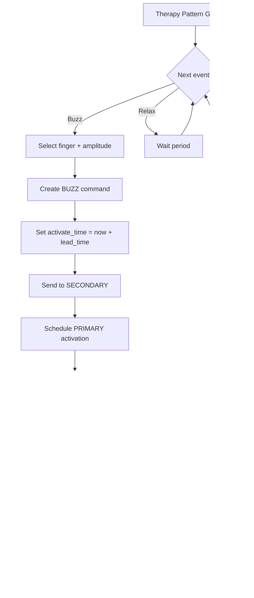

# BlueBuzzah Synchronization Protocol

**Version:** 2.1.0
**Last Updated:** 2025-12-08

---

## Overview

BlueBuzzah uses a bilateral synchronization protocol to coordinate haptic feedback between two gloves (PRIMARY and SECONDARY) over Bluetooth Low Energy. The protocol achieves <2ms synchronization accuracy using IEEE 1588 PTP-inspired clock synchronization with absolute time scheduling.

| Metric | Target | Achieved |
|--------|--------|----------|
| Bilateral sync accuracy | <50ms | <2ms |
| Clock offset precision | <5ms | <1ms |
| BLE latency compensation | Yes | PTP 4-timestamp |

### Core Principles

- **PRIMARY commands, SECONDARY follows** — All therapy decisions originate from PRIMARY
- **Absolute time scheduling** — Commands include future activation timestamps
- **Continuous synchronization** — Clock offset maintained throughout session
- **Fail-safe design** — SECONDARY halts if PRIMARY connection lost

---

## Session Lifecycle


### Timing Requirements

| Phase | Maximum Duration |
|-------|------------------|
| Connection establishment | 15 seconds |
| Initial clock sync | 200ms |
| Session start | Immediate after sync |
| Keepalive timeout | 6 seconds (3 missed) |

---

## Clock Synchronization

### PTP 4-Timestamp Exchange

The protocol uses IEEE 1588-inspired clock synchronization to measure the offset between PRIMARY and SECONDARY clocks, independent of network asymmetry.


### Offset Calculation

```text
offset = ((T2 - T1) + (T3 - T4)) / 2
```

| Timestamp | Device | Event |
|-----------|--------|-------|
| T1 | PRIMARY | PING sent |
| T2 | SECONDARY | PING received |
| T3 | SECONDARY | PONG sent |
| T4 | PRIMARY | PONG received |

A positive offset means SECONDARY's clock is ahead of PRIMARY.

### Filtering and Maintenance

- **Initial sync:** 10 PING/PONG exchanges, median offset selected
- **Quality filter:** Exchanges with RTT > 30ms are discarded
- **Minimum valid:** At least 5 good samples required
- **Drift compensation:** Ongoing sync every 500ms corrects for crystal drift
- **Smoothing:** Exponential moving average prevents sudden jumps

---

## Synchronized Execution

### BUZZ Command Flow


### Lead Time Calculation

The activation time is set in the future to ensure SECONDARY receives and processes the command before the scheduled time:

```text
activate_time = current_time + lead_time
lead_time = average_RTT + safety_margin
```

| Parameter | Value | Purpose |
|-----------|-------|---------|
| Minimum lead time | 15ms | Accounts for BLE latency |
| Maximum lead time | 50ms | Must be less than motor ON time |
| Safety margin | 3× latency variance | Handles jitter |

### Time Conversion

SECONDARY converts PRIMARY timestamps to local time:

```text
local_time = primary_time + clock_offset
```

---

## Therapy Event Cycle



### Macrocycle Structure

One therapy macrocycle consists of buzz and relax periods:

| Component | Duration |
|-----------|----------|
| Motor ON time | 100ms (configurable) |
| Motor OFF time | 67ms (configurable) |
| Buzzes per cycle | 3 |
| Relax periods | 2 |
| **Total cycle** | **~1.8 seconds** |

---

## Error Handling

### Connection Loss Recovery


### Timeout Behavior

| Event | Timeout | Action |
|-------|---------|--------|
| No SECONDARY found | 15s | Abort startup |
| No READY received | 8s | Abort startup |
| Sync burst failed | 2s | Retry (max 3) |
| No BUZZ received | 10s | Emergency stop |
| No PING/PONG | 6s | Emergency stop + reconnect |

---

## Message Reference

### Message Format

All messages use the format:

```text
COMMAND:field1|field2|field3|...
```

- Field delimiter: `|` (pipe)
- Message terminator: `0x04` (EOT)
- Timestamps: Microseconds since boot

### Handshake Messages

| Message | Direction | Fields | Example |
|---------|-----------|--------|---------|
| `READY` | S → P | (none) | `READY` |
| `START_SESSION` | P → S | seq, timestamp | `START_SESSION:1\|50000` |
| `STOP_SESSION` | P → S | seq, timestamp | `STOP_SESSION:99\|120000000` |

### Synchronization Messages

| Message | Direction | Fields | Example |
|---------|-----------|--------|---------|
| `PING` | P → S | seq, T1 | `PING:42\|1000000` |
| `PONG` | S → P | seq, 0, T2, T3 | `PONG:42\|0\|1000500\|1000600` |

**Note:** PING/PONG provides both clock synchronization AND connection keepalive. No separate HEARTBEAT message is needed.

### Therapy Messages

| Message | Direction | Fields | Example |
|---------|-----------|--------|---------|
| `BUZZ` | P → S | seq, ts, finger, amp, dur, freq, activate_time | `BUZZ:42\|5000000\|0\|100\|100\|235\|5050000` |
| `DEACTIVATE` | P → S | seq, timestamp | `DEACTIVATE:43\|5100000` |

**BUZZ fields:**

| Field | Description |
|-------|-------------|
| finger | Motor index (0-3: index, middle, ring, pinky) |
| amp | Intensity percentage (0-100) |
| dur | ON duration in milliseconds |
| freq | Motor frequency in Hz |
| activate_time | Scheduled activation (PRIMARY clock, µs) |

### Parameter Messages

| Message | Direction | Fields | Example |
|---------|-----------|--------|---------|
| `PARAM_UPDATE` | P → S | key:value pairs | `PARAM_UPDATE:TIME_ON:150:JITTER:10` |
| `SEED` | P → S | random seed | `SEED:123456` |
| `SEED_ACK` | S → P | (none) | `SEED_ACK` |

### Status Messages

| Message | Direction | Fields | Example |
|---------|-----------|--------|---------|
| `GET_BATTERY` | P → S | (none) | `GET_BATTERY` |
| `BAT_RESPONSE` | S → P | voltage | `BAT_RESPONSE:3.68` |

---

## Protocol Parameters

| Parameter | Value | Description |
|-----------|-------|-------------|
| Sync burst count | 10 | PING/PONG exchanges at startup |
| Sync burst interval | 15ms | Time between burst messages |
| RTT quality threshold | 30ms | Discard samples with higher RTT |
| Minimum valid samples | 5 | Required for valid sync |
| Maintenance sync interval | 500ms | Ongoing clock correction |
| Keepalive interval | 2s | Connection monitoring |
| Keepalive timeout | 6s | 3 missed = connection lost |
| BUZZ timeout | 10s | SECONDARY safety halt |
| Lead time range | 15-50ms | Scheduling window |
| BLE connection interval | 7.5ms | Low-latency communication |

---

## See Also

- **[BLE_PROTOCOL.md](BLE_PROTOCOL.md)** — Phone app command protocol
- **[THERAPY_ENGINE.md](THERAPY_ENGINE.md)** — Pattern generation
- **[ARCHITECTURE.md](ARCHITECTURE.md)** — System design overview
